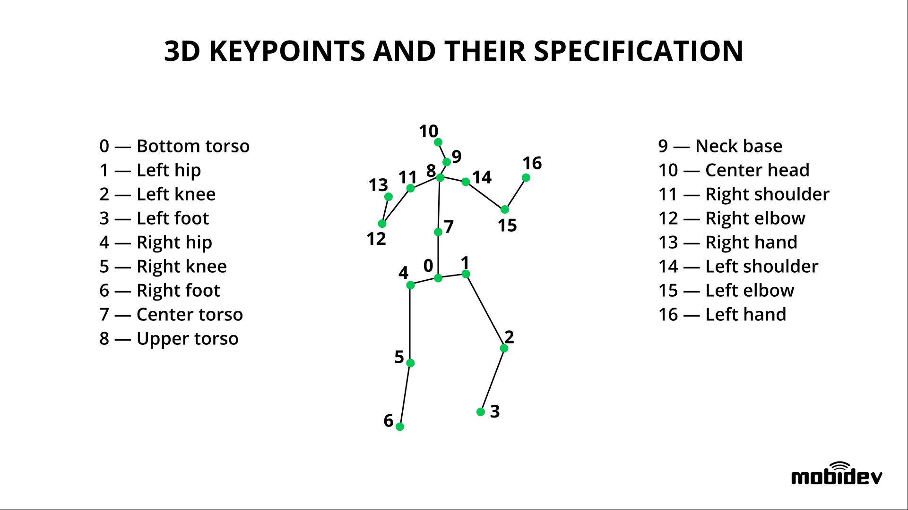

# 机器视觉

1. [图片标注软件](#图片标注软件)
2. [分类识别](#分类识别)
	1. [发展](#发展)
	2. [openCV](#opencv)
	3. [实操](#实操)
3. [姿态估计](#姿态估计)
	1. [姿态估计图](#姿态估计图)
	2. [姿态估计分类](#姿态估计分类)
		1. [多人姿态估计](#多人姿态估计)
			1. [自顶向下](#自顶向下)
			2. [自底向上](#自底向上)
		2. [AlphaPose](#alphapose)
		3. [HMFormer](#hmformer)
4. [文字识别](#文字识别)
5. [文档图像理解](#文档图像理解)

## 图片标注软件
labelimg

## 分类识别
### 发展
1. 滑动窗口
2. R-CNN (Region Proposal,使用的算法是Selective Search)
3. [Yolo](./Yolo/Yolo.md)

### openCV
[opencv](opencv/_opencv.md)

### 实操
* [Robomaster能量靶识别](Robomaster能量靶识别/Robomaster能量靶识别.md)
* [初试人脸识别](./人脸识别/初试人脸识别.md)
* [大学AI课程人脸识别](./人脸识别2/人脸识别AI课程项目.md)

## 姿态估计
### 姿态估计图

注意可能左右是相反的，比如HMFormer上半身不反，下半身反

### 姿态估计分类
单人 和 多人 姿态估计

#### 多人姿态估计
##### 自顶向下
1. 先检测图片中每个人的位置，在检测每个人的姿态
2. 缺点：高度依赖人体边界框的检测质量

##### 自底向上
1. 先检测出环境中的所有肢体节点，然后进行拼接
2. 缺点：如果两人离得很近，容易出现模棱两可的情况

#### AlphaPose
多人自顶向下

[AlphaPose](姿态估计_alphapose/alphapose.md)

#### HMFormer
单人自顶向下

[HMFormer](姿态估计_HMFormer/HMFormer.md)

## 文字识别
[文字识别](文字识别/_文字识别.md)

## 文档图像理解
[文档图像理](文档图像理/_文档图像理解.md)