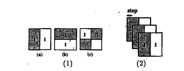
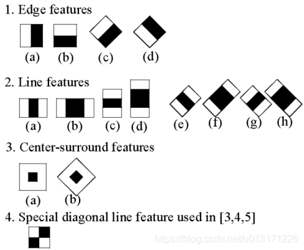
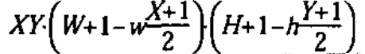
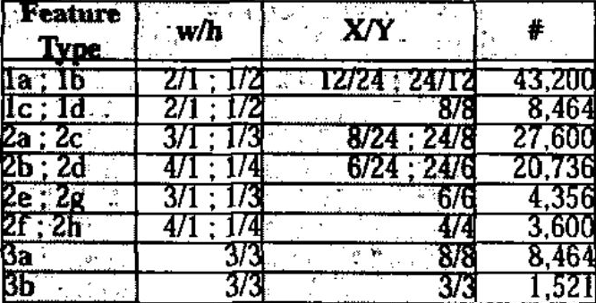
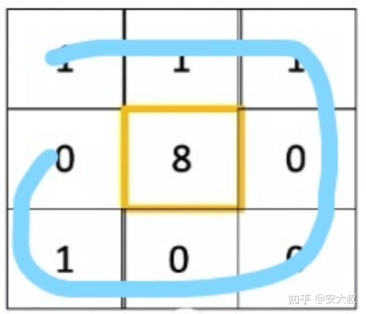
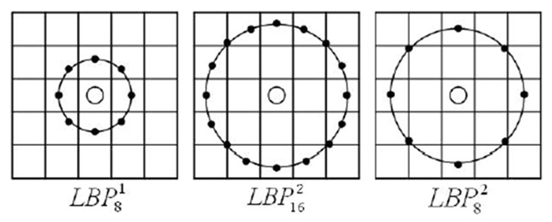
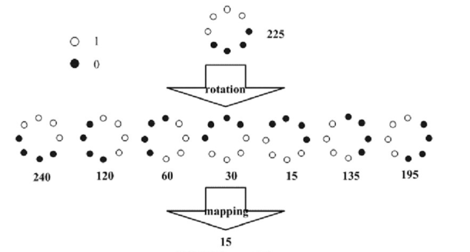
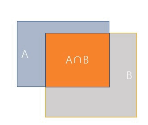
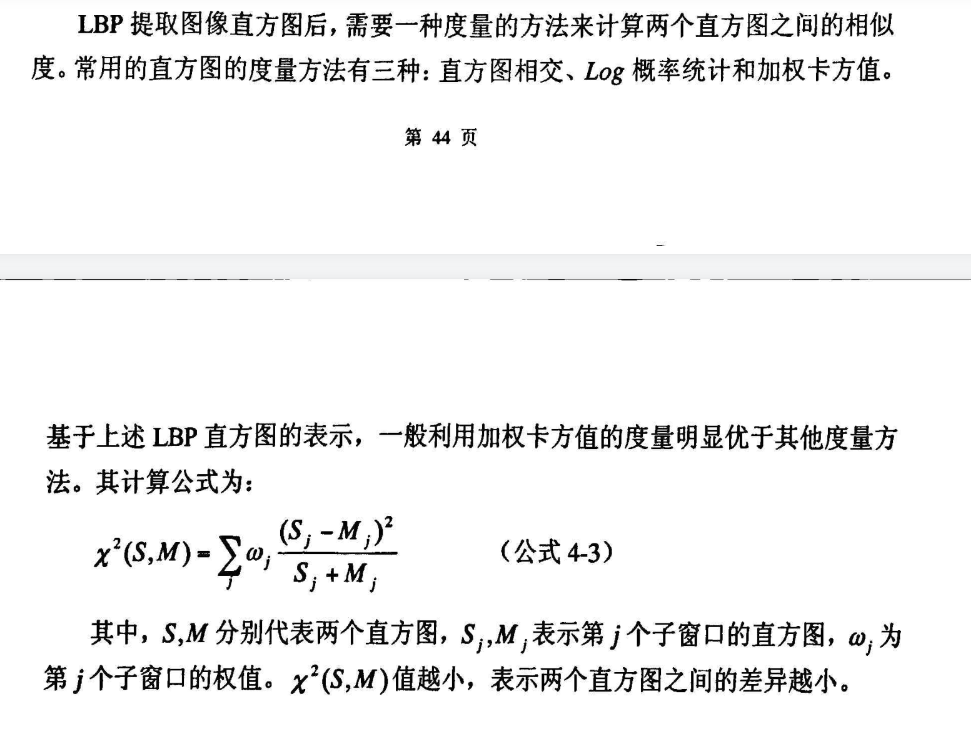

# AI Peoject : face recognize

## 报告
[AI报告](项目/Famous48%20Face%20Recognize%20Report.pdf)
使用了 **Haar**, **LBPH**, **Hog。** 并根据情况针对项目，创意性地构造了**LHH算法**加强联动准确率。

## Methods
### Overview
#### Traditional methods
* Haar + Adaboost
* Hog + Svm
* DPM

#### Deep leraning
* RCNN series: RCNN, spp-net, fast-rcnn, faster-rcnn
* YOLO series: YOLO and YOLO9000
* SSD
* RFCN
* mask-rcnn

### Choose methods for our project
1. Classifier
   Haar cascade + Adaboost: Use this way to detect the face in the image which will be tested. Because the data in famous48 has been good enough to contains only the part of face, we don't need to detect the face in the train image.\
   Haar is a feature created by `integral image`.
   Adaboost is a algorithm that create a strong classifier by several weak classifier. 

2. Recognizer
   * Eigenface or Fisherface：
      Eigenface (PCA) and Fisherface (LDA) are all classic methods to train data. 
       1. They all need calculate the mean value. But Eigenface calculate mean value of all samples to get mean face, while Fisherface calculate mean value for each class.
       2. They all need find and sort by eigenvalues. But Eigenface calculate the eigenvalue of covariance matrix, while Fisherface calculate it of more complex matrix.
      Based on [Eigenfaces vs. Fisherfaces: Recognition Using Class Specific Linear Projection](https://cseweb.ucsd.edu/classes/wi14/cse152-a/fisherface-pami97.pdf) and [Face Recognition: Eigenface and Fisherface Performence Comparison](https://www.docin.com/p-943975585.html), the efficiency of them is similar when we have big training set. But Fisherface have better result when handling light and expression in one of this article while in some article said differently. \
      And Eigenface doesn't consider the label (`unsupervised learning`), so when we have the a lot of pictures for the same people, it will not be a good choice.
   * LBPH(Local Binary Pattern Histogram)：
      It's principle is changing the number around centre by commparing them whether it is bigger/less than centre. If bigger change to 1, else change to 0. Then sort the numbers around as the sequence of circle to get a binary number. \
      After reseacher optimizing this method, it can use `Circular LBP operator` to substitute the squre. \
      For reducing complexity of algorithm when use circular, we consider the smallest binary number among rotate the circular 360°.\
      Except for this, there is also a good way to decrease the number of dimension. `ULBP` believe that the most LBP of important part of image only jump from 0 to 1 or from 1 to 0 twice (hop<=2, `Uniform Pattern`). And if neighbour is 8 (default usuallty 8), the ULBP will only contains 59 dimensions (calculate from 0 to 2^8).\
      When we finish LBP encode, we need get the LBP code histogram for each region and get the histogram of the whole image.\
      Comparing to other methods above, it can eliminate the influence of light to some extent. Because regardless of how big the value of pixel, it will be finally change to 0 or 1.
   
   Compared those advatages, we plan to use `LBPH`.

#### Details of method we choose:
1. Haar
   * Haar features:
     * The original ([A General Framework for Object Detection](https://ieeexplore.ieee.org/stamp/stamp.jsp?tp=&arnumber=710772)):\
        
     * New:\
        
   * Calculate `integral image` (Lefttop to right bottom)
   * Calculate Haar value (∑Black - ∑White)
     * for number of each haar value is as follows:
        
        (for 24*24 window:)
        


2. Adaboost (Adaptive boosting)
   Because we can get a lot of different features based on Haar. So we can use the Haar features to build many weak classifiers. For decision trees, Adaboost classification uses the CART classification tree.
   It need constantly adjust the weights when training and output a strong classifier at last.
   
3. LBPH
   * Base:
        
   * Optimization
        
        * rotation mode
            
        * Uniform Pattern
            Count hop time in binary number. (<=2, >2)
   * After calculating the LBP, we need divide the image into m*n part (can also give different weights). Make histogram for each part. Axis X is the pattern of LBP. For example, when the neighbour is 8, it will be 0-255 (if it is not ULBP, otherwise only 59 dimensions). Axis Y is the ratio of the amount of this pattern. (I don't plan to use number of amount, because when get new image, the number of pixels will be different)
   * Link all histogram into a big one.
   * When get a new image of face, calculate its histogram and the distance with train data. The closer one, will be closer to the result.

4. How to get the bounding-box:
   * Sliding-window
        When we get a new image, we need slide a small window in the image, and calculate the Haar again and again to find where is the face. The problem is when we use the classifier, we may get some windows overlapping.
   * NMS
        1. Sort points descending.
        2. Calculate IOU.
            * $IOU = {A∩B \over A∪B}$
            * 
        3. If IOU bigger than the threshold, remove the one which has lower points.
        4. Repeat step 2-3.


## Environment
* Language: Python/C++
* Library: OpenCV

## Process Design
1. Build the algorithm of classifier and Recognizer.
2. Training data from famous48 (If there is no test picture given, we still need split the data into train part and test part.)
3. Input new picture to test.

## Analysis of source code in OpenCV:
[OpenCV: Face Recognition with OpenCV](https://docs.opencv.org/3.4/da/d60/tutorial_face_main.html)

train
```cpp
void LBPH::train(InputArrayOfArrays _in_src, InputArray _in_labels, bool preserveData) 
{
   if(_in_src.kind() != _InputArray::STD_VECTOR_MAT && _in_src.kind() != _InputArray::STD_VECTOR_VECTOR) 
   { 
      string error_message = "The images are expected as InputArray::STD_VECTOR_MAT (a std::vector<Mat>) or _InputArray::STD_VECTOR_VECTOR (a std::vector< vector<...> >)."; 
      CV_Error(CV_StsBadArg, error_message); 
   } 
   if(_in_src.total() ==0) 
   { 
      string error_message = format("Empty training data was given. You'll need more than one sample to learn a model."); 
      CV_Error(CV_StsUnsupportedFormat, error_message); 
   } 
   else if(_in_labels.getMat().type() != CV_32SC1) 
   { 
      string error_message = format("Labels must be given as integer (CV_32SC1). Expected %d, but was %d.", CV_32SC1, _in_labels.type()); 
      CV_Error(CV_StsUnsupportedFormat, error_message); 
   }
   // get the vector of matrices 
   vector<Mat>src; 
   _in_src.getMatVector(src); 
   // get the label matrix 
   Mat labels = _in_labels.getMat(); 
   // check if data is well- aligned 
   if(labels.total() != src.size()) 
   { 
      string error_message = format("The number of samples (src) must equal the number of labels (labels). Was len(samples)=%d, len(labels)=%d.", src.size(), _labels.total()); 
      CV_Error(CV_StsBadArg, error_message); 
   } 
   // if this model should be trained without preserving old data, delete old model data 
   if(!preserveData) 
   { 
      _labels.release(); _histograms.clear(); 
   } 
   // append labels to _labels matrix 
   for(size_t labelIdx = 0; labelIdx < labels.total(); labelIdx++) 
   { 
      _labels.push_back(labels.at<int>((int)labelIdx)); 
   } 
   // store the spatial histograms of the original data 
   for(size_t sampleIdx = 0; sampleIdx < src.size(); sampleIdx++) 
   { 
      // calculate lbp image 
      Mat lbp_image = elbp(src[sampleIdx], _radius, _neighbors); 
      // get spatial histogram from this lbp image 
      Mat p = spatial_histogram( lbp_image, /* lbp_image */ 
      static_cast<int>(std::pow(2.0, static_cast<double>(_neighbors))), /* number of possible patterns */ 
      _grid_x,/* grid size x */ 
      _grid_y, /* grid size y */ 
      true); 
      // add to templates
      _histograms.push_back(p); 
   }
}
```

ELBP and histogram
```cpp
template <typename _Tp> static
inline void elbp_(InputArray _src, OutputArray _dst, int radius, int neighbors) {
    //get matrices
    Mat src = _src.getMat();
    // allocate memory for result
    _dst.create(src.rows-2*radius, src.cols-2*radius, CV_32SC1);
    Mat dst = _dst.getMat();
    // zero
    dst.setTo(0);
    for(int n=0; n<neighbors; n++) {
        // sample points
        float x = static_cast<float>(radius * cos(2.0*CV_PI*n/static_cast<float>(neighbors)));
        float y = static_cast<float>(-radius * sin(2.0*CV_PI*n/static_cast<float>(neighbors)));
        // relative indices
        int fx = static_cast<int>(floor(x));
        int fy = static_cast<int>(floor(y));
        int cx = static_cast<int>(ceil(x));
        int cy = static_cast<int>(ceil(y));
        // fractional part
        float ty = y - fy;
        float tx = x - fx;
        // set interpolation weights
        float w1 = (1 - tx) * (1 - ty);
        float w2 =      tx  * (1 - ty);
        float w3 = (1 - tx) *      ty;
        float w4 =      tx  *      ty;
        // iterate through your data
        for(int i=radius; i < src.rows-radius;i++) {
            for(int j=radius;j < src.cols-radius;j++) {
                // calculate interpolated value
                float t = static_cast<float>(w1*src.at<_Tp>(i+fy,j+fx) + w2*src.at<_Tp>(i+fy,j+cx) + w3*src.at<_Tp>(i+cy,j+fx) + w4*src.at<_Tp>(i+cy,j+cx));
                // floating point precision, so check some machine-dependent epsilon
                dst.at<int>(i-radius,j-radius) += ((t > src.at<_Tp>(i,j)) || (std::abs(t-src.at<_Tp>(i,j)) < std::numeric_limits<float>::epsilon())) << n;
            }
        }
    }
}

static void elbp(InputArray src, OutputArray dst, int radius, int neighbors)
{
    int type = src.type();
    switch (type) {
    case CV_8SC1:   elbp_<char>(src,dst, radius, neighbors); break;
    case CV_8UC1:   elbp_<unsigned char>(src, dst, radius, neighbors); break;
    case CV_16SC1:  elbp_<short>(src,dst, radius, neighbors); break;
    case CV_16UC1:  elbp_<unsigned short>(src,dst, radius, neighbors); break;
    case CV_32SC1:  elbp_<int>(src,dst, radius, neighbors); break;
    case CV_32FC1:  elbp_<float>(src,dst, radius, neighbors); break;
    case CV_64FC1:  elbp_<double>(src,dst, radius, neighbors); break;
    default:
        string error_msg = format("Using Original Local Binary Patterns for feature extraction only works on single-channel images (given %d). Please pass the image data as a grayscale image!", type);
        CV_Error(CV_StsNotImplemented, error_msg);
        break;
    }
}

static Mat
histc_(const Mat& src, int minVal=0, int maxVal=255, bool normed=false)
{
    Mat result;
    // Establish the number of bins.
    int histSize = maxVal-minVal+1;
    // Set the ranges.
    float range[] = { static_cast<float>(minVal), static_cast<float>(maxVal+1) };
    const float* histRange = { range };
    // calc histogram
    calcHist(&src, 1, 0, Mat(), result, 1, &histSize, &histRange, true, false);
    // normalize
    if(normed) {
        result /= (int)src.total();
    }
    return result.reshape(1,1);
}

static Mat histc(InputArray _src, int minVal, int maxVal, bool normed)
{
    Mat src = _src.getMat();
    switch (src.type()) {
        case CV_8SC1:
            return histc_(Mat_<float>(src), minVal, maxVal, normed);
            break;
        case CV_8UC1:
            return histc_(src, minVal, maxVal, normed);
            break;
        case CV_16SC1:
            return histc_(Mat_<float>(src), minVal, maxVal, normed);
            break;
        case CV_16UC1:
            return histc_(src, minVal, maxVal, normed);
            break;
        case CV_32SC1:
            return histc_(Mat_<float>(src), minVal, maxVal, normed);
            break;
        case CV_32FC1:
            return histc_(src, minVal, maxVal, normed);
            break;
        default:
            CV_Error(CV_StsUnmatchedFormats, "This type is not implemented yet."); break;
    }
    return Mat();
}


static Mat spatial_histogram(InputArray _src, int numPatterns,
                             int grid_x, int grid_y, bool /*normed*/)
{
    Mat src = _src.getMat();
    // calculate LBP patch size
    int width = src.cols/grid_x;
    int height = src.rows/grid_y;
    // allocate memory for the spatial histogram
    Mat result = Mat::zeros(grid_x * grid_y, numPatterns, CV_32FC1);
    // return matrix with zeros if no data was given
    if(src.empty())
        return result.reshape(1,1);
    // initial result_row
    int resultRowIdx = 0;
    // iterate through grid
    for(int i = 0; i < grid_y; i++) {
        for(int j = 0; j < grid_x; j++) {
            Mat src_cell = Mat(src, Range(i*height,(i+1)*height), Range(j*width,(j+1)*width));
            Mat cell_hist = histc(src_cell, 0, (numPatterns-1), true);
            // copy to the result matrix
            Mat result_row = result.row(resultRowIdx);
            cell_hist.reshape(1,1).convertTo(result_row, CV_32FC1);
            // increase row count in result matrix
            resultRowIdx++;
        }
    }
    // return result as reshaped feature vector
    return result.reshape(1,1);
}

//------------------------------------------------------------------------------
// wrapper to cv::elbp (extended local binary patterns)
//------------------------------------------------------------------------------

static Mat elbp(InputArray src, int radius, int neighbors) {
    Mat dst;
    elbp(src, dst, radius, neighbors);
    return dst;
}
```

predict
```cpp
void LBPH::predict(InputArray _src, int &minClass, double &minDist) const {
    if(_histograms.empty()) {
        // throw error if no data (or simply return -1?)
        string error_message = "This LBPH model is not computed yet. Did you call the train method?";
        CV_Error(CV_StsBadArg, error_message);
    }
    Mat src = _src.getMat();
    // get the spatial histogram from input image
    Mat lbp_image = elbp(src, _radius, _neighbors);
    Mat query = spatial_histogram(
            lbp_image, /* lbp_image */
            static_cast<int>(std::pow(2.0, static_cast<double>(_neighbors))), /* number of possible patterns */
            _grid_x, /* grid size x */
            _grid_y, /* grid size y */
            true /* normed histograms */);
    // find 1-nearest neighbor
    minDist = DBL_MAX;
    minClass = -1;
    for(size_t sampleIdx = 0; sampleIdx < _histograms.size(); sampleIdx++) {
        double dist = compareHist(_histograms[sampleIdx], query, CV_COMP_CHISQR);
        if((dist < minDist) && (dist < _threshold)) {
            minDist = dist;
            minClass = _labels.at<int>((int) sampleIdx);
        }
    }
}
```

## Question:
1. Do we need build or train the Haar classifier by ourselves (or we can use openCV directly)?
2. Do we need write the algorithm of LBPH by ourselves?


## Others
