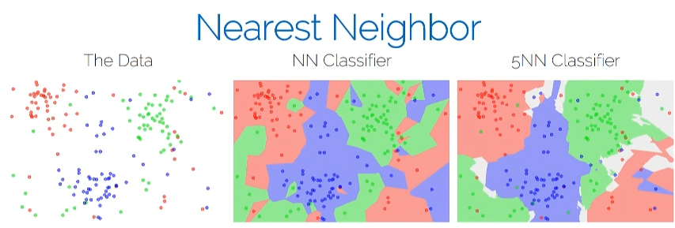
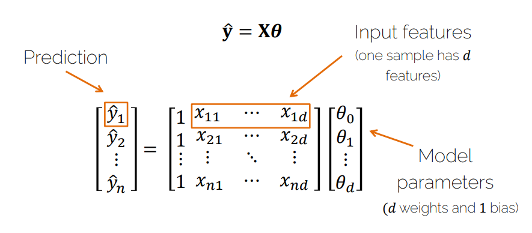
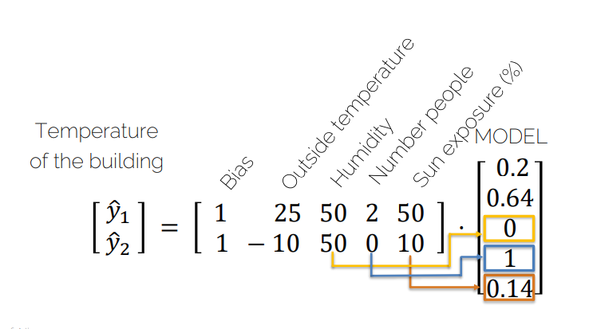
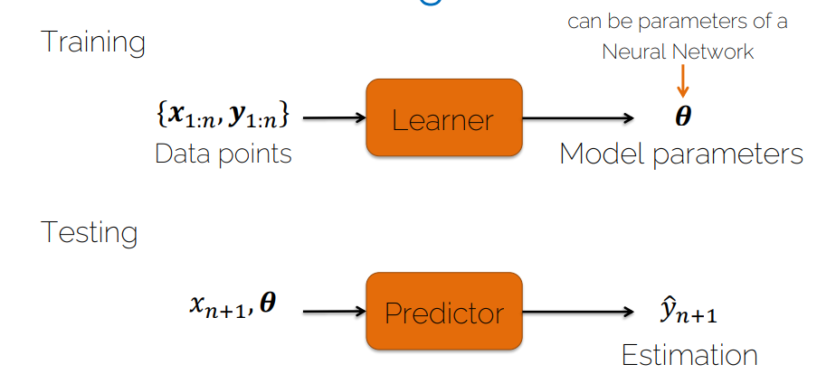
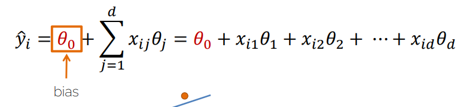
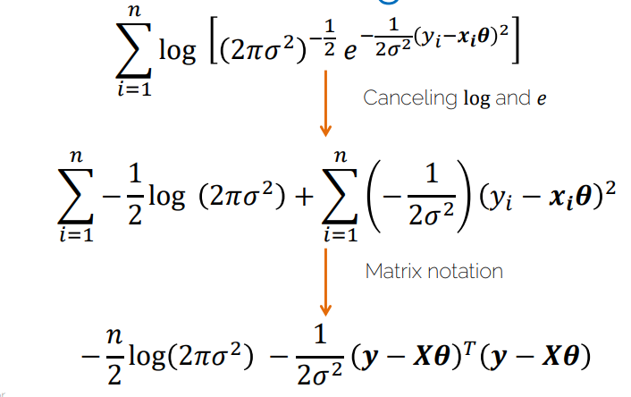
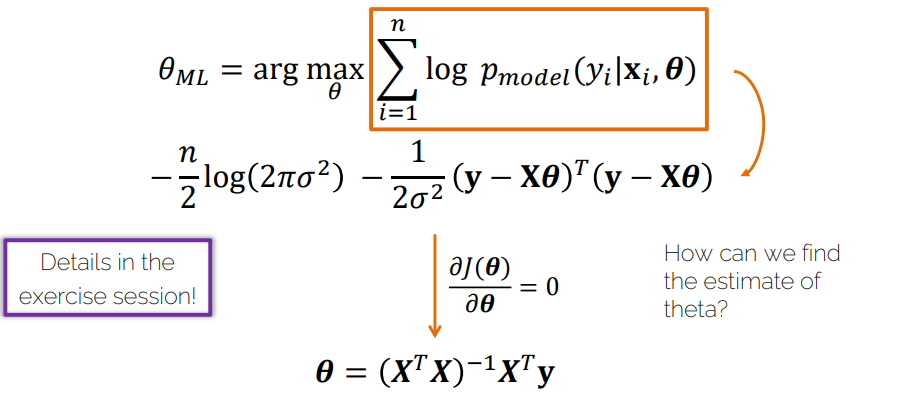

# Lecture 02.1 - ML Basics

- [1. 学习方法](#1-学习方法)
- [2. 以Image Classification为例](#2-以image-classification为例)
  - [2.1. K-Nearest Neighbors](#21-k-nearest-neighbors)
  - [2.2. Hyperparameters](#22-hyperparameters)
  - [2.3. Data](#23-data)
  - [2.4. Performance measure](#24-performance-measure)
- [3. 监督学习和无监督学习](#3-监督学习和无监督学习)
- [4. 强化学习](#4-强化学习)
- [5. 使用什么模型？](#5-使用什么模型)
  - [5.1. Linear Decision Boundary为例](#51-linear-decision-boundary为例)
    - [5.1.1. Linear Regression](#511-linear-regression)
- [6. 如何获得模型？](#6-如何获得模型)
  - [6.1. L1和L2，median和mean](#61-l1和l2median和mean)
  - [6.2. Maximum Likelihood 最大似然](#62-maximum-likelihood-最大似然)
  - [6.3. 回看线性回归](#63-回看线性回归)
  - [6.4. 小结](#64-小结)
- [7. Regression vs Classification](#7-regression-vs-classification)
- [8. Cross validation](#8-cross-validation)
  - [8.1. loss function和cost function](#81-loss-function和cost-function)


## 1. 学习方法
Task -> method

## 2. 以Image Classification为例

计算一个新图到其他图的距离。

### 2.1. K-Nearest Neighbors



NN 和 KNN 的区别是 KNN 会计算比较多个样本，然后投票。

KNN不是K越大就一定越好。

### 2.2. Hyperparameters

不是模型里的参数，是算法自身的参数

尝试最小化距离。（可以有不同的距离计算方法）

### 2.3. Data

train, validation, test (60,20,20 或 80,10,10 etc.)

### 2.4. Performance measure
Accuracy

## 3. 监督学习和无监督学习

self-supervised learning 是一种无监督学习。

无监督学习理解：就是你知道这两个不同，但你不知道是什么。

| 无监督学习 | 监督学习 |
| --- | --- |
| 训练的数据没有标签 | 训练的数据有标签 |
|找到数据结构的属性||
|聚类(k-means, PCA(主成分学习), etc.)||

## 4. 强化学习

```
Agents -interaction-> Environment
Agents <---reward---- Environment
```

## 5. 使用什么模型？

### 5.1. Linear Decision Boundary为例

#### 5.1.1. Linear Regression






$$\hat{y_i} = \theta_0 + \sum_{j=1}^{d} x_{ij} \theta_j$$



## 6. 如何获得模型？

1. Loss function: measures how good my estimation/model is and tells the optimiazation method how to make estimation better
2. Optimization: change the model in oder to improve the loss function

[线性回归](../../机器学习和数学/线性回归_梯度下降_矩阵求导.md)

### 6.1. L1和L2，median和mean

对于线性回归，如果用L2 + mean时候，会导致outlier对结果影响。

但如果用L1 + median，就不会受到outlier的影响。

### 6.2. Maximum Likelihood 最大似然

Maximum Likelihood Estimation (MLE) 是根据观测值来估计一个统计模型参数的方法，通过找到参数值使得观测值根据参数出现的似然最大。

注意likelihood和probability的区别：
注意翻译，似然，顾名思义**相似**，所以不完全是概率。

$$\theta_{MLE} = argmax_{\theta}\space P_{model}(y|X,\theta)$$

"i.i.d" assumption 独立同分布时 independent and identically distributed：

$$\theta_{MLE} = argmax_{\theta}\space \prod_{i=1}^n P_{model}(y_i|X_i,\theta)$$

优化使用log:

$$\theta_{MLE} = argmax_{\theta}\space \sum_{i=1}^n log P_{model}(y_i|X_i,\theta)$$

### 6.3. 回看线性回归

我们要假设观测值$y_i$的对于条件$x_i,\theta$的概率属于正态分布：

$$y_i = N(x_i\theta,\sigma^2) = x_i\theta + N(0,\sigma^2)$$

高斯分布的概率密度函数：

$$P(y_i) = \frac{1}{\sqrt{2\pi\sigma^2}}exp(-\frac{(y_i-\mu)^2}{2\sigma^2})$$

正态分布有一个好处，将上面的式子代入log的MLE公式，可以直接将log和exp抵消，得到一个简单的公式。





右边又是一个最小二乘法的公式，

$$\theta=(X^TX)^{-1}X^Ty$$


### 6.4. 小结

1. 给定假设时，MLE和LSE(Least Square Estimation 最小二乘法)是等价的。
2. 利用loss function和optimization method来获得线性回归模型。

## 7. Regression vs Classification
* Regression: predict a continuous output value
* Classification: predict a discrete value
  * Binary classification
  * Multi-class classification

## 8. Cross validation

交叉验证，将数据分为训练集和测试集，然后多次训练模型。

比如5折交叉验证，将数据分为5份，每次训练4份，测试1份，然后取平均值。

### 8.1. loss function和cost function
1. loss function: 用于评估单个样本的模型预测的好坏
2. cost function: 用于评估整个模型的好坏
   
通常最小化cost function来最小化loss function。没有解析解时，可以使用梯度下降法之类的。

案例：[逻辑回归](./Lecture02.2-LogisticRegression.md#loss-function和cost-function)