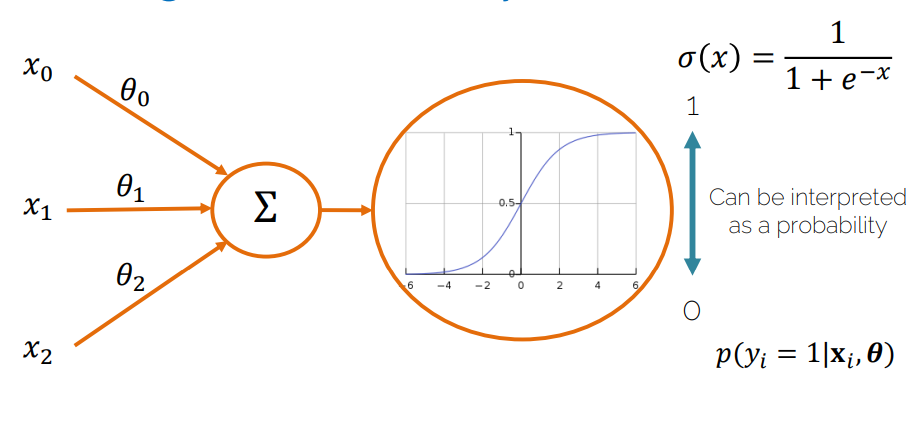
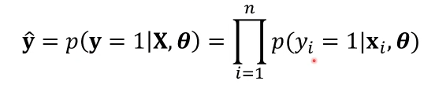
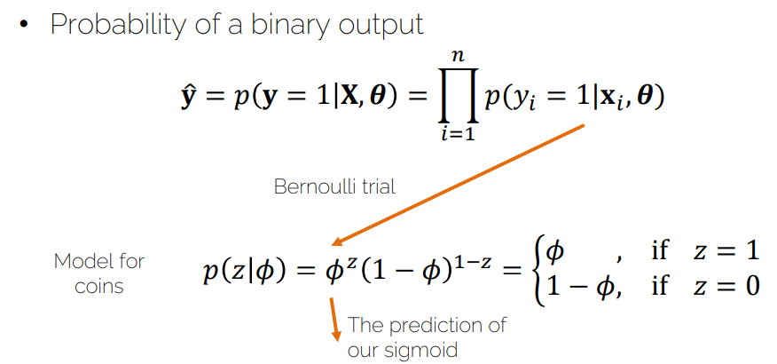
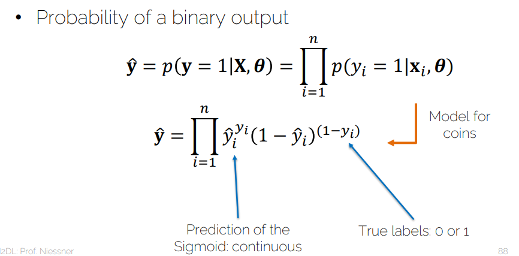
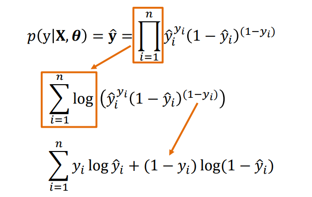
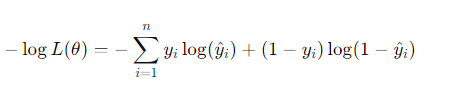
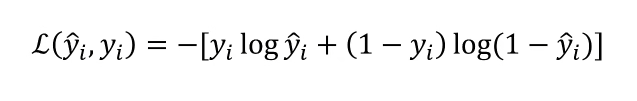
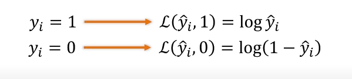
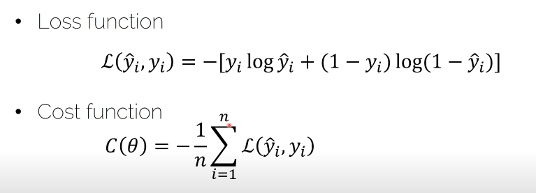

# Lecture 02.2 - Logistic Regression

- [1. 起源](#1-起源)
- [2. 介绍](#2-介绍)
- [3. 逻辑回归](#3-逻辑回归)
  - [3.1. loss function和cost function](#31-loss-function和cost-function)
- [4. 多分类-Softmax](#4-多分类-softmax)

## 1. 起源

**二分类**时候，输出是一个概率值，我们希望这个概率值是0或者1，所以我们需要一个函数来将实数映射到0-1之间，这个函数就是Logistic函数。

也称为Sigmoid函数

## 2. 介绍

Sigmoid函数形式为：

$$sigmoid(x) = \frac{1}{1+e^{-x}}$$

因为输出在0-1之间，所以可以看作是概率值。

比如有一个outlier很大，那么这个outlier会对线性回归的结果产生很大的影响，但是对于Logistic回归，因为sigmoid函数的存在，这个outlier对结果的影响会被限制在0-1之间。

## 3. 逻辑回归

1. Probability of a binary output 
   1. 二分类输出为一个指定类型的概率
   2. 有bias只不过都简写没了
   3. 
   4. 上面的条件里的就是 $\hat{y} = \sigma(x_i\theta)$
2. 以伯努利分布为案例：
   1. 
   2. 
   3. 进行log和化简：
      1. 
   4. 由于通常对于loss function我们要找最小值，所以可以加一个负号得到NLL(Negative Log Likelihood)
      1. 
   5. 扔硬币一次时，这个损失函数的单次点是：
      1. Binary Cross-Entropy Loss(BCE Loss 翻译为二元交叉熵损失)
      2. 
      3. 
         1. log单调函数，所以当想上面损失函数最大或者最小时候，其实就是$\hat{y}$最大或者最小时候，当然0和1在sigmoid里就是最大和最小值了。

### 3.1. loss function和cost function

当没有closed-form solution(没有解析解)时，我们可以使用梯度下降(gradient descent)法来求解。

## 4. 多分类-Softmax

当有多个类别时，我们可以使用Softmax函数，Softmax函数可以将多个类别的概率值映射到0-1之间。