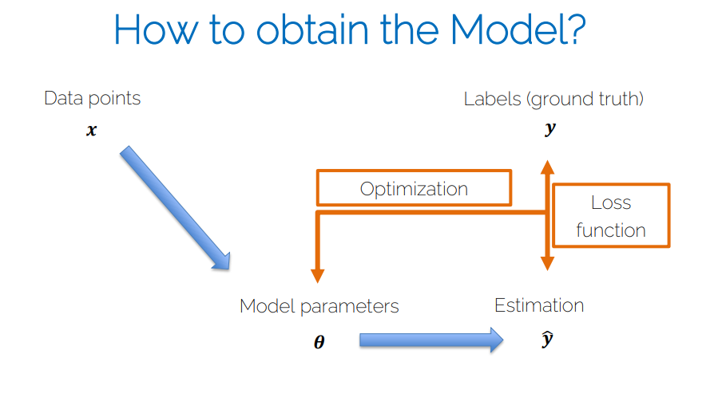
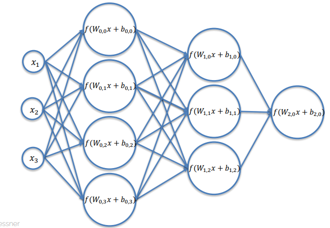
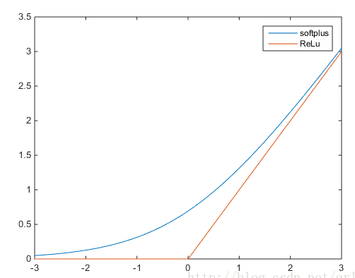
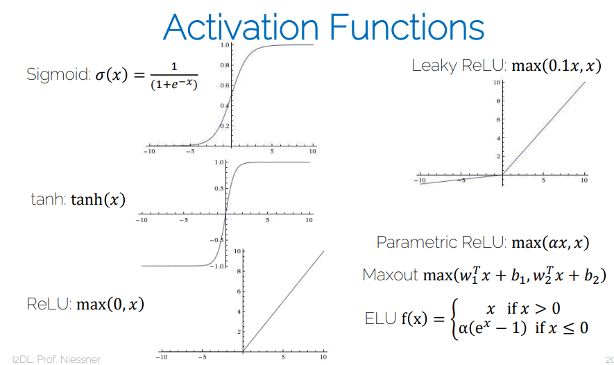
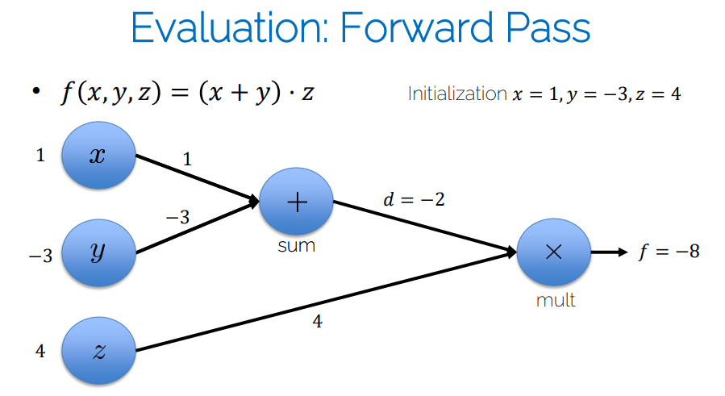
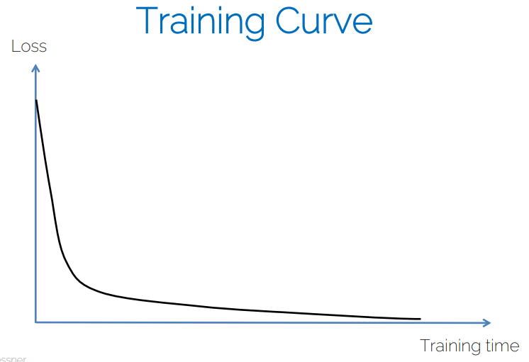
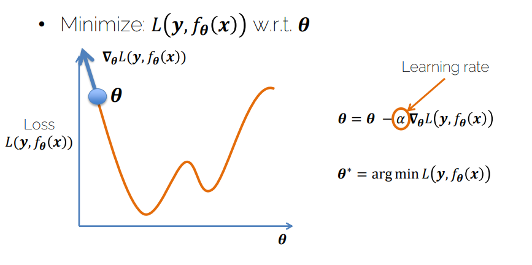
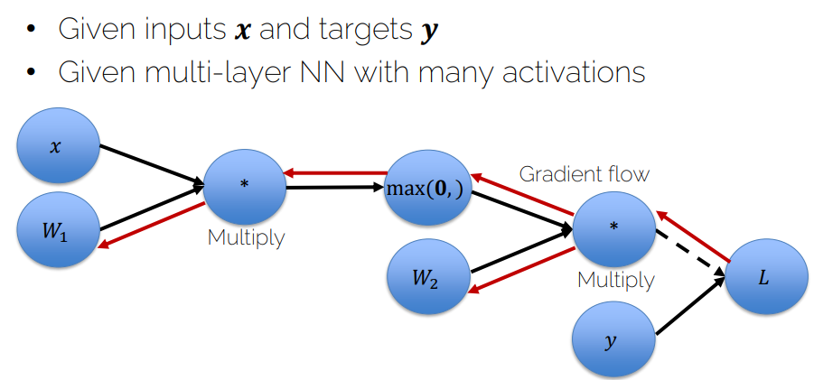

# Lecture 03 - Intro Neural Networks

- [1. 基础概念](#1-基础概念)
- [2. Linear Score Function](#2-linear-score-function)
- [3. Non-linearity](#3-non-linearity)
  - [3.1. Neural Network](#31-neural-network)
  - [3.2. Non-linear Activation Function](#32-non-linear-activation-function)
  - [3.3. 小结](#33-小结)
- [4. Computational Graphs (计算图)](#4-computational-graphs-计算图)
- [5. 评估模型](#5-评估模型)
  - [5.1. Loss Function](#51-loss-function)
  - [5.2. Training curve](#52-training-curve)
- [6. How to find a better NN](#6-how-to-find-a-better-nn)
  - [6.1. gradient descent](#61-gradient-descent)
    - [6.1.1. Backpropagation](#611-backpropagation)
    - [6.1.2. 为什么要使用梯度下降？](#612-为什么要使用梯度下降)

## 1. 基础概念

1. 评分函数（Score Function）：它是一个将输入映射到类别得分的函数。在神经网络中，评分函数通常是一个多层神经网络，也称为神经网络模型。比如原始图像数据到类别分值的映射。
2. 损失函数（Loss Function）：它是一个用来衡量评分函数的输出与真实标签之间的差距的函数。比如交叉熵损失函数。

## 2. Linear Score Function

$$f(x_i, W, b) = Wx_i + b$$

其中，$x_i$是输入数据的向量，$W$是权重矩阵，$b$是偏置向量。

作用方式：W的每一行对应一个类别，每一列对应一个特征。所以每一行输出一个类别的分值到结果。

1. 但是不够强大，所以引入多层，即神经网络。
2. 但是不够灵活，所以引入非线性激活函数。

## 3. Non-linearity
### 3.1. Neural Network

- 2-layers: $f=W_2 max(0,W_1x)$  (ReLU)
- 3-layers: $f=W_3 max(0,W_2max(0,W_1x))$
- 4-layers: $f=W_4 tanh(0,W_3max(0,W_2max(0,W_1x)))$
- 5-layers: $f=W_5 \sigma(0,W_4tanh(0,W_3max(0,W_2max(0,W_1x))))$
- ...up to hundreds of layers

每个小标的第一个代表0开始的第几层，第二个代表0开始的第几个神经元。

每个神经元的weights W的数量和上一层的神经元数量相同。

- W和x的乘: encode input information
- activation function: 选择key features
- convolutional layers: 通过shared weights来提取有用的特征

### 3.2. Non-linear Activation Function

$$f(x_i, W, b) = g(Wx_i + b)$$

其中，$g$是非线性激活函数，比如ReLU、Sigmoid、Tanh等。

sigmoid其实就是logistic函数，tanh是sigmoid的变形。

* ReLU: $g(x) = max(0,x)$
* Sigmoid: $g(x) = \frac{1}{1+e^{-x}}$
* Tanh: $g(x) = \frac{e^x - e^{-x}}{e^x + e^{-x}}$ (两端更平)
* Leaky ReLU: $g(x) = max(0.1x,x)$
* Parametric ReLU: $g(x) = max(\alpha x,x)$
* Maxout: $g(x) = max(w_1^Tx + b_1, w_2^Tx + b_2)$
* ELU: $g(x) = x, x>0; \alpha(e^x-1), x\leq0$
* softmax: $g(x_i) = \frac{e^{x_i}}{\sum_{j=1}^{n}e^{x_j}}$
* softplus: $g(x) = ln(1+e^x)$

1. 为什么要激活函数？
   1. 因为如果只是普通叠加(如下)，那么其实还是线性的，所以需要激活函数来引入非线性
   2. $$f=W_3\cdot(W_2\cdot(W_1x))$$
2. 为什么要构造层的结构？
   1. 为了引入非线性
   2. 方便使用API化的AI框架
   3. computational graphs方便计算梯度（比如分层graph就没有loop）

### 3.3. 小结

- 给定一个数据集和ground truth对$[x_i;y_i]$
- 找到优化的weights和biass使用随机梯度下降（SGD stochastic gradient descent）或者其他优化方法使得损失函数最小。
  - **Compute gradients** with backpropagation (use batch-mode; 后面会学到)
    - 很复杂的函数计算梯度很难，所以后面会有一些技术比如[backpropagation](./Lecture04-OptimizationAndBackprop.md)
  - Iterate many times over training set (SGD; 后面会学到)

## 4. Computational Graphs (计算图)

这种技术可以用来表达NN，方便计算梯度。

1. Directional graph
2. Matrix operations are represented as compute nodes
3. Vertex nodes are variables or operators like +, -, *, /, log(), exp(), etc.
4. Directional edges show flow of inputs to vertices

**forward pass**

## 5. 评估模型

### 5.1. Loss Function

衡量结果，模型的好坏。要根据具体问题来选择。

1. Regression Loss
   1. L1 Loss: $L(y,\hat{y}; \theta) = \frac{1}{N}\sum_{i=1}^{N}||y_i - \hat{y}_i||_1$
   2. MSE Loss: $L(y,\hat{y}; \theta) = \frac{1}{N}\sum_{i=1}^{N}||y_i - \hat{y}_i||^2_2$
   3. 右下小标代表欧几里得范数
2. Binary cross entropy(二分类交叉熵)
   1. $L(y,\hat{y}; \theta) = -\frac{1}{N}\sum_{i=1}^{N}[y_i\log(\hat{y}_i) + (1-y_i)\log(1-\hat{y}_i)]$
   2. y=0和y=1的情况分开讨论，就能理解上面的公式了
   3. 同时它不仅可以用来当损失函数，它的结果还是概率，即表示预测为1或0的概率，所以可以用来做分类器
3. Cross Entropy(多分类交叉熵)
   1. $L(y,\hat{y}; \theta) = -\sum_{i=1}^{N}\sum_{j=1}^{C}(y_{ij}\log(\hat{y}_{ij}))$
   2. 二分类交叉熵是多分类交叉熵的特例
   3. 所以也和二分类交叉熵一样，可以用来做分类器

More general case
1. Ground truth: $y$
2. Predicted: $\hat{y}$
3. Loss function: $L(y,\hat{y})$
4. Motivation:
   1. minimize the loss <==> find better predictions
   2. predictions are generated by the NN
   3. find better predictions <==> find better NN

### 5.2. Training curve

## 6. How to find a better NN

minize the loss w.r.t. $\theta$

optimization is done using gradient-based solvers, 不只是梯度下降

### 6.1. gradient descent
比如使用梯度下降：

参数$\theta$每次减去负的梯度乘以学习率$\alpha$。

#### 6.1.1. Backpropagation

[Backpropagation](./Lecture04-OptimizationAndBackprop.md)

使用chain rull来计算梯度。

理解：损失函数是正向算完结果，再将这个结果根据逆的损失函数反过来计算每一层要修改参数多少。

#### 6.1.2. 为什么要使用梯度下降？

1. 容易使用compute graphs来计算
2. 其他方法：
   1. Newton's method (牛顿法)
   2. L-BFGS （Limited-memory Broyden-Fletcher-Goldfarb-Shanno）
   3. Adaptive moments（Adam）
   4. Conjucate gradient（共轭梯度）