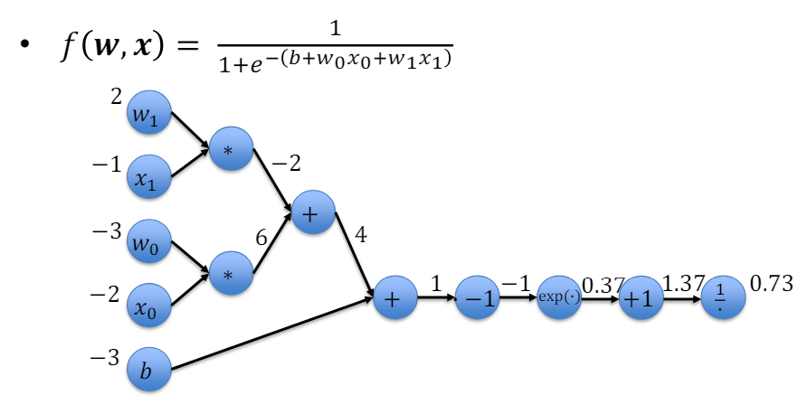

# Lecture 04 - Optimization and Backprop

- [1. Backprop(agation) 向后传播](#1-backpropagation-向后传播)
  - [1.1. 简单理解](#11-简单理解)
  - [1.2. 前置参数](#12-前置参数)
  - [1.3. 从Loss Function到带激活函数的向后传播](#13-从loss-function到带激活函数的向后传播)
  - [1.4. 举例](#14-举例)
- [2. Optimization](#2-optimization)
  - [2.1. Gradient Descent](#21-gradient-descent)
    - [2.1.1. The Flow of the Gradients](#211-the-flow-of-the-gradients)
      - [2.1.1.1. 图例](#2111-图例)
        - [2.1.1.1.1. 对于Binary Cross Entropy Loss案例](#21111-对于binary-cross-entropy-loss案例)
    - [2.1.2. 权重数量](#212-权重数量)
    - [2.1.3. 其他问题未来学习](#213-其他问题未来学习)
  - [2.2. Regularization（正则化）(我认为就是泛化generalization)](#22-regularization正则化我认为就是泛化generalization)
    - [2.2.1. over- and underfitting](#221-over--and-underfitting)
    - [2.2.2. 正则化技巧](#222-正则化技巧)
      - [2.2.2.1. L1/L2 regularization](#2221-l1l2-regularization)
        - [2.2.2.1.1. L1和L2对比并举例](#22211-l1和l2对比并举例)
    - [2.2.3. 目的](#223-目的)

## 1. Backprop(agation) 向后传播

### 1.1. 简单理解
本质上就是Chain Rule的应用，倒过来求导（梯度）。

简单案例：

下面的绿色方框是对y的求导。

### 1.2. 前置参数

1. $x_k$：输入
2. $w_{l,m,n}$：
   1. 第$l$层
   2. 第$m$个神经元
   3. 第$n$个权重(该神经元)
   4. 自我备注：注意如果只有两个，可能是省略了层，即$w_{m,n}$
3. $\hat{y}_i$：计算的结果（i output dim;$n_{out}$）
4. $y_i$：真实值
5. $L$：Loss Function

### 1.3. 从Loss Function到带激活函数的向后传播

$$\hat y_i=A(b_i+\sum_{k}x_kw_{i,k})$$

(A是激活函数)

$$L=\sum_{i}L_i$$

$$\frac{\partial L}{\partial w_{i,k}}=\frac{\partial L}{\partial \hat{y}_i}\frac{\partial \hat{y}_i}{\partial w_{i,k}}$$

我们要计算所有与权重$W$和偏置$b$有关的梯度。

**理解：**
1. 和向前计算的结果无关，总是用1从loss结果层开始back，而不是loss的值或者y_predict的值
   1. loss只是用来看的
   2. y_predict还没到反向的时候，还要再走一次loss function
2. 用向前传递时的前一层的传过来的值作为参数值
3. 即向后传播时，如果参数的导数带x，则用2说的值
4. 结果要乘在向后传播时从后面一层传过来的d_out
5. 只计算按权重的值，不计算输入的值，比如最初的x,y，如下图中的x,y，最后梯度下降
6. 不需要矩阵对矩阵求导，只需要拿每个矩阵比如输入X当作一个标量求导

### 1.4. 举例

## 2. Optimization

### 2.1. Gradient Descent

`GD`和`Backprop`的关系：其实就是GD用backprop计算到当前参数的梯度来更新参数，即W = W - alpha * dW

$$x^* = arg\space min\space f(x)$$

从导数到梯度：

$$\frac {d f(x)}{d x} \rightarrow \nabla_xf(x)$$

Direction of greatest increase 就是梯度的方向。

所以我们要找到最小值，就是往梯度的反方向走。

$$x^\prime = x - \alpha \nabla_xf(x)$$

$\alpha$是学习 - Learning Rate

$$\nabla _W f_{\{x,y\}}(W)=\begin{bmatrix}\frac{\partial f}{\partial w_{0,0,0}}\\\vdots\\\frac{\partial f}{\partial w_{l,m,n}}\end{bmatrix}$$

Gradient step(梯度步)：

$$W^\prime = W - \alpha \nabla_W f_{\{x,y\}}(W)$$

#### 2.1.1. The Flow of the Gradients

每个神经元都有自己的工作：forward and backward pass

理解：可以从编程角度想象，每个神经元都有自己的forward和backward函数，forward函数是计算结果，backward函数是计算梯度。

##### 2.1.1.1. 图例

###### 2.1.1.1.1. 对于Binary Cross Entropy Loss案例
1. 最后一层

注意：
1. sigmoid求导结果是$\hat{y}_i(1-\hat{y}_i)$是没错的
2. sigmoid求导结果里的$\hat{y}$是当前forward的输出不是backward到当前的$dy$

1. 第一层

上图看起来复杂，其实implementation的时候是一层一层的，没有这么复杂。

#### 2.1.2. 权重数量

$$\#neurons \times \#input channels + \#bias$$

bias数量就是该层神经元的数量，因为一般每个神经元都有一个bias。

**当然，注意有些activation functions也有weights**

#### 2.1.3. 其他问题未来学习
1. 如何选择一个好的学习率
2. 如何对单个训练对进行梯度计算（即本节课学的）
3. 如何对大量的数据集进行梯度计算
4. 如何加速

### 2.2. Regularization（正则化）(我认为就是泛化generalization)

需要一个channelization的tool或者process来面对新的没见过的样本，以此来优化一个函数。

通过增加约束或惩罚项来防止模型过拟合的方法。它通过**抑制模型参数的复杂性**，帮助模型在训练过程中找到最优点，并在未见数据上具有更好的**泛化能力**。

split data：
1. training 调整权重
2. validation 调整超参数（比如学习率），以及可以用来early stopping之类的，比如防止过拟合之类的
3. test 评估模型

#### 2.2.1. over- and underfitting

traing/validation curve

#### 2.2.2. 正则化技巧
1. L1/L2 regularization 即 添加regularization term到loss function中
2. Max norm regularization 即限制权重的范数
3. Dropout 即随机丢弃一些神经元
4. Early stopping 即在validation set上表现不好时停止训练或者如果表现不再提升时停止训练
5. ...

##### 2.2.2.1. L1/L2 regularization

注意这个和L1/L2 loss不一样，这个是在loss function上加上一个正则化项。

$$L(y,\hat{y}; \theta) = L(y,\hat{y}) + \lambda R(\theta)$$

1. $\hat{y}$：预测值，用$\theta$和$x$计算出来的
2. $R(\theta)$：regularization term, 惩罚项,用theta直接计算出来的

###### 2.2.2.1.1. L1和L2对比并举例
1. L1 让权重稀疏，有些权重值会相当于outlier
2. L2 让权重更平滑相似

下图的理解：
1. $\theta$是权重
2. 当训练结果是忽略一些特征时，L1放轻了惩罚，使得结果更趋向于稀疏
3. 当训练结果是使用所有特征时，L2放轻了惩罚，使得结果更趋向于权重平滑

#### 2.2.3. 目的
1. training error发生了什么
   1. training error会增加，更难overfit
2. goal是什么
   1. 更多的限制使得训练更难，更难overfit，获得更好的validation error
   2. 即使training error增加，validation error减少