# Lecture 05 - Scaling Optimization

- [1. Convergence of Gradient Descent](#1-convergence-of-gradient-descent)
  - [1.1. Local Minima vs Global Minima](#11-local-minima-vs-global-minima)
  - [1.2. Learning rate](#12-learning-rate)
  - [1.3. 可视化（仅低维）](#13-可视化仅低维)
  - [1.4. 梯度下降实际操作](#14-梯度下降实际操作)
    - [1.4.1. single training sample(简单例子)](#141-single-training-sample简单例子)
    - [1.4.2. Multiple training samples](#142-multiple-training-samples)
- [2. Optimal Leraning rate](#2-optimal-leraning-rate)
- [3. Stochastic Gradient Descent(SGD)(随机梯度下降)](#3-stochastic-gradient-descentsgd随机梯度下降)
  - [3.1. 总览](#31-总览)
  - [3.2. Convergence of SGD](#32-convergence-of-sgd)
  - [3.3. Problems of SGD](#33-problems-of-sgd)
  - [3.4. Gradient Descent with Momentum (使用动量的梯度下降)](#34-gradient-descent-with-momentum-使用动量的梯度下降)
    - [3.4.1. 能克服local minimas吗？](#341-能克服local-minimas吗)
    - [3.4.2. Variants of Momentum](#342-variants-of-momentum)
      - [3.4.2.1. Nesterov Momentum](#3421-nesterov-momentum)
  - [3.5. Root Mean Square Propagation (RMSProp)](#35-root-mean-square-propagation-rmsprop)
  - [3.6. Adam - Adaptive Moment Estimation](#36-adam---adaptive-moment-estimation)
  - [3.7. 可视化比较](#37-可视化比较)
- [4. 数学](#4-数学)
- [5. 总结](#5-总结)
- [6. General optimization](#6-general-optimization)


## 1. Convergence of Gradient Descent

### 1.1. Local Minima vs Global Minima

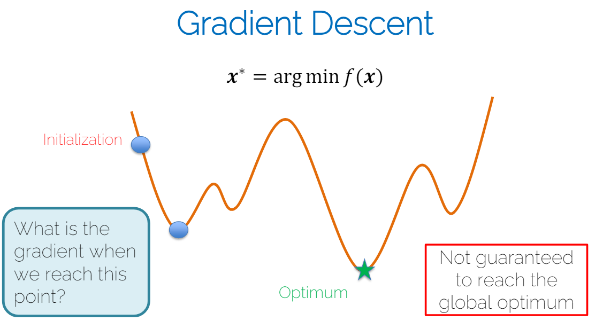


1. 可能到达Local minima，不保证global minima。
2. 唯有在凸函数中，可保证。
3. 但实际上用不同的参数设置可以达到不同的local minima但是有相似的效果。所以并不是很在乎到了哪个local minima。

### 1.2. Learning rate
大vs小

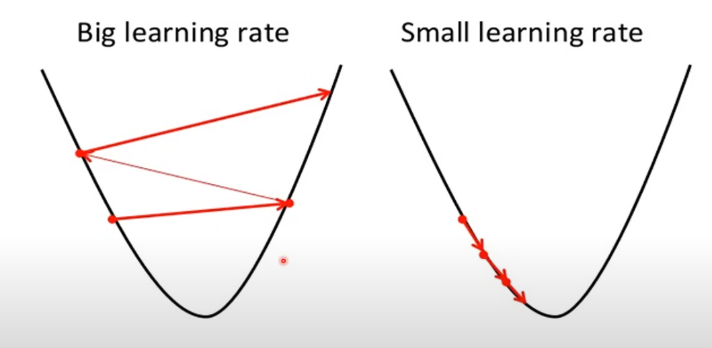

当gradient很小时，我们希望learning rate很大，这样可以快速收敛。但是当gradient很大时，我们希望learning rate很小，这样可以避免overshooting。

实际操作时，可以用Adaptive learning rate（PS 比如adam），或者先使用一个learning rate，然后修改一下看看能不能再挤出一些优化来。

### 1.3. 可视化（仅低维）

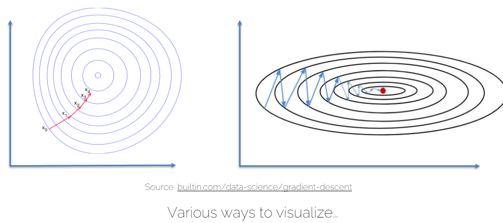

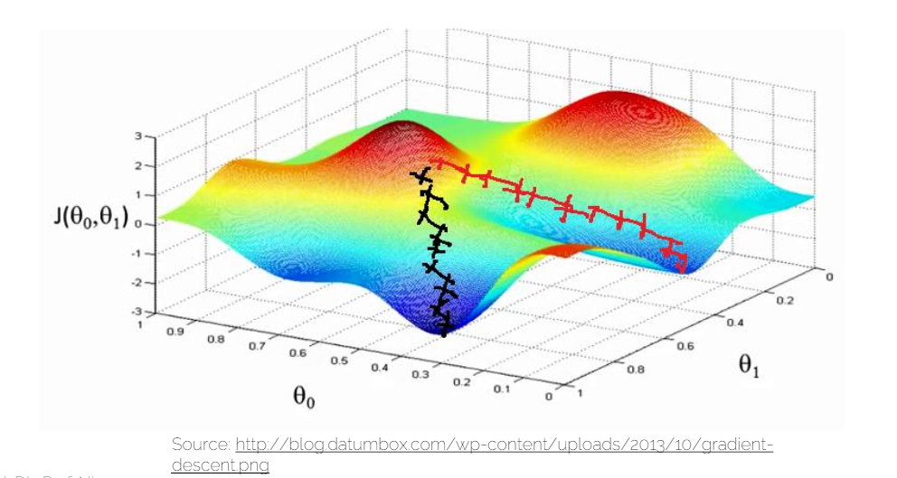

### 1.4. 梯度下降实际操作

#### 1.4.1. single training sample(简单例子)

* Given a loss function L and a single training sample $(x_i, y_i)$
* Find best model parameters $\theta = {W, b}$
* Cost $L_i(\theta, x_i, y_i)$
   * $\theta = arg\space min\space L_i(x_i,y_i)$
* Gradient Descent
   * 初始化$\theta^1$，用一个“random”的值（具体见下面的讨论）
   * $\theta^{k+1} = \theta^k - \alpha \nabla_\theta L_i(\theta^k, x_i, y_i)$
   * 迭代知道收敛：$|\theta^{k+1} - \theta^k| < \epsilon$

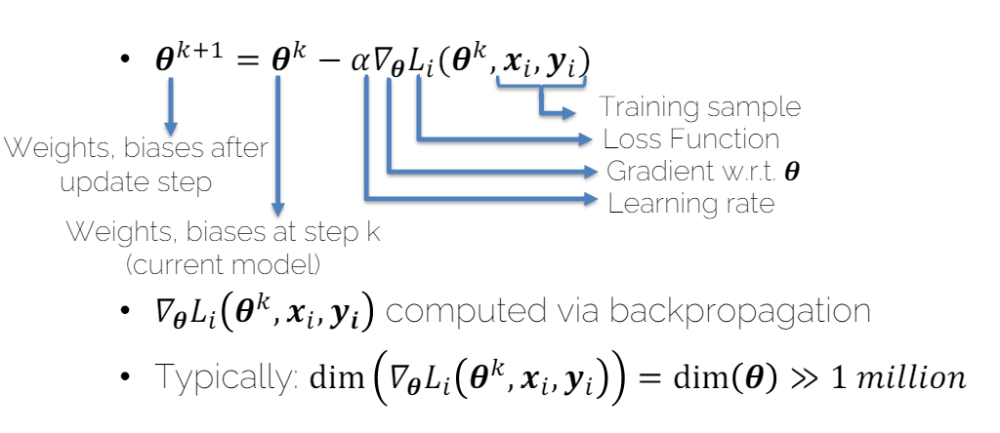

#### 1.4.2. Multiple training samples

* Given a loss function L and multiple (n) training samples $(x_i, y_i)$
* Find best model parameters $\theta = {W, b}$
* Cost $L=\frac{1}{n}\sum_{i=1}^{n}L_i(\theta, x_i, y_i)$
  * $\theta = arg\space min\space L$
* Update step for multiple samples
  * $\theta^{k+1} = \theta^k - \alpha \nabla_\theta L(\theta^k, x_{1:n}, y_{1:n})$
* Gradient is average / sum over residuls
  * $\nabla_\theta L(\theta, x_{1:n}, y_{1:n}) = \frac{1}{n}\sum_{i=1}^{n}\nabla_\theta L_i(\theta^k, x_i, y_i)$
  * reminder: $\nabla_\theta L_i(\theta, x_i, y_i)$ comes from backpropagation.即每个sample都用backprop计算gradient，然后再求平均。
* 如果很多人omit$1/n$，因为这个不影响最终的结果，只是rescale了learning rate。

## 2. Optimal Leraning rate

可以使用Line search来计算最优的learning rate。

理解：每次迭代，我们都在当前的$\theta$上，沿着gradient的方向，找到一个最优的$\alpha$，使得loss最小。

1. 计算gradient: $\nabla_\theta L=\frac{1}{n}\sum_{i=1}^{n}\nabla_\theta L_i$
2. Optimize for optimal step $\alpha$ (翻译：优化最优的步长$\alpha$)
   * $\alpha = arg\space min_\alpha L(\theta^k - \alpha \nabla_\theta L)$
   * 也就是说，我们在当前的$\theta$(参数)上，沿着gradient的方向，找到一个最优的$\alpha$，使得loss最小。
3. $\theta^{k+1} = \theta^k - \alpha \nabla_\theta L$

## 3. Stochastic Gradient Descent(SGD)(随机梯度下降)

### 3.1. 总览

普通梯度下降不实用是因为成本太高了，每次都是解算一个巨大的系统。

Loss function: $L(\theta, x_{1:n}, y_{1:n})=\frac{1}{n}\sum_{i=1}^{n}L_i(\theta, x_i, y_i)$相当于一个Expectation。

所以用一个subset of data来approximate这个expectation。

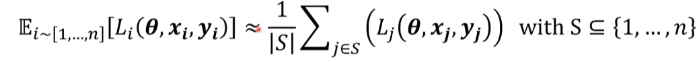

Minibatch, choose subset of trainset S << n

**重要点：一个sample只在一个batch中出现。即如果minibatch size=m, 总的batch数=n/m**

* minibatch size 也是超参数
  * 越小的batch size，方差越大
    * noisy updates
    * 受GPU内存限制，有时候一个batch可以分两份，然后分别计算（gradient accumulation）
  * size 一般是2的次方，因为GPU的内存是2的次方。
    * GPU并行计算的时候，会用到这个特性。
    * cuda里的block可以并行
  * Mostly limited by GPU memory (in backward pass)

PS: epoch = complete pass through training set 即所有的batch都被用到了一次。

### 3.2. Convergence of SGD
假设我们想用SGD来最小化一个函数$F(\theta)$

$$\theta^{k+1} = \theta^k - \alpha H(\theta^k,X)$$

其中$\alpha_1, \alpha_2, ...$是a sequence of positive step-sizes。$H(\theta^k,X)$是unbiased estimate of the gradient $\nabla F(\theta^k)$。

$$E[H(\theta,X)] = \nabla F(\theta^k)$$

Robbins, H. and Monro, S. (1951). 

SGD一定会收敛（converge）到local(global) minimum，只要：
1. $\alpha_n \geqslant 0, \forall n \geqslant 0$
2. $\sum_{n=1}^{\infty}\alpha_n = \infty$
3. $\sum_{n=1}^{\infty}\alpha_n^2 < \infty$
4. $F(\theta)$ is stricyly convex

### 3.3. Problems of SGD

* Gradient is scaled equally for all dimenstions(梯度在所有维度上都是一样的)
  * 即 我们不能单独的scale某个方向
  * 需要保守的学习率来避免divergence
  * 但是这样会导致收敛速度慢
  * 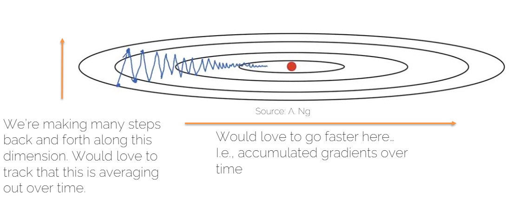
* 找一个好的学习率也是一门艺术
  * 下一课

### 3.4. Gradient Descent with Momentum (使用动量的梯度下降)

理解：就是把gradient每次都加起来。以三维为例，很好理解，一次梯度向左，一次向右，加起来就在中间了。

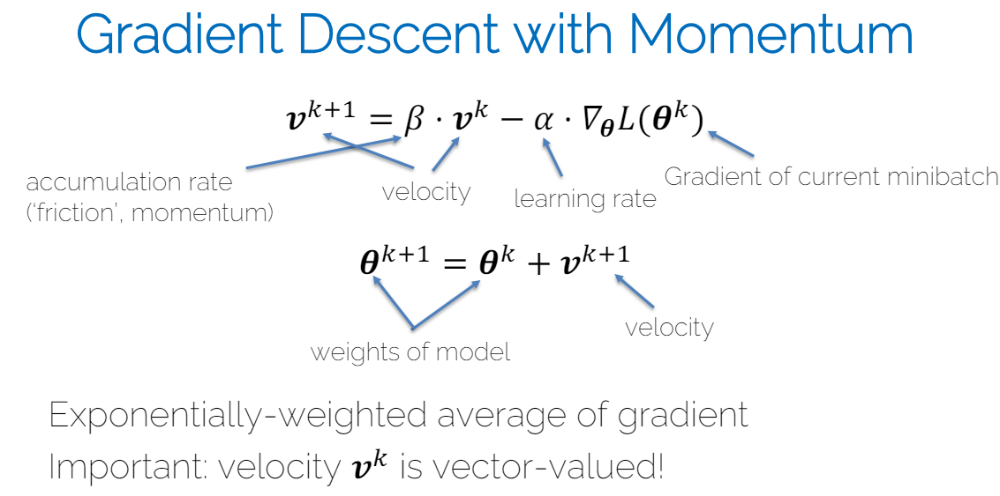

初始速度可以设置为0，动量（accumulate rate）$\beta$一般设置为0.9。

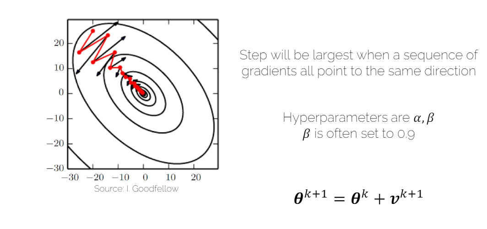

#### 3.4.1. 能克服local minimas吗？

能！但是不完全能。你就想象因为momentum存在，它会因为叠加下坠越来越快，有可能跳出当前的local minima，但是也有可能跳不出去下一个，或者再跳回来。甚至有可能跳到的另一个local minima更差(当然，神经网络不在乎就是了)。

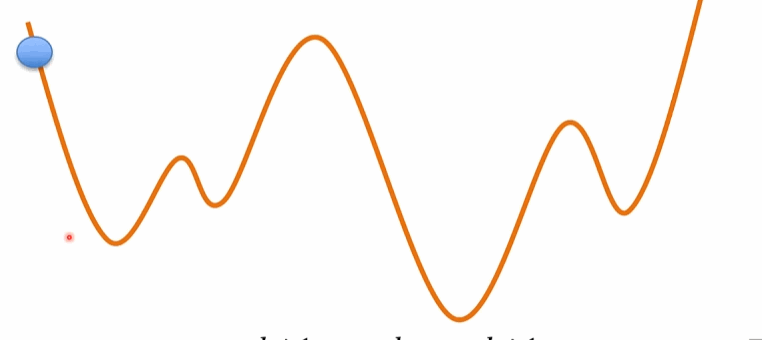

#### 3.4.2. Variants of Momentum
##### 3.4.2.1. Nesterov Momentum

Look-ahead momentum

理解：这里的$\tilde\theta$并不会被用到神经网络，只是用来计算速度，相当于首先根据当前动量进行一次大步跳跃，然后在新的位置计算梯度，并进行相应的修正。这样可以在一定程度上避免过度跳跃，并使优化更加稳定和高效。

为什么说是避免过度跳跃？因为，当前方向继续向前计算出来的梯度基本会减少速度，所以假设的下一步虽然跳远了，但是真实的下一步不会跳的太远。比如下图红色的修正3。

另外也加速了，比如下图红色的修正2。

红色就是theta tilde的梯度。

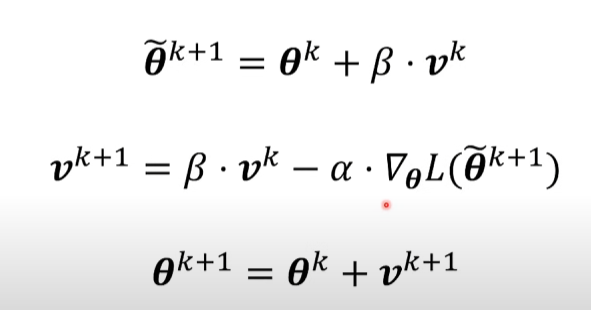

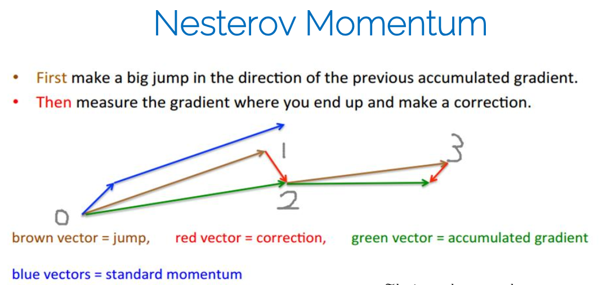

### 3.5. Root Mean Square Propagation (RMSProp)

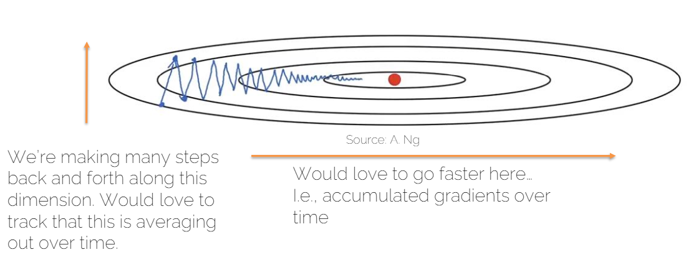

它惩罚波动：

将梯度的平方的指数加权平均数的平方根作为学习率的分母。相当于对梯度的波动进行了惩罚，使得波动较大的方向的学习率变小，波动较小的方向的学习率变大。

数学：accumulate squared gradients.

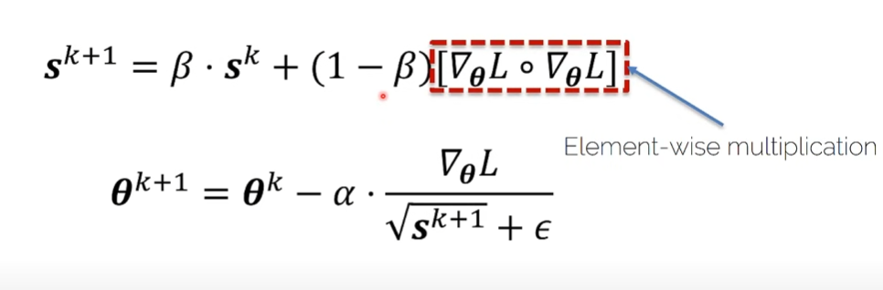

超参数：
* $\alpha$：needs tuning(需要调整)
* $\beta$：decay rate(衰减率) often 0.9
* $\epsilon$：避免除零, often $10^{-8}$

gpt:
```
问题：为什么波动大的方向，梯度的平方就会变大？

因为一般波动大的地方，梯度的绝对值大。
```

* dampening the oscillations for high-variance directions (翻译：对高方差方向的振荡进行抑制)
* can use faster learning rate beacuase it is less likely to diverge (翻译：可以使用更快的学习率，因为不太可能发散)
  * 加速学习速度(理解：因为分母放在学习率下就好理解了。)
  * 有时候被叫second momentum(见adam)
  * second moment(二阶矩方法)
    * 补：wiki:二阶矩法是一种在概率论和分析中使用的技术，用于显示随机变量为正的正概率。更一般地，**“矩量法”包括使用其矩量来限制随机变量远离其平均值波动的概率。**

### 3.6. Adam - Adaptive Moment Estimation

结合了Momentum和RMSProp

1. first momentum: mean of gradients
   1. $$m^{k+1}=\beta_1m^k+(1-\beta_1)\nabla_\theta L(\theta^k)$$
   2. 理解：所谓平均是现在和过去梯度的加权平均。
2. second momentum: variance of squared gradients
   1. $$v^{k+1}=\beta_2v^k+(1-\beta_2)(\nabla_\theta L(\theta^k)\odot \nabla_\theta L(\theta^k))$$
   2. 理解：这种计算方法不是严格意义上的统计学中的方差计算，因为它没有从每个梯度值中减去均值。然而，它给出了关于梯度大小波动性的度量，可以被看作是一种“非中心化方差”的估计。这也是为什么有些地方将其称作“方差”的原因，尽管这种表述不是十分精确。

未作bias correction时候：

$$\theta^{k+1}=\theta^k-\alpha\frac{m^{k+1}}{\sqrt{v^{k+1}}+\epsilon}$$

因为k=0时候，有 $m^0=0, v^0=0$，所以需要做bias correction。修正的方法是：
当k迭代到越大的值的时候，由于beta常常小于1，所以$\beta^k$会越来越接近于0，以此来放大过去，缩小现在。

$$\tilde m^{k+1}=\frac{m^{k+1}}{1-\beta_1^{k+1}}$$

$$\tilde v^{k+1}=\frac{v^{k+1}}{1-\beta_2^{k+1}}$$

=>

$$\theta^{k+1}=\theta^k-\alpha\frac{\tilde m^{k+1}}{\sqrt{\tilde v^{k+1}}+\epsilon}$$


超参数：
* $\alpha$：需要调整
* $\beta_1$：momentum decay rate，often 0.9
* $\beta_2$：RMSProp decay rate，often 0.999 （pytorch默认）
* $\epsilon$：避免除零，often $10^{-8}$

### 3.7. 可视化比较


（这个图不是不动的才好，而是离开的才好，所以显示了rmsprop很重要）


显示去了不同的local minima。


## 4. 数学

1. [Jacobians and Hessians](../../../../其他学科知识积累/Maths/标量求导_梯度_Jacobian_Hessian.md)
2. Newtons' method
3. Taylor series expansion
4. BFGS and L-BFGS
5. Gauss-Newton
6. Levenberg
7. Levenberg-Marquardt


## 5. 总结

* Standard: Adam
* Fallback option(备选方案): SGD with momentum
* Newton, L-BFGS, GN, LM only if you can do full batch updates (doesn't work well for minibatches!!) (实际上在DL里几乎不会用，虽然理论上非常好因为非常快就能收敛)

## 6. General optimization

* Leanear system (Ax=b)
  * LU, QR, Cholesky, Jacobi, Gauss-Seidel, CG, PCG, etc.
* **Non-linear** (gradient-based)
  * Newton, Gauss-Newton, LM, (L)BFGS
  * **Gradient descnet, SGD**
* Others
  * Genetic algorithms, MCMC(马尔科夫链蒙特卡洛), Metroplis-Hastings
  * Constrained and convex solvers(Langragge,ADMM,Primal-Dual,etc.)