# Lecture 07 - Losses and Activations

- [1. Output and Loss Functions](#1-output-and-loss-functions)
  - [1.1. Regression Losses](#11-regression-losses)
  - [1.2. Binary Classification: Sigmoid](#12-binary-classification-sigmoid)
  - [1.3. Multi-Class Classification: Softmax](#13-multi-class-classification-softmax)
    - [1.3.1. Cross-Entropy Loss of Softmax](#131-cross-entropy-loss-of-softmax)
    - [1.3.2. Loss Function of Softmax](#132-loss-function-of-softmax)
    - [1.3.3. Example](#133-example)
  - [1.4. Hinge Loss (SVM Loss)](#14-hinge-loss-svm-loss)
    - [1.4.1. Loss Function of Hinge Loss](#141-loss-function-of-hinge-loss)
    - [1.4.2. Example](#142-example)
  - [1.5. Hinge Loss vs Cross-Entropy Loss](#15-hinge-loss-vs-cross-entropy-loss)
  - [1.6. (小结) Loss in Compute Graph](#16-小结-loss-in-compute-graph)
    - [1.6.1. Example](#161-example)
- [2. Activation Function](#2-activation-function)
  - [2.1. ReLU系列图结](#21-relu系列图结)
  - [2.2. 所有函数图](#22-所有函数图)
  - [2.3. 小结](#23-小结)
- [3. Weight Initialization](#3-weight-initialization)
  - [3.1. 不好的初始化](#31-不好的初始化)
  - [3.2. Xavier Initialization (Glorot Initialization)](#32-xavier-initialization-glorot-initialization)
  - [3.3. Kaiming Initialization](#33-kaiming-initialization)
- [4. 小结](#4-小结)

## 1. Output and Loss Functions

### 1.1. Regression Losses

1. L1 Loss: Sum of absolute differences
   1. Robust (cost of outliers is linear)
   2. Costly to optimize
   3. Optimum is the median
2. L2 Loss: Sum of squared differences (SSD)
   1. Prone to outliers
   2. Compute-efficient optimization
   3. Optimum is the mean

### 1.2. Binary Classification: Sigmoid

$$y = \frac{1}{1 + e^{-x}}$$

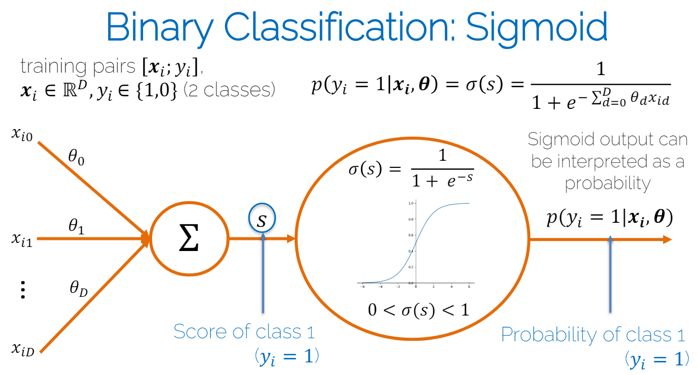

个人理解：使用sigmoid而不是直接拿sigmoid的输入值作为判别标准其实是因为它标准化输出，1 它平滑，2 它把输出限制在0-1之间使得可以看作是一个概率分布。

### 1.3. Multi-Class Classification: Softmax

$$y_i = \frac{e^{s_{y_i}}}{\sum_{k=1}^{C} e^{s_k}}$$

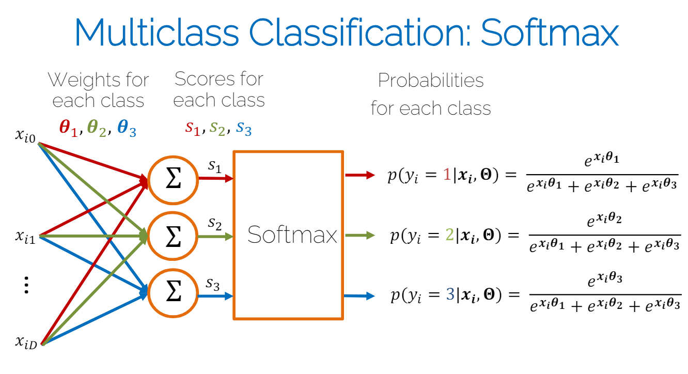

1. Exponential operation: 确保概率 > 0
2. Normalization: 确保概率和为1 (分母)

**理解：**
1. softmax 对应 L2 loss，max 对应 L1 loss
2. L2 平滑可导，L1 不可导（不可导的地方是0）
3. softmax 平滑可导，max 不平滑，因为忽上忽下
4. 因此softmax和L2 loss更适合用于梯度下降

为了防止$x_i$很大时计算溢出，可以使用以下公式：

$$y_i = \frac{e^{s_{y_i} - \max(x)}}{\sum_{k=1}^{C} e^{{s_k} - \max(x)}}$$

证明上式等价：

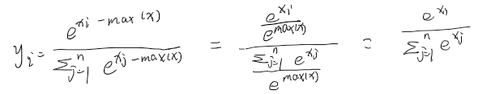

#### 1.3.1. Cross-Entropy Loss of Softmax

$$L = -log(p(y_i|x_i, \theta)) = -log(\frac{e^{s_{y_i}}}{\sum_{k=1}^{C} e^{s_k}})$$

意义：最小化交叉熵等价于最大化似然函数

理解：
1. 不要认为cross-entropy就是 $-\sum_{i=1}^{n} y_i \log(y_i)$
   1. 熵是指一个分布的不确定性，如果一个随机变量的可能结果多且不确定性高，那么它的熵就高
   2. 当你使用错误的概率分布（模型预测的分布）来编码来自正确分布（真实标签的分布）的事件时，平均编码长度（即不确定性）增加了多少。人话就是，如果你的模型预测的概率分布和真实标签的概率分布越接近，那么交叉熵就越小
2. Softmax本身并不提供一个机制来指导模型如何调整其参数以改进输出预测。但是交叉熵使得熵最小，即使得预测的概率分布和真实标签的概率分布尽可能接近。
3. 为什么这个公式说越小，softmax的预测越自信？
   1. 因为分子只取与真实标签$y_i$对应的类别输出$s_{y_i}$，所以只有这个值越大，交叉熵越小，即模型越自信

#### 1.3.2. Loss Function of Softmax
对此Loss function可以是（Li就是上面的交叉熵）：

$$L = \frac{1}{N} \sum_{i=1}^{N} L_i$$

#### 1.3.3. Example

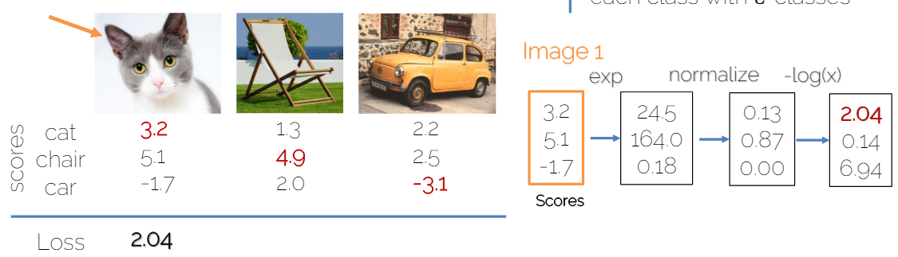

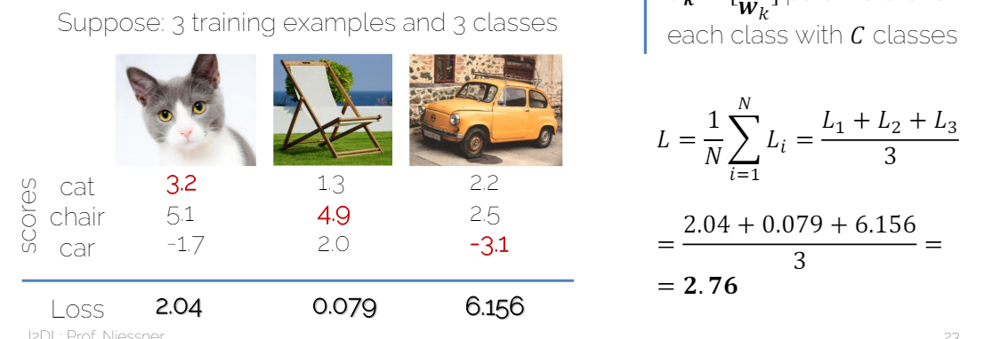

### 1.4. Hinge Loss (SVM Loss)

很少用，只是为了理解loss function

$$L_i = \sum_{k \neq y_i} \max(0, s_k - s_{y_i} + \Delta)$$

1. $\Delta$一般取1
2. $y_i$是正确类别，$k$是错误类别

#### 1.4.1. Loss Function of Hinge Loss

$$L = \frac{1}{N} \sum_{i=1}^{N} L_i$$

1. $L_i$就是上面的Hinge Loss

#### 1.4.2. Example

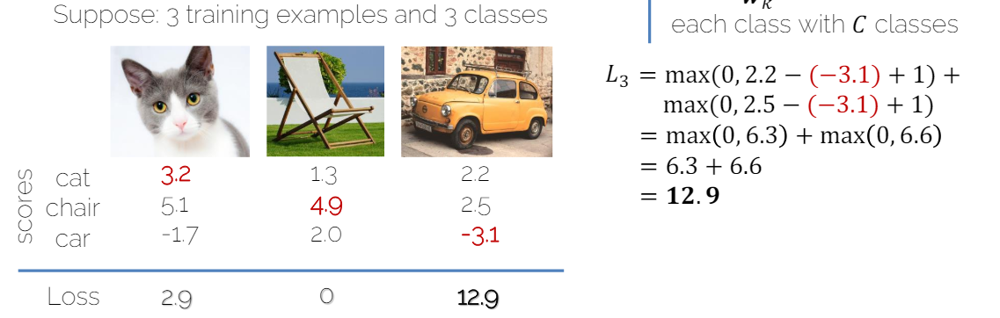

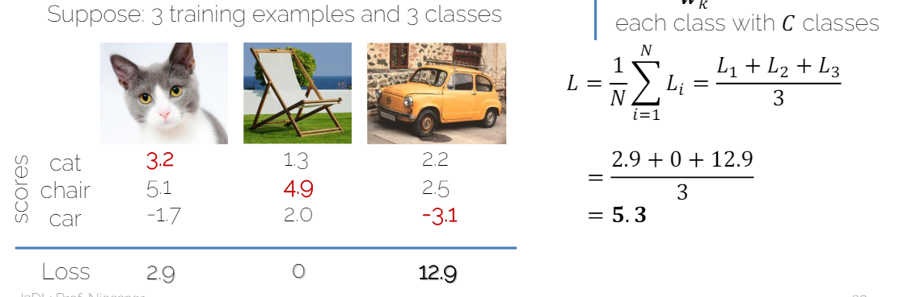

### 1.5. Hinge Loss vs Cross-Entropy Loss

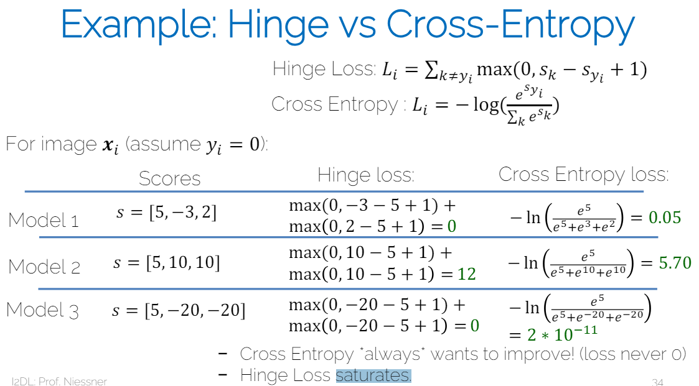

1. 交叉熵总是会想进步
2. hinge loss会饱和

### 1.6. (小结) Loss in Compute Graph

1. Score function: $s = f(x_i, \theta)$
2. Data Loss:
   1. Cross-Entropy Loss: $L = -log(p(y_i|x_i, \theta))= -log(\frac{e^{s_{y_i}}}{\sum_{k=1}^{C} e^{s_k}})$
   2. SVM: $L_i = \sum_{k \neq y_i} \max(0, s_k - s_{y_i} + 1)$
3. Regularization Loss: 
   1. L2: $R^2(w) = \sum w_i^2$
   2. L1: $R^1(w) = \sum |w_i|$
4. Full Loss = Data Loss + Reg Loss
   1. $L = \frac{1}{N} \sum_{i=1}^{N} L_i + \lambda R^2(w)$

#### 1.6.1. Example

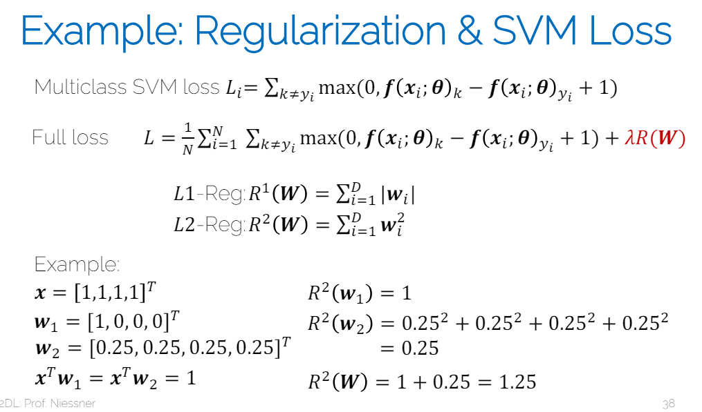

## 2. Activation Function

1. **Sigmoid**:
   1. $$y = \frac{1}{1 + e^{-x}}$$
   2. 优点：
      1. normalize: 把结果放到了0-1之间
      2. have smooth gradients: 处处可导，方便梯度
   3. 缺点
      1. saturated(饱和): 两端梯度接近0，导致**梯度消失**，这样权重更新就会很慢
      2. sigmoid全是正数，导致输出不是0均值（或说zero centered），这样会导致梯度方向不稳定
         1. 为什么不是zero centered就会不稳定？
            1. 当多层使用Sigmoid激活函数时，由于所有神经元的输出都是正的，导致梯度更新在所有层上都可能具有相同的符号（全正或全负）。这可能使得梯度更新在训练过程中表现出系统性的偏向，从而导致权重更新不稳定，进而影响整个网络的学习和收敛性。**当所有层的梯度都具有相同的符号时，这会导致权重更新在某些情况下过于一致，可能推动网络朝一个方向过度优化，从而忽略了其他潜在有用的方向。这种现象称为“梯度共振”，它可能使网络陷入局部最小值或延迟收敛。**
            2. 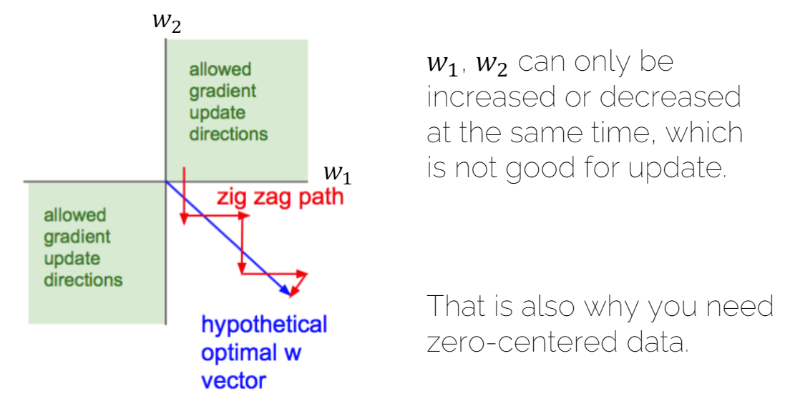
               1. 理解：图上w1,w2不能一个加一个减
         2. 可以使用**Tanh**解决这个问题(但是还是会有梯度消失问题)
            1. $$y = \frac{e^x - e^{-x}}{e^x + e^{-x}}$$
            2. 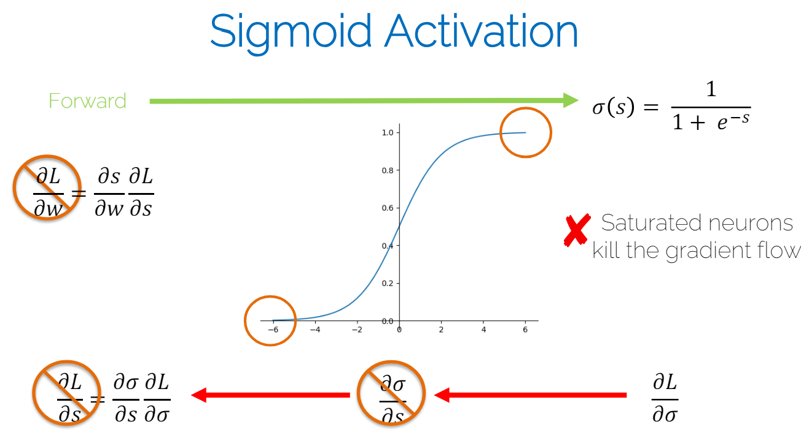
            3. 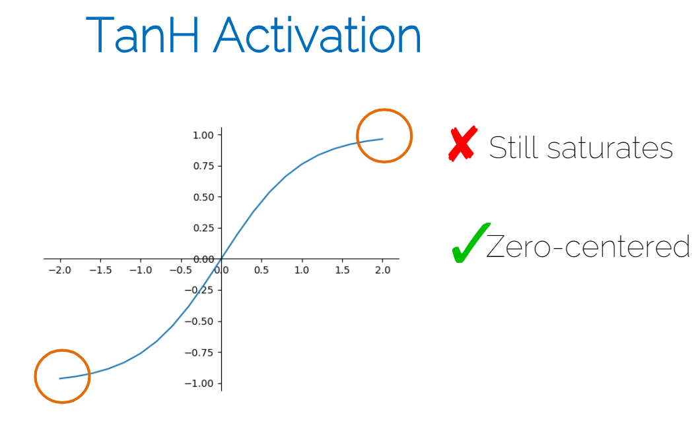
         3. 理解：机器学习也是一样的，有一个[normalize flow](../../机器学习进阶_深度生成模型/Normalizing_Flows.md)，就是为了将复杂分布转换为简单分布，比如高斯分布，然后这个分布就是均值为0。
2. **ReLU**:
   1. $$y = \max(0, x)$$
   2. 解决sigmoid的饱和问题 - 梯度消失
   3. 优点：
      1. Fast convergence: 收敛速度快
      2. 不会饱和
   4. 缺点：
      1. Dead ReLU: 当输入小于0时，梯度为0，导致权重更新不再进行 - 梯度消失
   5. 解决Dead ReLU问题：
      1. Leaky ReLU: $y = \max(0.01x, x)$
      2. Parametric ReLU: $y = \max(\alpha x, x)$
         1. One more parameter to backprop into
3. **Maxout Units**
   1. $$Maxout= \max(w_1^T x + b_1, w_2^T x + b_2)$$
   2. 现在的趋势是更简单的激活函数，这个不那么好用了

### 2.1. ReLU系列图结
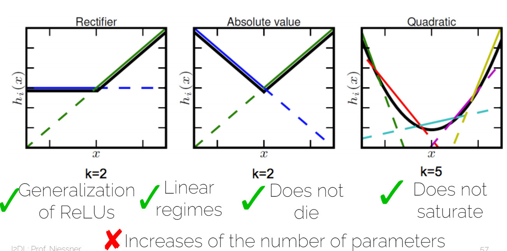 

第一个就是一维的ReLU，第二个是Maxout Unit，第三个就是更高维的。

### 2.2. 所有函数图

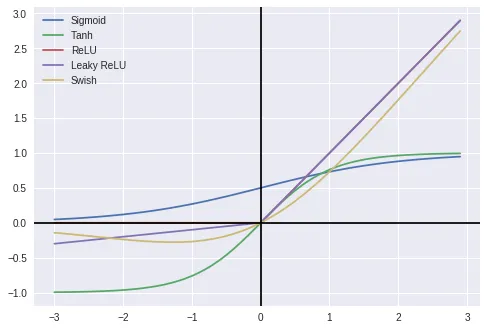

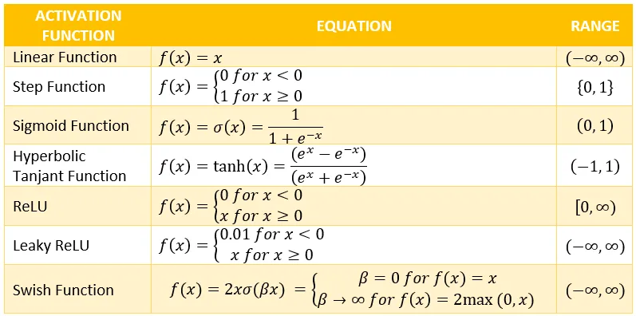

### 2.3. 小结

1. Sigmoid/TanH are not really used in feedward nets today
2. ReLU is the standatd choice
3. Second choise are the variants of ReLU or Maxout
4. Recurrent nets will require Sigmoid/TanH or similar

## 3. Weight Initialization

核心思想：让每一层的输出保持一致的分布。

### 3.1. 不好的初始化
1. All weights zero
   1. hidden units 会计算相同的东西，梯度也会相同 - 对称性，即会no symmetry breaking
2. Small random numebrs
   1. Gaussian with zero mean and standard deviation 0.01
      1. – Network with 10 layers with 500 neurons each
      2. – Tanh as activation functions
      3. – Input unit Gaussian data
   2. 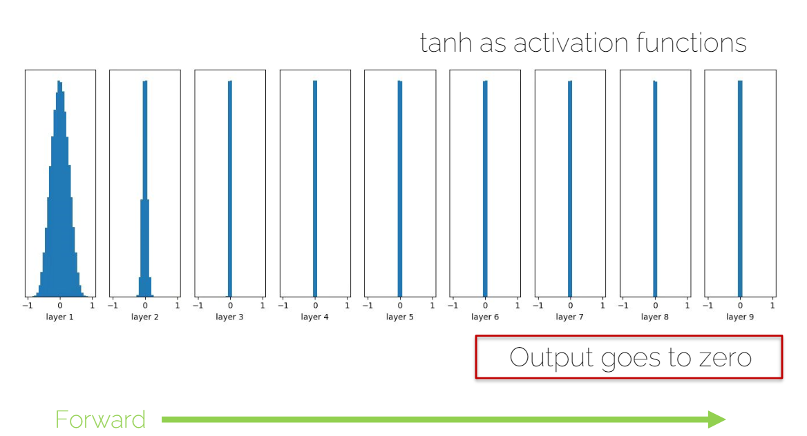
   3. 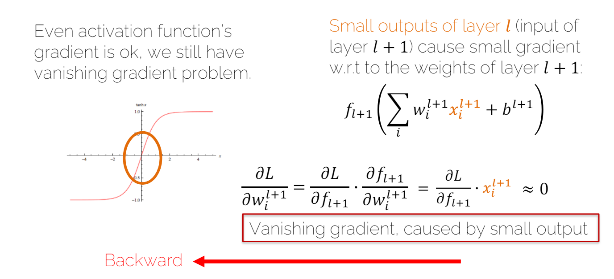
   4. 虽然激活函数的梯度不会消失，但是给下一层的传值太小，导致backpropagation的梯度也很小，导致**梯度消失**还是会发生
3. Big random numbers
   1. Gaussian with zero mean and standard deviation 1
      1. – Network with 10 layers with 500 neurons each
      2. – Tanh as activation functions
      3. – Input unit Gaussian data
   2. 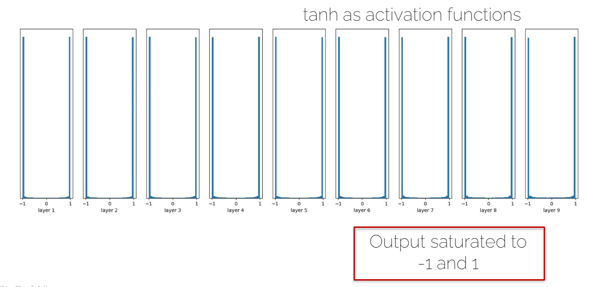
   3. 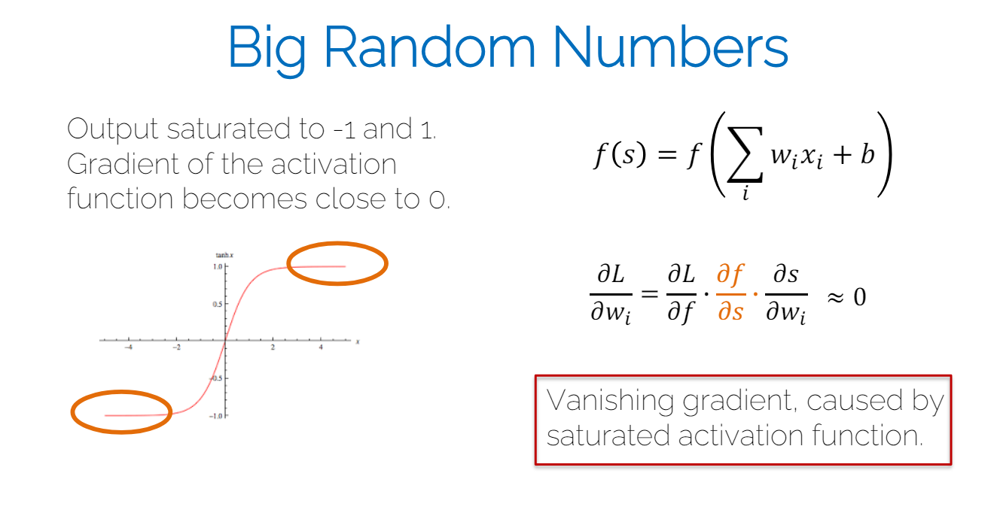
   4. 梯度消失，因为在tanh的两边

### 3.2. Xavier Initialization (Glorot Initialization)

Gaussian with zero mean, but what standard deviation?

n 是当前层的输入神经元数量。

$$Var(s)=Var(\sum_i^n w_i x_i)=\sum_i^n Var(w_i x_i)$$

利用[乘积的方差](../../../../其他学科知识积累/Maths/乘积的方差.md)：

$$Var(s)=\sum_i^n [E(w_i)]^2 Var(x_i) + [E(x_i)]^2 Var(w_i) + Var(w_i) Var(x_i)$$

其中E(w) = 0，E(x) = 0，

$$Var(s)=\sum_i^n Var(w_i) Var(x_i)$$

为了确保输出和输入的方差一致，即$Var(s) = Var(x)$，所以：

$$n Var(w) Var(x) = Var(s) = Var(x)$$

即：

$$Var(w) = \frac{1}{n}$$

### 3.3. Kaiming Initialization

$$ Var(s) = 1/(n/2) = \frac{2}{n}$$

理解：

ReLU 杀了一半的数据，使得输出的方差变为原来的一半，所以要乘以2。

如果继续用Xavier initialization:

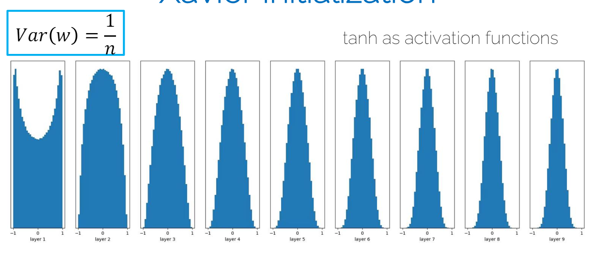

当使用Kaiming时：
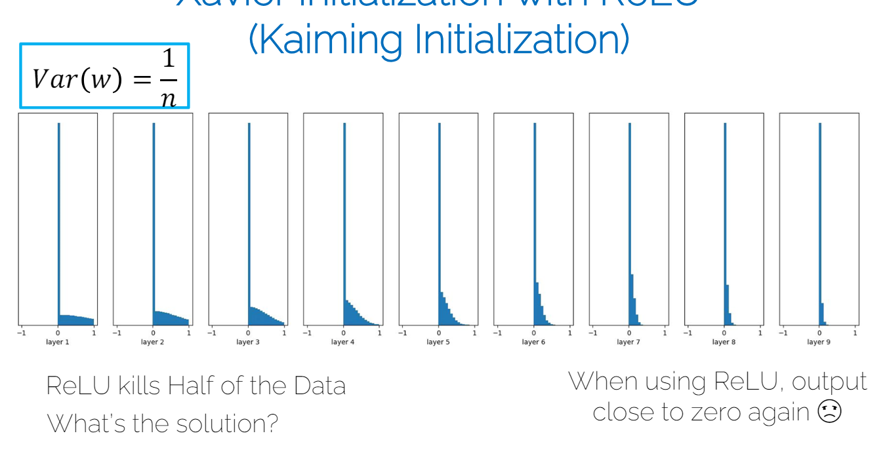

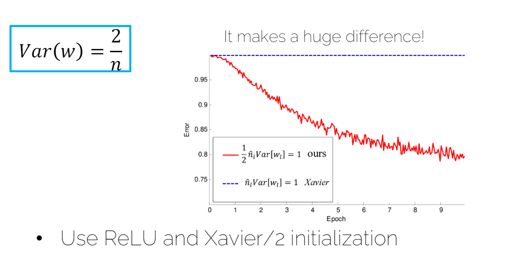

## 4. 小结

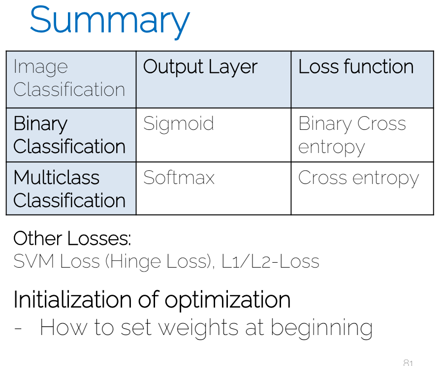