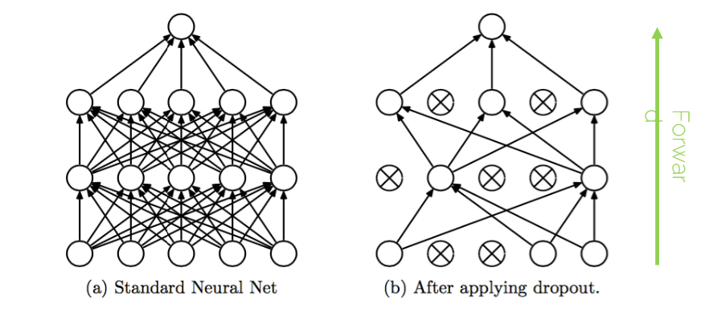

# Lecture 08 - Augmentation and Regularization

- [1. Data Pre-Procesing](#1-data-pre-procesing)
- [2. Data Augmentation](#2-data-augmentation)
  - [2.1. 简单的数据增强Flip + Crop](#21-简单的数据增强flip--crop)
  - [2.2. Brightness](#22-brightness)
  - [2.3. Random Crops](#23-random-crops)
  - [2.4. Advanced](#24-advanced)
  - [2.5. 补充](#25-补充)
- [3. Advanced Regularization](#3-advanced-regularization)
  - [3.1. L2 Regularization - 不是weight decay](#31-l2-regularization---不是weight-decay)
    - [3.1.1. L2 Regularization](#311-l2-regularization)
    - [3.1.2. Weight decay](#312-weight-decay)
  - [3.2. Early Stopping](#32-early-stopping)
  - [3.3. Bagging and Ensemble Methods](#33-bagging-and-ensemble-methods)
  - [3.4. Dropout](#34-dropout)
    - [3.4.1. Dropout: Intuition](#341-dropout-intuition)
    - [3.4.2. Dropout: Test Time](#342-dropout-test-time)
    - [3.4.3. Dropout: Before](#343-dropout-before)
    - [3.4.4. Dropout: Nowadays](#344-dropout-nowadays)
  - [3.5. Batch Normalization](#35-batch-normalization)
    - [3.5.1. BN Layer](#351-bn-layer)
    - [3.5.2. 实际使用](#352-实际使用)
    - [3.5.3. 补充](#353-补充)
    - [3.5.4. BN: Train vs Test](#354-bn-train-vs-test)
    - [3.5.5. BN: What do you get?](#355-bn-what-do-you-get)
    - [3.5.6. 补充](#356-补充)
- [4. Why not simply more layers?](#4-why-not-simply-more-layers)


## 1. Data Pre-Procesing


理解：
1. 数值太大，不好训练，容易进入local minimum。
2. 归一化，既可以zero-center，也可以数值归一化。

## 2. Data Augmentation

1. Classifier必须**对各种变换具有不变性**。
2. 帮助classifier：synthesize(合成)数据 模拟 合理的Transformation。理解：**通过生成数据的方式模拟可能的变换。**


### 2.1. 简单的数据增强Flip + Crop
1. Flip 翻转
2. Crop + Flip 剪裁 + 翻转


PS：224x224的图像，224是因为2010年的AlexNet，一般很多网络都有专门的中继函数写了用于处理224x224的图像。

### 2.2. Brightness

Random brightness and contrast changes （随机亮度和对比度变化）


### 2.3. Random Crops

* Training: random crops
  * 在[256, 480]中随机选取一个L
  * 训练图像短边缩放到L
  * 随机选择一个224x224的区域进行裁剪
* Testing: fixed set of crops
  * 在N个不同的尺度上调整图像大小：为了进行测试，图像首先会被调整到N个预定义的尺度。这一步骤旨在通过不同的尺寸来评估模型的性能，确保模型对尺寸变化的鲁棒性。
  * 每个尺度的图像都会进行10 fixed crops of 224x224: (4 corners + center) x 2 flips (original + horizontal flip)。

### 2.4. Advanced

* Shear + Contrast
  * 
* Sample strength:
  * 

  * ```ada
    -- TricialAugmentation Procedure
    procedure TA(x:image)
        Sample an augmentation a from A
        Sample a strength m from {0,...,30}
        Return a(x,m)
    end procedure
    ```

  * 理解: 就是从各种变换的集合A中随机选择一个变换a，然后从{0,...,30}中随机选择一个强度，然后对图像进行变换。
    * 概率：这指的是进行特定数据增强操作的概率。例如，在随机翻转的情况下，强度可以表示为翻转发生的概率。这种情况下，高概率意味着翻转更频繁，低概率则相反。
    * 程度：在一些操作中，如旋转、缩放或色彩调整，强度具体指操作的程度。例如，在旋转图像时，强度可以是旋转的最大角度；在调整亮度时，强度可以是亮度调整的范围。
    * 参数变化：在裁剪等操作中，强度可能指裁剪大小的变化范围或裁剪框的位置范围。例如，随机裁剪时，强度可以是允许的裁剪区域大小的最小和最大范围，或是裁剪位置的随机性。


### 2.5. 补充

* 当比较两个网络时，使用相同的data augmentation
* 将data augmentation认为是网络设计的一部分

## 3. Advanced Regularization

Recap: Regularization是为了让训练更难，从而不会过拟合，从而提高泛化能力即对新数据的适应能力。

### 3.1. L2 Regularization - 不是weight decay

#### 3.1.1. L2 Regularization
[L1 L2 Regularization](./Lecture04-OptimizationAndBackprop.md#222-正则化技巧)

* L2 regularization
  * $$\Theta_{k+1} = \Theta - \epsilon \nabla_\Theta (\Theta_k,x,y) - \lambda \theta_k$$
  * $\epsilon$：学习率
  * $\nabla_\Theta (\Theta_k,x,y)$：梯度
  * $\theta_k$：L2-regularization 梯度
* Penalizes large weights (惩罚大权重)
* Improves generalization (提高泛化能力)

#### 3.1.2. Weight decay
Weight decay regularization: 在梯度下降的时候，直接减去一个比例的权重，这样就不用额外计算梯度了。

$$\Theta_{k+1} = (1-\lambda)\Theta_k - \alpha \nabla f_k(\Theta_k)$$

* $1-\lambda$：Learning rate of weight decay
* $\alpha$：Learning rate of the optimizer

它在GD（梯度下降）中是和L2 regularization等价的，但在Adam之类的高级SGD中不等价。

### 3.2. Early Stopping

Patience，当**validation loss**（不是training loss）不再下降时，停止训练。

### 3.3. Bagging and Ensemble Methods

翻译：Bagging（自举汇聚法）和集成方法

* Train multiple models and average their results
* E.g. use a different algorithem for optimization or change the objective function/loss function
* If errors are uncorrelated, the expected combined error will decrease linearly with the esemble size

比如：训练多个模型，然后对结果进行平均。

* 也可以使用k different datasets(or SGD/init noise) - 很少见

PS: 一般人们不会一开始就是用这个方案，只有一般在比赛竞争中或者应用中，为了提高性能，才会在进行了一系列测试后最后使用这个方案。

### 3.4. Dropout

Disable a random set of neurons (typically 50%) during training.

理解：其实有点像集成的，但是更加优雅也不用训练多个模型。



#### 3.4.1. Dropout: Intuition

* Using half the network = half capacity
  * Redundant representation
    * 理解：从表面上看，这确实像是在减少网络利用的特征数量。但是，从整个训练过程的角度来看，Dropout 实际上促使网络在不同的训练阶段关注不同的特征，这样可以增加模型的整体特征利用效率和鲁棒性。
  * Base your scores on more features
* Consider it as a model ensemble
  * Training a large ensemble of models, each on different set of data (mini-batch) and with **SHARED** parameters
  * Reducing co-adaptation between neurons (减少神经元之间的相互适应)

#### 3.4.2. Dropout: Test Time
* 当测试或验证时：no dropout，打开所有的neurons
  * conditions at train and test time are not the same
  * Pytorch: `model.train()` and `model.eval()`
  * 测试时用Dropout Scaling来解决训练和测试时网络行为不一致的问题 - 即通过下一层activation的值会更大，因为有更多个上一层的neurons的值被sum然后进入了activation。
    * scaling意味着在测试时，将dropout的概率乘以权重，以保持输出的期望值不变。
    * 案例：
      * 
    * Test: $z=(\theta_1x_1 + \theta_2x_2) * p$
      * Dropout probability: $p=0.5$ 
    * Train: $E[z] \\= \frac{1}{4}(\theta_10+\theta_20+\theta_1x_1+\theta_20+\theta_10+\theta_2x_2+\theta_1x1+\theta_2x_2)\\=\frac{1}{2}(\theta_1x_1+\theta_2x_2)$
      * 理解1：这里的1/4是因为有4种可能的组合，每种组合的概率是1/4，所以期望就是拿概率乘以每种组合的值。
      * 理解2：然后计算期望值的结果可以看到和测试时的公式是一样的，因为测试时就是以这个原理才乘以了p。
    * 根据GPT显示，也可以不通过test时候 * p 补偿，而是通过在train的时候将dropout的mask * (1-p)

#### 3.4.3. Dropout: Before

* Efficient bagging method with parameter sharing
* Try it
* Dropout reduces the effective capacity of a model, but need more training time
* Efficient regularization method, can be used with L2

#### 3.4.4. Dropout: Nowadays

* 和batch-norm结合时，常常**不好用**
  * Batch-norm: 不是每次iteration用的batch，而是内部每到一层神经，就会使用一次batch-normalization。详情见下一个章节。
* 训练更久，通常1.5倍
* 但是，可以用于uncertainty estimation(不确定性估计)
  * Monte Carlo dropout (Yain Gal and Zoubin Ghahramani series of papers)
    * idea: 在test时，使用dropout，然后看预测结果是否一样。
    * Neural networks 是过于自信的
    * 我们可以用dropout来使softmax概率更加校准
    * 训练：使用dropout with a low p (0.1 or 0.2)
    * 推断时，多次运行相同的图像（25-100次），并平均结果。

### 3.5. Batch Normalization

Reducing internal Covariate Shift (减少内部协变量转移)

* Goal: Out activations do not die out
  * 
* Wish: Unit Gausssian activations (as example)
* Solution:
  * 
  * 让特征们的每一个维度，都有一个unit gaussian (in this example)
  * For NN in general, BN normalizes the mean and variance of the inputs to your activation functions.

#### 3.5.1. BN Layer

A layer to be applied after Fully Connected (or Convolutional) layer and before the non-linear activation functions.


#### 3.5.2. 实际使用

1. Normalize:
   1. 
   2. 必须要backpropagate这个东西，正好根据上面公式它是differentiable的。
2. Allow the network to change the range:
   1. 可以有两个可学习的超参数，让这个range更灵活，比如甚至它可以将整个normalize返回回去
      1. 比如$\gamma^{(k)}=\sqrt{Var[x^{(k)}]}$，$\beta^{(k)}=E[x^{(k)}]$
   2. $$y^{(k)}=\gamma^{(k)}\hat{x}^{(k)}+\beta^{(k)}$$

Disadvantages

1. 运算压力
2. 当你的mini-batch不稳定，结果也不稳定

老师推荐：

不要在开始时候就想着用这玩意，后期再想到他。

#### 3.5.3. 补充

* Ok to treat dimensions separately?
  * 是的，甚至当特征之间存在相关性（correlation）的时候，也可以用BN。

#### 3.5.4. BN: Train vs Test

起因：测试时，不再有多个样本，所以你的BN层就不存在mean和variance了，因此：

* Tranining: Compute mean and variance from mini-batch 1,2,3...
* Testing: Compute mean and variance by running an exponentially weighted average across training mini-batches. Use them as $\sigma^2_{\text{test}}$ and $\mu_{\text{test}}$.
  * $$Var_{\text{running}}=\beta_m * Var_{\text{running}} + (1-\beta_m) * Var_{\text{mini-batch}}$$
  * $$\mu_{\text{test}}=\beta_m * \mu_{\text{running}} + (1-\beta_m) * \mu_{\text{mini-batch}}$$
  * $\beta_m$:momentum (hyperparameter)

#### 3.5.5. BN: What do you get?

* Very deep nets are much easier to train, more stable gradients
  * 理解：
    * 训练深层网络更容易：深度神经网络因其层数众多，训练起来通常较为困难。主要问题包括梯度消失和梯度爆炸，这些问题使得网络难以通过标准的反向传播算法有效学习。Batch Normalization 通过规范化每层的输入，帮助缓解了这些问题，使得每层的激活值分布更加稳定。这样，信息和梯度能够更有效地在网络中传播，从而使得更深的网络也能够有效地训练。
    * 梯度更稳定：BN 通过减少内部协变量偏移（即层间输入分布的变化）来维持激活函数输出的方差，这有助于维护整个训练过程中的梯度稳定性。结果是，梯度更少地受到异常值的影响，优化过程更加平滑。
* A much larger range of hyperparameters works similarly when using BN
  * 理解：更大范围的超参数有效：通常在训练神经网络时，需要精心选择学习率和其他超参数，以确保模型的有效训练。使用 BN 后，因为模型变得对参数的具体值不那么敏感，从而可以使用更广泛的超参数（特别是更大的学习率），而不会使训练过程变得不稳定或导致发散。这一点显著降低了调参的难度和复杂性，使得训练过程更加友好和容错。

#### 3.5.6. 补充

1. 里程碑：


2. 缺点：越小的mini-batch，效果越差:


3. 其他的normalization方法比较:


   * Batch Norm, Layer Norm, Instance Norm, Group Norm

   * 

   * 上图理解：
     * 正方体是输入到一个层的tensor
     * 蓝色的就是normalize什么东西，对于BN就是对单个特征（channel）的所有样本进行normalize，对于LN就是对单个样本的所有特征进行normalize，对于IN就是对单个样本的单个特征的内部值进行normalize，对于GN就是对单个样本的一组特征进行normalize。
     * **备注：所以比如BN，不是说每个坐标的像素点的某个channel计算均值和方差然后normalize，而是这个channel下，所有坐标点一起计算均值和方差然后normalize。这几个normalization都是这样。**
       * 
       * 自我理解：对于图像，这样的话，可以保证不同的坐标间的相关性，当然，如果遇到特定情况，比如每个点单独有作用的，好像可以不用所有点一起，当然我没有idea什么情况是这个。 
   * 但不管是哪个normalization都是为了让nonlinearity更加稳定，从而让训练更加容易。


## 4. Why not simply more layers?
翻译：
* 至少有一个隐藏层的神经网络是通用函数逼近器。
* 但泛化是另一个问题。
* 为什么不只是更深，然后得到更好的结果？
  * 没有结构！！
  * 这只是一种蛮力！
  * 优化变得困难
  * 性能会出现平台/下降！
* 我们需要更多东西！更多意味着CNN、RNN之类的，最终是Transformer。