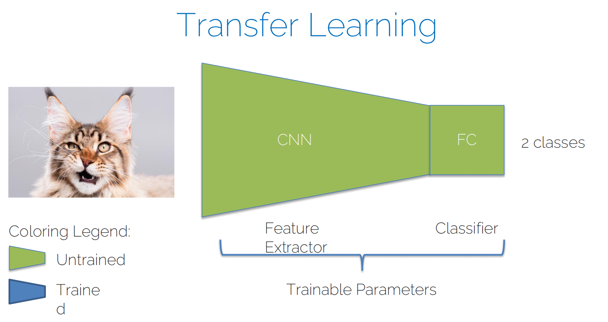
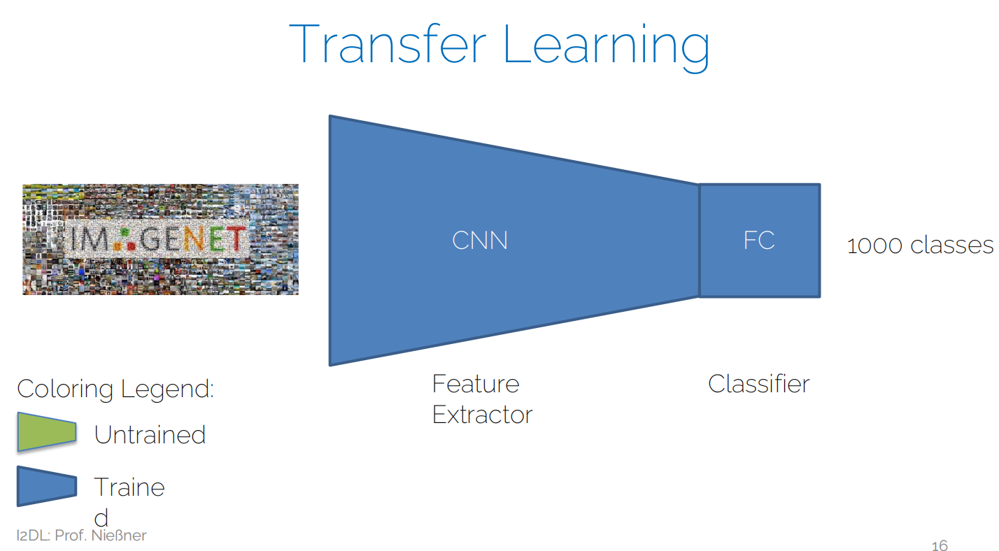
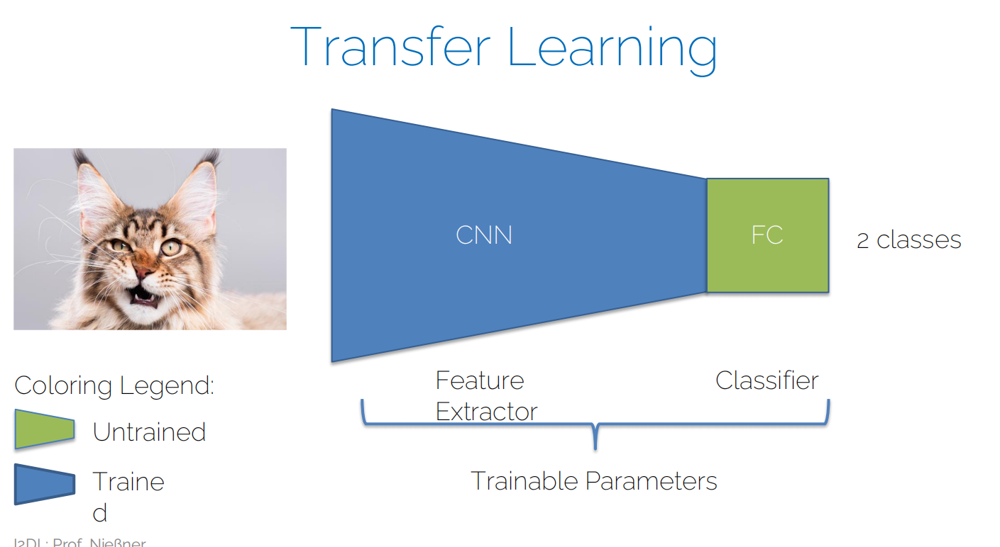
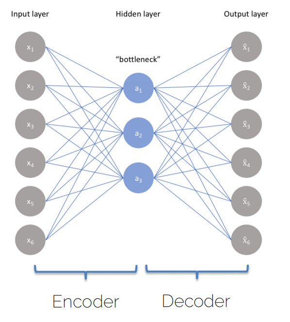
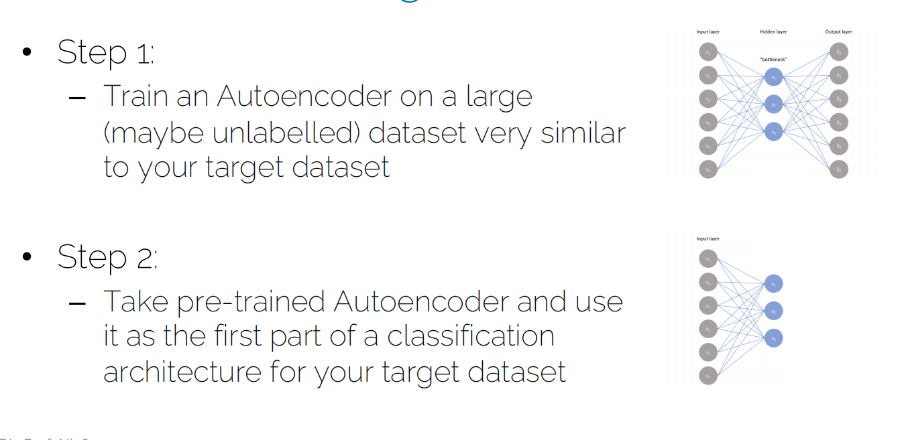
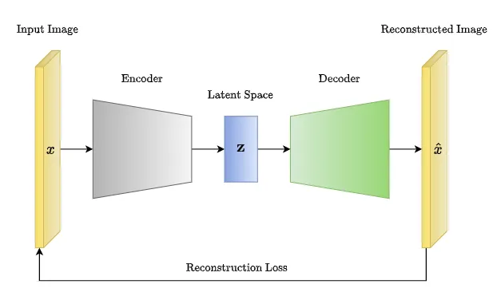

# Lecture 08 - 补充Exercise 8 - Transfer Learning And Autoencoders

## Transfer Learning

2024-06-25 补充：在后面的[Lecture 11](./Lecture11-RNNsAndTransformers.md)中，也有正课学到Transfer Learning。

* 问题陈述：
    * 训练深度神经网络需要大量数据
    * 收集大量数据是昂贵的或者根本不可能的
  * 理念：
    * 一些问题/任务是密切相关的
    * 我们能否从一个任务中转移知识到另一个任务？
    * 我们能否重用（至少部分）预训练网络用于新任务？








## Autoencoders



encode到一个低维度的bottleneck(瓶颈,也是latent space潜在空间)，再decode重构输入


## Transfer Learning with Autoencoders


* 先基于大量数据训练一个autoencoder
* 再取出encoder部分，用于新任务的特征提取

实际代码中：注意它将autoencoder的encoder部分作为一个模型，然后再在这个encoder的基础上再加上一个classifier的后半部分即可。forward函数中，先将输入通过encoder，再通过classifier的模型。

```python
class Classifier(nn.Module):

    def __init__(self, hparams, encoder):
        super().__init__()
        # set hyperparams
        self.hparams = hparams
        self.encoder = encoder
        self.model = nn.Identity()
        self.device = hparams.get("device", torch.device("cuda" if torch.cuda.is_available() else "cpu"))

        self.inside_size = hparams.get("n_hidden", 256)
        self.model = nn.Sequential(
            nn.Linear(encoder.latent_dim, self.inside_size),
            nn.ReLU(),
            nn.Linear(self.inside_size, 10),
            nn.Softmax(dim=1) # 因为是多分类问题
        )

        self.set_optimizer()
        
    def forward(self, x):
        x = self.encoder(x)
        x = self.model(x)
        return x
```

## AE和VAE

1. AE
   
   

2. VAE

    


VAE的encoder输出到latent space的不再不仅仅是潜在向量，而是潜在分布的参数（通常是均值和方差），解码器生成数据之前，会从这个分布随机采样一个向量。