# Lecture 09 - Convolutional Neural Networks

- [1. FC](#1-fc)
- [2. Convolutions](#2-convolutions)
  - [2.1. 什么是卷积](#21-什么是卷积)
    - [2.1.1. 对于CNN的作用-自我理解](#211-对于cnn的作用-自我理解)
    - [2.1.2. 计算式边缘处理](#212-计算式边缘处理)
  - [2.2. 一个卷积核](#22-一个卷积核)
  - [2.3. 多个卷积核 - 卷积层](#23-多个卷积核---卷积层)
  - [2.4. 参数和小结](#24-参数和小结)
  - [2.5. 不同的Filter](#25-不同的filter)
  - [2.6. Dimensions](#26-dimensions)
    - [2.6.1. Valid Convolution vs Same Convolution](#261-valid-convolution-vs-same-convolution)
  - [2.7. Shape of Weights Tensor](#27-shape-of-weights-tensor)
- [3. Pooling](#3-pooling)
  - [3.1. 介绍](#31-介绍)
  - [3.2. Max Pooling](#32-max-pooling)
  - [3.3. Average Pooling](#33-average-pooling)
  - [3.4. 其他Pooling](#34-其他pooling)
  - [3.5. Dimensions](#35-dimensions)
- [4. CNN](#4-cnn)
  - [4.1. 激活函数问题](#41-激活函数问题)
  - [4.2. 多层卷积后的效果](#42-多层卷积后的效果)
  - [4.3. CNN Prototype](#43-cnn-prototype)
- [5. Convolutional vs Fully Connected](#5-convolutional-vs-fully-connected)
- [6. Receptive field (感受野)](#6-receptive-field-感受野)

## 1. FC

Fully connected layers 就是每个神经元都和上一层的所有神经元相连，有时候叫MLP（Multi-Layer Perceptron）。

理解：其实前面学的那些基础- 'ordinary' neural network -就都是FC。

Problem:
- 我们不能让网络arbitrarily complex(任意复杂)
- 为什么不just go deeper and get better?
  - No structure
  - It is just brute force
  - Optimization becomes hard
  - Perfoamance plateaus/drop 停滞/下降

Better way than FC:
1. 我们想要限制degrees of freedom
   1. A layer with structure
   2. Weight sharing -> using the same weights for different parts of the input(image)
      1. 意思是：可以用一个通用的filter来获取图片不同部分的特征。

## 2. Convolutions

PS: 数学上 Convolution: 将两个函数(或信号)合并成一个新的函数。

### 2.1. 什么是卷积

PS: 使用点积来计算卷积，其实矩阵的点积就是[Hadamard乘积](../../../../其他学科知识积累/Maths/Hadamard积.md)，即对应位置相乘。乘完后再求和。

$$f*g = \int_{-\infty}^{\infty} f(\tau)g(t-\tau)d\tau$$

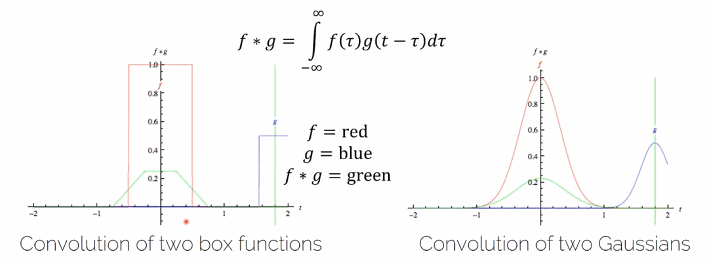

理解：

1. 卷积操作本质上是通过滑动一个函数（通常称为卷积核或滤波器）相对于另一个函数，并在每个滑动位置计算两个函数的重合区域的每一个点的g和f的乘积。
   1. 滑动的是卷积核：将卷积核g从左向右滑动过另一个函数f。
   2. 计算重合部分每个点的乘积：在t时刻计算乘积。
2. 形成了一个关于t的新函数。
3. 意义：量化在每个可能的 t 下 g 对 f 的“贡献”或“影响”
4. 由于原始函数的形状和特性，卷积的结果会展现出某些特定的特征，这些特征反映了两个函数的相互作用方式。例如：
   1. 若两个函数都是方框函数，则卷积结果呈现梯形。
   2. 若两个函数都是高斯函数，则卷积结果仍然是高斯函数，但其标准差不同。
   3. 因此在CNN中可以特征提取，创建复杂模式的层级（从简单特征到复杂特征形成一个层级结构）。当然大多数情况下CNN里都是离散卷积。
   4. 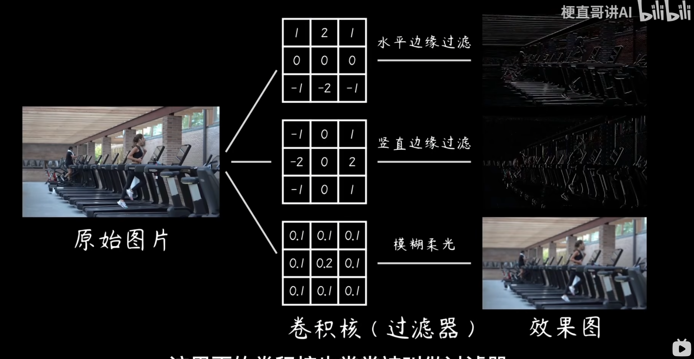
   5. 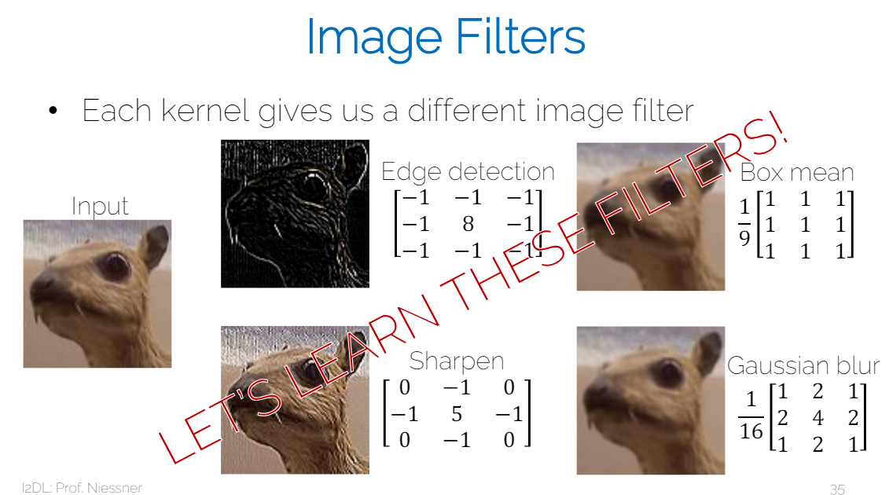
5. 上面gif图里的绿色线就是形成的新函数，即f被g卷积后的结果。

#### 2.1.1. 对于CNN的作用-自我理解

1. 提取特征
2. 可以减少参数量，否则一张图有太多的像素，参数量会很大

#### 2.1.2. 计算式边缘处理

1. Option 1: shrink，即不处理边缘，直接忽略。
2. Option 2（通常）: zero-padding，即在边缘填充0。

### 2.2. 一个卷积核

5*5*3的卷积核，32*32*3的RGB图片，那么生成的就是28*28*1的feature map / activation map（假设没有padding）。计算方式是将对应的层的像素点与卷积核的对应位置的像素点相乘，然后求和。

### 2.3. 多个卷积核 - 卷积层

同时使用多个卷积核即可。

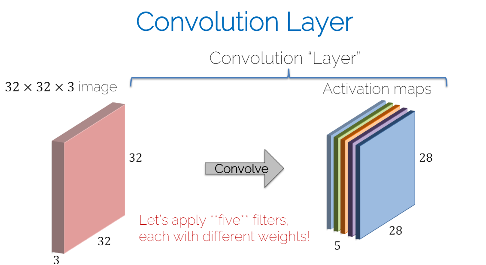

### 2.4. 参数和小结

1. 一次卷积层的参数量由Filter决定 = 卷积核宽 * 卷积核高 * 通道数 (由输入决定) * 卷积核个数 + 卷积核个数（bias）
   1. 通道数：输入的图片的通道数 - 卷积核在channel这个维度上的数字也是不一样的
   2. 卷积核个数：输出的feature map的个数
   3. 为什么要加卷积核个数：每个卷积核都有一个bias。
2. 每个filter提取一个不同的图片特征
3. 不要忘了和Batch norm一样，弄完还得Backpropagation。

### 2.5. 不同的Filter

--------------------------------

不重要，但是可以了解一下。

常见的特征提取的filter:

* Horizontal edge
* Vertical edge
* Circle
* Square
* ...

所以其实我们并不需要在深度学习手动创建新的filter，都是通过训练得到的，上面提到的其实都是过去用在比如Sobel边缘检测或者其他滤波器里的filter。

当然，不排除可以hard-coded一些filter放到网络里。

--------------------------------

### 2.6. Dimensions

w/o padding:
1. Input: N * N
2. Filter: F * F
3. Stride: S
4. Output: $(\frac{N-F}{S}+1) * (\frac{N-F}{S}+1)$

Note: 
1. 如果N-F不能被S整除，那么就要考虑padding的问题，否则就是illegal。
2. Filter的个数会是下一个层的通道数。[参数和小结](#24-参数和小结)

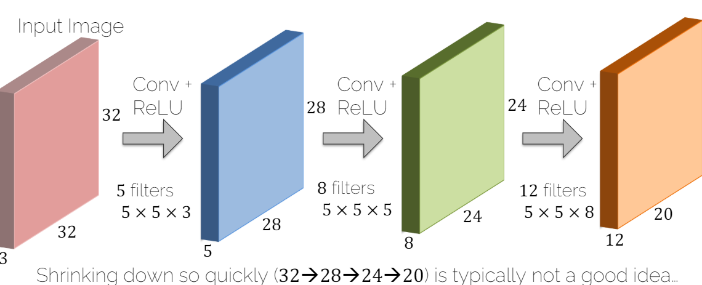

上图不是一个Good Idea，偶尔才是，因为shrink太快了。所以一般都要用padding，这样就可以获得图片边缘的像素点作为被卷积的对象中心。正常情况都用0填充。

w/ padding: (N就是WH)
1. Input: N * N
2. Filter: F * F
3. Stride: S
4. Padding: P
5. Output: $(\frac{N+2P-F}{S}+1) * (\frac{N+2P-F}{S}+1)$ 

#### 2.6.1. Valid Convolution vs Same Convolution
* Valid Convolution: 
  * no padding
* Same Convolution: 
  * output size = input size
  * Set padding to P = $\frac{F-1}{2}$

### 2.7. Shape of Weights Tensor

shape是(C, K, F, F)，其中：
* C: 输入的通道数
* K: 输出的通道数, 即filter的个数
* F: filter的宽和高

当然这里省略了bias，所以实际上是(C, K, F, F) + (K, )。

Note: 在不同的资料下，这个也不是绝对的，有时候是：
1. (K, C, F, F)
2. (F, F, C, K)

## 3. Pooling

### 3.1. 介绍

在CNN里，我们已经知道了经过stride, padding可以调整尺寸，但是我们可以直接通过一个layer来改变size，resolution。

1. **这个层是没有要学习的参数的**。
2. 理解：
   1. Conv Layer = Feature extraction: 计算一个给定区域的特征
   2. Pooling Layer = Feature selection: 选择一个区域的最强（或平均）的activation

### 3.2. Max Pooling

Filter: 2 * 2, Stride: 2
Output: 在每个2 * 2的区域里取最大值。

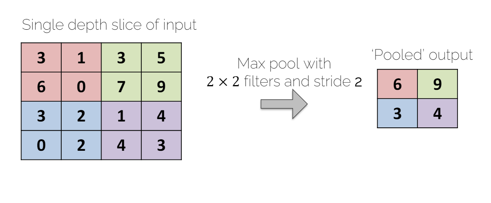

### 3.3. Average Pooling

典型地用在网络的更深层。所以大多数人可能会用Max Pooling多数时候。

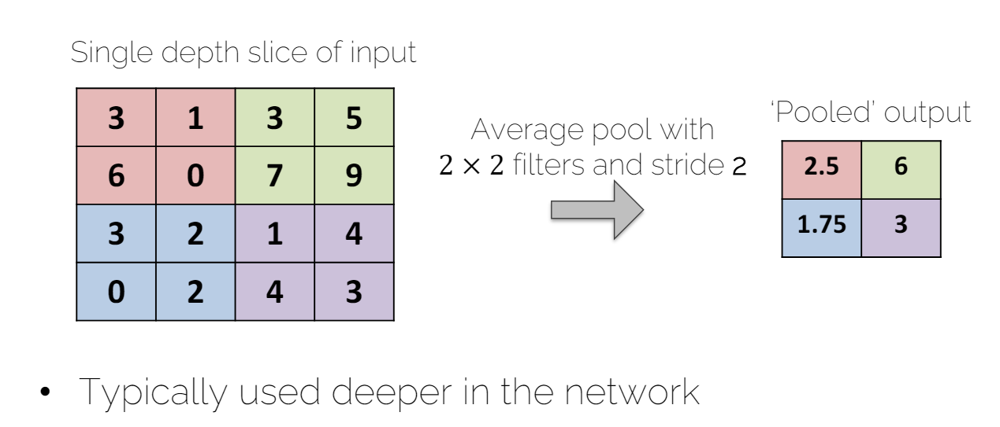

### 3.4. 其他Pooling

1. Min Pooling
2. L2-norm Pooling
3. ...

### 3.5. Dimensions

* Input volumn of size: $W_{in} * H_{in} * D_{in}$
* Filter Hyperparameters:
  * Filter size: F
  * Stride: S
  * 这里没有Filter Count K, 也没有padding P
* Output volume of size: $W_{out} * H_{out} * D_{out}$
  * $W_{out} = \frac{W_{in} - F}{S} + 1$
  * $H_{out} = \frac{H_{in} - F}{S} + 1$
  * $D_{out} = D_{in}$
* 没有要学习的参数的，是一个fixed function。

## 4. CNN

--------------------------------

不重要，但是可以了解一下。

CNNs can be used in CV:
- single object:
  - Classification
  - Classification + Localization
- Multiple objects:
  - Object Detection
  - Instance segmentation: 识别出图片中的每个instance，然后对每个instance进行segmentation(分割)。

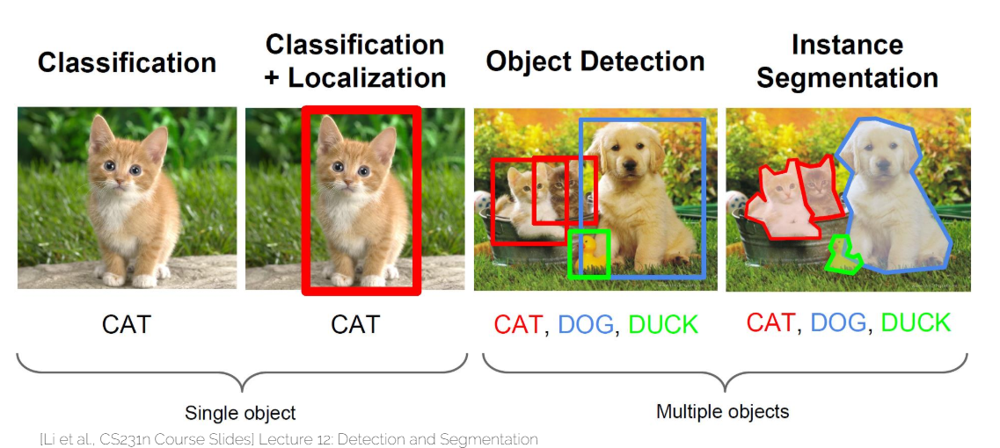

--------------------------------

### 4.1. 激活函数问题

注意下图，CNN的结构里，经过卷积计算后还要经过一个non-linear activation function。即: Conv + ReLU。

### 4.2. 多层卷积后的效果

有趣的是越深，提取的特征越concrete。

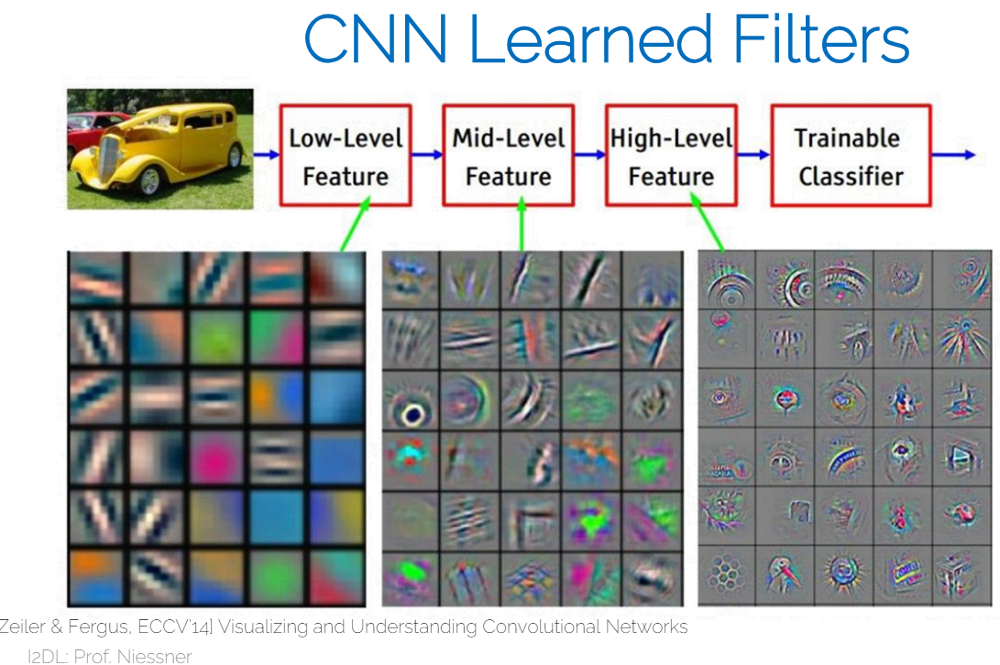

### 4.3. CNN Prototype

PS: 

1. 要谨慎Min Pooling和ReLU同时使用，因为ReLU是挑选最大值，Min Pooling是挑选最小值。
2. 注意prototye最后**典型的会有有一个或两个FC层**，这个FC层是用来拿卷积提取的特征做最后决定的。
3. 到最后的FC层时候，其实feature map一般都会很小的尺寸，但是很大的深度，比如32*32*64。
4. 然后FC层通向一个比如softmax之类的分类器或者Loss function。
5. 如果最后FC时候参数比整个网络的参数还多，那么就是不理想的，因为你更想提取特征。

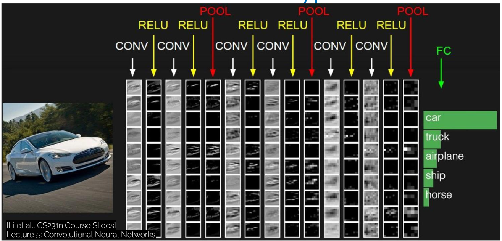

## 5. Convolutional vs Fully Connected

1. 我们想要限制degrees of freedom
   1. FC somewhat brute force
   2. Convolutions are structured
2. Sliding window 来使用相同的filter params来提取特征
   1. weight sharing的概念
   2. 不同的location提取相同的特征

## 6. Receptive field (感受野)

**前言-老师讲解**：你希望有一个大的感受野，以便更好地做出决策或计算特征，你想要覆盖尽可能多的像素。这就是为什么你想要一个更大的filter。当然，特别的大的filter意味着更多的参数，也就不太好了，所以你需要权衡。然后有如下设计选择：
1. 使用更大的filter kernel
2. 使用更小的filter kernel，但是通过多层来增加感受野

理解：想象极端情况，filter的size和input的size一样，那么其实传给激活函数的就是经过一次计算得到的整张图的一个特征值。

* Spatial extent of the connectivity of a convolutional filter (翻译：卷积滤波器的连接的空间范围)

其实很简单：

1. 一层layer如下，就是一个像素点对应9个像素点的感受野。

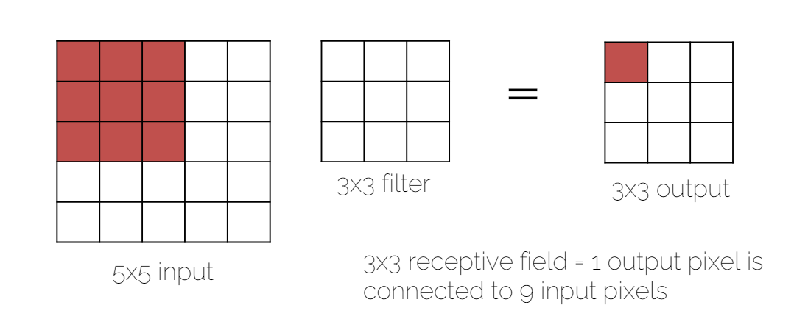

2. 两层layer时候，就是一个像素点对应25个像素点的感受野。

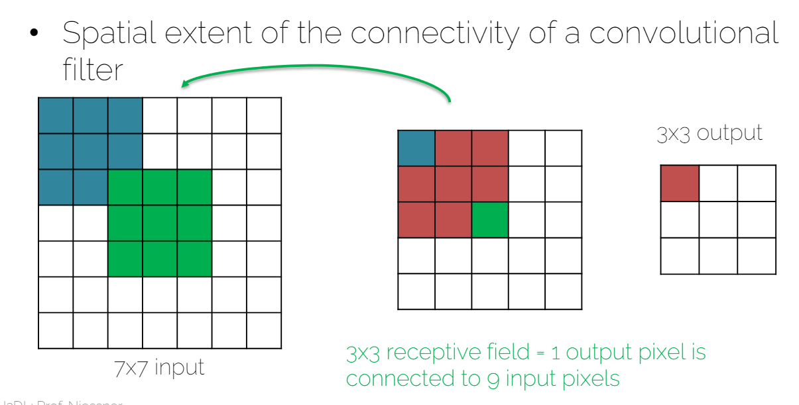

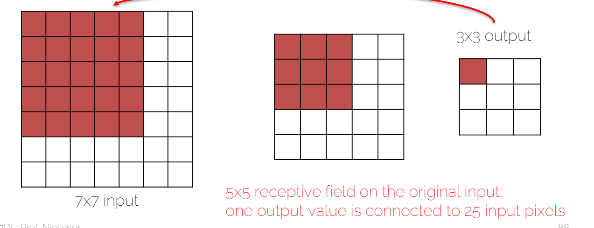

PS: 历史验证是，当年AlexNet是11 * 11来提取高频，但是对中频不好，第二次这个人用ZFNet用7 * 7，然后牛津大学的VGG用连续的3 * 3发现效果更好，低频中频高频的特征都能提取到。（频率这里是指特征的频率，比如花色的墙显然比纯色的白墙高频）