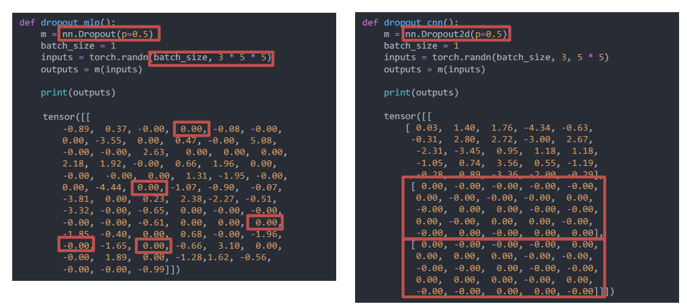

# Lecture 09 - 补充Exercise 9 - Convolution的BN和Dropout

## Spatial Batch Normalization

对比：

| 名称     | Batch Normalization | Spatial Batch Normalization |
|----------|---------------------|-----------------------------|
| x        | N x D               | N x C x H x W               |
| mean     | 1 x D               | 1 x C x 1 x 1               |
| variance | 1 x D               | 1 x C x 1 x 1               |
| y        | γ(x-μ) / σ + β      | γ(x-μ) / σ + β              |

理解：其实很简单，就是mean和var计算时候变成了$\frac{1}{N*H*W}$。

pytorch中的实现：

```python
nn.BatchNorm2d(num_features, eps=1e-05, momentum=0.1, affine=True, track_running_stats=True)
```

其中:`num_features`是输入的channel数。


## Dropout for Convolutional Layers

* Regular Dropout
  * 停用网络中的特定神经元（一个神经元“查看”整个图像）
  * 理解：全连接层的每个神经元会接触所有的输入，即查看整个图像。
* Dropout Convolutional Layers
  * 理解：传统的dropout会导致信息丢失，因为对于比如图像，随机丢去的像素可能会导致图像的信息丢失，一个像素和周围的像素是有关系的。
* Spatial Dropout
  * 随机将整个feature map设置为0
* Comparison in PyTorch:

    