# Lecture 10 - Architectures

- [1. Test Benchmarks (测试基准) - ImageNet](#1-test-benchmarks-测试基准---imagenet)
- [2. Common Performance Metrics](#2-common-performance-metrics)
- [3. Classic Architectures](#3-classic-architectures)
  - [3.1. LeNet](#31-lenet)
  - [3.2. AlexNet](#32-alexnet)
  - [3.3. VGGNet](#33-vggnet)
- [4. Skip Connections 跳跃连接](#4-skip-connections-跳跃连接)
  - [4.1. 跳跃连接引言](#41-跳跃连接引言)
  - [4.2. Residual Block 残差块](#42-residual-block-残差块)
  - [4.3. ResNet Block](#43-resnet-block)
  - [4.4. ResNet](#44-resnet)
    - [4.4.1. Error 和 Depth 的关系](#441-error-和-depth-的关系)
    - [4.4.2. Why ResNet works?](#442-why-resnet-works)
  - [4.5. 代码实现](#45-代码实现)
- [5. 1x1 Convolution](#5-1x1-convolution)
- [6. Inception Layer](#6-inception-layer)
  - [6.1. 概念](#61-概念)
  - [6.2. 解决Computational Cost的问题证明](#62-解决computational-cost的问题证明)
  - [6.3. GoogLeNet](#63-googlenet)
- [7. Xception Net](#7-xception-net)
  - [7.1. 简介](#71-简介)
  - [7.2. Depthwise Separable Convolutions](#72-depthwise-separable-convolutions)
    - [7.2.1. WHY Depthwise Separable Convolutions?](#721-why-depthwise-separable-convolutions)
    - [7.2.2. 个人思考-DSC的特征提取效果](#722-个人思考-dsc的特征提取效果)
- [8. 小结](#8-小结)
- [9. Fully Convolutional Networks](#9-fully-convolutional-networks)
  - [9.1. 简介](#91-简介)
  - [9.2. 如何Upsample](#92-如何upsample)
    - [9.2.1. Interpolation 插值](#921-interpolation-插值)
    - [9.2.2. Transposed Convolution 转置卷积](#922-transposed-convolution-转置卷积)
  - [9.3. Refined Outputs（细化输出）](#93-refined-outputs细化输出)
    - [9.3.1. U-Net](#931-u-net)


## 1. Test Benchmarks (测试基准) - ImageNet

PS: 不是网络，是数据集

ImageNet Dataset：ILSVRC (ImageNet Large Scale Visual Recognition Challenge)

这个数据集一般用来测试网络的性能。

## 2. Common Performance Metrics

1. Top-1 score: 检测一个样本的最高概率的label是否正确
2. Top-5 score: 检测一个样本的label是否在最高的5个概率中
3. Top-5 error: 测试样本中，label不在最高的5个概率中的比例

## 3. Classic Architectures

### 3.1. LeNet

* 太老了，所以当时用的filter数量比较少
* 太老了，用了avg pooling而不是max pooling
* 太老了，用了Tanh和Sigmoid而不是ReLU系列

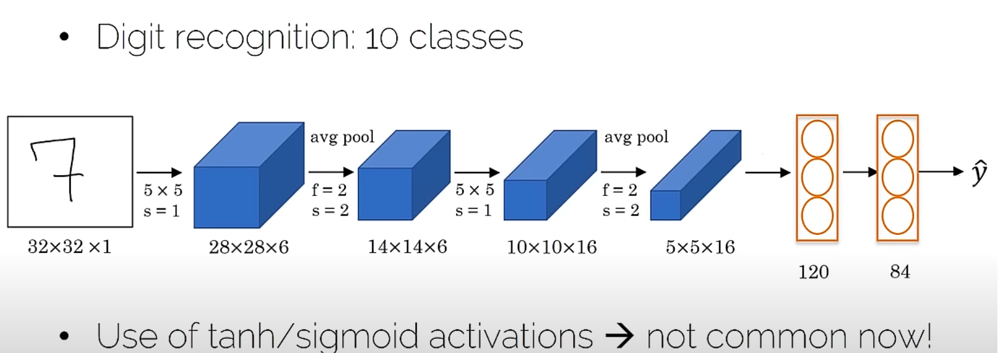

Conv->Pool->Conv->Pool->Conv->FC

deeper: width ↓, height ↓, number of filters ↑

PS:MNIST 手写数字识别的数据集

### 3.2. AlexNet

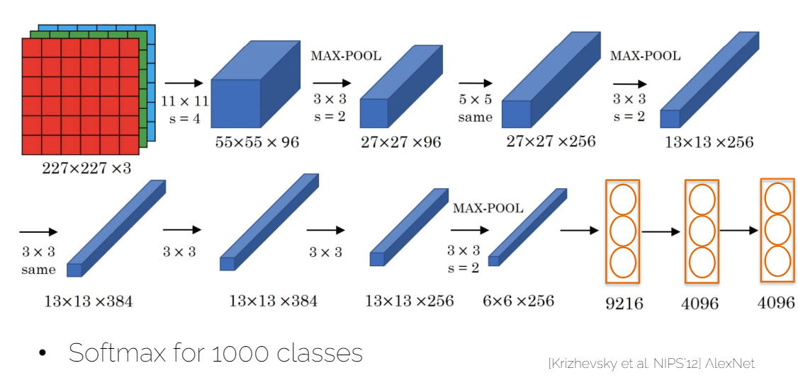

* 用了ReLU instead of tanh/sigmoid
* Similar to LeNet, but much bigger (~1000 times) - 60M parameters


PS: 用了cuda，但是是C++写的

### 3.3. VGGNet

PS: VGG 是Visual Geometry Group的缩写，是牛津大学的一个研究组

**NOTE: 'Same convolutions' 意味着用padding来保持输入输出的大小一致** [same vs valid conv](./Lecture09-ConvolutionalNeuralNetworks.md#261-valid-convolution-vs-same-convolution)

* Striving for simplicity (翻译：追求简单)
* CONV = 3x3 filter, STRIDE = 1, same convolutions
* MAXPOOL = 2x2 filters, STRIDE = 2

PS: 下图中 "x2" 意味着连续两层的Conv，"x3" 意味着连续三层的Conv

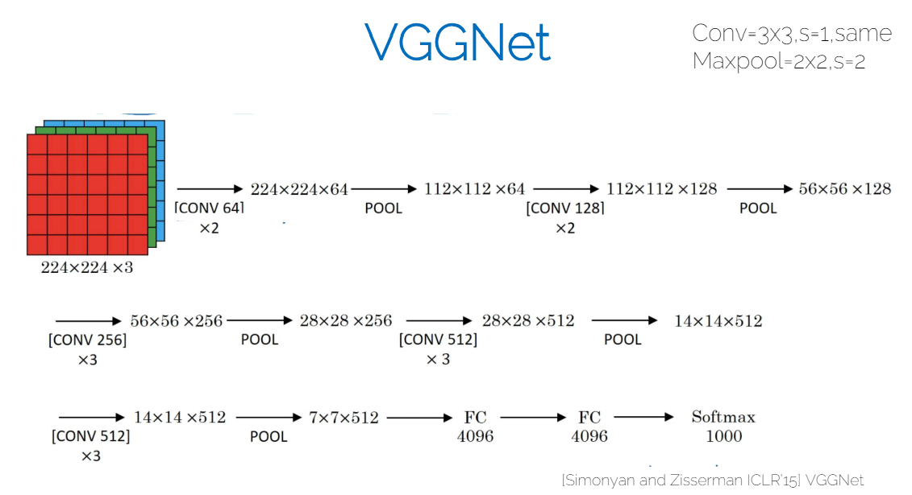

* 138M parameters
* 实际上上图是VGG-16，即16层，大部分时候VGG说的是VGG-16
  * 在他们论文中他们尝试了不同的层数和conv，pool的大小和数量和组合
  * 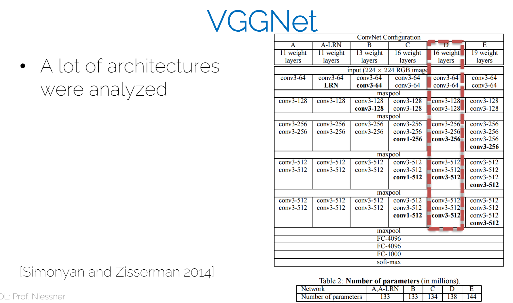

PS：也证明了不是越深越好，其中一个原因是需要back prop，即使是ReLU，在层数多的情况下，也会导致梯度消失。这个其中的原因也会涉及到比如数字是32bit或者16bit的限制之类的。

## 4. Skip Connections 跳跃连接

### 4.1. 跳跃连接引言

* 越多的层数，越难训练
* 梯度消失和梯度爆炸
* 如何训练非常深的网络？

我的和GPT理解 - skip connection 的出发点是什么：
1. **梯度消失问题**：在深度神经网络中，随着层数的增加，通过多个层反向传播时，梯度往往会逐渐变小，导致网络中的前层参数更新非常缓慢，这称为梯度消失问题。跳跃连接通过创建从前层直接到后层的短路，**使得梯度可以直接传播到更早的层**，从而有助于缓解梯度消失问题。
2. **网络性能退化**：在理论上，网络层次的增加应该带来性能的提升或至少保持稳定。然而，在实际操作中，增加更多的层次有时会导致网络性能退化，而不是提高。这是因为网络变得越来越难以训练。跳跃连接**允许模型在增加深度的同时，保持或者提升性能**。
3. **特征重用**：通过跳跃连接，网络可以直接使用**原始的输入或早期层的特征**，这样可以在网络深层中重用有效的特征。这意味着网络不必在每一层重新学习相同的特征表示，从而提高了学习效率和网络的表达能力。（**我的理解：就是相当于中间的一堆w和b都是0，直接把输入的x传到后面的层来用**）

### 4.2. Residual Block 残差块

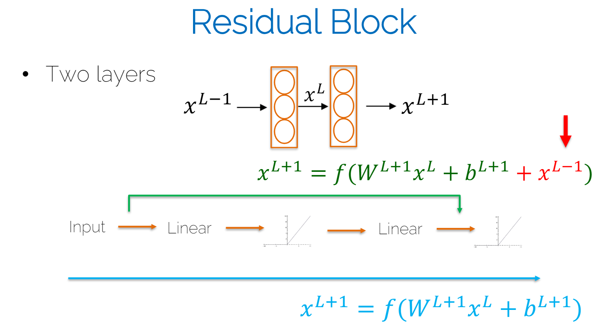

* 直接将前一层的x加到后一层的输出上，然后再通过ReLU
* 通常直接使用 same convolutions 策略，因为要相加，所以要保持大小一致
* 否则我们需要convert维度with a matrix of learned weights or zero padding(理解：这里的0填充不是每次conv时候0填充而是直接将矩阵的维度通过0填充扩展到和前面一样)

### 4.3. ResNet Block

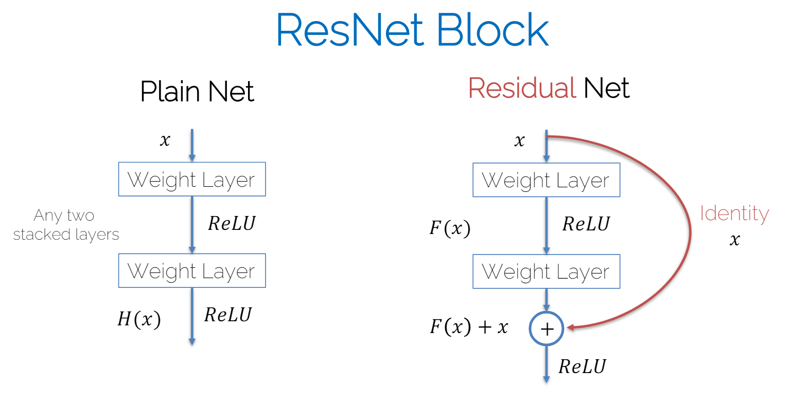

直接将 **identity** 的x加到后面，可能跳过的不止一两层，可能是多层

### 4.4. ResNet

* [Xavier](./Lecture07-LossesAndActivations.md#32-xavier-initialization-glorot-initialization)/2 initialization
* [SGD + Momentum (0.9)](./Lecture05-ScalingOptimization.md#34-gradient-descent-with-momentum-使用动量的梯度下降)
* Learning rate 0.1, divided by 10 when plateau
* Mini-batch size 256
* Weight decay 1e-5
* No dropout

ResNet-152: 60M parameters

老师讲解：fewer parameters but more efficient than VGG，而且一般训练的话会从一个较小的层数开始，比如ResNet-18，然后慢慢增加层数，而不是直接从ResNet-152开始训练。

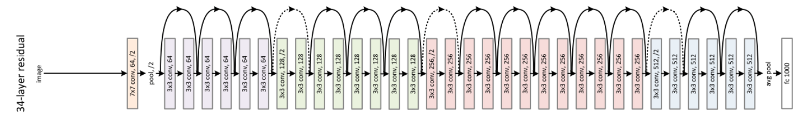

#### 4.4.1. Error 和 Depth 的关系

* 对于plain: if we make the network deeper, at some point performance will degrade
* 对于ResNet: 通常来说，更深的网络会有更好的性能

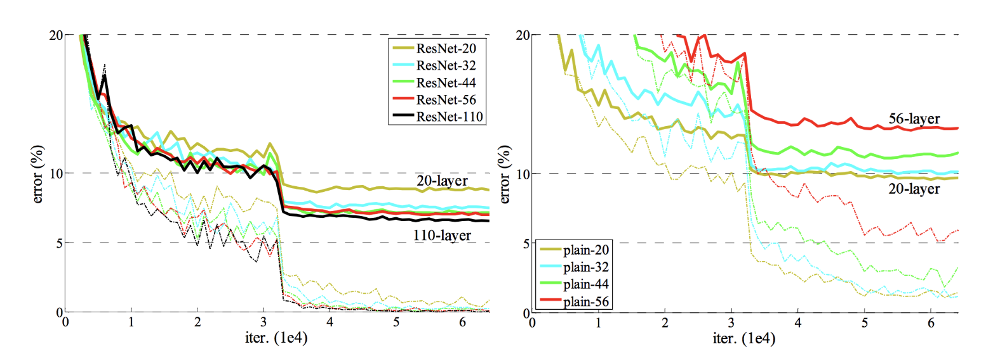

#### 4.4.2. Why ResNet works?

* ResNet的一个假设是：identity mapping is easier to learn than the residual mapping (理解：easier 不是说训练的时候更快，而是说更容易学习到有用的特征以及不会梯度消失之类的)
* Guarantees performace只会improve (理解：跳跃连接保证了即使残差块未能有效学习任何有用的变换，网络的输出至少可以是前一层的输出。这意味着在最坏的情况下，网络的性能至少与不加任何残差块的情况相当。就像前面[引言](#跳跃连接引言)中提到的特征重用)

### 4.5. 代码实现

关键在于forward函数里：

跳过两层
```python
def forward(self, x):
        identity = x

        out = self.conv1(x)
        out = self.bn1(out)
        out = self.relu(out)

        out = self.conv2(out)
        out = self.bn2(out)

        if self.downsample is not None:
            identity = self.downsample(x)

        out += identity
        out = self.relu(out)

        return out
```

跳过多层：
```python
    def forward(self, x):
        identity = x

        out = self.conv1(x)
        out = self.bn1(out)
        out = self.relu(out)

        out = self.conv2(out)
        out = self.bn2(out)
        out = self.relu(out)

        out = self.conv3(out)
        out = self.bn3(out)

        if self.downsample is not None:
            identity = self.downsample(x)

        out += identity
        out = self.relu(out)

        return out
```

## 5. 1x1 Convolution

看起来只是等比例放大，但是放到三维的有很多层的conv块的情况下看，就：

1. 可以用来shrink the number of channels (主要)
2. Further add a non-linearity -> one can learn more complex functions （次要）

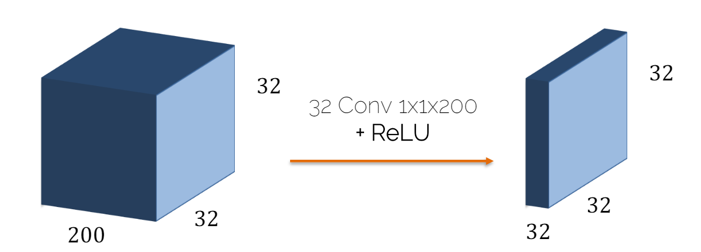

老师讲解：现代架构常常用它来代替FC层，因为FC层的参数太多，或者至少携带一些1x1的conv层来减少参数数量。

（GPT:用1x1的conv层来代替FC层的好处是，1x1的conv层可以保持空间信息）。

## 6. Inception Layer

### 6.1. 概念

* 不像前面那些论文说多大的filter，而是直接用所有的filter大小
* 但是必须用same convolutions策略，因为要concatenate
  * concatenate: 将多个矩阵拼接在一起，而不是相加，如下图：64+128+32+192=416
* filter不仅有conv的filter还有pool的filter，但是pool的filter不改变size，比如当使用max pooling的时候直接复制最大数值到周边的位置
* 但是这样的话，参数太多，即 Compute cost too high，比如图中已经416个channel了。
* 所以要解决这个问题，就要用1x1的conv来减少channel数量（对于**Max pooling**，常见是**先max pooling再1x1 conv**，对于**Convolution**，常见是**先conv再1x1 conv**）

基础版本的Inception Layer：

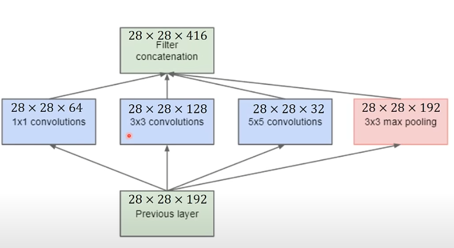

解决Compute Cost的问题的版本：

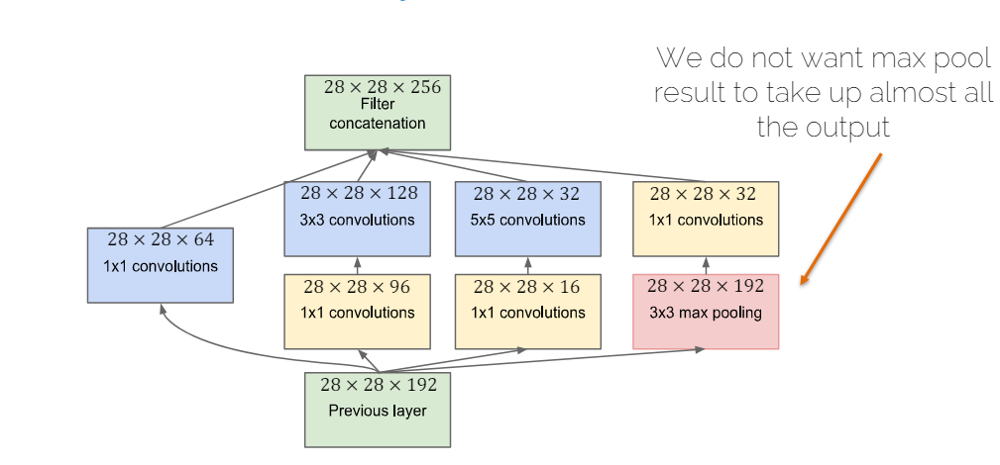

### 6.2. 解决Computational Cost的问题证明

使用1x1的conv来减少channel数量。下面两张图就是先用1x1的conv来减少channel数量，然后再用5x5的conv来提取特征。

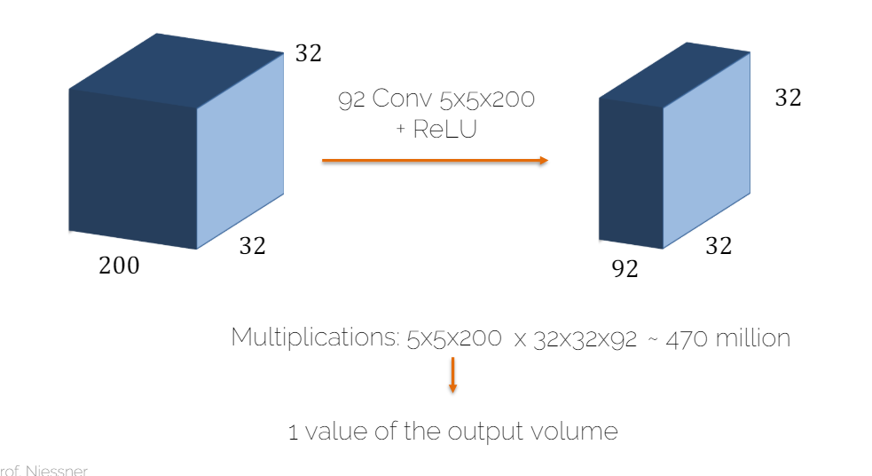

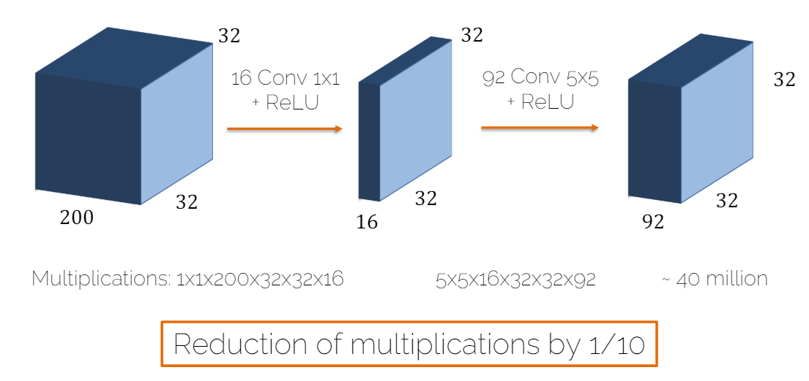

### 6.3. GoogLeNet

Incaption Layer和在Incption Layer之间的Max Pooling，这个中间的Max Pooling是可以更好的减少size。

（为什么有三个softmax分类器？只有最深的是用来预测的，另外两个是为了辅助backprop的，因为这样可以减少梯度消失问题，这两个已经在较深位置了，但是因为没有走到更深，使得这部分可以获得一个较好的梯度来做backprop，同时运作的方式即把每个softmax的loss加权求和，主分类器的损失通常会被赋予最大的权重，而辅助分类器的损失则被赋予较小的权重。例如，在原始的GoogLeNet实现中，主分类器的损失权重为1，而每个辅助分类器的损失权重可能为0.3。）

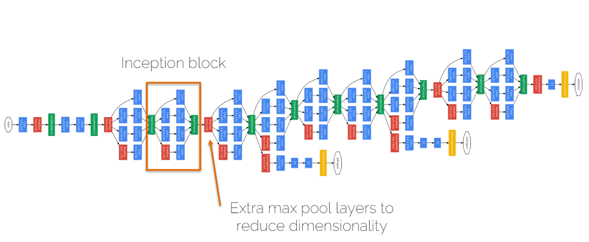

原图高清：

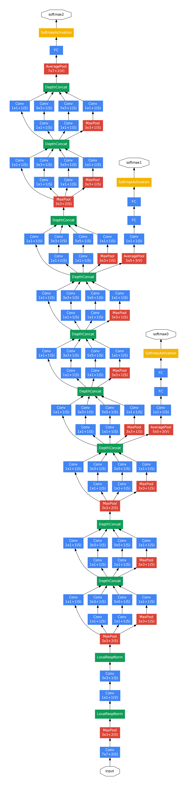

## 7. Xception Net

### 7.1. 简介

* 极限版的Inception: 用**Depthwise Separable Convolutions**来代替Inception的normal convolutions
* 36 conv layers, structured into several modules with **skip connections**
* 胜过Inception Net V3

### 7.2. Depthwise Separable Convolutions

即原本一个卷积核的channel是和输入一样的，现在一个输入的channel可以分配给多个卷积核。

DSC之后会有相同深度的输出，但是对于常规的一个卷积核conv输出会只有一个channel，整个层的输出是filter个数的channel。所以为了保持channel数量，需要再加一个1x1的conv，即可将DSC之后的输出变为只有一层channel的输出。这样就又变成常规的一个卷积核的结果size了。**然后最后的输出的channel数量不是根据DSC的个数，而是根据1x1的conv的filter个数**。比如下面WHY Depthwise Separable Convolutions章节的例子里，用了256*256个1x1卷积核，所以最后的输出是256个channel。

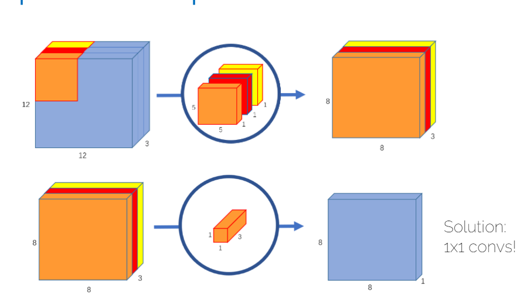

对于pytorch:
```python
classtorch.nn.Conv2d(in_channels, out_channels, kernel_size, stride=1, padding=0, groups=3)
classtorch.nn.ConvTranspose2d(in_channels, out_channels, kernel_size, stride=1, padding=0, groups=3)
```

PS：[ConvTranspose2d 转置卷积](../深度学习知识积累/转置卷积TransposeConvolution.md)

#### 7.2.1. WHY Depthwise Separable Convolutions?

减少计算量。

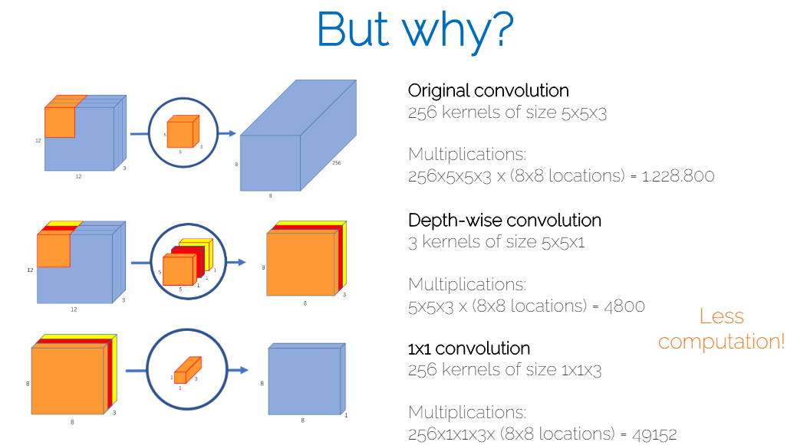

#### 7.2.2. 个人思考-DSC的特征提取效果

难道dsc的特征提取效果不会比常规的低吗？因为原本一个卷积核卷出来对不同通道之间的关系会有保留，现在分开了，最后再通过一个1x1的conv来等比例放大缩小，不会没什么效果吗？

GPT回答：

1. 特征交互限制
    * 在传统的卷积中，每个卷积核直接作用于所有输入通道，并且能够捕捉跨通道的特征交互。这意味着卷积核可以直接学习不同通道之间的复杂关系。而在深度可分离卷积中，深度卷积部分仅在单个通道内部进行卷积，没有直接捕捉跨通道信息的能力，这可能限制了模型学习通道间复杂交互的能力。
2. 逐点卷积的角色
    * 尽管深度卷积不能直接处理跨通道的特征交互，逐点卷积（1x1卷积）步骤在这里发挥了至关重要的作用。**逐点卷积可以重新组合深度卷积的输出**，通过这种方式，网络可以学习如何从各个独立处理的通道中整合信息。逐点卷积实际上是在执行一个跨通道的线性变换，**虽然这种变换的表达能力可能不及传统卷积，但在许多实际应用中已被证明是非常有效的。**
3. 效率与效果的权衡
    * 使用深度可分离卷积确实是在模型参数/计算效率与特征提取能力之间做出权衡。虽然深度可分离卷积可能无法完全匹敌传统卷积在特征提取上的能力，尤其是在需要高度复杂特征交互的任务中，但它提供了显著的计算和存储效率优势。在实践中，这种权衡往往是可接受的，特别是在资源受限的环境中或当模型的可扩展性和效率是主要考虑因素时。
4. 实验与应用表现
    * 实际应用中，深度可分离卷积已被广泛采用，并在多项任务中表现出色。例如，Google的MobileNet系列在移动和边缘设备上提供了高效的图像识别解决方案，这得益于深度可分离卷积的使用。实验和实际部署证明，虽然单独的深度和逐点卷积可能损失了一些特征处理能力，组合使用时能够达到非常好的性能和效率平衡。

## 8. 小结

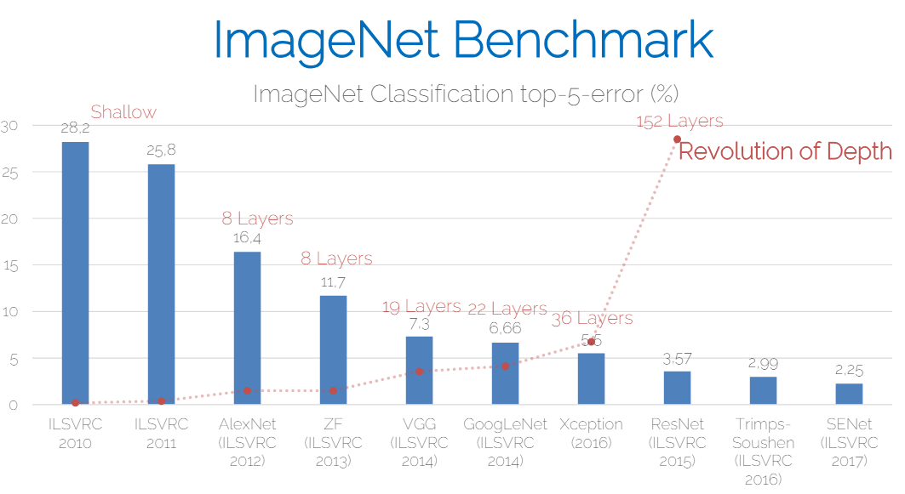

* Xception和ResNet之间的深度革命的high level idea都是more depth more useful，而过去都是层数过多会导致梯度消失。
  * 关键在于用了skip connection

## 9. Fully Convolutional Networks

### 9.1. 简介

FCN 全卷积网络

原理：将传统的CNN的全连接层替换为卷积层，这样可以接受任意大小的输入，同时输出也是一个feature map。

这种卷积层是一种"反卷积"，即将feature map的size放大，这样可以得到一个和输入一样大小的feature map。

常用于语义分割（Semantic Segmentation），即将图像中的每个像素分配到一个类别中。

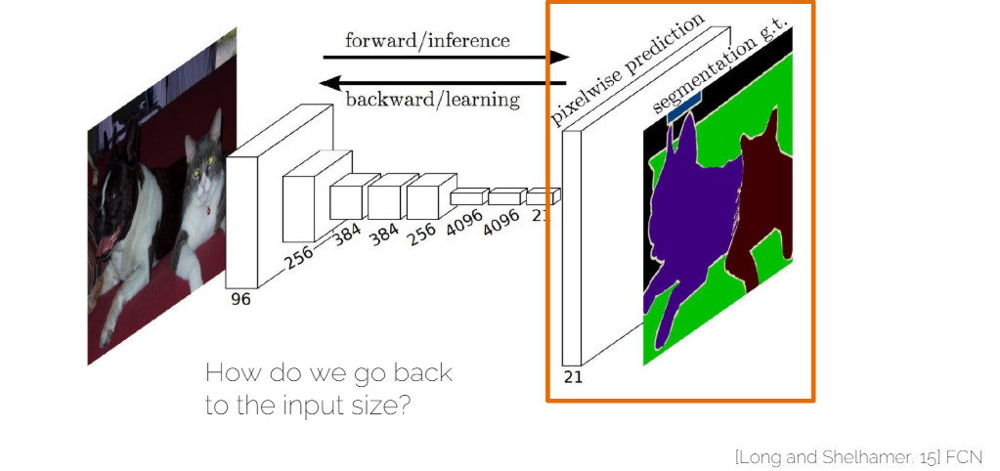

### 9.2. 如何Upsample

#### 9.2.1. Interpolation 插值

实际上就是特殊的转置卷积，用固定值而非学习性来转置卷积。

* Nearst Neighbor Interpolation: 用最近的像素的值来填充
* Bilinear Interpolation: 用周围四个像素的值进行线性插值
* Bicubic Interpolation: 用周围16个像素的值进行三次插值

#### 9.2.2. Transposed Convolution 转置卷积

[转置卷积Transpose Convolution](../深度学习知识积累/转置卷积TransposeConvolution.md)

- Unpooling
- Convolution filter (learned)
- Also called up-convolution (**never** deconvolution)

Note: Transpose convolution之后还是可以有conv层的，来更好的提取特征、优化结果。

### 9.3. Refined Outputs（细化输出）

* If one does a cascade of **unpooling + conv** operations(用于decoder部分), we get to the **encoder-decoder architecture**.
* Even more refined: **Autoencoder**s （即encoder-decoder的结构）） with **skip connections** (AKA **U-Net**)

#### 9.3.1. U-Net

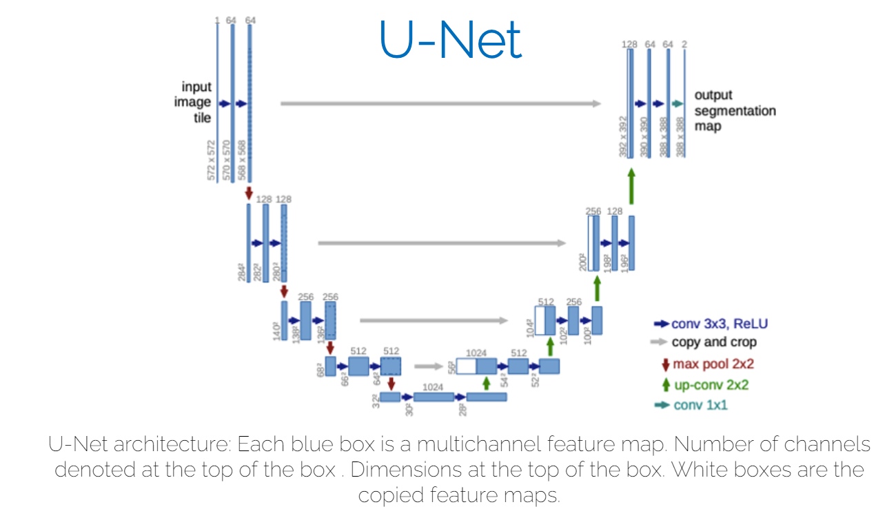

* 白色部分就是左边encoder里取出一部分直接copy到右边
* Left side: **Contraction Path**(收缩路径) - encoder
  * Captures context of the image
  * Follows typical CNN architecture (结合上图的数字看)
    * Repeated application of 2 unpadded 3x3 convolutions
    * Each followed by ReLU activation
    * 2x2 maxpooling operation with stride 2 for downsampling
    * After each downsampling step, number of channels is doubled by conv
  * As before: Height, width ↓, depth ↑
* Right side: **Expansive Path**(扩张路径) - decoder
  * Upsampling （上采样）以恢复空间位置，以便为每个像素分配类标签
    * 2x2 up-convolution that halves the number of feature channels
    * **Skip connections**: outputs of up-convolutions are concatenated with feature maps from encoder
    * Followed by 2 ordinary 3x3 convs
    * final layer: 1x1 conv to map 64 channels to number of classes
  * Height, width ↑, depth ↓