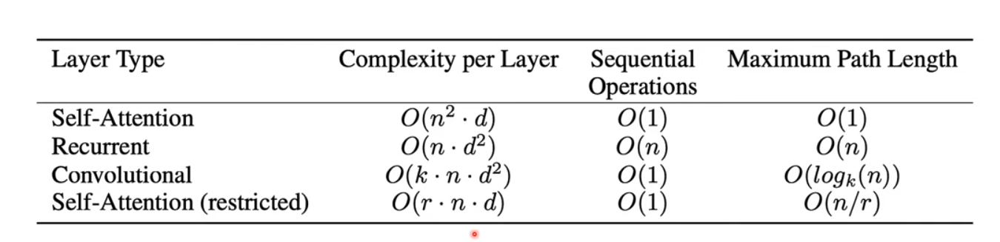

# Lecture 11 - RNNs and Transformers

- [1. Transfer Learning 迁移学习](#1-transfer-learning-迁移学习)
- [2. Representation Learning 表征学习](#2-representation-learning-表征学习)
  - [2.1. 自监督学习和对比学习和表征学习](#21-自监督学习和对比学习和表征学习)
    - [2.1.1. Siamese Networks 孪生网络](#211-siamese-networks-孪生网络)
- [3. 个人理解+老师理解-迁移学习和表征学习](#3-个人理解老师理解-迁移学习和表征学习)
- [4. Recurent Neural Networks (RNNs)](#4-recurent-neural-networks-rnns)
  - [4.1. Processing Sequences 处理序列](#41-processing-sequences-处理序列)
  - [4.2. RNN are flexible](#42-rnn-are-flexible)
  - [4.3. Basic structure of RNN](#43-basic-structure-of-rnn)
    - [4.3.1. 简介](#431-简介)
    - [4.3.2. 基础结构:](#432-基础结构)
    - [4.3.3. Unrolling RNNs - 训练时](#433-unrolling-rnns---训练时)
    - [4.3.4. Long-term Dependencies 长期依赖](#434-long-term-dependencies-长期依赖)
- [5. Long Short Term Memory (LSTM)](#5-long-short-term-memory-lstm)
  - [5.1. 讲解](#51-讲解)
  - [5.2. 计算小结](#52-计算小结)
  - [5.3. High way](#53-high-way)
  - [5.4. 维度计算](#54-维度计算)
  - [5.5. 代码实现](#55-代码实现)
    - [5.5.1. 手写](#551-手写)
    - [5.5.2. Pytorch](#552-pytorch)
- [6. Attention](#6-attention)
  - [简介](#简介)
  - [Attention vs Convolution](#attention-vs-convolution)
  - [Long-term dependencies](#long-term-dependencies)
  - [Attention Architecture](#attention-architecture)
- [Transformers](#transformers)
  - [Teacher forcing](#teacher-forcing)
  - [结构](#结构)
  - [Multi-head Attention](#multi-head-attention)
  - [自我理解](#自我理解)
  - [自我补充:自注意力机制和注意力机制的区别](#自我补充自注意力机制和注意力机制的区别)
  - [自注意力机制缺失的部分-位置编码](#自注意力机制缺失的部分-位置编码)
    - [Positional Encoding](#positional-encoding)
    - [为什么不直接用数字标记位置](#为什么不直接用数字标记位置)
  - [complexity](#complexity)


## 1. Transfer Learning 迁移学习

之前做练习时也有一些关于迁移学习的内容[Lecture 08-补充Exercise 8 - Transfer Learning And Autoencoders](./Lecture08-%E8%A1%A5%E5%85%85Exercise8-TransferLearningAndAutoencoders.md)。

老师PS:主要谈论的是基于ImageNet的预训练模型，如何迁移到其他任务上。CV的大部分工作都是用的这种方法，利用pre-trained的模型来做downstream(下游)的任务。

* 训练模型可能会因为限制的数据和其他资源而变得困难，比如标注数据，所以考虑重用pre-trained模型。
* 有时候这种操作被称为**fine-tuning**，但是这个词有点误导，因为我们可能会改变模型的一些部分，而不仅仅是调整参数。
* 
* 如果数据集足够大，可以**用较小的学习率train更多的层**，frozen更少的层
  * 也可以靠近原始图的层用较小的学习率，远离原始图的层用较大的学习率（理解，小的学习率保护了原本的特征提取）
* 什么时候使用：
  * Task T1和T2的输入相同（比如都是RGB图像）
  * T1的数据集比T2大
  * 当T1的low-level features对T2有帮助时
* 老师PS: 具体的实例，比如stable diffusions，即便是大公司更多的也是fine-tuning，而不是从头训练。

## 2. Representation Learning 表征学习

老师PS: 和transfer learning一个思路，先学习一个好的表征，然后再做downstream的任务。 

* 什么是好的特征：
  * good features are essential for successful machine learning
  * (Supervised) deep learning 基于使用的练数据: input/target labels
  * 输入的变化(noise，irregularities(不规则), etc. )可能导致截然不同的结果
* 表征学习：
  * 允许发现被不同的任务所需要的特征
  * 深度表征学习：模型将 input X map 到输出 Y。
  * 直觉的，深度网络会学习不同层级的abstraction(抽象)。e.g. low-level->mid-level->high-level
    * 理解：而这些抽象又没有label
* 如何学习到好的特征：
  * determine desired feature invariances (翻译：确定所需的特征不变性)
    * 理解：e.g. translation invariance(平移不变性), rotation invariance(旋转不变性), scale invariance(尺度不变性)
    * 理解：所以可以通过augmentation(数据增强)来实现这些不变性
  * 因此教机器来区分相似和不想死的东西
    * 即：**self-supervised learning** 自监督学习

### 2.1. 自监督学习和对比学习和表征学习

* **对比学习是自监督学习的一种形式，对比学习是表征学习的一种方法。但是表征学习可以是监督的、无监督的、自监督的。**
* 自监督学习常常包括比如：预测任务（预测未来的数据点、缺失的部分或序列的下一个元素等），自编码器，以及对比学习。
* 对比学习专注于通过比较样本对来学习特征表示。在对比学习中，模型学习区分**相似（positive）样本对和不相似（negative）样本**对，目的是使相似样本的表示更接近，而不相似样本的表示更远离。
* 对比学习主要用于语音识别、CV等领域。

对比学习：
* 有很多种方式，比如：**Siamese Networks**, Triplet Networks, SimCLR, MoCo, SwAV, BYOL, PIRL, etc.

#### 2.1.1. Siamese Networks 孪生网络

PS: Siamese 暹罗，泰国的古称，后来因为一对叫Eng & Chang Bunker的连体双胞胎（后为马戏团成员）而带有了“孪生，连体”的意思。


通过对两个图像已知是否是同一个图来训练，并使得loss function来比较相似，使loss最小，相似最大。

GPT重点：两个encoder不是说真的两个encoder，其实就是并行的概念，这是两个一摸一样的网络，共享参数，只是并行来处理两个不同的输入，最后通过常见的度量方式包括欧氏距离、余弦相似性等来比较是否相似。可应用于：人脸验证，签名识别，异常检测，匹配和分类等。

对于上图中出现了fine tuning，理解见下一小节。

## 3. 个人理解+老师理解-迁移学习和表征学习

* 表征学习其可以作为迁移学习的前一步，好的表征学习可以更好的用于迁移学习。
* 但是表征学习，比如对比学习里的孪生网络，其实本身也可以有一些实际用途，但是也可以将encoder部分拿出来用作迁移学习来识别具体的东西，因为它提取了好的特征。
* 表征学习的有效性可以由迁移学习的效果来验证 (but also other factors, e.g. smoothness of the manifold(流形的光滑性，即数据点在流形上分布的连续性和一致性，在这里应该是为了表示当数据发生微笑改变时，提取的特征变化也是微小的，没有突变))。

## 4. Recurent Neural Networks (RNNs)

### 4.1. Processing Sequences 处理序列

* RNN 处理序列数据
* 输入和输出可以是序列
* 老师：输入和输出的长度都是可变的

### 4.2. RNN are flexible


* One to One: 传统的神经网络-图片分类
* One to Many: 图像描述生成
* Many to One: 语言识别、情感分析
* Many to Many: 机器翻译、语音识别
* Many to Many: event classification (事件分类，比如描述一个视频中的发生了哪些事件)

### 4.3. Basic structure of RNN

#### 4.3.1. 简介

multi-layer RNN:

* 
* 理解：
 * 上图其实就是每个输出基于上一个输出和当前输入。
 * 上图只是一种展示，实际上RNN的结构可以有很多种。
* The hidden state will have its own internal dynamics. 意思就是每一层的隐状态（hidden state）都会根据输入和前一时间步的隐状态自身更新。
* 因此，More expressive model (更具表达力的模型)。

#### 4.3.2. 基础结构:


* 我们需要“时间time”和“序列sequence”的概念
* 理解：**我们不知道要多长的序列，长度是动态的**
* $$A_t = \theta_cA_{t-1} + \theta_xX_t\\h_t=\theta_hA_t$$
* 
  * $A_{t-1}$: 上一个时间步的隐状态(previous hidden state)
  * $X_t$: 当前时间步的输入
  * Note: 暂时忽略Non-linearities，后面再讨论
    * 加上就是$A_t = tanh(\theta_cA_{t-1} + \theta_xX_t + b)$
  * **Same parameters for each time step = generalization(泛化)** （相当于parameter sharing，参数共享，这样可以减少参数数量，提高泛化能力）

#### 4.3.3. Unrolling RNNs - 训练时

其实就没什么技术含量的章节，只是显示一下怎么训练，找一个max的长度来把上面那张图unroll解开为下面这个图训练即可。


理解: 上图中，要看成一个普通的feedforward nets(前馈网络，即最普通的神经网络)，最左边一列是输入层，然后通过全连接层向右传递，每层参数值是一样的。和MLP区别主要在于每一层有一个新的输入。

backprop:
* 
* 还是chain rule
* 回到t=0
* 在不同时间步的梯度是不同的，但是因为参数是共享的，所以要对用一组参数进行更新
* 问题是：sequence越长，即这个网络越长，梯度越容易出问题，解决方案如下面讲解

#### 4.3.4. Long-term Dependencies 长期依赖

PS：改善处理长期依赖信息的能力是RNN的一个重要问题。

* Simple recurrence:$A_t = \theta_cA_{t-1} + \theta_xX_t$
  * Let's forget the input: $A_t = \theta^t_cA_0$
  * When weights are small, the gradient vanishes
  * When weights are large, the gradient explodes
  * 如果 $\theta$ 可以 eigendecoposition (特征分解) like this:
    * $$\theta = Q\Lambda Q^{T}$$
      * 注意这里是正交的$Q^{T}$，正常的特征分解是$Q^{-1}$，正交即$Q^{T} = Q^{-1} \leftrightarrow Q^{T}Q = QQ^{T} = I$
    * $Q$: Matrix of eigenvectors (特征向量)
    * $\Lambda$: Diagonal matrix of eigenvalues (特征值的对角矩阵)
    * **Othogonal** (正交) $\theta$ allows us to simplify the recurrence (递归)
      * 因为最后结果因为连乘，正交被约掉，成为：
      * $$A_t = \theta^t_cA_0 = Q\Lambda^{t}Q^{T}A_0$$
  * 出现了新的问题：
    * 如果特征值大于1，梯度爆炸；
      * Gradient Clipping 梯度裁剪 - 将梯度缩放限制在一个范围内
        * 设置阈值:$\tau$
        * 当前梯度:$g$，如果$||g|| > \tau$，则$g\prime = \frac{\tau}{||g||}g$
        * 更新参数是：$\theta = \theta - \eta g\prime$ ($\eta$是学习率)
    * 如果小于1，梯度消失
    * 解决问题：
      * from the weights： $A_t = \theta^tA_0 = 1A_0$
        * 所以可以通过初始化参数设计参数的特征值，以及梯度裁剪、单位范数约束等各种手段来将特征值设计到1
        * eigenvalues = 1 (所有特征值都是1) 可以让cell保持它的"state"
      * from the activcation functions (tanh)。还会导致梯度消失
        * 标准RNN结构中tanh是一个常用的激活函数，但是tanh还是会导致梯度消失。[参考Lecture 07激活函数](./Lecture07-LossesAndActivations.md#2-activation-function)
          * 
          * 
        * 解决方案：LSTM (Long short Term Memory), GRU (Gated Recurrent Unit - 改版的LSTM), etc.
          * PS: 当然，不是说LSTM只从解决激活函数的问题，而是解决了RNN的长期依赖问题。它通过一系列的门来控制信息的流动，解决早期信息被逐渐"稀释"的问题。

## 5. Long Short Term Memory (LSTM)

LSTM也是一种RNN，但是它可以解决RNN的长期依赖问题。

### 5.1. 讲解

* 简单的RNN:
  * 
* LSTM:
  * 

1. High level idea - 有点类似ResNet（skip connection），LSTM也有一个skip connection，即cell state，这样可以保持信息的流动。
2. 自我补充：
   1. C就是Cell state，是长期记忆的载体
   2. h就是hidden state，当前时间步的输出，反映了LSTM对当前输入和之前记忆的处理结果。这是实际传递到下一个层（如果有）或输出层的信息。举例来说，在生成文本的任务中，最终生成的单词或字符就是基于$h_t$的输出。它是由$C_t$和$x_t$和$h_{t-1}$共同决定的。
   3. LSTM大部分地方都是hadamard积，即对应元素相乘，对于W(或者叫$\theta$)权重的地方就是矩阵乘法，比如用concatenate的地方就是将h和x竖着拼接，然后用W的每一行乘以这个拼接的向量,即矩阵乘。
3. 补充：图例
   1. 
4. Key ingredients (关键原料)
   1. Cell = transports the information through the unit - ResNet的identity
      1. 
      2. $C_t=f_t\odot C_{t-1}+i_t\odot \tilde{C}_t$
         1. 加号的前面是Previous cell state，后面是Current cell state
   2. Gate = remove or add information to the cell state
      1. Sigmoid导致了**0(forget)~1(keep)之间**的值，决定保留多少信息
      2. 
      3. Forget Gate: $f_t = sigmoid(\theta_{xf}x_t + \theta_{hf}h_{t-1} + b_f)$
         1. 决定了忘记什么
         2. 理解：如图，根据输入和上一个时间步的隐状态，决定保留多少cell state(图里的C)
         3. 
      4. Input Gate: $sigmoid(\theta_{xi}x_t + \theta_{hi}h_{t-1} + b_i)$
         1. 决定了更新什么
         2. 理解：如图，根据输入和上一个时间步的隐状态，$i_{t}$决定了怎么加，$\tilde{C}_{t}$决定了新的cell state的内容将被加进来
         3. 值因为`tanh`和`sigmoid`相乘在`[-1,1]`之间
         4. 注意：图里按图例来说是要concatenate的，但是老师给的公式并没有，经过自己查看，是因为老师的公式是某种变体版本的LSTM，而图例是2000年引入遗忘门哪个版本。它的公式是：
            1. $i_t=sigmoid(W_i\cdot[h_{t-1},x_t]+b_i)$
            2. $\tilde{C}_t=tanh(W_c\cdot[h_{t-1},x_t]+b_C)$
         5. 
      5. Output gate: $h_t=o_t\odot tanh(C_t)$
         1. 决定了输出什么
         2. 
         3. 值因为`tanh`和`sigmoid`相乘在`[-1,1]`之间

### 5.2. 计算小结

PS: $\tilde{C}$有时候写成$g$，表示tanh后的新内容。

* Forget gate: $f_t = \sigma(\theta_{xf}x_t + \theta_{hf}h_{t-1} + b_f)$
* Input gate: $i_t = \sigma(\theta_{xi}x_t + \theta_{hi}h_{t-1} + b_i)$
* Output gate: $o_t = \sigma(\theta_{xo}x_t + \theta_{ho}h_{t-1} + b_o)$
* Cell state: $\tilde{C}_t = tanh(\theta_{xc}x_t + \theta_{hc}h_{t-1} + b_c)$
* Cell: $C_t = f_t \odot C_{t-1} + i_t \odot \tilde{C}_t$
* Output: $h_t = o_t \odot tanh(C_t)$

---
**这里所有的$\theta$和$b$都是需要通过backpropagation来学习的参数。并且他们不那么容易被梯度消失。**

理解：GPT说这里不容易梯度消失的原因有好几个，但是这个是我最能理解的：
1. LSTM的遗忘门和输入门控制了细胞状态的更新，这使得模型可以有选择地保留和遗忘信息。这种选择性更新进一步防止了梯度消失。
2. LSTM允许误差通过多条路径进行反向传播，不仅通过细胞状态，还通过隐状态和门控机制。这种多路径误差流增加了梯度的稳定性，防止了梯度消失和爆炸。
---
 
如果使用concatenate的话，公式需要发生变化，在2000年由Felix Gers等人提出的LSTM改进版本，引入了遗忘门，公式是：
* $f_t = \sigma(W_f\cdot[h_{t-1},x_t]+b_f)$
* $i_t = \sigma(W_i\cdot[h_{t-1},x_t]+b_i)$
* $o_t = \sigma(W_o\cdot[h_{t-1},x_t]+b_o)$
* $\tilde{C}_t = tanh(W_c\cdot[h_{t-1},x_t]+b_C)$
* $C_t = f_t \odot C_{t-1} + i_t \odot \tilde{C}_t$
* $h_t = o_t \odot tanh(C_t)$

pytorch的版本是：
* $i_t = \sigma(W_{ii}x_t + b_{ii} + W_{hi}h_{t-1} + b_{hi})$
* $f_t = \sigma(W_{if}x_t + b_{if} + W_{hf}h_{t-1} + b_{hf})$
* $g_t = tanh(W_{ig}x_t + b_{ig} + W_{hg}h_{t-1} + b_{hg})$
* $o_t = \sigma(W_{io}x_t + b_{io} + W_{ho}h_{t-1} + b_{ho})$
* $c_t = f_t \odot c_{t-1} + i_t \odot g_t$
* $h_t = o_t \odot tanh(c_t)$

[Pytorch LSTM page](https://pytorch.org/docs/stable/generated/torch.nn.LSTM.html)

### 5.3. High way

High way for the gradient to flow:


理解：cell state这条路就像告诉公路一样，它允许信息沿着一条主要路径流动，同时通过门控单元（Gates）进行必要的更新和过滤。

### 5.4. 维度计算

对于LSTM维度，`hidden state 的维度` = `cell state 的维度` (老师还说= `输入的维度`，但是输入维度很显然不用一样。其实用权重乘一下输入的维度D就能得到hidden state的维度H)。

有一个细节需要注意，pytorch 定义lstm时候的参数是 `input_size, hidden_size, num_layers`，其中 `input_size` 是输入的维度，`hidden_size` 是 `hidden state` 的维度，`num_layers` 是LSTM的层数。所以如果`input_size`和`hidden_size`不一样，那么就会有一个线性变换，即`Wx`和`Wh`。

### 5.5. 代码实现

#### 5.5.1. 手写

* 向前传播：这里为了计算快，直接将参数W和并到了一个矩阵，所以先算了`a`，然后再分开。这里的另一个问题是它把输入x放在了矩阵乘法的左边，实际上pytorch也是这样的，因为常有个batch_size的维度在前面，这么算可以减少转置。

```python
def lstm_step_forward(x, prev_h, prev_c, Wx, Wh, b):
    """
    Forward pass for a single timestep of an LSTM.

    The input data has dimensions D, the hidden state has dimension H, and we use
    a minibatch size of N.

    Inputs:
    - x: Input data, of shape (N, D)
    - prev_h: Previous hidden state, of shape (N, H)
    - prev_c: previous cell state, of shape (N, H)
    - Wx: Input-to-hidden weights, of shape (D, 4H)
    - Wh: Hidden-to-hidden weights, of shape (H, 4H)
    - b: Biases, of shape (4H,)

    Returns a tuple of:
    - next_h: Next hidden state, of shape (N, H)
    - next_c: Next cell state, of shape (N, H)
    - cache: Tuple of values needed for backward pass
    """
    next_h, next_c, cache = None, None, None

    N, H = prev_h.shape
    a = np.dot(x, Wx) + np.dot(prev_h, Wh) + b

    ai = a[:, :H]
    af = a[:, H:2*H]
    ao = a[:, 2*H:3*H]
    ag = a[:, 3*H:]

    i = sigmoid(ai)
    f = sigmoid(af)
    o = sigmoid(ao)
    g = np.tanh(ag)

    next_c = f * prev_c + i * g
    next_h = o * np.tanh(next_c)

    cache = (i, f, o, g, ai, af, ao, ag, Wx, Wh, b, prev_h, prev_c, x, next_c, next_h)

    return next_h, next_c, cache
```

* 反向传播：

```python
def lstm_step_backward(dnext_h, dnext_c, cache):
    """
    Backward pass for a single timestep of an LSTM.

    Inputs:
    - dnext_h: Gradients of next hidden state, of shape (N, H)
    - dnext_c: Gradients of next cell state, of shape (N, H)
    - cache: Values from the forward pass

    Returns a tuple of:
    - dx: Gradient of input data, of shape (N, D)
    - dprev_h: Gradient of previous hidden state, of shape (N, H)
    - dprev_c: Gradient of previous cell state, of shape (N, H)
    - dWx: Gradient of input-to-hidden weights, of shape (D, 4H)
    - dWh: Gradient of hidden-to-hidden weights, of shape (H, 4H)
    - db: Gradient of biases, of shape (4H,)
    """
    dx, dh, dc, dWx, dWh, db = None, None, None, None, None, None

    i, f, o, g, ai, af, ao, ag, Wx, Wh, b, prev_h, prev_c, x, next_c, next_h = cache

    do = np.tanh(next_c) * dnext_h
    dnext_c += o * (1 - np.tanh(next_c) ** 2) * dnext_h

    df = prev_c * dnext_c
    dprev_c = f * dnext_c
    di = g * dnext_c
    dg = i * dnext_c

    dai = sigmoid(ai) * (1 - sigmoid(ai)) * di
    daf = sigmoid(af) * (1 - sigmoid(af)) * df
    dao = sigmoid(ao) * (1 - sigmoid(ao)) * do
    dag = (1 - np.tanh(ag) ** 2) * dg

    da = np.hstack((dai, daf, dao, dag))

    dx = np.dot(da, Wx.T)
    dprev_h = np.dot(da, Wh.T)
    dWx = np.dot(x.T, da)
    dWh = np.dot(prev_h.T, da)
    db = np.sum(da, axis=0)

    return dx, dprev_h, dprev_c, dWx, dWh, db
```

#### 5.5.2. Pytorch

```python
import torch
import torch.nn as nn

class LSTMModel(nn.Module):
    def __init__(self, input_dim, hidden_dim, output_dim, num_layers):
        super(LSTMModel, self).__init__()
        # 初始化 LSTM
        self.lstm = nn.LSTM(input_dim, hidden_dim, num_layers, batch_first=True)
        # 全连接层，将 LSTM 的输出转换为目标输出维度
        self.linear = nn.Linear(hidden_dim, output_dim)
    
    def forward(self, x):
        # LSTM 输出包括所有时间步的输出以及最后一个时间步的隐藏状态和细胞状态
        lstm_out, (hn, cn) = self.lstm(x)
        # 仅使用序列的最后一个时间步的输出
        out = self.linear(lstm_out[:, -1, :])
        return out

# 定义模型参数
input_dim = 10  # 输入特征的维度
hidden_dim = 50 # LSTM 隐藏层的维度
output_dim = 1  # 输出的维度
num_layers = 1  # LSTM 层数

# 创建模型实例
model = LSTMModel(input_dim, hidden_dim, output_dim, num_layers)

# 假设有一些随机数据作为输入
batch_size = 5
seq_length = 7
dummy_input = torch.randn(batch_size, seq_length, input_dim)

# 前向传播
output = model(dummy_input)
print("Output Shape:", output.shape)  # 应该是 (batch_size, output_dim)
```

## 6. Attention

### 简介

想法是，关注序列的某些部分或tokens，在大多数情况下通过自注意力机制来找出输入序列的相关且重要的部分，以便提供特定的输出。

论文 - [Attention is All You Need](https://arxiv.org/pdf/1706.03762)

该论文提出了一个新的架构 - Transformer。而Attention机制是Transformer的核心。

### Attention vs Convolution


* Convolution有效减少了参数数量，但是它只能捕捉局部信息，所以一般要很多层convolution，不然两个像素很远时候的关系就捕捉不到。
  * Fully connected layer: 每个神经元都和上一层的所有神经元相连，但参数量太大
* Global attention: 在整个序列上区分不同的输入对输出的重要性。也是weight，但是表示不同的输入对输出的重要性的权重。
  * Local attention: 在局部里区分不同的输入对输出的重要性
  * "输入"并不是指输入的东西，可能只是一个中间的状态，比如decoder的hidden state，见下一小节的图，它将hidden state作为contex

### Long-term dependencies


不同步的hidden state有不同的权重给输出。

### Attention Architecture


* decoder来处理信息
* decoder的输入：
  * previous decoder hidden state
    * **这里是引入自注意力机制的改进版seq2seq**的decoder，所以decoder的输入有前一个hidden state，在transformer里，只有输出的token作为输入，没有前一个hidden state
  * previous output
  * attention - 这里的$\alpha$是attention的权重，即输入的token对输出的token的重要性

## Transformers

PS: Transformer 处理NLP是一个重要的里程碑，但是还有个东西叫ViT(Visual Transformer)，它将图像分成小块在排列成序列（这样序列长度会减少），然后用transformer处理，这样就可以用transformer处理图像了。不过ViT虽然效果确实比原本的CNN有很大进步，但是还没有100%确认就一定会更好。

### Teacher forcing

自我补充的知识。

1. 在autoencoder中，我们都是encoder之后decoder，然后将decoder结果和原始的output比较。
2. 在transformer的结构可以看到decoder的输入就有原始output了，这是因为用了teacher forcing。

所谓的teacher forcing就是在decoder生成输出时，将前面的decoder输出替换为真实的输出，这样可以加速训练。

### 结构


### Multi-head Attention


用Query Q来找最相似的Key K，然后找到对应的Value V。

* V - Here is a bunch of interesting things
* K - Here is how we can index some things
* Q - I would like to know this interesting thing


$$Attention(Q,K,V) = softmax(\frac{QK^{T}}{\sqrt{d_{k}}})V$$

Multi-head Attention 是每个头处理相同的数据，但是可能从不同的角度去处理（比如句式，语义等），即不同的权重，这样一来，一：结果经过“多人投票”会更合理，二：可以并行计算，三：可以学习到不同的特征。

### 自我理解
* $QK^T$之所以能计算相似度，其实本质就是你拿两个向量内积相乘就能得到相似度，$cos\theta$两个向量平行就是1，完全相反就是-1，垂直即完全不想关就是0。
* 除以底部的$\sqrt{d_{k}}$是为了归一化，因为$QK^T$的值可能很大，所以要归一化。而$d_k$是$Key$的维度数。
* $softmax$是为了让值在0~1之间，这样可以作为权重。
* 最后算出来的就是一个score，然后乘以$V$，就是最后的Contextualized Queries。

* QKV部分：
  * 
  * 
* 完整流程:


* Self-attention(自注意力)和cross-attention(交叉注意力)：
  * 
  * 自注意力机制在encoder和decoder中都有，而cross-attention只在decoder中有。
  * cross-attention是decoder的自注意力机制生成的query和encoder得到的context即key和value。

注：
* 上面的projection其实就是一个linear层，只是为了把维度变成合适的。

### 自我补充:自注意力机制和注意力机制的区别

* 注意力机制（seq2seq常见）：
  * 这是一种让模型在处理信息时能够自动将重点放在最重要的部分的技术。它通常用于加强模型对关键信息的捕捉。
  * 例如在翻译任务中，模型需要关注当前翻译的单词在源句子中的对应部分。
  * 跨不同的序列或数据部分进行应用，如在图像标注任务中，模型可能需要在查看图像的同时关注描述该图像的相关词语。
* 自注意力机制：
  * 这是注意力机制的一种特殊形式，其中模型在处理单个序列时对序列内部的关系进行编码。
  * 例如，在处理生成一个句子时，模型将计算已生成句子中每个单词与其它所有单词之间的关系。
  * 通常用于同一序列内部的元素之间，如在处理文本或音频数据时，关注同一句话或音频片段内不同部分的关系。
  

所以transformer里decoder的部分有自注意力机制，encoder里也有自注意力机制，但是通过encoder部分的KV和decoder的query做的cross-attention属于注意力机制。

### 自注意力机制缺失的部分-位置编码

* 卷积用了同一个filter来处理不同的位置，所以位置信息是通过filter的位置来传递的。但是self attention只是一个加权平均的过程，所以位置信息就丢失了。
* 为了解决这个问题，我们需要加入位置编码，这样模型就可以学习到不同位置的信息。

#### Positional Encoding

transfomer用trigonometic series只是一个最简单的方法，现在有更多的更先进的方法，比如siren等。

$$PE_{(pos,2i)} = sin(\frac{pos}{10000^{2i/d_{model}}})$$
$$PE_{(pos,2i+1)} = cos(\frac{pos}{10000^{2i/d_{model}}})$$

* $pos$是位置
* $i$是维度的索引
* $d_{model}$是模型的维度，也是模型的一个超参数
* 对于每个token，都要计算i从0到$d_{model}-1$的位置编码，然后加到token的embedding(word)上。

#### 为什么不直接用数字标记位置

直接使用数字（如位置索引）来标记词语的位置可能不会有效地捕捉位置信息，因为这样的数值表示不能直接表达位置之间的相对或周期性关系。

### complexity



* n: the sequence length
* d: representation dimension (表示维度通常指的是模型中某个层或表示的特征向量的维数。)
* k: convolutional kernel size
* r: the size of the neighborhood
* 实际的句子长度（即句子中的词语数，用 n 表示）通常远小于用于表示这些词语的向量的维度 d，比如句子n=20, d=512, 所以自注意力机制是很高效的。