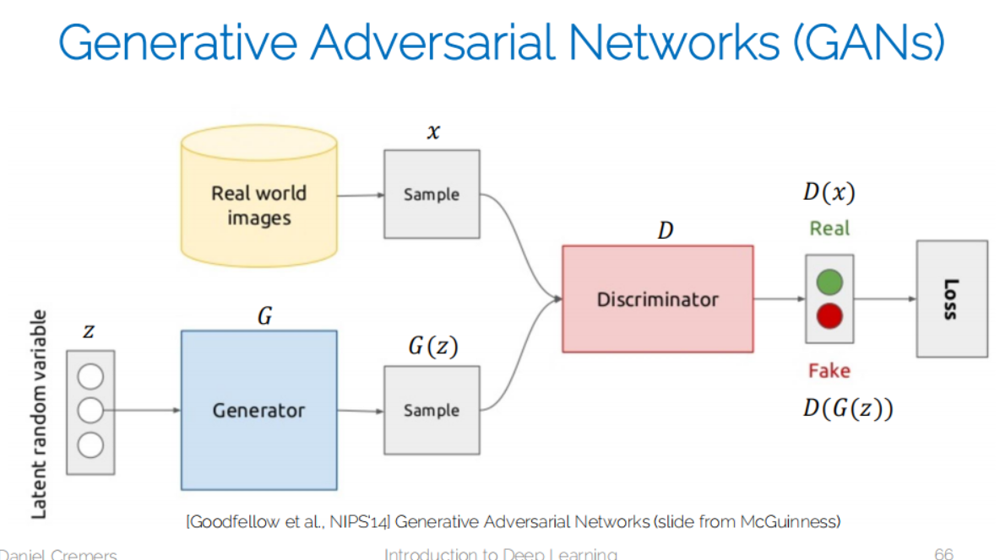
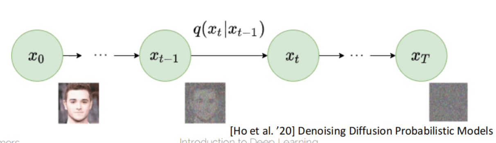
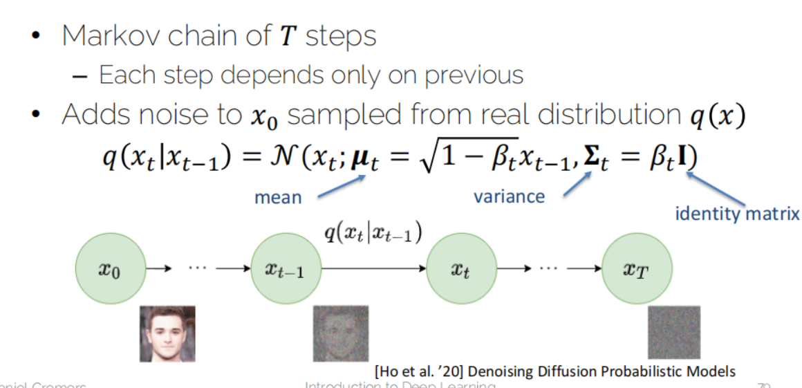

# Lecture 12 - Advanced topics

## GNN

Graph Neural Networks

* Node: a concept
* Edge: a connection between concepts

比如：3D mesh classification

## Generative Models

### AE和VAE

[AE VAE](./Lecture08-补充Exercise8-TransferLearningAndAutoencoders.md)

### GAN

Generative Adversarial Networks

1. 用带real fake的label的图片
2. train discriminator来区分real和fake
3. 这里的lantant random variable是一个预定义的概率分布（如均匀分布或正态分布）中随机采样得到的潜在向量。这个概率分布是手动设定的，与数据无关，其目的是为生成器提供一个随机噪声的源，从而使生成器能够学习如何将这些噪声映射到数据分布上。

## Diffusion

### Diffusion process

* Gradually add noise to input image 𝑥0 in a series of 𝑇 time steps
* Neural network trained to recover original data

#### Forward diffusion

* Markov chain of 𝑇 steps
  * each step depends only on previous
* Add noise to x_0 sampled from real distribution

#### Reverse Diffusion

* 𝑥_{𝑇→∞} becomes a Gaussian distribution
* Reverse distribution
  * Sample 𝑥_𝑇~𝒩(𝟎,𝐈) and run reverse process
  * Generates a novel data point from original distribution

### Difusion Model Architecture

* Input and output dimensions must match
* Highly flexible to architecture design
* Commonly implemented with U-Net architectures