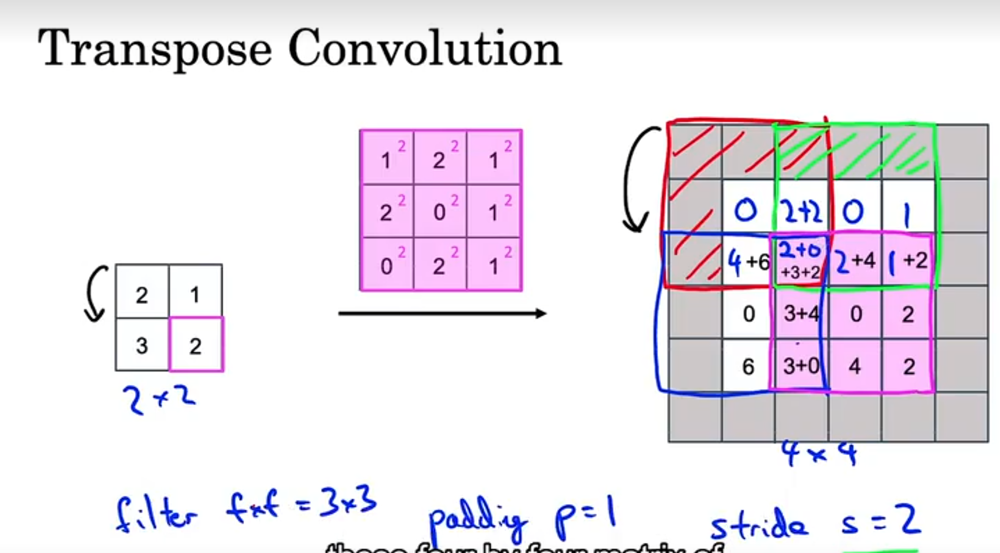

# 转置卷积TransposeConvolution

转置卷积是原本卷积的上下左右翻转，计算方式依旧是先加padding，然后卷积依旧是重叠的框乘起来加起来就行。

如上图，转置卷积是卷积的逆操作，当然只是维度上是逆的，实际上数值上是不逆的。只是做了个升维的转置卷积。

padding=1,stride=2，即输出会多一个padding（反过来看就好理解了），stride=2，即每次跳两个像素（反过来看就好理解了）。

然后每次都用卷积核乘以输入的像素，然后求和。最后的结果是：

