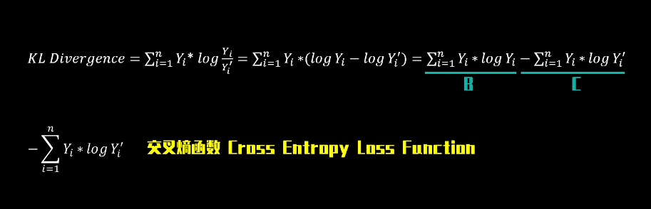

# 词汇收集

## 鲁棒性 Robust
   鲁棒是Robust的音译，也就是健壮和强壮的意思，是指控制系统在一定（结构，大小）的参数摄动下，维持其它某些性能的特性；根据对性能的不同定义，可分为稳定鲁棒性和性能鲁棒性。 鲁棒性也代表了异常和危险情况下系统生存的能力。 鲁棒性决定了机器人实际应用中在未知环境下工作的稳定性和异常情况的容错性，对评价机器人具有重要意义。

## 损失函数
   [【数之道 32】6分钟理解机器学习核心知识之<损失函数>](https://www.bilibili.com/video/BV1vg411172u?spm_id_from=333.1007.top_right_bar_window_history.content.click&vd_source=6beebf17d5aa6fb3d9fb4b629d0b319a)
   
   
   表示误差的就是损失函数

   1. 绝对值损失函数 和 平方损失函数
   

   相对于绝对值损失函数，平方损失函数会导致结果更偏向异常值
   

   

   2. Huber Loss 介于二者之间
   

   3. KL散度
   对于[0,1]之间的概率结果，前面的显然都不好用，需要更加厌恶大概率误差的损失函数
   

   4. 交叉熵函数
    

## mAP

### 查准率（Precision）和查全率（recall）

For example, in the testing for cancer:

### IoU
两个范围的重叠/两个范围面积的总和（只算一次重叠的地方）

用来：比如IoU >= 0.5 就说预测正确。（两次两个框重叠计算出IoU）

## AP（average precision）
Let’s create an over-simplified example in demonstrating the calculation of the average precision. In this example, the whole dataset contains 5 apples only. We collect all the predictions made for apples in all the images and rank it in descending order according to the predicted confidence level. The second column indicates whether the prediction is correct or not. In this example, the prediction is correct if IoU ≥ 0.5.

Let’s take the row with rank #3 and demonstrate how precision and recall are calculated first.

Precision is the proportion of TP = 2/3 = 0.67.

Recall is the proportion of TP out of the possible positives = 2/5 = 0.4.

Recall values increase as we go down the prediction ranking. However, precision has a zigzag pattern — it goes down with false positives and goes up again with true positives.

Let’s plot the **precision against the recall** value to see this zig-zag pattern.

The **general definition for the Average Precision (AP)** is finding **the area under the precision-recall curve above**.

Precision and recall are always between 0 and 1. **Therefore, AP falls within 0 and 1 also.** Before calculating AP for the object detection, we often smooth out the zigzag pattern first.

Graphically, at each recall level, we **replace each precision value with the maximum precision value to the right of that recall level**.

So the orange line is transformed into the green lines and the curve will decrease monotonically instead of the zigzag pattern. The calculated AP value will be less suspectable to small variations in the ranking. Mathematically, we replace the precision value for recall ȓ with the maximum precision for any recall ≥ ȓ.

对于AP(Average Precision)的计算有两种方法：

1. VOC2010之前的方法

AP =（平滑后PR曲线上，Recall分别等于0，0.1，0.2，… , 1.0等11处Precision的平均值）。

2. VOC2010及以后的方法

AP=平滑后PR曲线下包围的面积

### mAP的计算
上述计算的AP只是针对dog这个类别，物体检测通常有多个类别，模型性能肯定是多个类别准度的综合度量。

1. VOC数据集中的mAP

**VOC数据集中的mAP计算的是IoU_threshold=0.5时各个类别AP的均值。**

2. COCO数据集中的mAP

**检测是否正确有两个超参数，P_threshold和IoU_threshold。AP是固定了IoU_threshold，再综合考虑各个P_threshold下的模型平均准确度。**

VOC认为IoU_threshold固定一个单值0.5即可，COCO则认为固定了IoU_threshold的取值，无法衡量IoU_threshold对模型性能的影响。

比如，

A模型在IoU_threshold=0.5时，mAP=0.4。

B模型在IoU_threshold=0.7时，mAP同样为0.4。

依据VOC的标准，AB模型的性能一样，但显然B模型的框更准，性能更优。

COCO在VOC标准的基础上，取IoU_threshold=0.5，0.55， 0.6，… , 0.95时各个mAP的均值。

下图给出了当前mAP最佳结果。

