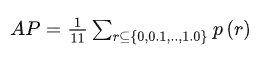

# 词汇收集

- [机器学习和深度学习](#机器学习和深度学习)
- [鲁棒性 Robust](#鲁棒性-robust)
- [损失函数](#损失函数)
- [mAP](#map)
  - [查准率（Precision）和查全率（recall）](#查准率precision和查全率recall)
  - [IoU](#iou)
- [AP（average precision）](#apaverage-precision)
  - [mAP的计算](#map的计算)
- [pytorch中epoch,batch概念](#pytorch中epochbatch概念)
- [监督学习，无监督学习](#监督学习无监督学习)
- [端到端](#端到端)
- [bin](#bin)
- [超参数 hyperparameters](#超参数-hyperparameters)
- [交叉验证 cross validation](#交叉验证-cross-validation)
- [AUC](#auc)
  - [ROC](#roc)
- [AUC](#auc-1)

## 机器学习和深度学习
机器学习是一种通过模式识别和数据分析来训练计算机程序的方法。它通过使用统计学、概率论和最优化等数学方法，自动从数据中提取规律和模式，并利用这些模式来做出预测和决策。机器学习算法包括决策树、逻辑回归、支持向量机、朴素贝叶斯等。

深度学习是机器学习的一个分支，它使用神经网络模型来解决复杂的模式识别和预测问题。与传统机器学习方法不同，深度学习算法可以自动从原始数据中提取多层次的特征表示，从而实现更高水平的性能和更广泛的应用。深度学习算法包括卷积神经网络、循环神经网络和变换器等。

## 鲁棒性 Robust
   鲁棒是Robust的音译，也就是健壮和强壮的意思，是指控制系统在一定（结构，大小）的参数摄动下，维持其它某些性能的特性；根据对性能的不同定义，可分为稳定鲁棒性和性能鲁棒性。 鲁棒性也代表了异常和危险情况下系统生存的能力。 鲁棒性决定了机器人实际应用中在未知环境下工作的稳定性和异常情况的容错性，对评价机器人具有重要意义。

## 损失函数
   [【数之道 32】6分钟理解机器学习核心知识之<损失函数>](https://www.bilibili.com/video/BV1vg411172u?spm_id_from=333.1007.top_right_bar_window_history.content.click&vd_source=6beebf17d5aa6fb3d9fb4b629d0b319a)
   
   
   表示误差的就是损失函数

   1. 绝对值损失函数 和 平方损失函数
   

   相对于绝对值损失函数，平方损失函数会导致结果更偏向异常值
   

   

   2. Huber Loss 介于二者之间
   

   3. KL散度
   对于[0,1]之间的概率结果，前面的显然都不好用，需要更加厌恶大概率误差的损失函数
   

   4. 交叉熵函数
    

## mAP

### 查准率（Precision）和查全率（recall）

For example, in the testing for cancer:

### IoU
两个范围的重叠/两个范围面积的总和（只算一次重叠的地方）

用来：比如IoU >= 0.5 就说预测正确。（两次两个框重叠计算出IoU）

## AP（average precision）
Let’s create an over-simplified example in demonstrating the calculation of the average precision. In this example, the whole dataset contains 5 apples only. We collect all the predictions made for apples in all the images and rank it in descending order according to the predicted confidence level. The second column indicates whether the prediction is correct or not. In this example, the prediction is correct if IoU ≥ 0.5.

Let’s take the row with rank #3 and demonstrate how precision and recall are calculated first.

Precision is the proportion of TP = 2/3 = 0.67.

Recall is the proportion of TP out of the possible positives = 2/5 = 0.4.

Recall values increase as we go down the prediction ranking. However, precision has a zigzag pattern — it goes down with false positives and goes up again with true positives.

Let’s plot the **precision against the recall** value to see this zig-zag pattern.

The **general definition for the Average Precision (AP)** is finding **the area under the precision-recall curve above**.

Precision and recall are always between 0 and 1. **Therefore, AP falls within 0 and 1 also.** Before calculating AP for the object detection, we often smooth out the zigzag pattern first.

Graphically, at each recall level, we **replace each precision value with the maximum precision value to the right of that recall level**.

So the orange line is transformed into the green lines and the curve will decrease monotonically instead of the zigzag pattern. The calculated AP value will be less suspectable to small variations in the ranking. Mathematically, we replace the precision value for recall ȓ with the maximum precision for any recall ≥ ȓ.

对于AP(Average Precision)的计算有两种方法：

1. VOC2010之前的方法

AP =（平滑后PR曲线上，Recall分别等于0，0.1，0.2，… , 1.0等11处Precision的平均值）。

2. VOC2010及以后的方法

AP=平滑后PR曲线下包围的面积

### mAP的计算
上述计算的AP只是针对dog这个类别，物体检测通常有多个类别，模型性能肯定是多个类别准度的综合度量。

1. VOC数据集中的mAP

**VOC数据集中的mAP计算的是IoU_threshold=0.5时各个类别AP的均值。**

2. COCO数据集中的mAP

**检测是否正确有两个超参数，P_threshold和IoU_threshold。AP是固定了IoU_threshold，再综合考虑各个P_threshold下的模型平均准确度。**

VOC认为IoU_threshold固定一个单值0.5即可，COCO则认为固定了IoU_threshold的取值，无法衡量IoU_threshold对模型性能的影响。

比如，

A模型在IoU_threshold=0.5时，mAP=0.4。

B模型在IoU_threshold=0.7时，mAP同样为0.4。

依据VOC的标准，AB模型的性能一样，但显然B模型的框更准，性能更优。

COCO在VOC标准的基础上，取IoU_threshold=0.5，0.55， 0.6，… , 0.95时各个mAP的均值。

下图给出了当前mAP最佳结果。

## pytorch中epoch,batch概念
batch_size、epoch、iteration是深度学习中常见的几个超参数：

（1）batch_size：每批数据量的大小。DL通常用SGD的优化算法进行训练，也就是一次（1 个iteration）一起训练batchsize个样本，计算它们的平均损失函数值，来更新参数。batch_size（块大小）数值意思是：一个 batch 中的样本总数，一次喂进网络的样本数。

（2）iteration：1个iteration即迭代一次，也就是用batchsize个样本训练一次。Numbers of iterations = All/batch_size

（3）epoch：1个epoch指用训练集中的全部样本训练一次，此时相当于batchsize 等于训练集的样本数。epochs被定义为向前和向后传播中所有批次的单次训练迭代。这意味着1个周期是整个输入数据的单次向前和向后传递。简单说，epochs指的就是训练过程中全部样本数据将被“轮”多少次，就这样。

最初训练DNN采用一次对全体训练集中的样本进行训练（即使用1个epoch），并计算一次损失函数值，来更新一次权值。当时数据集较小，该方法尚可。后来随着数据集迅速增大，导致这种方法一次开销大进而占用内存过大，速度过慢。

后来产生了一次只训练一个样本的方法（batchsize=1）,称作在线学习。该方法根据每一个样本的情况更新一次权值，开销小速度快，但收到单个样本的巨大随机性，全局来看优化性能较差，收敛速度很慢，产生局部震荡，有限迭代次数内很可能无法收敛。

## 监督学习，无监督学习
1. 监督学习（supervised learning）的任务是学习一个模型，使模型能够对任意给定的输入，对其相应的输出做出一个好的预测。

即：利用训练数据集学习一个模型，再用模型对测试样本集进行预测。 

官方提供旅客数据——数据集1（姓名，年龄，性别，社会经济阶层，是否生存等），要求参赛选手建立一个预测模型来回答“另外418名乘客是否会生存？”

这是一个典型的监督学习（supervised learning）的例子。因为该训练资料有输入物件（姓名，年龄，性别，社会经济阶层等）和预期输出（是否生存）。

**有无预期输出是监督学习（supervised learning）与非监督学习（unsupervised learning）的区别。**

1. 非监督学习（unsupervised learning）为直接对数据进行建模。没有给定事先标记过的训练范例，所用的数据没有属性或标签这一概念。事先不知道输入数据对应的输出结果是什么。

自动对输入的资料进行分类或分群，以寻找数据的模型和规律。

如聚类算法：

针对数据集，自动找出数据中的结构，从而把数据分成不同的簇。

例如：谷歌新闻利用聚类算法把不同的主题放在一起。

## 端到端
端到端（End-to-End）是指将整个过程从输入到输出看作一个整体，而不是将其分解成多个子任务进行独立处理的过程。在机器学习领域，端到端通常指使用深度学习模型来直接处理输入数据并输出预期的结果，无需手动设计特征或使用其他中间步骤。这种方法的优点是可以减少人工参与的需要，同时也能够提高系统的准确性和泛化能力。端到端在自然语言处理、语音识别、计算机视觉等领域都有广泛的应用，其中以深度学习技术为主。

## bin
在机器学习中，bin通常指的是**将连续的数值型特征划分为离散的区间，也称为分箱或离散化**。通过分箱，可以将数值型特征转换为类别型特征，这有助于模型的学习和预测。

例如，将一个年龄特征分成儿童、青年、中年和老年四个区间，就可以把数值型特征转化为类别型特征。通常使用pyspark.ml.feature.Bucketizer类将连续的数值型特征分箱。

## 超参数 hyperparameters
超参数（hyperparameters）是指在训练模型之前需要设定的参数，这些参数通常不由算法本身学习得到，而是由人为设定。常见的超参数包括学习率、正则化系数、最大迭代次数、隐藏层节点数等。超参数的设定会直接影响模型的性能和训练速度，因此需要进行调优，找到最优的超参数组合。通常通过网格搜索或随机搜索等方法寻找最优的超参数组合。

## 交叉验证 cross validation
交叉验证（Cross validation）是机器学习中常用的一种模型评估方法。它的基本思想是将数据集分成k个互斥的子集，将每个子集都做一次验证集，其余的k-1个子集作为训练集，然后分别进行k次训练和验证，最后将k次的实验结果平均得到评估指标的一个值，比如平均准确率、平均精度等。

具体的操作步骤如下：

将数据集按照某种方式划分成k个互斥的子集。
对于每个子集i，取出子集i作为验证集，剩下的k-1个子集作为训练集，训练得到模型Mi。
使用模型Mi在验证集上进行验证，得到模型Mi的评估指标。
重复步骤2和步骤3，直到所有的子集都被用作了一次验证集。
计算所有k次实验的评估指标的平均值作为该模型的评估指标。
交叉验证的优点是可以避免由于数据集划分不当而导致的偏差，同时可以最大化地利用数据集进行训练和验证。缺点是训练时间较长，尤其是对于大规模数据集和复杂模型来说，训练时间可能会非常长。

## AUC

### ROC
ROC曲线（Receiver Operating Characteristic curve）是一种常用的二分类模型的评估方法。它的横轴是假正例率（False Positive Rate，FPR），纵轴是真正例率（True Positive Rate，TPR）。ROC曲线的特点是，当阈值从小到大变化时，假正例率先增大后减小，真正例率先减小后增大。

## AUC
ROC曲线下的面积（Area Under Curve，AUC）是常用的评估二分类模型好坏的指标。AUC的取值范围是`[0,1]`，AUC越大，模型的预测能力越好。