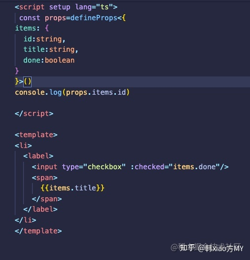
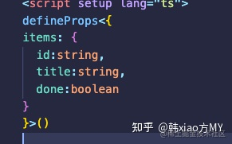
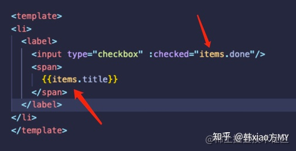
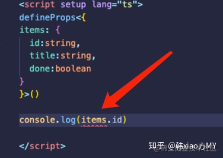
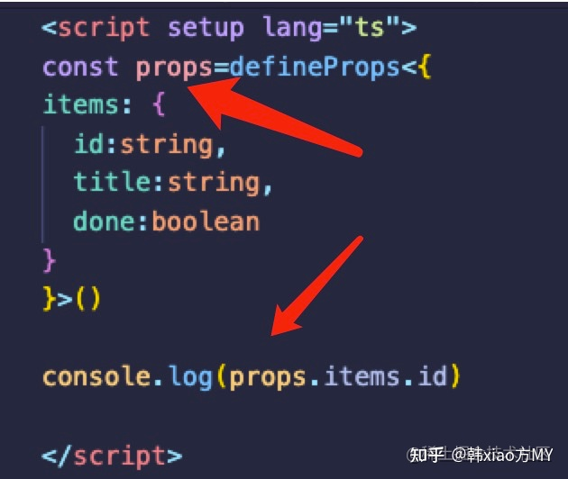

# defineProps
在嵌套组件中我们的父级组件中引入子级组件中的值，或者在子组件中我们使用父组件中的值。

## 使用
1. 在子组件里引入defineProps就可调用该函数去接收父组件传来的属性。
子组件：


2. 为什么要用一个值接收defineProps的返回值，好像不用变量去接收，在template里也能正常使用。



**原因**
原来在script标签里直接拿属性用是拿不到的



## 理论知识
在嵌套组件中我们的父级组件中引入子级组件中的值，或者在子组件中我们使用父组件中的值。

在vue3.2的语法中我们则使用defineProps和defineEmits来声明props和emit，用其进行组件之间的传值。

1. 用于组件通信中父级组件给子级组件传值，其用来声明props,其接收值为props选项相同的值

2. 默认支持常见的类型检查，在ts下，我们需要明确变量的类型，类型经常是我们的自定义类型

3. 只能在`<script setup>`中使用

4. 不需要被导入即可使用,它会在编译`<script setup>`语法块时一同编译掉

5. 必须在`<script setup>`的顶层使用，不可以在`<script setup>`的局部变量中引用

6. 不可以访问 `<script setup>` 中定义的其他变量，因为在编译时整个表达式都会被移到外部的函数中

如果我们正在构建一个博客，我们可能需要一个表示博客文章的组件。我们希望所有的博客文章分享相同的视觉布局，但有不同的内容。要实现这样的效果自然必须向组件中传递数据，例如每篇文章标题和内容，这就会使用到 props。

Props 是一种特别的 attributes，你可以在组件上声明注册。要传递给博客文章组件一个标题，我们必须在组件的 props 列表上声明它。这里要用到 defineProps 宏：

```html
<!-- BlogPost.vue -->
<script setup>
defineProps(['title'])
</script>

<template>
  <h4>{{ title }}</h4>
</template>
```
defineProps 是一个仅 `<script setup>` 中可用的编译宏命令，并不需要显式地导入。声明的 props 会自动暴露给模板。defineProps 会返回一个对象，其中包含了可以传递给组件的所有 props：
```js
const props = defineProps(['title'])
console.log(props.title)
```

一个组件可以有任意多的 props，默认情况下，所有 prop 都接受任意类型的值。

当一个 prop 被注册后，可以像这样以自定义 attribute 的形式传递数据给它：
03.2

```html
<BlogPost title="My journey with Vue" />
<BlogPost title="Blogging with Vue" />
<BlogPost title="Why Vue is so fun" />
```
在实际应用中，我们可能在父组件中会有如下的一个博客文章数组：
```js
const posts = ref([
  { id: 1, title: 'My journey with Vue' },
  { id: 2, title: 'Blogging with Vue' },
  { id: 3, title: 'Why Vue is so fun' }
])
```
这种情况下，我们可以使用 v-for 来渲染它们：
```html
<BlogPost
  v-for="post in posts"
  :key="post.id"
  :title="post.title"
 />
```

## props

定义一个props时：
```js
	const props = defineProps({
		icon: {
			type: String,
			required: true
		}
	})
```

* default：为该 prop 指定一个当其没有被传入或值为 undefined 时的默认值。对象或数组的默认值必须从一个工厂函数返回。工厂函数也接收原始 prop 对象作为参数。

* required：定义该 prop 是否必需传入。在非生产环境中，如果 required 值为真值且 prop 未被传入，一个控制台警告将会被抛出。

* validator：将 prop 值作为唯一参数传入的自定义验证函数。在开发模式下，如果该函数返回一个假值 (即验证失败)，一个控制台警告将会被抛出。