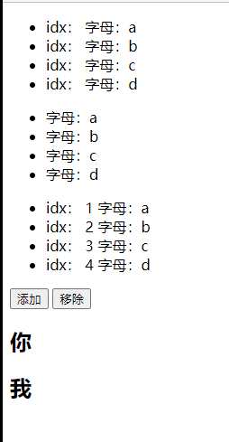

# v-for

* 根据数据生成列表结构
* 数组经常被组合使用
* (item, index) in 数据
* item 和 index 可以结合其他指令一起使用
* 数组长度的更新会同步到页面上，是响应式的

注意案例第一个有`:key=index`, [key属性](../../../计算机语言/超文本/html.md/#key属性)

```html
    <div id="app">
        <ul>
            <li v-for="(item, index) in arr" :key="index">idx： {{key}} 字母：{{item}}</li>
        </ul>

        <ul>
            <li v-for="item in arr">字母：{{item}}</li>
        </ul>

        <ul>
            <li v-for="(item, index) in arr">idx： {{index + 1}} 字母：{{item}}</li>
        </ul>

        <input type="button" value="添加" @click="add">
        <input type="button" value="移除" @click="remove">
        <h2 v-for="(item, index) in arr2" :title="item.name"> {{item.name}} </h2>
    </div>
```

```html
    <script>
        var app = new Vue({
            el:"#app",
            data:{
                arr:['a','b','c','d'],
                arr2:[
                    {name:"你"},
                    {name:"我"}
                ]
            },
            methods:{
                add(){
                    this.arr2.push({name:"他"});
                },
                remove(){
                    this.arr2.shift();
                }
            }
        })
    </script>
```

