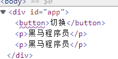
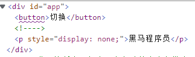

# v-if

* 根据表达式的真假，切换元素的显示和隐藏（操纵dom元素）
* 本质是通过操纵dom元素来切换显示状态
  * 和[v-show](v-show.md)不一样，v-show是改变style display
  * 频繁时候选择v-show，消耗性能小
* true 元素存在，false从dom树中移除




```html
    <div id="app">
        <button  @click="changeIsShow">切换</button>
        <p v-if="isShow">黑马程序员</p>
        <p v-show="isShow">黑马程序员</p>
    </div>
```

```html
    <script src="https://cdn.jsdelivr.net/npm/vue/dist/vue.js"></script>
    <script>
        var app = new Vue({
            el:"#app",
            data:{
                isShow:true,
                age:19
            },
            methods: {
                changeIsShow(){
                    this.isShow = !this.isShow;
                }
            },
        })
    </script>
```