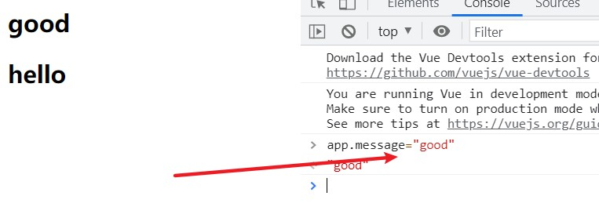

# v-once

**定义的表达式或者组件只会渲染一次，首次渲染后，不再随着数据的改变而再次渲染**

```javascript
<div id="app" >
  <h2>{{message}}</h2>
  <h2 v-once>{{message}}</h2>
</div>
<script src="../js/vue.js"></script>
<script>
  const app = new Vue({
    el: '#app',
    data: {
      message: 'hello'
    }
  })
</script>
```



修改了值，虽然有新的一行出现，但是原来的值也还在