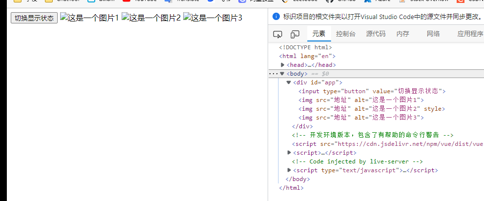
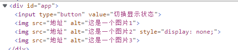

# v-show

* 根据表达式真假，切换元素的显示和隐藏
* 原理是修改元素的display，实现显示隐藏（f12可以看见该属性）
  * 这点和[v-if](v-if.md)不同，v-if是直接操纵dom元素消失
  * 频繁时候选择v-show，消耗性能小
* 指令后i按的内容族中都会解析为布尔值
* true显示，false隐藏




第二章图片的style在变


```html    <div id="app">
        <input type="button" value="切换显示状态" @click="changeIsShow">
        
        
        =18">
    </div>
```

```html
    <!-- 开发环境版本，包含了有帮助的命令行警告 -->
    <script src="https://cdn.jsdelivr.net/npm/vue/dist/vue.js"></script>
    <script>
        var app = new Vue({
            el:"#app",
            data:{
                isShow:true,
                age:19
            },
            methods: {
                changeIsShow(){
                    this.isShow = !this.isShow;
                }
            },
        })
    </script>
```