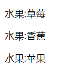
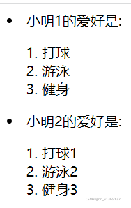
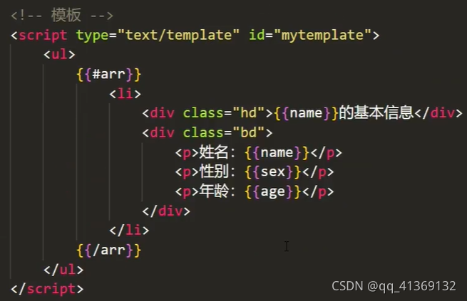

# 插值语法Mustache

## Mustache语法在vue中的基本使用
```html
  <h1>{{message}}</h1>
  <!--不仅可以写变量，也可以写简单的表达式-->
  <h1>{{firstName + '  ' + lastName}}</h1>
  <h1>{{firstName}} {{lastName}}</h1>
  <h1>{{weight * 2}}</h1>
</div>
<script src="../js/vue.js"></script>
<script>
  const app = new Vue({
    el: '#app',
    data: {
      message: 'hello',
      firstName: 'qi',
      lastName: 'lili',
      weight: 20
    }
  })
</script>
```


## Mustache原本的用法
循环数组：{{#arr}}{{/arr}}

数据填入：Mustache.render(templateStr,data)

templateStr-->表示模板字符串<div>{{name}}</div>

data-->表示数据，例如：


```html
            var str3 = `<div>
							{{#arr}}
							<p>水果:{{.}}</p>
							{{/arr}}
						</div>`
						var string3 = {
							arr:['草莓','香蕉','苹果']
						}
			var strdata = Mustache.render(str3,string3)
			var container= document.getElementById('container')
			container.innerHTML = strdata
————————————————
版权声明：本文为CSDN博主「qq_41369132」的原创文章，遵循CC 4.0 BY-SA版权协议，转载请附上原文出处链接及本声明。
原文链接：https://blog.csdn.net/qq_41369132/article/details/120875829
```



```html

            var string4 = {
				arr: [{
						"name": "小明1",
						"age": 12,
						"hobby": ['打球', '游泳', '健身']
					},
					{
						"name": "小明2",
						"age": 12,
						"hobby": ['打球1', '游泳2', '健身3']
					}
				],
			}
			var strdata = Mustache.render(str4, string4)
			var container = document.getElementById('container')
			container.innerHTML = strdata
————————————————
版权声明：本文为CSDN博主「qq_41369132」的原创文章，遵循CC 4.0 BY-SA版权协议，转载请附上原文出处链接及本声明。
原文链接：https://blog.csdn.net/qq_41369132/article/details/120875829
```

