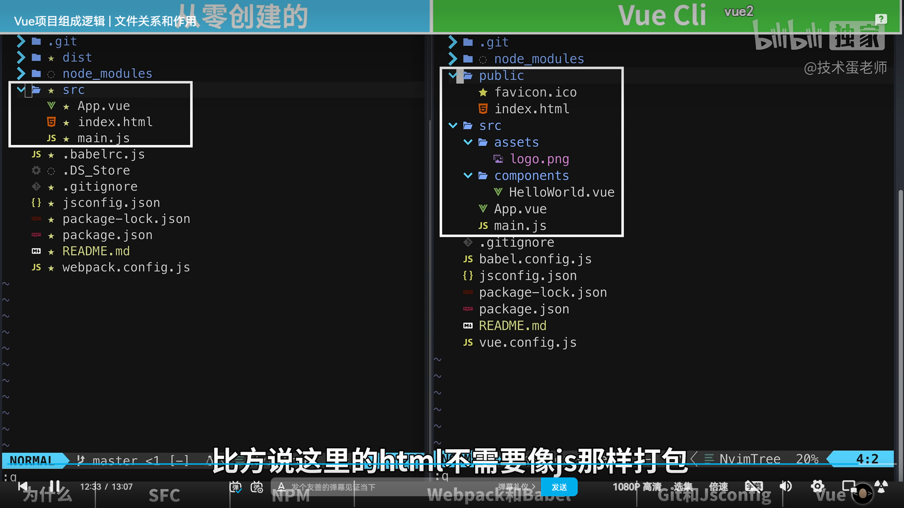

# Vue文件关系和作用

[https://www.bilibili.com/video/BV1dt4y1K7BF/?spm_id_from=333.999.0.0&vd_source=6beebf17d5aa6fb3d9fb4b629d0b319a](https://www.bilibili.com/video/BV1dt4y1K7BF/?spm_id_from=333.999.0.0&vd_source=6beebf17d5aa6fb3d9fb4b629d0b319a)

[项目文件夹的作用](../Vue知识积累/项目文件夹的作用.md)

## .vue-SFC
就是一组件
single file component

`<template>`,`<script>`,`<style>`

然后单独创建一个main.js，引入createApp函数和新建的app.vue组件，创建app并挂载这个组件

## npm - package
但是我们是自己从0创建的，并没有vue这些功能代码可以用，这时，需要vue框架，所以用npm来管理这些依赖/包（框架）。

```
npm init -y
```

生产`package.json`文件，是npm包管理器的核心文件

```
npm i vue
```

1. package.json 会多一行`dependencies: {"vue" : "v^3.2.41"}`。（简易包管理文件）
2. package-lock.json 锁定版本号之类的。（详细包管理文件）

### node_modules - webpack
可以将几个js文件合并

新建 webpack.config.js

安装相关依赖
```
npm i -D webpack webpack-cli webpack-dev-server
```

#### babel-loader
不是所有浏览器支持ES6语法，所以需要这个将代码从高版本转成低版本

```bash
# 后面两个是因babel比较麻烦需要后面两个
npm i -D babel-laoder @babel/core @babel/preset-env
```

#### vue-loader css-loader html-webpack-plugin
浏览器不认识单文件组件，所以需要vue-loader来识别
```
npm i -D vue-loader vue-template-compiler css-loader vue-style-loader html-webpack-plugin
```

#### 配置webpack文件
```js
  module:.{ 规则 :.[ { test:./\.js$/,'use:.'babel-loader'.}, {.test:./\.vue$/,.use:.'vue-loader'.}, { test:./\.css$/,'use:.['vue-style-loader',.'css-loader'l}, 1 plugins::l new HtmlWebpackPlugin({ template: :./src/index .html' Y new VueLoaderPlugin(),
// 引入刚安装的两个依赖作为webpack的插件
const HtmlWebpackPlugin = require('html-webpack-plugin');
const {VueLoaderPlugin} = reguire('vue-loaderi');

// 将配置模块导出
module.exports = {
// 设置起点
    entry: '../src/main.js',
// 设置规则
    module:{
        rules:[ 
            { test: ./\.js$/, use:.'babel-loader' }, 
            { .test: ./\.vue$/, use:.'vue-loader' },
            { test:./\.css$/, use: ['vue-style-loader' .'css-loaderil']},
        ]
    },
// 标注使用的插件
    plugins: [
        new HtmlWebpackPlugin({ 
            template: '../src/index.html' 
        }),
        new VueLoaderPlugin(),
    ],
}
```

#### babel 配置
创建`.babelrc.js`

```js
module.exports = {
    preset: ['@babel/preset-env']
}
```

就可以使用最新的js语法写代码了

### 配置快捷命令
可以用webpack进行打包了但是命令长
在`package.json`：
```json
"scripts" {
    // npm run serve 生成模仿http的服务器
    "serve": "webpack-dev-server --mode development",
    // npm run build 构成生产版本
    "build": "webpack --mode production"
},
```

## dist文件夹（distribution）
`npm run build` 会出现dist文件夹

## jsconfig.json
```json
{
    "compilerOptions": { 
        "target": "es5", 
        "module": "esnext",
        "baseUrl": "./", 
        "moduleResolution": "node",
        // 这里将src路径变成@
        "paths": { 
            "@/*": [ 
                "src/*"
            ]
        }, 
        "lib": [ 
            "esnext",
            "dom", 
            "dom.iterable", 
            "scripthost"
        ]
    }
}
```

## 脚手架
目前为止所有东西加起来就是脚手架了

**vue Cli 和 Vite可以创建项目**

### vue Cli - webpack
上面自己从0构建，现在用vue Cli创建对比
```bash
vue create vue-cli
```
1. 
    其实一样的
2. src文件夹下多了assets和components文件夹
   * assets 图片字体等
   * components 组件
3. 
   src文件夹里少了index.html，因为被移动到`public`文件夹里了，**public一般用来放那些静态资源**
4. npm run build 生成的文件里， `.babelrc.js` = `babel.config.js`, `webpack.config.js` = `vue.config.js`