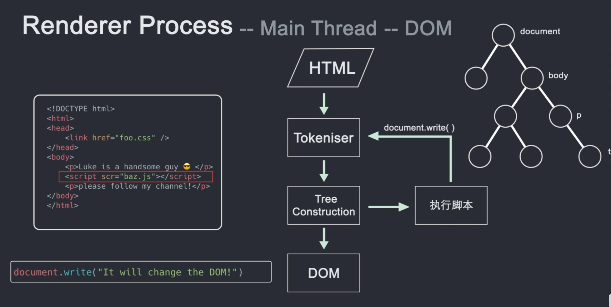

# 前端学习技能树
[前端学习路线](https://objtube.github.io/front-end-roadmap/#/)

1. [互联网](#互联网)
2. [浏览器](#浏览器)
3. [VSCode](#vscode)
4. [超文本(html, css)](#超文本html-css)
5. [JavaScript](#javascript)
6. [TypeScript](#typescript)
7. [Vue](#vue)

## 互联网
[互联网是如何运作的](https://www.bilibili.com/video/BV1Rz4y197Jd)

## 浏览器
[浏览器是如何运作的](https://www.bilibili.com/video/BV1x54y1B7RE/)

```
   +-------+
   |用户界面|             +----+
   +-------+             | 数 |
       |                 |    |
       v                 |    |
  +---------+            | 据 |
  |浏览器引擎|            |    |
  +---------+            |    |
       |                 | 持 |
       v        ------>  |    |
   +-------+             |    |
   |渲染引擎|             | 久 |
   +-------+             |    |
    |      |             |    |
    v      v             | 层 |
+-----+   +-------+      |    | 
| 网络 |  |JS解释器|      +----+
+-----+   +-------+
```

1. 进程，线程
一个软件有多个进程，进程之间靠**进程间通信管道IPC**传递数据
每个进程有多个线程，线程间可以**直接通信**
2. 浏览器用到的进程
   - 浏览器进程
   - 缓存进程
   - 网络进程
   - GPU进程
   - 插件进程
   - 渲染进程
3. 不同的模型 
  - Process-per-site-instance
    为每个instance（不同站点和同一站点都适用）创建一个rederer process。
  - Process-per-site
    同意站点使用同一进程
  - process-per-tab
    script-connected tabs里的所有站点使用同一进程(This model can be selected using --process-per-tab command-line switch)
  - single-proess
    浏览器引擎和渲染引擎共用一个OS进程
4. 渲染进程
   

   网络进程获取到html数据，通过IPC传给渲染器进程的主线程，主线程解析html构建DOM树。
   
   - DOM Tree
   DOM是文档对象模型，可以通过JS与之交互的数据结构和API
   形成`DOM Tree`后会调用CSS（或默认css）形成样式
   
   - Layout Tree
   分布会形成`Layout Tree`。
   其中before伪类里的content不会出现在DOM树里，只出现在Layout树。
   
   - Paint Record
   paint顺序，比如按z-index之类的，最后形成绘制记录表（Paint Record）。
   
   - Rastering
     栅格化，将信息转化为像素点。
     早期只形成可视区域，滚动时新栅格化下面的像素点。
     现在合成（compositing）技术是记录好信息，然后随着滚动展示不在可视区域的部分。（不完全准确，精确见下合成器）

   - Layer Tree
     主线程遍历layout tree后形成，并传递给合成器线程。
     
   - 合成器
     合成器线程栅格化每个图层。会分割页面给不同的栅格化线程（Raster Thread）。
     栅格化存储到GPU。GPU收集Draw Quads信息。
     合成器根据信息搞定合成器帧（composition frame）。并通过IPC传递给浏览器进程。
     浏览器进程再将其传送到GPU，
     GPU渲染展示到屏幕上。
     滚动页面再形成新的合成器帧传送给浏览器进程。
  
5. 总结
   主线程：DOM,style,layoutm,paint,layer
   合成器线程：tiles,frame
   栅格线程：raster，draw quads
6. 重绘和重排问题
   主线程还有 JS， 所以有可能会抢夺主线程导致没及时渲染出现卡顿 (反复重绘和重排)。
   优化有二：
   - requestAniationFrame() 会归还主线程每帧。
   - css属性中有个动画属性Transform，只用在合成器线程和栅格线程，不会受到主线程中JS执行的影响。

## VSCode
[Web/01-VS Code的使用.md at master · qianguyihao/Web](https://github.com/qianguyihao/Web/blob/master/00-%E5%89%8D%E7%AB%AF%E5%B7%A5%E5%85%B7/01-VS%20Code%E7%9A%84%E4%BD%BF%E7%94%A8.md)

- git在vscode中的使用
  - `GitLens`插件，甚至可以比对不同分支的文件内容差异
  - 自带git功能
- TODO 和 FIXME
  - `TODO highlight`插件

## 超文本(html, css)
[css](../计算机语言/超文本/css.md)\
[html](../计算机语言/超文本/html.md)


## JavaScript
[JavaScript](../计算机语言/JavaScript和TypeScript/JavaScript/JavaScript.md)

## TypeScript
[TypeScript](../计算机语言/JavaScript和TypeScript/TypeScript/TypeScript.md)

## Vue
[Vue](Vue/Vue.md)
