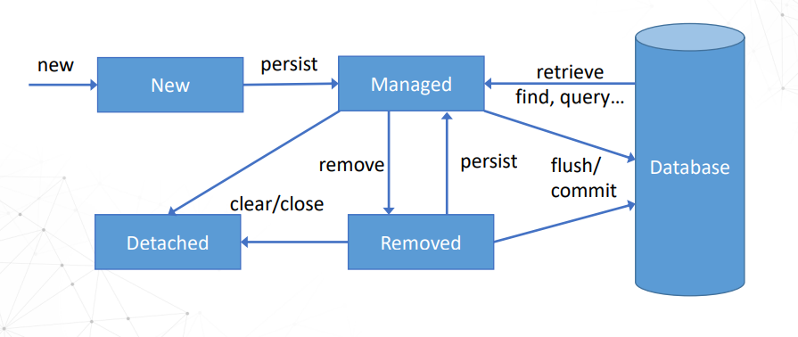

# JPA

## 介绍
JPA是Java Persistence API, 用于对象持久化的 API，是 Java EE 5.0 平台标准的 ORM (object  relation  mapping) 规范，使得应用程序以统一的方式访问持久层。

[JPA和JDBC区别](JPA和JDBC区别.md)

[Spring Data JPA](../SpringBoot/JPA%E5%92%8CHibernate.md)是基于JPA（Java Persistence API）的一个模块，它简化了使用JPA进行数据访问的开发过程。

细节见[Large Scale Enterprise Application](../../LargeScaleEnterpriseApplication/KKC_LSEA_0b00000000.pdf)

## JPA Lifecycle

四个状态：
1. New (Transient): The entity is newly created and not yet associated with a persistence context. It is not yet managed by the JPA implementation.
2. Managed: The entity is associated with a persistence context and is under the management of the JPA implementation. Any changes made to the entity will be tracked and synchronized with the underlying database.
3. Removed: The entity has been marked for removal from the persistence context and the database. Upon the next synchronization with the database, it will be deleted.
4. Detached: The entity was previously managed but has been detached from the persistence context. Changes made to the entity in this state will not be automatically synchronized with the database.

## EntityManager 和 EntityManagerFactory
[EntityManager_EntityManagerFactory](EntityManager_EntityManagerFactory.md)

## EntityTransaction
[EntityTransaction](EntityTransaction.md)

## JPQL
[JPQL](JPQL.md)