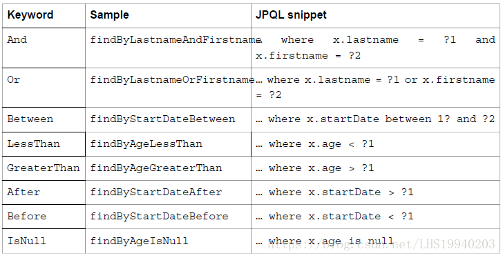
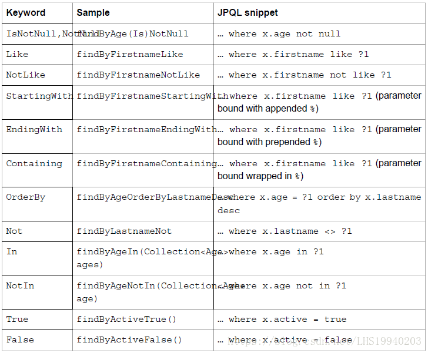

# @Repository

## 自定义查询
```java
@Repository
public interface CharacterRepository extends JpaRepository<Character, Long> {


    /**
     * Seeks for single user's character.
     *
     * @param id   character's id
     * @param user characters's owner
     * @return container (can be empty) with character
     */
    Optional<Character> findByIdAndUser(Long id, User user);

    /**
     * Seeks for all user's characters.
     *
     * @param user characters' owner
     * @return list (can be empty) of user's characters
     */
    List<Character> findAllByUser(User user);

}
```

**规则：**



* Spring Data JPA框架在进行方法名解析时，会先把方法名多余的前缀截取掉，比如find，findBy，read，readBy，get，getBy，然后对剩下的部分进行解析。
* 假如创建如下的查询：findByUserName（），框架在解析该方法时，首先剔除findBy，然后对剩下的属性进行解析，假设查询实体为User：
  * 先判断userName（**根据POJO规范，首字母变为小写**）是否为查询实体的一个属性，如果是，则表示根据该属性进行查询;如果没有该属性，继续第二步;
  * **从右往左截取第一个大写字母开头的字符串**（此处是Name），然后检查剩下的字符串是否为查询实体的一个属性，如果是，则表示根据该属性进行查询;如果没有该属性，则重复第二步，**继续从右往左截取**;最后假设用户为查询实体的一个属性;
  * 接着处理剩下部分（UserName），先判断用户所对应的类型是否有userName属性，如果有，则表示该方法最终是根据“User.userName”的取值进行查询;否则继续按照步骤2的规则从右往左截取，最终表示根据“User.userName”的值进行查询。
  * 可能会存在一种特殊情况，比如User包含一个的属性，也有一个userNameChange属性，此时会存在混合。可以明确在属性之间加上“_”以显式表达意思，比如“findByUser_NameChange ）“或者”findByUserName_Change（）“