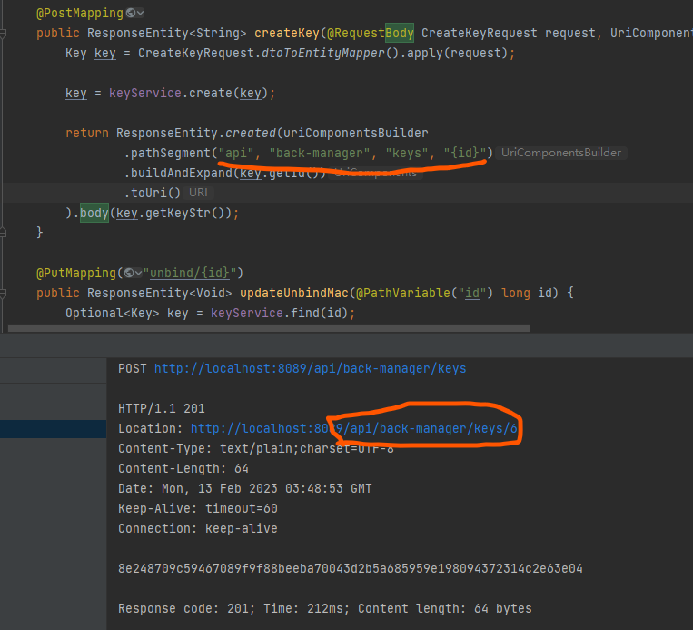

# ResponseEntity

## 常见语法
[对应 ### 状态码](../../服务器网络/域名和网址以及超文本传输协议/超文本传输协议.md)

1. `ResponseEntity.accepted().build()`
2. `ResponseEntity.notFound().build()`
3. `ResponseEntity.created(参数).build`  
   1. accepted:201状态
   2. 参数:
        

## BadRequest添加错误信息

```java
    @PostMapping
    public ResponseEntity<String> createAnimal(@RequestBody CreateAnimalRequest request, UriComponentsBuilder builder) {
        Optional<Animal> findRes = animalService.find(request.getName());
        if(findRes.isPresent()){
            return ResponseEntity
                    .status(HttpStatus.BAD_REQUEST)
                    .body("This animal has been existed!");
        }
        Animal animal = CreateAnimalRequest.dtoToEntityMapper().apply(request);
        animal = animalService.create(animal);
        return ResponseEntity.created(builder.pathSegment("api", "animals", "{name}").buildAndExpand(animal.getName()).toUri()).build();
    }
```
