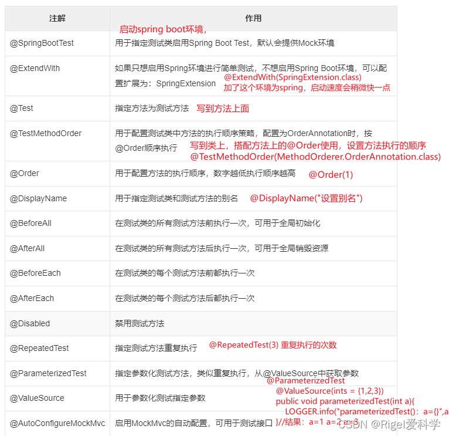

# springboot Test

[单元测试-SpringBoot Test和Mock_springboot 单元测试数据库_Rigel爱科学的博客-CSDN博客](https://blog.csdn.net/sinat_41900036/article/details/128551507)

Spring Boot Test中包含了JUnit测试框架。Spring Boot Test是建立在 [JUnit](../JUnit/_JUnit.md) 的基础之上的，并提供了一些额外的功能和工具，使得编写和执行测试更加方便和灵活。

Spring Boot Test还提供了一些用于测试的注解，例如@SpringBootTest、@WebMvcTest、@DataJpaTest等，用于方便地配置不同类型的测试环境，并提供一些常用的测试工具和辅助方法，例如TestRestTemplate、MockMvc等，以便进行Web API测试和模拟请求发送。



```java
@RunWith(SpringRunner.class)
@SpringBootTest
public class FirstTest {
    @Test
    public void test() {
        int a=1;
        Assertions.assertEquals(1,a);//判断二者是否相等
    }
}
```