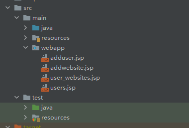
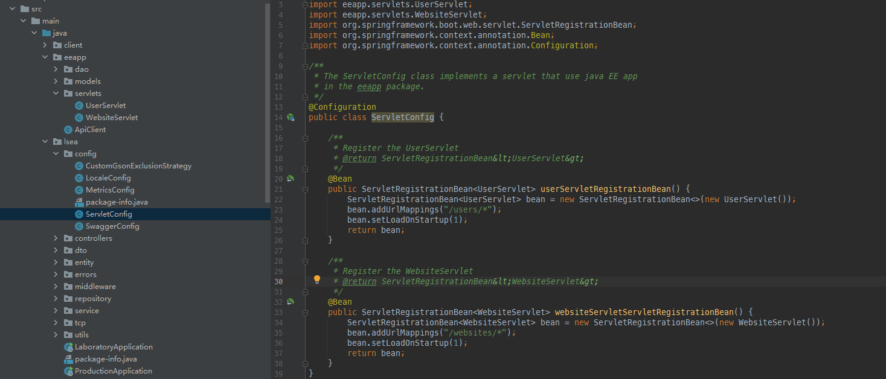

# springboot集成javaEE

## 配置
[springboot 2.0.6 整合jsp页面 打包成jar_jsp打包jar_超级鑫锅锅的博客-CSDN博客](https://blog.csdn.net/qq_32884009/article/details/90575261)

我的设置案例：



上图中webapp文件夹可以通过file->project structure->modules->web->web resource directories来设置intelliJ的识别，当然不识别也没关系。

`application.properties`:
```properties
spring.mvc.view.prefix=/
spring.mvc.view.suffix=.jsp
```

`pom.xml`:
```xml
	<packaging>jar</packaging>
	...
	<build>
		<resources>
			<resource>
				<directory>src/main/webapp</directory>
				<targetPath>META-INF/resources</targetPath>
				<includes>
					<include>*.*</include>
				</includes>
			</resource>
			<resource>
				<directory>src/main/resources</directory>
				<includes>
					<include>*.*</include>
				</includes>
			</resource>
			<resource>
				<directory>src/main/java</directory>
				<includes>
					<include>**/**</include>
				</includes>
			</resource>
		</resources>
		<plugins>
			<plugin>
				<groupId>org.springframework.boot</groupId>
				<artifactId>spring-boot-maven-plugin</artifactId>
				<version>1.4.2.RELEASE</version>
				<configuration>
					<mainClass>lsea.ProductionApplication</mainClass>
				</configuration>
				<executions>
					<execution>
						<goals>
							<goal>repackage</goal>
						</goals>
					</execution>
				</executions>
				<dependencies>
					<dependency>
						<groupId>org.springframework</groupId>
						<artifactId>springloaded</artifactId>
						<version>1.2.6.RELEASE</version>
					</dependency>
				</dependencies>
			</plugin>
			<plugin>
				<groupId>org.apache.maven.plugins</groupId>
				<artifactId>maven-war-plugin</artifactId>
				<configuration>
					<failOnMissingWebXml>false</failOnMissingWebXml>
				</configuration>
			</plugin>
			<plugin>
				<groupId>org.apache.maven.plugins</groupId>
				<artifactId>maven-javadoc-plugin</artifactId>
				<version>3.3.1</version>
				<executions>
					<execution>
						<id>attach-javadoc</id>
						<phase>package</phase>
						<goals>
							<goal>jar</goal>
						</goals>
					</execution>
				</executions>
			</plugin>
		</plugins>
	</build>
```

## servlet运行

项目结构:



userServlet可以在这里找到：[servlet](../JavaEE/Servlet.md)

```java
@Configuration
public class ServletConfig {

    /**
     * Register the UserServlet
     * @return ServletRegistrationBean&lt;UserServlet&gt;
     */
    @Bean
    public ServletRegistrationBean<UserServlet> userServletRegistrationBean() {
        ServletRegistrationBean<UserServlet> bean = new ServletRegistrationBean<>(new UserServlet());
        bean.addUrlMappings("/users/*");
        bean.setLoadOnStartup(1);
        return bean;
    }

    /**
     * Register the WebsiteServlet
     * @return ServletRegistrationBean&lt;WebsiteServlet&gt;
     */
    @Bean
    public ServletRegistrationBean<WebsiteServlet> websiteServletServletRegistrationBean() {
        ServletRegistrationBean<WebsiteServlet> bean = new ServletRegistrationBean<>(new WebsiteServlet());
        bean.addUrlMappings("/websites/*");
        bean.setLoadOnStartup(1);
        return bean;
    }
}
```