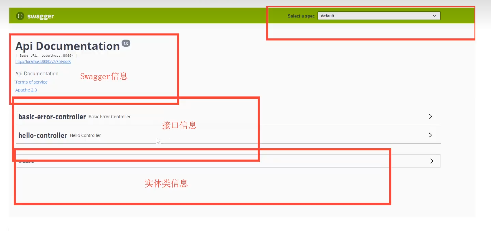

# swagger基本使用流程

1. [1. 依赖](#1-依赖)
2. [2. 集成](#2-集成)
	1. [2.1 简单集成](#21-简单集成)
	2. [2.2 使用](#22-使用)
3. [3. 配置](#3-配置)


## 1. 依赖

```xml
		<dependency>
			<groupId>io.springfox</groupId>
			<artifactId>springfox-swagger2</artifactId>
			<version>2.7.0</version>
		</dependency>
		<dependency>
			<groupId>io.springfox</groupId>
			<artifactId>springfox-swagger-ui</artifactId>
			<version>2.7.0</version>
		</dependency>
```

## 2. 集成

### 2.1 简单集成
```java
@Configuration
@EnableSwagger2
public class SwaggerConfig {

}
```


### 2.2 使用

`/swagger-ui.html`


## 3. 配置

1. Swagger的bean实例：`Docket`
2. API info 可以直接看源码加东西 （注意有个Contact类放个人信息）
3. 配置扫描接口
   1. `Docket.select(). ... .build()`
      1. `apis(RequestHandlerSelectors.?)` 
         1. `basePackage("com.example.demo.controller")`扫描包 (error的api默认会消失) 一般都用这个
         2. `any()` 扫描所有
         3. `none()` 不扫描
         4. `withClassAnnotation(RestController.class)` 扫描类上有`@RestController`注解 注意一定要是注解的反射对象
         5. `withMethodAnnotation(ApiOperation.class)` 扫描方法上有`@ApiOperation`注解 比如`GetMapping` `PostMapping`等
      2. `paths(PathSelectors.?)` 过滤路径
		 1. `any()` 扫描所有
		 2. `none()` 不扫描
		 3. `regex("/user.*")` 扫描以`/user`开头的
		 4. `ant("/user/**")` 扫描以`/user`开头的
   2. `enable(false)` 关闭swagger，默认是打开

```java
@Configuration
@EnableSwagger2
public class SwaggerConfig {

	// 配置了swagger的Docket的bean实例
	@Bean
	public Docket productApi() {
		return new Docket(DocumentationType.SWAGGER_2)
				.apiInfo(apiInfo())
				.select()
				.apis(RequestHandlerSelectors.withMethodAnnotation(ApiOperation.class))  //添加ApiOperiation注解的被扫描
				.paths(PathSelectors.any())
				.build();

	}

	// 配置Swagger信息=apiInfo
	private ApiInfo apiInfo() {
		return new ApiInfoBuilder()
			.title("Single-sign-on API Doc")
			.description("swagger doc of sso")
			.version("v1.0")
			.build();
	}
}
```