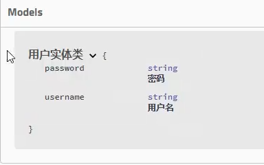

# 分组和接口注释

## 分组

多个Docket实例，每个实例对应一个分组

```java
@Configuration
@EnableSwagger2

public class SwaggerConfig {
	@Bean
	public Docket docket1() {
		return new Docket(DocumentationType.SWAGGER_2)
				.groupName("A");
	}
	@Bean
	public Docket docket2() {
		return new Docket(DocumentationType.SWAGGER_2)
				.groupName("B");
	}
}
```

类上分组
```Java
@RestController
@Api(tags = "用户管理", value = "用户相关接口", groupName = "用户分组")
@RequestMapping("/users")
public class UserController {
    // ...
}
```	

函数分组
```Java
@ApiOperation(value = "获取所有用户信息", notes = "查询所有用户的信息列表", groupName = "用户分组")
@GetMapping("/")
public List<User> getAllUsers() {
    // ...
}

```

## 接口注释

重要的是controller里的返回值，这是连接到实体的关键

注意swagger版本2.7.0是不能显示返回体的model的，需要升级到2.9.2

### 实体类 @Api @ApiModel @ApiModelProperty
```java
//@Api(注释) //等价的
@ApiModel("用户实体类")
public class User {
	@ApiModelProperty("用户名")
	private String username;
	@ApiModelProperty("密码")
	private String password;
}
```


#### @Api
@Api：用在请求的类上，表示对类的说明，可以放在类上，可以放在方法上
* tags=“说明该类的作用，可以在UI界面上看到的注解”
* value=“该参数没什么意义，在UI界面上也看到，所以不需要配置”
* description=“对类的描述，但是已经被deprecated了”，可以直接在config Docket时，在build后加上`.tags(new Tag("name", "description"), new Tag... ...)` 

### 接口类 @ApiOperation @ApiParam @ApiImplicitParam @ApiImplicitParams
```java
@RestController
public class UserController {

	@ApiOperation("获取用户列表")
	@GetMapping("/user")
	public List<User> list() {
		return null;
	}

	@ApiOperation("获取用户")
	@ApiImplicitParams({
		@ApiImplicitParam(name = "id", value = "用户id", required = true, dataType = "int", paramType = "path")
	})
	@GetMapping("/user/{id}")
	public User get(@PathVariable int id) {
		return null;
	}

	@ApiOperation("添加用户")
	@PostMapping("/user")
	public User add(@RequestBody User user) {
		return null;
	}

	@ApiOperation("修改用户")
	@PutMapping("/user")
	public User update(@RequestBody User user) {
		return null;
	}
	
	@ApiOperation("删除用户")
	@DeleteMapping("/user/{id}")
	public void delete(@PathVariable int id) {
	}
}
```

#### @ApiParam
可以用于  `@RequestParam`、`@PathVariable` 和 `@RequestBody` 的参数

下面案例就是默认RequestParam
```java
@GetMapping("/user")
public List<User> list(@ApiParam("用户名") String username) {
	return null;
}
```

#### @ApiImplicitParam
@ApiImplicitParam 注解中的属性包括：

* name：参数名称。
* value：参数说明。
* dataType：参数类型。默认String，其它值dataType=“Integer”
* paramType：参数传递方式，包括 path、query、header、body 和 form 等。
  * header --> 请求参数的获取：@RequestHeader
  * query --> 请求参数的获取：@RequestParam
  * path（用于restful接口）–> 请求参数的获取：@PathVariable
  * body（不常用）
  * form（不常用）
* required：是否为必填参数。
* defaultValue：默认值。
* allowMultiple：是否允许多个值。

```java
@GetMapping("/users/{id}")
@ApiImplicitParam(name = "id", value = "用户 ID", dataType = "int", paramType = "path", required = true)
public User getUserById(@PathVariable("id") int id) {
    // ...
}
```

#### 区别
一个在方法上一个在函数里，多参数情况下方法上的ApiImplicitParams更好看

### 接口返回值
* @ApiResponses：用在请求的方法上，表示一组响应
* @ApiResponse：用在@ApiResponses中，一般用于表达一个错误的响应信息
  * code：数字，例如400
  * message：信息，例如"请求参数没填好"
  * response：抛出异常的类

```Java
@ApiOperation("获取用户")
@ApiResponses({
	@ApiResponse(code = 400, message = "请求参数没填好"),
	@ApiResponse(code = 404, message = "请求路径没有或页面跳转路径不对")
})
@GetMapping("/user/{id}")
public User get(@PathVariable int id) {
	return null;
}
```
