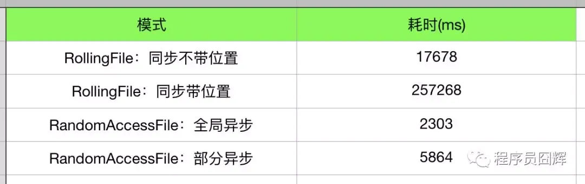

# log

## java
### 教程

[log框架介绍](https://developer.aliyun.com/article/633179)

[Log4j2与Slf4j最佳实践](https://zhuanlan.zhihu.com/p/36554554)

[log4j2哔哩哔哩教程](https://www.bilibili.com/video/BV1jo4y1x7Td/)

### 理解

slf4j 相当于一个统一接口，log4j2 相当于一个实现，log4j2 也可以换成其他的实现，比如 logback(springboot 默认)。可以直接用log4j2，但是slf4j可以使用户不用重写代码，直接替换log4j2为其他的实现。

### 名词解释
1. RollingFile 会在文件大小达到指定大小时，将当前日志文件重命名，然后创建一个新的日志文件继续记录日志。并可以设置最大文件数量，当文件数量达到最大值时，会将最早的日志文件删除。
2. 同步模式 vs 异步模式
    - 同步模式：日志事件会直接被发送到日志文件中，这种模式下，日志事件会阻塞应用程序的执行，直到日志事件被写入到日志文件中。
    - 异步模式：日志事件会先被发送到一个队列中，然后应用程序会继续执行，而不会等待日志事件被写入到日志文件中。这种模式下，日志事件的写入操作是由一个单独的线程来完成的，这样就不会阻塞应用程序的执行了。
3. RandomAccessFile 会在文件大小达到指定大小时，将当前日志文件重命名，然后创建一个新的日志文件继续记录日志。与 RollingFile 不同的是，RandomAccessFile 会在日志文件中记录每个日志事件的位置，这样就可以方便的定位到某个日志事件的位置了。还可以在文件任意位置插入日志事件，这样就可以在不影响其他日志事件的情况下，将某个日志事件插入到日志文件中了。
4. RollingRandomAccessFile  有缓冲区Buffer的概念，缓冲区满了后才会写入磁盘，所以可能看不到实时滚动更新的日志（但其性能更好）。要看到实时滚动更新的日志，则用RollingFIle

速度对比：RandomAccessFile > RollingFile

综上：
1. 想要性能，异步 + RandomAccessFile
2. 想要实时滚动更新的日志，异步 + RollingFile
3. 我喜欢：异步 + RollingRandomAccessFile

### 各种框架
1. log4j
2. jul
3. jcl
4. logback
5. log4j2
6. commons-logging

统一接口：slf4j

### log4j2
[log4j2](log4j2.md)

## go

1. [log](../../计算机语言/Go/log服务.md)