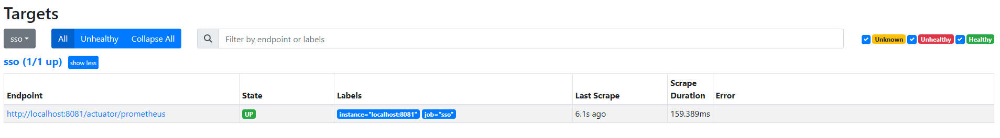

# Prometheus

## 安装
[Prometheus - Monitoring system &amp; time series database](https://prometheus.io/)

```bash
# 根据版本自己去选择 
wget https://github.com/prometheus/prometheus/releases/download/v2.44.0/prometheus-2.44.0.linux-amd64.tar.gz
# 解压
tar zxvf prometheus-2.44.0.linux-amd64.tar.gz 
# 移动 (不移动也行的)
mv prometheus-2.44.0.linux-amd64 /usr/local/prometheus-2.44.0
```

## 配置
```bash
# 进入
cd /usr/local/prometheus-2.44.0
```
```bash
$ ll
total 215448
drwxr-xr-x. 2 1001 121        38 Nov  9 22:52 console_libraries
drwxr-xr-x. 2 1001 121       173 Nov  9 22:52 consoles
-rw-r--r--. 1 1001 121     11357 Nov  9 22:52 LICENSE
-rw-r--r--. 1 1001 121      3773 Nov  9 22:52 NOTICE
-rwxr-xr-x. 1 1001 121 114465160 Nov  9 22:34 prometheus
-rw-r--r--. 1 1001 121       934 Nov  9 22:52 prometheus.yml
-rwxr-xr-x. 1 1001 121 106127759 Nov  9 22:36 promtool
————————————————
版权声明：本文为CSDN博主「TTRy_Harder」的原创文章，遵循CC 4.0 BY-SA版权协议，转载请附上原文出处链接及本声明。
原文链接：https://blog.csdn.net/weixin_44352521/article/details/127947313
```

修改配置文件 prometheus.yml
```yml
scrape_configs:
  - job_name: "prometheus"
    static_configs:
      - targets: ["localserver:9090"]
      
  - job_name: 'pushgateway'
    static_configs:
      - targets: ['localserver:9091']
        labels:
          instance: pushgateway
          
  - job_name: 'node exporter'
    static_configs:
      - targets: ['localserver:9100', 'ubuntu18:9100']
```
这里的 localserver 写为本地的 IP 也可以，或者使用 localhost 代替均可。

配置说明：

1. global 配置块：此片段指定的是 prometheus 的全局配置， 比如采集间隔，抓取超时时间等。
```
scrape_interval：拉取数据的时间间隔，默认为 1 分钟默认继承 global 值。
scrape_timeout: 抓取超时时间,默认继承 global 值。
evaluation_interval：规则验证（生成 alert）的时间间隔，默认为 1 分钟。
```
2. rule_files 配置块：此片段指定报警规则文件， prometheus 根据这些规则信息，会推送报警信息到alertmanager 中。
3. scrape_configs 配置块：配置采集目标相关， prometheus 监视的目标。Prometheus自身的运行信息可以通过 HTTP 访问，所以Prometheus 可以监控自己的运行数据。指定抓取配置，prometheus 的数据采集通过此片段配置。
```
job_name：监控作业的名称。他的下一集是instance，也就是target
static_configs：表示静态目标配置，就是固定从某个 target 拉取数据。一个 scrape_config 片段指定一组目标和参数， 目标就是实例，指定采集的端点， 参数描述如何采集这些实例， 主要参数如下
	targets ： 指定监控的目标， 其实就是从哪儿拉取数据。
	metric_path: 抓取路径， 默认是/metrics
	*_sd_configs: 指定服务发现配置
Prometheus 会从 http://server:9090/metrics 上拉取数据。
```

样例：
```yml
global:
  # How frequently to scrape targets by default.
  [ scrape_interval: <duration> | default = 1m ]

  # How long until a scrape request times out.
  [ scrape_timeout: <duration> | default = 10s ]

  # How frequently to evaluate rules.
  [ evaluation_interval: <duration> | default = 1m ]

  # The labels to add to any time series or alerts when communicating with
  # external systems (federation, remote storage, Alertmanager).
  external_labels:
    [ <labelname>: <labelvalue> ... ]

  # File to which PromQL queries are logged.
  # Reloading the configuration will reopen the file.
  [ query_log_file: <string> ]

# Rule files specifies a list of globs. Rules and alerts are read from
# all matching files.
rule_files:
  [ - <filepath_glob> ... ]

# A list of scrape configurations.
scrape_configs:
  [ - <scrape_config> ... ]

# Alerting specifies settings related to the Alertmanager.
alerting:
  alert_relabel_configs:
    [ - <relabel_config> ... ]
  alertmanagers:
    [ - <alertmanager_config> ... ]

# Settings related to the remote write feature.
remote_write:
  [ - <remote_write> ... ]

# Settings related to the remote read feature.
remote_read:
  [ - <remote_read> ... ]
```

## 启动
```bash
./prometheus --config.file=prometheus.yml
```

如果配置springboot:[springboot整合prometheus](../SpringBoot/Prometheus.md)

## 访问
使用浏览器访问 http://localhost:9090/targets 可以看到根据 `scrape_configs` 配置的目标。



点击graph之类的打开细节：自己调整

## 常用测量指标

