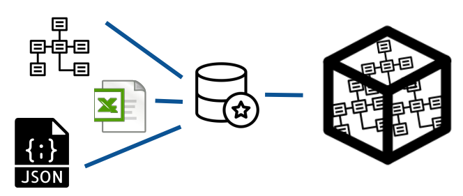
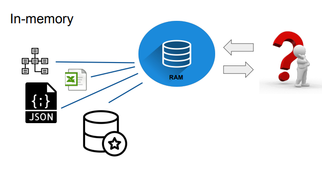

# Data warehouse - Tabular mode

## 简介
Combines functionality of Relational and Multidimensional models 
- tables and relationships 
- KPIs 
- Measures 
- optimized for analytical queries 
- high performance 
- high scalability（the model is scalable vs. number of tuples.）

### 定义
Tabular models in Analysis Services are databases that run **in-memory** or in **DirectQuery mode**, connecting to data from **back-end relational data sources**.

（Tabular model has one more feature - it can be designed as a **non-materialized view**
(**DirectQuery mode**) or as a **database** which runs in the **memory** (**in-memory**). ）

Tabular model can work in two modes: **In-Memory**, similar to **MOLAP**, and **DirectQuery**, similar to **ROLAP**.

### DirectQuery
**和 multidimensional model 比较而言**
**Multidimensional model,** during ETL (extract, transform, load), process the data are retrieved from data sources and uploaded to the data warehouse in the needed format. 
The **ETL process** is executed at the **specific time** and all data at this time are **loaded** to the data warehouse. 

In the **DirectQuery** mode when the query is issued it is executed by **issuing it to the data source**. You must remember that **only one data source is allowed**.

关键点：和in-memory以及multidimensional model相比，它把query发到外部数据源。

#### Advantages
1. Data is always real-time.
2. There is no extra management overhead of having to  maintain a separate copy of the data.
3. No memory limitations.
4. Data does not need to be moved from the source database  to the SSAS database

1. 数据始终是实时的。 
2. 不必维护数据的单独副本没有额外的管理开销。 
3. 没有内存限制。
4. 数据不需要从源数据库移动到SSAS数据库

#### Disadvantages
1. The tremendous speed of the in-memory engine is lost.
2. It is not possible to integrate data coming from different  data sources - only one data source is allowed.
3. Some limitations for query language.

#### DirectQuery Mode 的数据仓库结构
*由于上述DirectQuery的原因*：

Thus, the architecture used for DirectQuery is similar to the one presented in the slide. The data from various data sources must **be uploaded (in the ETL process) to one data base (often relational database with star schema)**.

#### Design tips
During processing query the table will be accessed at least once for  each query and, out of the whole table, only a small subset of it might  be needed for the query. In this case, you need to optimize the SQL model to **quickly answer the queries** generated by DirectQuery. This includes creating the **correct indexes** on the table, and probably **partitioning** it to reduce I/O activity during query execution. 

在处理查询期间，对于每个查询，该表将至少被访问一次，并且在整个表中，查询可能只需要它的一小部分。 在这种情况下，您需要优化 SQL 模型以快速响应 DirectQuery 生成的查询。 这包括在表上创建正确的索引，并可能对其进行分区以减少查询执行期间的 I/O 活动。

（in-memory index没有用）

#### 其他
Power BI 可以直接选择这个模式，如果从sql数据库直接读而不是用VS创建的analyis services数据库。

### In-memory
All needed data from external **data sources are loaded into memory** and the **query is executed in the memory**. 

#### Advantages
1. Data is compressed and stored in a format that makes  queries much faster.
2. Data can come from different data sources and be  transformed into a single format.
3. The in-memory engine contains several optimizations for  memory access, because all the data is stored in RAM.

1. 数据被压缩并以使查询更快的格式存储。 
2. 数据可以来自不同的数据源并转换为单一格式。 
3. 内存引擎包含对内存访问的多项优化，因为所有数据都存储在 RAM 中。

#### Disadvantages
1. There is no way to make sure that the query references the latest changes to  the original data source.
2. Processing (rewriting data to the internal structure) requires a lot of CPU  power. During data processing, the server is busy and typically doesn’t have  the resources to answer queries efficiently.
3. If the database you are working on does not fit into memory, you’ll need to  buy more RAM.
4. Data needs to be moved from the source database to the internal storage.
When dealing with large amounts of data, just moving the data over the  network can take a significant amount of time.

1. 无法确保查询引用了对原始数据源的最新更改。 
2. 处理（将数据重写到内部结构）需要大量的CPU能力。 在数据处理期间，服务器很忙，通常没有资源来有效地回答查询。 
3. 如果您正在处理的数据库不适合内存，则需要购买更多 RAM。 
4. 数据需要从源数据库移动到内部存储。 在处理大量数据时，仅通过网络移动数据可能会花费大量时间。

#### In-memory 的数据仓库结构

#### xVelocity
1. In-memory columnstore engine
2. Data is stored in a highly compressed format
3. Great performance

The data are stored in memory. It means that the data are stored in columnar storage  engine (xVelocity) which has been optimized for high performance analysis and  exploration of data. It provides fast query times for aggregation queries. 
数据存储在内存中。 这意味着数据存储在列式存储引擎（xVelocity）中，该引擎已针对数据的高性能分析和探索进行了优化。 它为聚合查询提供了快速的查询时间。

(The in-memory analytics engine used in Power Pivot is called xVelocity, but it is commonly referred to by its original name, Vertipaq. 
Power Pivot 中使用的内存分析引擎称为 xVelocity，但通常以其原始名称 Vertipaq 来指代它。不是说Tabular mode就没有In-memory模式。)

#### Design tips
当数据加载到 xVelocity 时，引擎会从表中检索所有数据。这导致了如下tips：

During processing, the SSAS engine **will execute a SELECT  statement over the entire table, reading all the rows** and  performing its own processing steps. This means you need to  **optimize your data source for a huge single scan of the table**.

**Indexes are useless**, and **partitioning**, if needed, should be aligned with partitions defined in your SSAS solution.

在处理过程中，SSAS 引擎将对整个表执行 SELECT 语句，读取所有行并执行自己的处理步骤。 这意味着您需要优化数据源以对表进行巨大的单次扫描。 索引是无用的，如果需要，分区应该与 SSAS 解决方案中定义的分区保持一致。