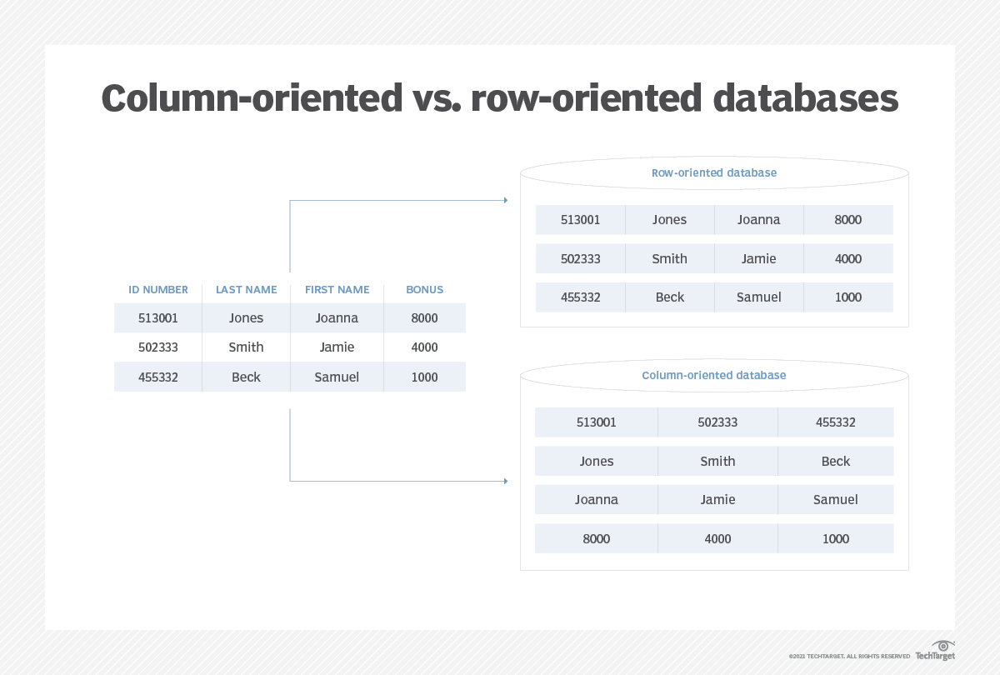
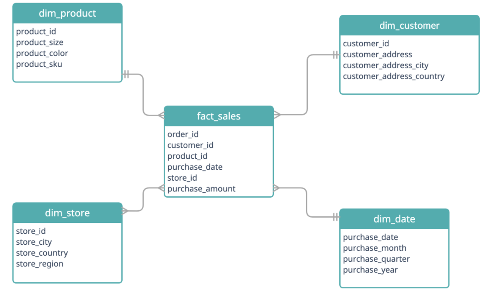
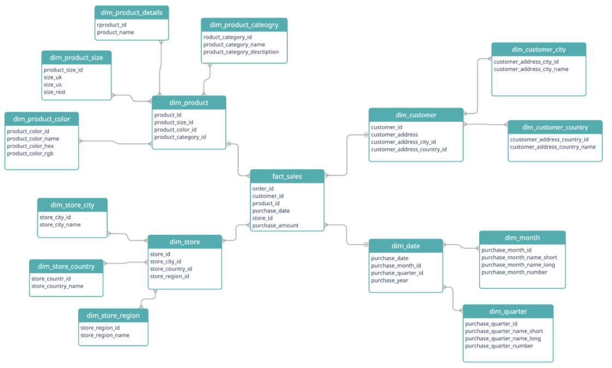

# DataWarehouse基本知识积累

## OLAP
OLAP: online analytical processing

## SSAS
SQL Server Analysis Services

## measure & KPI
measure:  The measure is a numerical value describing a fact (an event  taking place in the organisation). The examples can be the cost of buying a product or  the tax related to this purchase. The measure has often aggregation function  assigned (i.e. the function which aggregates single values of a measure - average,  sum, min, max etc.) The other notion is KPI (Key Performance Indicator). What is it?
This is a measure which has additional values associated. These are bounds which  defines if the value of the measure is beneficial for the organisation (e.g. if the number  of sold books meets the goals set) or not.

## ELT
extract, transform, load

The ETL process is executed at the specific time and all data at this time are loaded to the data warehouse. 

## Relational model(×), multidimensional model(√), Tabular model(√)

### 为社么不用relational model
1. relational database there is no possibility to define measures or KPIs
2. ⭐ Relational model does not provide fast access of complex 
analytical queries.

### 其他
multidimensional model 太复杂

Tabular = realtional + multidimensional

## 列存储和行存储

## schema（图式）

### Star Schema 星型图式
要求将模型表分为 维度（dimension） 和 事实（fact）

### Snowflake Schema 雪花图式
它是星型模式的扩展，增加了功能。与星型模式不同，雪花模式中的维度表被规范化为多个相关表。

#### 关键点
它的维度表可以继续分（比如我有书作为维度表，那我还可以每本书有作者作为一个维度表）

星型图式：

雪花图式：

### dimension 和 fact
#### dimension
维度表描述业务实体——您建模的事物。实体可以包括产品、人员、地点和概念，包括时间本身。您会在星型模式中找到最一致的表是日期维度表。维度表包含一个（或多个）键列（用作唯一标识符）和描述性列。

#### fact
事实表存储观察或事件，可以是销售订单、库存余额、汇率、温度等。
##### granularity
粒度。每一个单个个例怎么分，比如 按月,天,产品号之类的

#### dimension 和 fact 关系
维度键列决定了事实表的维度，而维度键值决定了事实表的粒度。例如，考虑一个旨在存储销售目标的事实表，该表具有两个维度键列Date和ProductKey。很容易理解，表格有两个维度。但是，如果不考虑维度键值，则无法确定粒度。在此示例中，考虑存储在Date中的值列是每个月的第一天。在这种情况下，粒度是月产品级别。
