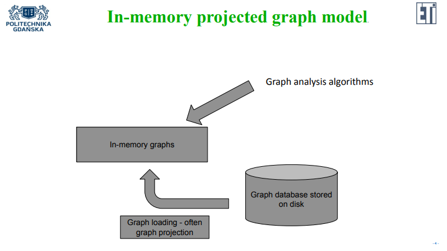
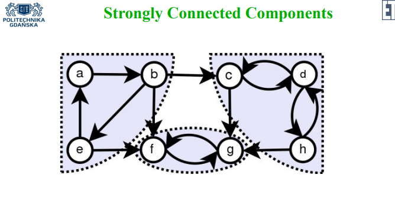
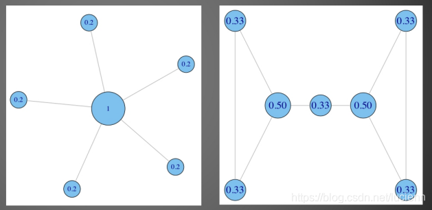
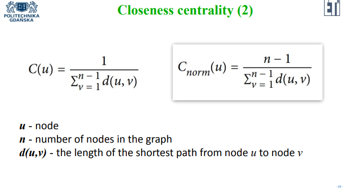
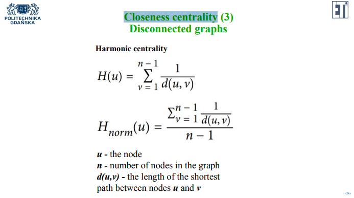
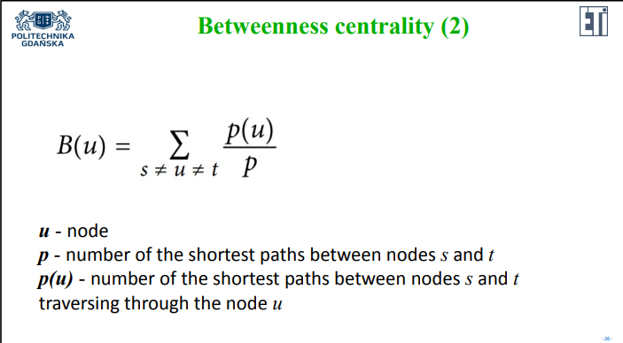

# GraphDatabase_neo4j

1. [no broken links](#no-broken-links)
2. [cypher command](#cypher-command)
   1. [变量](#变量)
3. [语法补充](#语法补充)
   1. [曾经的作业](#曾经的作业)
4. [Graph analysis](#graph-analysis)
   1. [分类](#分类)
   2. [Graph projection](#graph-projection)
      1. [In-memory projected graph model](#in-memory-projected-graph-model)
      2. [Cypher query](#cypher-query)
         1. [construct:](#construct)
            1. [图表目录 Graph Catalog](#图表目录-graph-catalog)
            2. [syntax](#syntax)
            3. [讲解](#讲解)
            4. [悟](#悟)
         2. [export to database](#export-to-database)
   3. [Community detection algorithms](#community-detection-algorithms)
      1. [Triangle Count and Clustering Coefficient 三角形计数和聚类系数](#triangle-count-and-clustering-coefficient-三角形计数和聚类系数)
         1. [Local clustering ciefficient](#local-clustering-ciefficient)
         2. [global clustering coefficient](#global-clustering-coefficient)
      2. [Strongly connected component](#strongly-connected-component)
      3. [Weakly connected component (connected component)](#weakly-connected-component-connected-component)
      4. [Labeled Propagation Algorithm 标记传播算法](#labeled-propagation-algorithm-标记传播算法)
         1. [formal description of steps](#formal-description-of-steps)
   4. [Centrality algorithms](#centrality-algorithms)
      1. [Degree centrality](#degree-centrality)
      2. [Closeness centrality](#closeness-centrality)
         1. [非联通图用 Harmonic centrality](#非联通图用-harmonic-centrality)
      3. [Betweenness centrality](#betweenness-centrality)
      4. [Page Rank](#page-rank)
   5. [Similarity algorithms](#similarity-algorithms)
      1. [Jaccard similarity](#jaccard-similarity)

## no broken links
Ensure that an existing relationship will never point to a non-existing endpoint. Since a relationship always has a start and end node, you cannot delete a node without also deleting its associated relationships.

确保现有关系永远不会指向不存在的端点。 由于关系始终具有开始节点和结束节点，因此您无法删除节点而不删除其关联关系。

## cypher command
### 变量
`param name=>"Johan"`

调用：`$name`

## 语法补充
```cypher
MATCH (n {name: 'Teresa'}) 
REMOVE n:PERSON RETURN labels(n);

match (n)-->(m) return n,m;
match (n)-[rel]->(m) return type(rel);
match (n:Person)-[rel]->(m:Person) return distinct type(rel)

match ()-[]->()<-[]-() return.... LIMIT 2

MATCH (p:Person) WHERE NOT EXISTS(p.born) RETURN p

match(n:Person)-->(f:Movie) 
where n.born is not null
with distinct n order by n.born desc limit 5
return n.name;

MATCH (person:Person)   //遍历所有 Person
MERGE (city:City { name: person.bornIn }) //如果不存在 出生地的城市，则创建
MERGE (person)-[r:BORN_IN]->(city)  //如果不存在关系则创建
RETURN person.name, person.bornIn, city;

match (a),(b) where id(a)=25 and id(b)=8  
merge (a)-[r:gogogo]->(b) //如果不存在 gogogo 关系则创建
on create set r.w = 1   //当关系不存在时，新增关系时，增加或修改其属性
on match set r.w = coalesce(r.w, 0) + 1  //当关系已存在时，增加或修改其属性
return a,b,r;
```

### 曾经的作业
```sql
CREATE (N:PERSON {name:'John', age:12});
CREATE (N:PERSON {name:'Sally', age:15});
MATCH (N {name:'John'}), (M {name:'Sally'})
CREATE (N)-[:IS_FRIEND_OF {date:date('2021-10-10')}]->(M);
CREATE (N:BOOK {name:'Graph Databases', author:'XYZ'});
MATCH (N {name:'John'}), (M {name:'Sally'}), (B {name:'Graph Databases'})
CREATE (N)-[:READ {score:3, start_date:date('2022-10-10')}]->(B), (M)-[:READ {score:5, start_date:date('2021-10-10')}]->(B);

MATCH (M {name:'John'}) - [r:IS_FRIEND_OF] - (N {name:'Sally'})
RETURN r.date;

MATCH () - [r:READ] - (B:BOOK {name:'Graph Databases'})
RETURN avg(r.score);

MATCH (B:BOOK {name:'Graph Databases'})
RETURN B.author;

MATCH (M {name:'Sally'})
RETURN M.age;

MATCH (M {name:'John'})
RETURN M.age;

//MATCH (M:PERSON)
//WITH M ORDER BY M.age desc limit 1
//RETURN COLLECT(M.name);

MATCH (M:PERSON)
WITH max(M.age) as a
Match(M:PERSON)
where M.age = a
RETURN M.name;

MATCH (M:PERSON) - [r:READ] -> (B:BOOK {name:'Graph Databases'})
WITH M,r ORDER BY r.start_date desc limit 1
RETURN M.name;
```

## Graph analysis

### 分类
- [Community detection algorithms](#community-detection-algorithms)
  - evaluate how a group is clustered or  partitioned, as well as its tendency to strengthen or break apart
  - 评估一个群体是如何聚集或划分的，以及其加强或分裂的趋势 
  - 包含 TC（triangle count）, CC（clustering coefficient），Labeled Propagation algorithm 等
- centrality algorithms
  - determine the importance of distinct nodes in a network
  - 确定网络中不同节点的重要性
- similarity algorithms
  - help calculate the similarity of nodes
  - 帮助计算节点的相似度
- pathfinding algorithms
  - help find the shortest path or evaluate the availability  and quality of routes 
  - 帮助找到最短路径或评估路线的可用性和质量
- link prediction algorithms
  - determine the closeness of pairs of nodes
  - 确定节点对的接近程度

### Graph projection
很多时候，图形分析算法都在图形投影上工作，因为算法可以要求图形的特定类型（例如，节点只能分配一个标签，而且每个节点都可以分配相同的标签）。

通常所需的图类型是 k-Partite、bipartite 或 monopartite 图。

1. k-Partite graph: k-Partite 图是一个图，其顶点被或可以被划分为 k 个不同的独立集合。 等效地，它是一个可以用 k 种颜色着色的图，因此一条边的任何两个端点都不具有相同的颜色。
2. bipartite: 二分图（Bipartite graph）是一种图，其顶点可以分为两个不相交且独立的集合 U 和 V，使得每条边都将 U 中的一个顶点连接到 V 中的一个顶点。
3. monopartite: 有时我们会使用 Monopartite 图，如果它包含来自具有一个标签和一种关系类型的节点。

#### In-memory projected graph model


In Neo4J most of the graph analysis algorithms work in memory. The graph database  stores all nodes and edges, but only **the needed graph projection is loaded to the memory**. In next step the graph analysis algorithm works on this in-memory graph  (**the projection of the graph stored in the database**).

#### Cypher query
neo4j:
##### construct:

```sql
CALL gds.graph.create.cypher(
   'projA',
   'MATCH (n:Person) RETURN id(n) AS id, labels(n) AS labels',
   'MATCH (n:Person)-[:WATCHED]->(r:TVShow)<-[:WATCHED]-(m:Person)
   WHERE ID(n) < ID(m)
   RETURN DISTINCT id(n) AS source, id(m) AS target, count(r) AS weight';
)
```
新版应该是 ：`gds.graph.project.cypher()`
使用`CALL dbms.procedures()`看所有的函数

讲解：
###### 图表目录 Graph Catalog
姓名	|描述
-|-
gds.graph.project|使用本机投影将图形添加到目录。
gds.graph.project.cypher|使用 Cypher 投影将图形添加到目录中。
gds.alpha.graph.project|使用 Cypher 聚合将图表添加到目录。
gds.beta.graph.project.subgraph|通过使用节点和关系谓词过滤现有图形，将图形添加到目录。
gds.alpha.graph.sample.rwr|通过使用重新启动的随机游走对现有图形进行采样，将图形添加到目录中。
gds.beta.graph.generate|创建用户定义的属性和尺寸的新随机图形投影。

###### syntax
CALL gds.graph.project.cypher(
    graphName: String,
    nodeQuery: String,
    relationshipQuery: String,
    configuration: Map
) YIELD
    graphName: String,
    nodeQuery: String,
    nodeCount: Integer,
    relationshipQuery: String,
    relationshipCount: Integer,
    projectMillis: Integer

###### 讲解
In the Cypher query we can construct the query which allows us to create the graph  presented on the right hand side of the previous slide. This projection is done  in-memory. The name of the graph in-memory is defined as ‘projA’. Then the query  retrieving nodes (their ids and labels) is formulated. In our example the query  retrieves only people. The second query retrieves edges. To do that the pairs of the  two nodes are identified (the source node and the target node). The query is looking  for two persons which are both related to at least one the same node representing TV  show. The number of theses nodes (tv shows) is calculated. The edges are created  between these two nodes and the weight of the edge is equal to the calculated  number of the same tv shows watched by both people.
It is also worth notice why we additionally **add WHERE ID(n) < ID(m) statement. This  statement ensures that only one edge between the two nodes is created.**

在 Cypher 查询中，我们可以构建查询，它允许我们创建上一张幻灯片右侧显示的图形。 此投影在内存中完成。 内存中图形的名称定义为“projA”。 然后制定查询检索节点（它们的 id 和标签）。 在我们的示例中，查询只检索人。 第二个查询检索边。 为此，两个节点的对被识别（源节点和目标节点）。 该查询正在寻找两个人，这两个人都与至少一个代表电视节目的相同节点相关。 计算这些节点（电视节目）的数量。 在这两个节点之间创建边，边的权重等于计算的两个人观看的相同电视节目的数量。
还值得注意的是为什么我们额外**添加了 WHERE ID(n) < ID(m) 语句。 此语句确保仅创建两个节点之间的一条边**。

###### 悟
- nodeQuery: 
  - id() as id 选择点
  - labels() as labels 继承label
  - X as Y 自定义属性(同时是节点的权重)
- relationshipQuery
  - as source 源头
  - as target 目标
  - as weight 线的权重

##### export to database
```sql
CALL gds.graph.export('projA', {dbName: 'projA'})

:USE system
create database projA
:Use projA
match(n) return n
```

### Community detection algorithms
评估一个群体是如何聚集或划分的，以及其加强或分裂的趋势：
• Triangular Count
• Clustering Coefficient
• SCC
• WCC
• Labeled Propagation Algorithm
• ...

#### Triangle Count and Clustering Coefficient 三角形计数和聚类系数
Triangle Count (TC) - the number of triangles passing through the given node.

Triangle - three nodes, each one is related to the other ones.

The clustering factor (CC) shows how closely a group is related with respect to  how much it could be related.
The full graph has the value of this factor equal to 1.

##### Local clustering ciefficient
$CC(u) = \frac{2R_u}{k_u(k_u-1)}$
u - vertex 
Ru  - number of triangles passing through the u vertex 
ku  - degree of vertex u

##### global clustering coefficient
即 average clustering coefficient: normalised sum over all the local clustering coefficients
$C = \frac{1}{n}\sum_{i=1}^{n}C_i$

#### Strongly connected component

The other way to evaluate how a group is clustered or partitioned for directed graphs is to check if the graph is strongly connected.

A directed graph is strongly connected if there is a path in each direction between each pair of nodes in the graph.

The graph presented in the slide is not strongly connected. For example there is no path in both directions between a and f nodes.

The grey parts represent the subgraphs which are strongly connected, so called  strongly connected components.

#### Weakly connected component (connected component)

If we treat this graph as undirected then there is a path between each pair of nodes in  the graph. Such a graph is weakly connected. Each strongly connected graph is also  weakly connected.

如果我们将此图视为无向图，则图中的每对节点之间都有一条路径。 这样的图是弱连接的。 **每个强连接图也是弱连接的。**

#### Labeled Propagation Algorithm 标记传播算法

The Label Propagation algorithm (LPA) is a fast algorithm for finding communities in a graph. It detects these communities using network structure alone as its guide, and doesn’t require a pre-defined objective function or prior information about the communities.

标签传播算法 (LPA) 是一种用于在图中查找社区的快速算法。 它仅使用网络结构作为指导来检测这些社区，并且不需要预定义的目标函数或有关社区的先验信息。

The algorithm works as follows: 
1. Every node is initialized with a unique community label (an identifier).
2. These labels propagate through the network.
3. At every iteration of propagation, each node updates its label to the one that the  maximum numbers of its neighbours belongs to. Ties are broken arbitrarily but  deterministically.
4. LPA reaches convergence when each node has the majority label of its neighbours.
5. LPA stops if either convergence, or the user-defined maximum number of iterations is achieved.

该算法的工作原理如下：
1. 每个节点都使用唯一的社区标签（标识符）进行初始化。 
2. 这些标签通过网络传播。
3. 在每次传播迭代中，每个节点都将其标签更新为其邻居的最大数量所属的标签。 关系被任意地但确定性地打破。
4. 当每个节点具有其邻居的多数标签时，LPA 达到收敛。
5. 如果达到收敛或用户定义的最大迭代次数，则 LPA 停止。
  
As labels propagate, densely connected groups of nodes quickly reach a consensus on  a unique label. At the end of the propagation only a few labels will remain - most will  have disappeared. Nodes that have the same community label at convergence are  said to belong to the same community.
随着标签的传播，密集连接的节点组迅速就唯一标签达成共识。 在传播结束时，**只剩下几个标签 - 大多数会消失。** 在收敛时具有相同社区标签的节点被称为属于同一个社区。

One interesting feature of LPA is that nodes can be assigned preliminary labels to narrow down the range of solutions generated. This means that it can be used as semi-supervised way of finding communities where we hand-pick some initial  communities.

LPA 的一个有趣特性是可以为节点分配初步标签以缩小生成的解决方案的范围。 这意味着它可以用作寻找社区的半监督方式，我们在其中手工挑选一些初始社区。

##### formal description of steps
C - node label 
1. Assign labels to nodes in the graph. For given node x, Cx  (0) = x, where 0 stands for the iteration number.
2. Set the iteration number to t = 1.
3. Order the nodes in the graph randomly and add them to the ordered set X.
4. For each node x ∈ X, set label Cx (t) = f(Cxi1(t), ...,Cxim(t),Cxi(m+1) (t − 1), ...,Cxik (t − 1)).
The f function returns the most common label among neighbourhood nodes. If more than one such label exists, choose one of them randomly.
5. Stop, if there is no node left that is missing most common label among neighbourhood nodes. Otherwise increase iteration number and go back to point 3.

C - 节点标签 
1. 为图中的节点分配标签。 对于给定的节点 x，Cx (0) = x，其中 0 代表迭代次数。
2. 将迭代次数设置为 t = 1。
3. 对图中的节点进行随机排序，并将它们添加到有序集合 X 中。
4. 对于每个节点 x ∈ X，设置标签 Cx (t) = f(Cxi1(t), ...,Cxim(t),Cxi(m+1) (t − 1), ...,Cxik (  t - 1))。
f 函数返回邻域节点中最常见的标签。 如果存在多个这样的标签，则随机选择其中一个。
5. 停止，如果不存在缺少邻域节点中最常见标签的节点。 否则增加迭代次数并返回第 3 点。


### Centrality algorithms

Determine the importance of distinct nodes in a network:
• Degree Centrality
• Closeness Centrality
• Betweenness Centrality
• Page Rank
• ...

#### Degree centrality
Degree centrality - measures the degree of a vertex in the graph. The most important node is the one with the greatest degree.

图中顶点的度数是直到顶点 w 的入射边的数量。 值得一提的是，每个循环都会将其从中绘制的顶点的度数增加2。我们可以计算所有入射边的数量，指向顶点的入射边的数量以及从顶点出来的边的数量 .

$DC_i = \frac{k_i}{N-1}$
- ki 表示现有的与节点 i 相连的边的数量
- N−1 表示节点 i 与其他节点都相连的边的数量


#### Closeness centrality
calculates which node has the shortest path to all other nodes.


接近中心性的值与最短路径的长度之和成反比。 这两种计算接近中心性的方法中的任何一种都不适用于断开的图，因为分母的值趋于无穷大，因此接近中心性趋于 0。

##### 非联通图用 Harmonic centrality


#### Betweenness centrality
Betweenness centrality calculates for each node the number of shortest paths  between the two other nodes that pass through the given node.
中介中心性为每个节点计算通过给定节点的其他两个节点之间的最短路径数。


normalized: 
$BC_i = \frac{1}{(N-1)(N-2)/2}\sum_{s!=i!=t}\frac{p(u)}{p}$

#### Page Rank
PageRank can be viewed as a model of user behavior. We assume  there is a "random surfer" who browses a randomly selected website  and clicks links, but never goes back to the links already viewed. At  some point, he gets bored and starts browsing another random page.
The probability that a random internet user visits a given page is  precisely the PageRank value. The d-factor indicates the likelihood of  boredom on the page (typically 0.85).

### Similarity algorithms
Help to calculate the similarity of nodes:
• Jaccard similarity
• Cosine similarity
• Euclidean similarity
• Pearson similarity
• ...

#### Jaccard similarity
$J(A,B) = \frac{|A\cap B|}{|A\cup B|} = \frac{|A\cap B|}{|A|+|B| - |A\cap B|}$

Jaccard similarity computes the similarity of the two sets of nodes. It is defined as the  size of the intersection divided by the size of the union of two sets.
It is possible to use Jaccard similarity to compute the similarity of the two nodes. To  do that, firstly we select the specific neighborhoods of each node by defining the type  of edges we are interested in and than for these two sets the Jaccard similarity is  calculated.

Jaccard 相似度计算两组节点的相似度。 它被定义为交集的大小除以两个集合的并集的大小。
可以使用 Jaccard 相似度来计算两个节点的相似度。 为此，首先我们通过定义我们感兴趣的边缘类型来选择每个节点的特定邻域，然后计算这两个集合的 Jaccard 相似度。