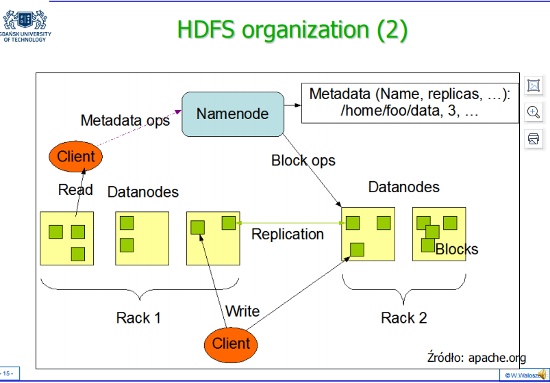
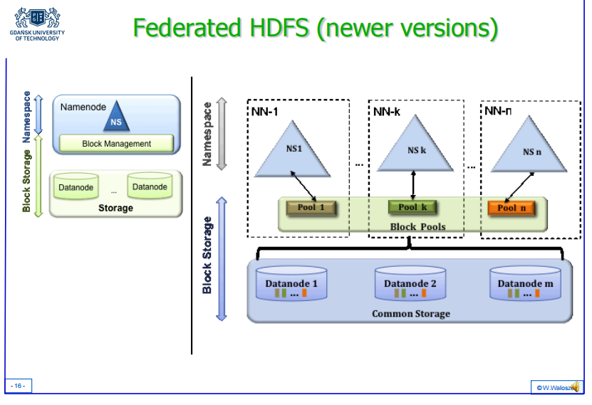
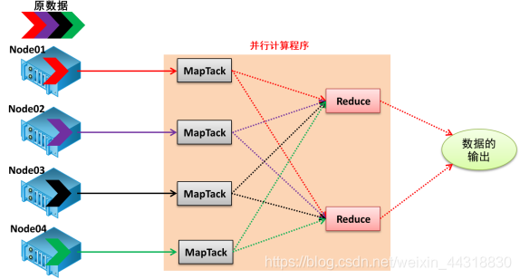
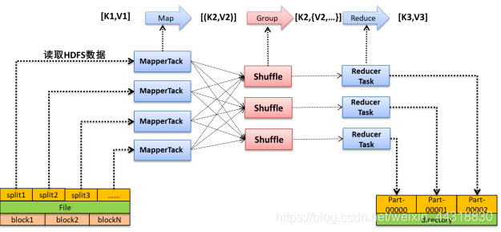
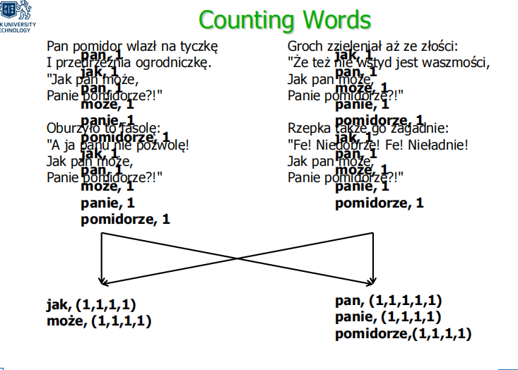
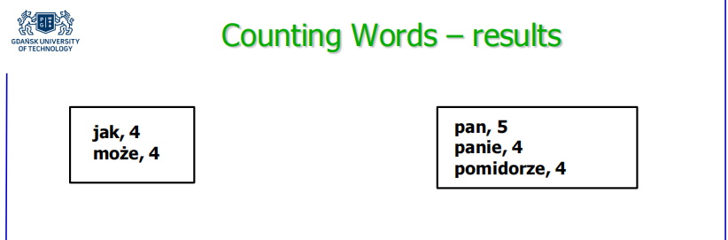
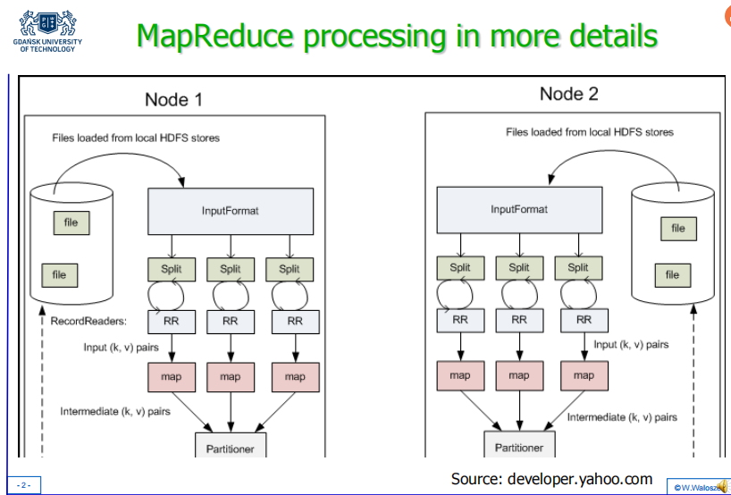
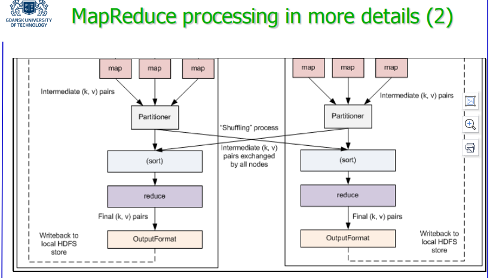
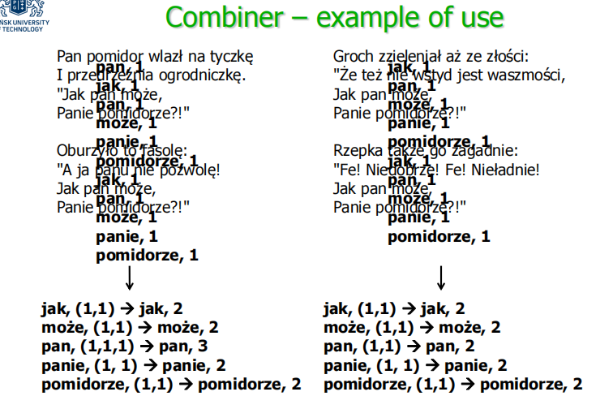
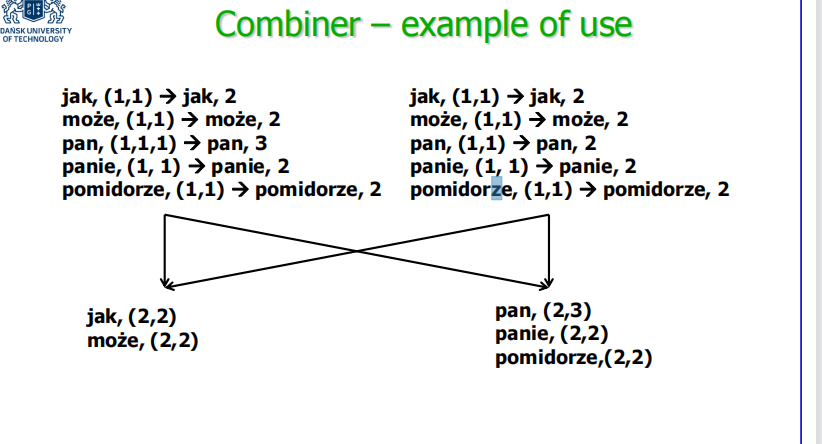

# Hadoop

1. [简介](#简介)
   1. [Assumtions](#assumtions)
2. [HDFS](#hdfs)
   1. [HDFS organization](#hdfs-organization)
3. [MapReduce](#mapreduce)
   1. [Map](#map)
   2. [Driver](#driver)
   3. [MapReduce processing scheme 处理方案](#mapreduce-processing-scheme-处理方案)
   4. [example: counting words](#example-counting-words)
4. [Mapreduce Processing](#mapreduce-processing)
   1. [Input Format](#input-format)
   2. [RecordReader](#recordreader)
   3. [Mapper](#mapper)
   4. [Combiner](#combiner)
   5. [Partitioner](#partitioner)
   6. [Output](#output)
   7. [Sharing information between nodes](#sharing-information-between-nodes)
   8. [Reporting and Counting](#reporting-and-counting)
   9. [example](#example)
5. [Hadoop, HDFS, Hive, HBase](#hadoop-hdfs-hive-hbase)
   1. [Hive](#hive)
6. [积累](#积累)
   1. [BasicOperations](#basicoperations)
   2. [Combiner和Reducer](#combiner和reducer)
7. [pig](#pig)

## 简介
建立在 Google 的 [BigTable](../BigTable/BigTable.md) 的基础上，即文件系统的组织及其分布式处理。 它最初的用途是 Nutch 网络搜索引擎的存储子系统。

Doug Cutting 是第一个在系统上工作的人，他也是“Hadoop”这个名字的作者。

### Assumtions
* From the very beginning, the two main parts of Hadoop are  the distributed file system (HDFS) and the system of  distributed processing MapReduce.
* Hadoop is intented for files that hold large amounts of data  (Big Data), 
* Hadoop focuses on lowering the amount of data that need to  be sent during distributed processing. Its aim is to process  the data „near the data”, 
* A very important aspect of Hadoop is to offer *horizontal  scalability* while being reliable and resistant to faults of single  nodes – it is achieved by redundancy in storing and  processing data.

* 从一开始，Hadoop 的两个主要部分就是分布式文件系统（HDFS）和分布式处理系统 MapReduce。
* Hadoop 旨在用于保存大量数据（大数据）的文件， 
* Hadoop 专注于降低分布式处理期间需要发送的数据量。 其目的是处理“靠近数据”的数据。 
* Hadoop 的一个非常重要的方面是提供水平可扩展性，同时可靠并能抵抗单个节点的故障——它是通过存储和处理数据的冗余来实现的。

疑问：[hdfs集群中的每个datanode中的数据是否是相同的？ - 知乎](https://www.zhihu.com/question/40590258/answer/90302673)

hdfs是否类似mysql的复制，将一个节点的实例复制到其他节点，之后每次读取数据都会从合适的节点取出合适的数据，再组合成数据结果？
还是将数据打散后均匀分布到集群中的每一个节点上，每个节点上的数据都不同，但是每次读取数据都会从namenode的类似普通文件系统的inode的结构中找到数据存放的指针（类似的东西）？

答：有复制行为 复制单元为具体每个文件，不是整个节点作为一个实例读取确实会考虑data locality根据文件大小是否大于block size决定是否将文件数据打散打散后并没有一定均匀分布说法，Loadbalance可以人为触发每个节点上的数据确实可能会不同，视datanode数量和replica指定数量而定

## HDFS
* HDFS (Hadoop Distributed File System) is the file system  offered and handled by Hadoop, 
* The capabilities of HDFS are slightly reduced in comparison to  standard file systems, 
* HDFS is indended to hold very large files (giga- and terabytes  and larger), 
* HDFS is integrated with MapReduce, 
* HDFS is horizontally scalable – one can scale up the system  by adding nodes to it, 
* HDFS is prepared (by redundancies) for failures or sudden  performance decreases of single nodes.

* HDFS（Hadoop 分布式文件系统）是 Hadoop 提供和处理的文件系统， 
* 与标准文件系统相比，HDFS 的功能略有降低， 
* HDFS 旨在保存非常大的文件（giga- and terabytes以及更大）  , 
* HDFS 与 MapReduce 集成， 
* HDFS 是水平可扩展的——可以通过向系统添加节点来扩展系统， 
* HDFS （通过冗余）为单个节点的故障或突然性能下降做好准备。

### HDFS organization
* Files are divided into **blocks** of the default size of 64MB, the  blocks are distributed among the servers, 
* These blocks are replicated among servers to reduce the probability of failure, 
* Server that hold the data are called data nodes (**DataNodes**), 
* Access to metadata is provided by a single server called name node (**NameNode**).

* 文件被分成默认大小为 64MB 的块，这些块分布在服务器之间， 
* 这些块在服务器之间复制以减少失败的可能性， 
* 保存数据的服务器称为数据节点 (DataNodes)， 
* 对元数据的访问由称为名称节点 (NameNode) 的单个服务器提供。


New version: federated HDFS, it have more than one namenode and the whole system will not fail when one node fail.


## MapReduce
* MapReduce is a method of organizing distributed processing especially for large amounts of data,
* MapReduce is simplified in comparison to other methods  (does not require the programmer to use synchronization （同步）,  semaphores（信号量）, etc.),
* The primary rule for MapReduce is „processing data near the data”,
* It is best suited for tasks, where one need to look through large amounts of data to obtain a relatively simple answer,
* The data is processed as pairs (key, value)

### Map
* Map tasks preprocess a portion (a record) of input data, | Map任务预处理输入数据的一部分（一条记录），
* The record is read from a file (most commonly HDFS) in the form of the (key, value) pair
* Map tasks are carried out on the node that holds the data being processed,
* Every tasks produces in the result another set of (key, value) pairs – the keys and values don’t have to be of the same type as those read from the file | 每个任务都会在结果中产生另一组（键，值）对——键和值不必与从文件中读取的类型相同

### Driver
* There is also an additional task for MapReduce, its purpose is to configure the job,
* This additional task is called **Driver**

### MapReduce processing scheme 处理方案
* Once again it needs to be underlined that along the all  processing phases (key, value) pairs are used | 再次需要强调的是，在所有处理阶段都使用（键，值）对
* MapReduce中定义了如下的Map和Reduce两个抽象的编程接口，由用户去编程实现:
  ```
  MAP: (K1, V1) -> list(K2, V2) 
  REDUCE: (K2, list(V2)) -> list(K3, V3)
  ```
  * Map: 将数据进行拆分，即把复杂的任务分解为若干个“简单的任务”来并行处理。可以进行拆分的前提是这些小任务可以并行计算，彼此间几乎没有依赖关系。**对一组数据元素进行某种重复式的处理**
  * Reduce:对数据进行汇总,即对map阶段的结果进行全局汇总。**对Map的中间结果进行某种进一步的结果整理。**
    
    

### example: counting words
1. Map
```java
public static class MapClass extends MapReduceBase 
    implements Mapper<LongWritable, Text, Text, IntWritable> {
        private final static IntWritable one = new IntWritable(1);
        private Text word = new Text();
        public void map(LongWritable key, Text value, 
                        OutputCollector<Text, IntWritable>output,
                        Reporter reporter) throws IOException {
            String line = value.toString();
            StringTokenizer itr = new StringTokenizer(line);
            while (itr.hasMoreTokens()) {
                word.set(itr.nextToken());
                output.collect(word, one);
            }
        }
    }
```
2. Reduce
```java
public static class Reduce extends MapReduceBase
    implements Reducer<Text, IntWritable, Text, IntWritable> {
        public void reduce(Text key, Iterator<IntWritable> values,
                            OutputCollector<Text, IntWritable> output,
                            Reporter reporter) throws IOException {
            int sum = 0;
            while (values.hasNext()) {
                sum += values.next().get();
            }
            output.collect(key, new IntWritable(sum));
        }
    }
```
3. Driver
```java
public void run(String inputPath, String outputPath) throws Exception {
    JobConf conf = new JobConf(WordCount.class);
    conf.setJobName("wordcount")
    conf.setJarByClass( WordCount.class );
    conf.setOutputKeyClass(Text.class);
    conf.setOutputValueClass(IntWritable.class);
    conf.setMapperClass(MapClass.class);
    conf.setReducerClass(Reduce.class);
    FileInputFormat.addInputPath(conf, new Path(inputPath));
    FileOutputFormat.setOutputPath(conf, new Path(outputPath));
    JobClient.runJob(conf);
}
```
4. Keys and values
```
MAP: (address, line) -> list(word, number of occurences)
REDUCE: (word, list(number of occurences)) -> (word, number of occurences)
```
5. result



## Mapreduce Processing


### Input Format
* Input for MapReduce is coming from files, most commonly  they are HDFS files of large sizes, 
* The format of the input (InputFormat) specifies what files  are read, how the files are read (defines InputSplits) and  how the input (key, value) pairs are built (it is a factory of  RecordReader objects), 
* The default Input Format isTextInputFormat, it produces  (key, value) pairs for each line of text, key is the position of  the line in the file, while value is the contents of the line, 
* Another important Input Format is KeyValueInputFormat, it  reads the lines that are encoded in the form of „`key [tab]  value`”.

* MapReduce 的输入来自文件，最常见的是大尺寸的 HDFS 文件， 
* 输入的格式 (InputFormat) 指定读​​取的文件、文件的读取方式（定义 InputSplits）以及输入的方式（键、  value) 对（它是 **RecordReader** 对象的工厂）， 
* 默认输入格式是 TextInputFormat，它为每一行文本生成 (key, value) 对，key 是该行在文件中的位置，而 value 是行的内容， 
* 另一个重要的输入格式是KeyValueInputFormat，它读取以“`key [tab] value`”形式编码的行。

### RecordReader
* RecordReader is an object which actually reads the file, and  produces the input (key, value) pairs , 
* The default (TextInputFormat) produces LineRecordReader objects, 
* The developer can define their own RecordReader, they have  to conform to `RecordReader<key, value>` interface,  
* The developer can use their own value (they have to  implement Writable interface) and key types (they have to  implement WritableComparable interface).

* RecordReader 是一个实际读取文件的对象，并产生输入（键，值）对， 
* 默认（TextInputFormat）产生LineRecordReader 对象， 
* 开发者可以定义自己的RecordReader，他们必须符合`RecordReader<key,  value>` 接口， 
* 开发人员可以使用他们自己的值（他们必须实现 Writable 接口）和键类型（他们必须实现 WritableComparable 接口）。

### Mapper
* Mapper carries out the Map task, 
* The (key, value) types are set by default as those for the  Reducer task, 
* The types can be changed by invoking  setMapOutputKeyClass and setMapOutputValueClass methods

* Mapper 执行Map 任务， 
* (key, value) 类型默认设置为Reducer 任务的类型， 
* 可以通过调用setMapOutputKeyClass 和setMapOutputValueClass 方法更改类型

### Combiner
* To reduce the network overhead one might want to already preaggregate the results on a single node, 
* Such preaggregation is done by a Combiner, 
* Reducer interface extends the one of Combiner so the same  class can be used for combining (as for reducing), 
* Therefore in the Word Counting example the only code that  is needed for combining is:  conf.setCombinerClass(Reduce.class)

* 为了减少网络开销，人们可能希望已经在单个节点上**预聚合**结果， 
* 这种预聚合由 Combiner 完成， 
* Reducer 接口扩展了 Combiner 之一，因此可以使用相同的类进行组合（如用于减少）  , 
* 因此在字数统计示例中，合并所需的唯一代码是：conf.setCombinerClass(Reduce.class)



### Partitioner
* Partitioning influences how Reduce tasks are assigned to  nodes, 
* Pairs with the same key are always directed to a single node, 
* Hadoop by default uses a simple partitioning mechanism  (hash of the key modulo the numper of partitions), 
* This default mechanism can be replaced by a customized  one; the developer needs to implement the interface: public interface `Partitioner<K, V>` extends JobConfigurable {  int getPartition(K key, V value, int numPartitions);  } 
* To use this customized mechanism one has to use  setPartitionerClass method

* 分区影响如何将 Reduce 任务分配给节点， 
* 具有相同键的对总是定向到单个节点， 
* Hadoop 默认使用简单的分区机制（键的哈希对分区数取模）， 
* 这种默认机制 可以用定制的替换； 开发者需要实现接口： 
    ```java
    public interface Partitioner<K, V> extends JobConfigurable { 
        int getPartition(K key, V value, int numPartitions);  
    } 
    ```
* 要使用这种自定义机制，必须使用 setPartitionerClass 方法

### Output
* Output of MapReduce task is directed to files, according to  rules held in OutputFormat object, 
* Default OutputFormat object is TextOutputFormat which  saves the results in the lines of the form „key value”, 
* Other important OutputFormat objects are  SequenceFileOutputFormat (especially useful in cascading  MapReduce jobs) and NullOutputFormat (which ignores the output)

* MapReduce 任务的输出根据 OutputFormat 对象中的规则定向到文件， 
* 默认 OutputFormat 对象是 TextOutputFormat，它将结果保存在“键值”形式的行中， 
* 其他重要的 OutputFormat 对象是 SequenceFileOutputFormat（尤其地有效的在 级联 MapReduce 作业）和 NullOutputFormat（which忽略输出）

### Sharing information between nodes
* Sometimes to efficiently process the contents of the file a  node must hae access to some kind of shared information, 
* To share small amounts of data a developer can use the  JobConf object, 
* Larger amounts of information can be shared with use  ofdistributed cache; such a cache can be „filled” with a file,  whose contents will be sent to all the processing nodes.

* 有时为了有效地处理文件的内容，节点必须访问某种共享信息， 
* 要共享少量数据，开发人员可以使用JobConf 对象， 
* 可以使用分布式缓存共享大量信息； 这样的缓存可以用一个文件“填充”，其内容将被发送到所有处理节点。

### Reporting and Counting
* Another kind of information about processing that can be distributed among nodes are those passed to Reporter  interface, 
* The interface allows for defining new counters, that can aggregate various information about processing.

* 另一种可以在节点之间分发的处理信息是传递给 Reporter 接口的信息， 
* 该接口允许定义新的计数器，可以聚合各种处理信息。

### example
Combiner in Word Counting

* Combiner allows for performing a ”local reduction” of  (key, value) pairs; it is executed between the Map and  Reduce tasks 
* 编程
```
MAP: (address, line) -> list(word, number of occurences) 
COMBINER: (word, list(number of occurences)) ->  (word, number of occurences)  
REDUCE: (word, list(number of occurences)) ->  (word, number of occurences)
```




## Hadoop, HDFS, Hive, HBase
[Hadoop-HDFS-Hive-HBase](Hadoop-HDFS-Hive-HBase.md)

### Hive
[Hive](../Hive/Hive.md)

## 积累
### [BasicOperations](BasicOperations.md)
### [Combiner和Reducer](Combiner和Reducer.md)

## pig
[pig](../Hadoop_Pig/Hadoop_Pig.md)