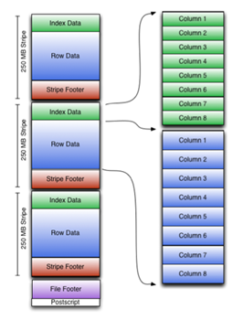

# Hive

1. [定义](#定义)
2. [Hive components](#hive-components)
3. [Storing data](#storing-data)
   1. [可以创建的两种table](#可以创建的两种table)
   2. [数据可以如何储存](#数据可以如何储存)
      1. [TextFile](#textfile)
      2. [SequenceFile](#sequencefile)
         1. [基本介绍](#基本介绍)
         2. [the structure of sequence file](#the-structure-of-sequence-file)
         3. [为什么使用它](#为什么使用它)
         4. [Horizontal row-store](#horizontal-row-store)
      3. [Parquet](#parquet)
         1. [Column-store](#column-store)
      4. [RCFile](#rcfile)
         1. [Row Columnar File 行列式文件](#row-columnar-file-行列式文件)
         2. [Optimized Row Columnar File](#optimized-row-columnar-file)
      5. [Json](#json)
      6. [AVRO - data serialization system](#avro---data-serialization-system)
         1. [介绍](#介绍)
         2. [The example of Avro schema](#the-example-of-avro-schema)
      7. [ORC](#orc)
4. [Data Type](#data-type)
   1. [All Types reference](#all-types-reference)
   2. [Complex types](#complex-types)
      1. [Basic Complex Types](#basic-complex-types)
         1. [STRUCT](#struct)
         2. [ARRAY](#array)
         3. [MAP](#map)
         4. [UNIONTYPE](#uniontype)
      2. [more complicated examples](#more-complicated-examples)
      3. [Collection functions](#collection-functions)
5. [Partitioning and bucketing 分区和分桶](#partitioning-and-bucketing-分区和分桶)
   1. [Partitioning](#partitioning)
      1. [Static Partitioning](#static-partitioning)
         1. [加载数据](#加载数据)
         2. [features](#features)
      2. [Dynamic partitioning](#dynamic-partitioning)
         1. [features](#features-1)
      3. [悟：为什么查询快慢](#悟为什么查询快慢)
   2. [Bucketing](#bucketing)
      1. [Features](#features-2)
      2. [advantages](#advantages)
      3. [limitations](#limitations)
6. [Hive 操作](#hive-操作)


## 定义
Apache Hive 是一个建立在 Apache Hadoop 之上的数据仓库软件项目，用于提供数据查询(query)和分析(analysis)。

我们可以将 HIVE 视为允许访问存储在 HDFS 中的数据的层。

Hive 的独特部署是为了在处理**大量数据（large volumes of data）**时提供数据查询、强大的数据分析和数据汇总 （querying of data, powerful data analysis, and data summarization）。

Hive 的组成部分是 **HiveQL**，它是一个类似于 SQL 的接口，广泛用于查询存储在数据库中的数据。

HIVE 是 Hadoop 平台上存储在 HDFS 文件中的数据的 SQL 标准。 提供对 HDFS 数据的类似 SQL 的访问。  Hive 中的数据模型提供高级结构，类似于关系数据库中已知的表。

**Hive Query Language (HQL)** 类似于 SQL，支持 [DDL、DML 和 DCL](../../../SQL/SQLKnowledgeAccumulation.md) 操作

Hive 可以被视为存储在 HDFS 文件中的数据的**附加层**。

Hive **不是为 [OLTP](../../../DataWarehouse/DataWarehouse基本知识积累.md) 处理而设计**的。 因此，它通常不被称为“数据库”，而是被称为“**数据仓库**”，这意味着它针对分析查询进行了优化。

## Hive components

展示了 HIVE 组件(components)和查询执行过程(query execution process)的总体思路。

Components: 
* UI – The user interface for users to **submit queries and other operations** to the system.
* Driver – The component which **receives the queries**. This component implements the notion of **session handles** and provides **execute and fetch APIs** modeled on **JDBC/ODBC interfaces**.
* Compiler – The component that **parses the query**, does **semantic（语义学的） analysis** on the different query blocks and query expressions and eventually **generates an execution plan** with the help of the table and partition metadata looked up from the **metastore**.
* Metastore – The component that **stores all the structure information** of the various **tables** and **partitions** in the warehouse including **column and column type information**.
* Execution Engine – The component which **executes the execution plan** created by the **compiler**.

**How a typical query flows through the system?**
The UI calls the execute interface to the Driver (step 1). The Driver creates a session handle for the query and sends the query to the compiler to generate an execution plan (step 2 and 5). The compiler gets the necessary metadata from the metastore (steps 3 and 4). The execution engine executes the query (big blue arrow)

## Storing data
### 可以创建的两种table
1. Internal
  - 数据是**临时**的 
  - 您希望 Hive **管理表和数据的生命周期**。
2. External
   - the data is also **used outside** of Hive, for example, the data files are updated by another process (that doesn't lock the files); 
   - data needs to **remain in the underlying location（底层）**, even after **dropping** the  table; 
   - you need a **custom location**, such as a non-default storage account; 
   - a program **other** than hive **manages the data format, location, and so on**.

### 数据可以如何储存
#### TextFile
```
"Last name","First name","Student number","Test1","Test2","Test3","Test4","Final","Grade"
"Alfalfa","Aloysius","123-45-6789",40.0,90.0,100.0,83.0,49.0,"D-"
"Alfred","University","123-12-1234",41.0,97.0,96.0,97.0,48.0,"D+"
"Gerty","Gramma","567-89-0123",41.0,80.0,60.0,40.0,44.0,"C"
"Android","Electric","087-65-4321",42.0,23.0,36.0,45.0,47.0,"B-"
"Bumpkin","Fred","456-78-9012",43.0,78.0,88.0,77.0,45.0,"A-"
```
第一个解决方案是一个文本文件。 包含来自特定表的数据的文件示例，该表存储有关学生的分数和最终成绩的信息。

#### SequenceFile
##### 基本介绍
Sequence files:
- binary files containing serialized key/value pairs,
- you can **compress** a sequence file at the **record** (key-value pair) or **block** levels,
- binary files provide **faster** read/write than that of text file format.
序列文件： 
- 包含序列化键/值对的二进制文件， 
- 您可以在记录（键值对）或块级别压缩序列文件， 
- 二进制文件提供比文本文件格式更快的读/写。

三种 sequence files:
1. Uncompressed key/value records.
2. **Record** compressed key/value records - **only 'values'** are compressed here.
3. **Block** compressed key/value records - **both keys and values** are collected in 'blocks' **separately** and compressed. **The size of the 'block' is configurable**.
1. 未压缩的键/值记录。
2. 记录压缩的键/值记录——这里只压缩“值”。
3. 块压缩键/值记录——键和值分别收集在“块”中并压缩。 “块”的大小是可配置的。

PS：性能:处理大量小文件 < 处理少量大文件，所以有了sequence file

We know that Hadoop's performance is drawn out when we work with a small  number of files with big size rather than a large number of files with small size. If the  size of a file is smaller than the typical block size in Hadoop, we consider it as a small  file. Due to this, a number of metadata increases which will become an overhead to  the NameNode. To solve this problem sequence files are introduced in Hadoop.
**Sequence files act as a container to store the small files.**

Sequence files are flat files consisting of binary key-value pairs. When Hive converts  queries to MapReduce jobs, it decides on the appropriate key-value pairs to be used  for a given record. Sequence files are in the binary format which can be split and the  main use of these files is to club two or more smaller files and make them as a one  sequence file.
序列文件是由二进制键值对组成的平面文件。 当 Hive 将查询转换为 MapReduce 作业时，它会决定将适当的键值对用于给定记录。 **序列文件是可以分割的二进制格式，这些文件的主要用途是将两个或多个较小的文件组合成一个序列文件。**

In Hive we can create a sequence file by specifying `STORED AS SEQUENCEFILE` in 
the end of a `CREATE TABLE` statement.

##### the structure of sequence file
根据压缩和块压缩是否处于活动状态，序列文件基本上有 3 种不同的文件格式。

然而，所有上述格式共享一个共同的标题：
Header:
- version - A byte array: 3 bytes of magic header 'SEQ', followed by 1 byte of actual version no. (e.g. SEQ4 or SEQ6)
- keyClassName - String
- valueClassName - String
- compression - A boolean which specifies if compression is turned on for keys/values in this file.
- blockCompression - A boolean which specifies if block compression is turned on for keys/values in this file.
- compressor class - The classname of the CompressionCodec which is used to compress/decompress keys and/or values in this SequenceFile (if compression is enabled).
- metadata - SequenceFile.Metadata for this file (key/value pairs)
- sync - A sync marker to denote end of the header.

标头：
- 版本 - 一个字节数组：3 个字节的魔术标头“SEQ”，后跟 1 个字节的实际版本号。  （例如 SEQ4 或 SEQ6） 
- keyClassName - String 
- valueClassName - String 
- compression - 一个布尔值，指定是否为此文件中的键/值打开压缩。
- blockCompression - 一个布尔值，指定是否为此文件中的键/值打开块压缩。
- compressor class - CompressionCodec 的类名，用于压缩/解压缩此 SequenceFile 中的键和/或值（如果启用压缩）。
- 元数据 - 此文件的 SequenceFile.Metadata（键/值对） 
- sync - 一个同步标记来表示标头的结尾。

Uncompressed & RecordCompressed Writer Format:
```
Header
(version, metadata, compressed, …)
Record
- record length
- key length
- key
- value (compressed - 1 or not - 2)
A sync-marker every few k bytes or so.
```
未压缩和记录压缩的编写器格式：
- 标头 
- 记录 
  - 记录长度
  - 密钥长度 
  - 密钥 
  - (压缩？)值 
- 每隔几 k 字节左右的同步标记

The sync marker permits seeking to a random point in a file and then re-synchronizing input with record boundaries. This is required to be able to efficiently split large files for MapReduce processing.
同步标记允许查找文件中的随机点，然后将输入与记录边界重新同步。 这是为了能够有效地拆分大文件以进行 MapReduce 处理所必需的。

The format for the BlockCompressedWriter is as follows:
```
Header
(version, metadata, compressed, …)
Record Block
- A sync-marker 
- CompressedKeyLengthsBlockSize
- CompressedKeyLengthsBlock
- CompressedKeysBlockSize
- CompressedKeysBlock
- CompressedValueLengthsBlockSize
- CompressedValueLengthsBlock
- CompressedValuesBlockSize
- CompressedValuesBlock
```
键长度和值长度的压缩块由以 ZeroCompressedInteger 格式编码的各个键/值的实际长度组成。

##### 为什么使用它
Now, one of the main problem that sequence file format solves is the problem  of processing too many small files in Hadoop. As you know Hadoop is not  good for processing large number of small files as referencing (memory) large  amounts of small files generates a lot of overhead for the namenode. Besides  this memory overhead, the second problem arises in terms of number of  mappers as more number of mappers will be executed for each files (as the file  size is smaller than that of block).

现在，序列文件格式解决的主要问题之一是**Hadoop中处理过多小文件的问题**。 如您所知，**Hadoop 不适合处理大量小文件**，因为引用（内存）大量小文件会为名称节点产生大量开销。 除了这个内存开销之外，**第二个问题是映射器（Mapper）的数量**，因为每个文件将执行更多的映射器（因为文件大小小于块的大小）。


##### Horizontal row-store


Now, let me remind the idea of **horizontal row-store**. **The set of rows is stored in one block. The whole block is always stored on the same node**
现在，让我提醒一下水平行存储的概念。 一组行存储在一个块中。 整个区块总是存储在同一个节点上

1. Disadvantages: 
   - **cannot provide fast query** processing due to unnecessary column reads if  only a subset of columns in a table  are needed in a query; 
   - it is **not easy** for row-store to **achieve a high data compression ratio** due to mixed columns with different data domains.

缺点： 
- 如果查询中只需要表中列的子集，则由于不必要的列读取而无法提供快速查询处理；  
- 由于具有不同数据域的混合列，行存储不容易实现高数据压缩比。

1. Advantages: 
   - it has **fast data loading**, what is  important in Hadoop file system; 
   - strong **adaptive** ability to **dynamic  workloads**; 
   - row-store guarantees that all fields in  the **same record** is located in the  **same cluster node** since they are in  the **same HDFS block**.

优点： 
- 它具有快速的数据加载，这在 Hadoop 文件系统中很重要；  
- 对动态工作负载的适应能力强； 
- 行存储保证同一记录中的所有字段位于同一集群节点中，因为它们位于同一 HDFS 块中。

#### Parquet

**支持将嵌套类型柱状存储**

##### Column-store


1. Disadvantages: 
- **cannot** provide **fast query** processing in Hadoop-based systems due to high  overhead of a tuple reconstruction; 
- **cannot** guarantee that all fields in the  **same** record are located in the **same**  cluster node.

缺点： 
- 由于元组重建的高开销，无法在基于 Hadoop 的系统中提供快速查询处理；  
- 无法保证同一记录中的所有字段都位于同一集群节点中。

2. Advantages: 
- can **avoid** reading **unnecessary**  columns during a query execution;
- can **easily** achieve a **high  compression ratio** by compressing  each column within the same data  domain;

优点： 
- 可以避免在查询执行期间读取不必要的列；  
- 可以通过压缩同一数据域内的每一列轻松实现高压缩率；

#### RCFile
##### Row Columnar File 行列式文件

问题是如何提供快速查询处理并确保同一记录的所有字段都位于同一节点中。 这个需求的答案是Row Columnar File，**它把所有的记录分成行组，每个行组存储在同一个节点上，但是是以列的方式。**

- has comparable data loading speed and workload adaptivity with the row-store, 
- is read-optimized by avoiding unnecessary column reads during table scans, 
- uses column-wise compression and thus provides efficient storage space utilization.

- 具有与行存储相当的数据加载速度和工作负载适应性， 
- 通过在表扫描期间避免不必要的列读取来进行读取优化，
- 使用列式压缩，从而提供高效的存储空间利用率。

##### Optimized Row Columnar File
- complex types are supported (struct, list, map, union) 
- simple indexes stored within the file (skip row groups that do not pass  predicate filtering, seek to a given row) 
- compression depending on the data types 
- ...

- 支持复杂类型（结构、列表、映射、联合） 
- 存储在文件中的简单索引（跳过不通过谓词过滤的行组，查找给定行） 
- 根据数据类型进行压缩 
- ...

#### Json
The other way of storing the data are JSON files.

#### AVRO - data serialization system
##### 介绍
Serialization is the **process of converting an object into a stream of bytes to store the object or transmit it to memory, a database, or a file.**
Its main purpose is to save the **state of an object** in order to be able to **recreate it when needed**.
The **reverse process** is called **deserialization**.


The producer provides **binary data** and **data schema**. The consumer according to data  schema **deserialize** binary data.
生产者提供二进制数据和数据模式。 消费者根据数据模式反序列化二进制数据。

##### The example of Avro schema 

An Avro schema is created using JSON format.

* type: identifies the JSON field type.
For Avro schemas, this must always be **record** when it is specified at the schema's top level. **The type record means that there will be multiple fields defined**.
* namespace: identifies the namespace in which the object  lives.
Essentially, this is meant to be a URI that has meaning to you  and your organization. It is used to differentiate one schema  type from another should they share the same name.
* name: the schema name which, when combined with the  namespace.
Uniquely identifies the schema within the store. In the above  example, the fully qualified name for the schema is  com.example.FullName.
* fields: the actual schema definition.
It defines what fields are contained in the value, and the data  type for each field. A field can be a simple data type, such as an  integer or a string, or it can be complex data. 

* type：标识JSON字段类型。
对于 Avro 模式，当它在模式的顶层指定时，它必须始终被记录。 类型记录意味着将定义多个字段。
* 命名空间：标识对象所在的命名空间。
本质上，这是一个对您和您的组织有意义的 URI。 如果它们共享相同的名称，它用于将一种模式类型与另一种模式类型区分开来。
* 名称：模式名称，当与名称空间组合时。
唯一标识商店中的架构。 在上面的示例中，架构的完全限定名称是 com.example.FullName。
* fields：实际的模式定义。
它定义值中包含哪些字段，以及每个字段的数据类型。 字段可以是简单的数据类型，例如整数或字符串，也可以是复杂的数据。

#### ORC
column-oriented. 比rcfile效率高。
Divide into stripes. Each stripe includes an index, data, and Footer. The index stores the maximum/minimum values of each column and the position of each row in the column.


## Data Type
### All Types reference
[LanguageManual Types - Apache Hive - Apache Software Foundation](https://cwiki.apache.org/confluence/display/Hive/LanguageManual+Types#LanguageManualTypes-Overview)

### Complex types
#### Basic Complex Types
* STRUCT - a complex data type, representing multiple fields of a single item
* ARRAY - A complex data type that can represent an arbitrary number of ordered elements. The elements can be scalars or another complex type.
* MAP - Map is a collection of key-value pairs where fields accessed using array notation of keys.
* UNIONTYPE - Union can hold any one of the specified data types.

##### STRUCT
```
column_name STRUCT < name : type, ... >
type ::= primitive_type | complex_type

example:
employee_info STRUCT < employer: STRING, id: BIGINT, address: STRING >
```

STRUCT 类型允许创建由复杂或原始类型的其他元素组成的任何结构。

##### ARRAY
```
column_name ARRAY < type >
type ::= primitive_type | complex_type

Example:
pets ARRAY <STRING>
```

##### MAP
```
column_name MAP < primitive_type, type >
type ::= primitive_type | complex_type

Example:
metrics MAP <STRING, BIGINT>
```
Map 复杂类型用于表示键值对。 **键值必须是原始类型**，值可以是原始类型或复杂类型。

##### UNIONTYPE
```
column_name UNIONTYPE <type, ... >
type ::= primitive_type | complex_type

Example:
column1 UNIONTYPE<INT, DOUBLE, VARCHAR>
```

Uniontype 允许定义数据可以是各种类型的列（在示例中为 int、double 或 varchar）

#### more complicated examples
```
places_lived ARRAY < STRUCT <street: STRING, city: STRING, country: STRING >>

current_address STRUCT 
< 
   street_address: 
      STRUCT <street_number: INT, street_name: STRING, street_type: STRING>, 
   country: 
      STRING, 
   postal_code: 
      STRING 
>

marriages ARRAY < 
STRUCT <
 spouse: STRING,
 children: ARRAY <STRING>>
>

notables MAP <STRING, ARRAY <STRING>>
```

#### Collection functions
```
size(array<A>):int // it returns the total number of elements in the array
array_contains(array<A>,value):Boolean // it returns true if the array contains the value
sort_array(array<A>) // it returns a sorted array of given array

size(map<k,v>):int // it returns the total number of elements in the map
map_keys(map<k,v>) // it returns an unordered array of keys of the map
map_values(map<k,v>) //...............................values.........
```

## Partitioning and bucketing 分区和分桶
有partition为什么还要bucket：
[Hive中Bucket的应用 - JueFan_C - 博客园](https://www.cnblogs.com/juefan/p/3414476.html)

假设我们有一张日志表，我们需要按照日期和用户id来分区，目的是为了加快查询谁哪天干了什么，　　

但是这里面用user_id去分区的话，就会产生很多很多的分区了，这些分区可大可小，这个数量是文件系统所不能承受的。

在这种情况下，**我们既想加快查询速度，又避免出现如此多的小分区**，篮子（bucket）就出现了。

首先按照日期分区，分区结束之后再按照user_id把日志放在96个篮子，这样同一个用户的所有日志都会在同一个篮子里面，并且一个篮子里面有好多用户的日志。


### Partitioning
- Partitioning is a way of dividing a table into related parts based on the values of particular columns like date, city, and department.
- Each table in the hive can have one or more partition keys to identify a particular partition.

- 分区是一种根据日期、城市和部门等特定列的值将表划分为相关部分的方法。
- hive 中的每个表都可以有一个或多个分区键来标识特定分区。

Why?
1. Apache Hive converts the SQL queries into MapReduce jobs and then submits it to the Hadoop cluster.
2. When we submit a SQL query, Hive read the entire data-set.
3. It becomes inefficient to run MapReduce jobs over a large table.
4. When querying a particular table, appropriate partition of the table is queried which contains the query value.

1. Apache Hive 将SQL 查询转换为 MapReduce 作业，然后将其提交给 Hadoop 集群。
2. 当我们提交 SQL 查询时，Hive 读取整个数据集。
3. 在大表上运行 MapReduce 作业变得低效。
4. 查询特定表时，查询包含查询值的表的适当分区。

首先我们讨论分区的想法。 我们有两种类型的分区：静态和动态。

#### Static Partitioning
- We manually decide how many partitions tables will have and also value for those partitions
- 我们手动决定有多少个分区表以及这些分区的值
```
CREATE TABLE partitioned_test_managed(
empId INT,
firstname STRING,
lastname STRING,
city STRING,
mobile STRING)
PARTITIONED BY (yearofexperience INT)
ROW FORMAT DELIMITED
FIELDS TERMINATED BY ','
LINES TERMINATED BY '\n'
STORED as TEXTFILE;
```

In Static Partitioning, we have to manually decide how many partitions tables will have  and also value for those partitions. One of the major drawbacks of static partitioning  is, when we are loading data to some partition, **we have to make sure we are putting  the right data in the right partition.**
在静态分区中，我们必须手动决定有多少个分区表以及这些分区的值。 静态分区的主要缺点之一是，当我们将数据加载到某个分区时，我们必须确保将正确的数据放入正确的分区中。

让我创建静态分区的示例表。 该表根据经验年份进行分区。 请注意，**此列未在 CREATE TABLE 语句后列出**。

##### 加载数据
```
LOAD DATA LOCAL INPATH ‘/user/data/employee.txt’ INTO TABLE partitioned_test_managed PARTITION (yearofexperience=3);
```
我们必须**自己定义将数据加载到 yearofexperience 等于 3 的分区中**。
现在您应该看到此方法的另一个缺点。 如果您有 1 到 30 年的经验，这不是一个大问题。 但是年份分区列呢？ 您必须手动创建它，这很不好玩！

##### features
1. When we are loading data to some partition, we have to make sure we are putting the right data in the right partition.
2. Static partitioning is faster for loading data as all of the information is already present in the query.

1. 当我们将数据加载到某个分区时，我们必须确保将正确的数据放入正确的分区中。
2. 静态分区加载数据更快，因为所有信息都已存在于查询中。

With all these drawbacks you might think, static partitions are not that useful. But when you have limited and well know a set of values (like departments or state names etc), you can use static partitioning. Static partitioning is faster for loading data as all of the information is already present in the query. Also, it will stop you from creating unnecessary partitions creating performance issues the very thing which partitions are supposed to help us with.
[https://analyticshut.com/static-vs-dynamic-partitioning-in-hive/]

由于所有这些缺点，您可能会认为静态分区不是那么有用。 但是，当您有限且非常了解一组值（如部门或州名称等）时，您可以使用静态分区。 静态分区加载数据的速度更快，因为所有信息都已存在于查询中。 此外，它会阻止您创建不必要的分区，从而导致性能问题，而分区应该可以帮助我们解决这些问题。
[https://analyticshut.com/static-vs-dynamic-partitioning-in-hive/]

#### Dynamic partitioning
Inserting data into Hive table having Dynamic Partition, is a two step process:
1. Create **staging table** in **staging database** in hive and load data into that table from external source such as RDBMS, document database or local files using Hive load.
2. Insert data into actual table into ODS (operational data store/final  database) using Hive insert.

1. 在 hive 的暂存数据库中创建暂存表，并使用 Hive 加载从外部源（如 RDBMS(Relational Database Management System)、文档数据库或本地文件）将数据加载到该表中。
2. 使用Hive 插入将数据插入实际表到ODS（操作数据存储/最终数据库）中。

In most cases, you will find yourself using Dynamic partitions. Dynamic partitions provide us with flexibility and create partitions automatically depending on the data that we are inserting into the table.[https://analyticshut.com/static-vs-dynamic-partitioning-in-hive/] 

##### features
1. During data loading the right partition is chosen by HIVE.
2. For big tables the time of loading is **much longer than for the static partitioning**.

#### 悟：为什么查询快慢
因为static查询要输入在哪个表查询，dynamic是自动的。

### Bucketing
Basically, the concept of Hive **Partitioning provides a way of segregating （隔离） hive table data into multiple files/directories**. However, it only gives effective results in few  scenarios. Such as: 
– When there is the limited number of partitions.
– Or, while partitions are of comparatively equal size.

基本上，Hive 的概念**分区提供了一种将（隔离）Hive 表数据隔离到多个文件/目录中的方法**。 但是，它仅在少数情况下提供有效结果。 如： 
– 当分区数量有限时。
– 或者，分区的大小相对相等。

虽然，并非在所有情况下都可行。 例如，何时根据国家/地区等地理位置对我们的表进行分区。 因此，一些较大的国家/地区将有较大的分区（例如：4-5 个国家/地区本身贡献了总数据的 70-80%）。
虽然小国家数据会创建小分区（世界上其余所有国家可能只占总数据的 20-30%）。 因此，那时分区将不理想。
然后，为了解决过度分区的问题，Hive 提供了 Bucketing 概念。 这是将表数据集分解为更易于管理的部分的另一种有效技术。
[https://data-flair.training/blogs/bucketing-in-hive/] 

Buckets 对指定列计算 hash，根据 hash 值切分数据，目的是为了并行，每一个 Bucket 对应一个文件。如将 user 列分散至 32 个 bucket，首先对 user 列的值计算 hash，对应 hash 值为 0 的 HDFS 目录为：`/ warehouse /xiaojun/dt =20100801/ctry=US/part-00000`；hash 值为 20 的 HDFS 目录为：`/ warehouse /xiaojun/dt =20100801/ctry=US/part-00020` 

#### Features
1. This concept is based on hashing function on the bucketed column.
2. The hash_function depends on the type of the bucketing column.
3. Bucketing can be done without partitioning.

1. 这个概念是基于分桶列上的哈希函数。
2. hash_function 取决于
3. 分桶列的类型。
4. 分桶可以不用分区。

Basically, this concept is based on **hashing function** on the bucketed column. Along with **mod** (by the total number of buckets).
1. Where the hash_function depends on the **type** of the bucketing column.
2. However, the Records with the **same bucketed column** will always be **stored in the same bucket**.
3. Moreover, to divide the table into buckets we use `CLUSTERED BY` clause.
4. Generally, in the table directory, **each bucket is just a file**, and **Bucket numbering is  1-based**.
5. **Along with** Partitioning on Hive tables bucketing can be done and even **without** partitioning.
6. Moreover, Bucketed tables will create **almost equally distributed** data file parts.

基本上，这个概念是基于分桶列上的hashing函数。 连同 mod（按桶的总数）。
1. 其中 hash_function 取决于分桶列的类型。
2. 但是，具有相同分桶列的记录将始终存储在同一个桶中。
3. 此外，为了将表划分为桶，我们使用 CLUSTERED BY 子句。
4. 一般在table目录下，每个bucket就是一个文件，Bucket编号从1开始。
5. 与 Hive 表的分区一起，分桶也可以完成，甚至不需要分区。
6. 此外，Bucketed tables 将创建几乎均匀分布的数据文件部分。

#### advantages
1. On comparing with non-bucketed tables, Bucketed tables offer the **efficient sampling**.
2. **Map-side joins** will be **faster** on bucketed tables than non-bucketed tables, as the data files are equal sized parts.
3. Here also bucketed tables offer **faster query** responses than non-bucketed tables as compared to Similar to partitioning.
4. This concept offers the **flexibility** to keep the records in each bucket to be **sorted by  one or more columns**.
5. Since the **join of each bucket becomes an efficient merge-sort**, this makes map-side  joins even more efficient.

1. 与非分桶表相比，分桶表提供了高效的采样。
2. 映射端连接在分桶表上比非分桶表更快，因为数据文件是大小相等的部分。
3. 与类似于分区相比，这里分桶表也提供比非分桶表更快的查询响应。
4. 这个概念提供了灵活性，可以让每个桶中的记录按一个或多个列排序。
5. 由于每个桶的连接变成了高效的合并排序，这使得 map-side 连接更加高效。

#### limitations
1. However, it doesn’t ensure that the table is properly populated.
2. So, we need to handle Data Loading into buckets by our-self.

1. 但是，它并不能确保表格被正确填充。
2. 因此，我们需要自己处理数据加载到桶中。
[https://data-flair.training/blogs/bucketing-in-hive/]


## Hive 操作
[Hive_Operations](Hive_Operations.md)