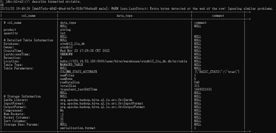
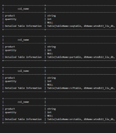
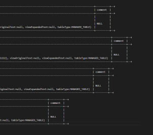
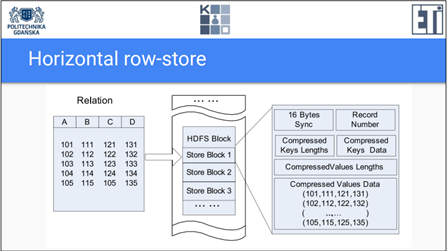
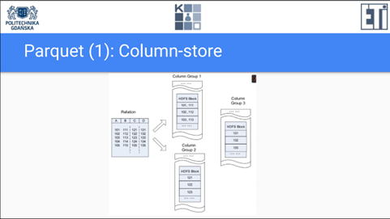
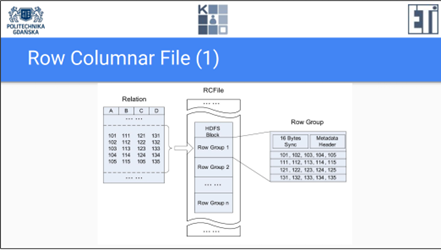
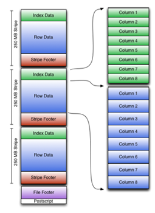

# Hive Operations

1. [连接](#连接)
2. [学校练习备注-便于理解](#学校练习备注-便于理解)
3. [数据库](#数据库)
   1. [创建数据库](#创建数据库)
   2. [使用指定数据库](#使用指定数据库)
   3. [删除数据库](#删除数据库)
   4. [表](#表)
      1. [删除表](#删除表)
      2. [修改](#修改)
      3. [显示所有表或数据库](#显示所有表或数据库)
      4. [Create internal table:](#create-internal-table)
         1. [复杂类型](#复杂类型)
         2. [跳过第一行](#跳过第一行)
      5. [加载数据](#加载数据)
      6. [create external table:](#create-external-table)
      7. [DESCRIBE - Display the description of newly created table:](#describe---display-the-description-of-newly-created-table)
      8. [drop](#drop)
      9. [文件夹变化](#文件夹变化)
      10. [各种storing type](#各种storing-type)
          1. [TEXTFILE SEQUENCEFILE ORC PARQUET RCFILE](#textfile-sequencefile-orc-parquet-rcfile)
          2. [AVRO](#avro)
4. [Complex data type](#complex-data-type)
   1. [create table](#create-table)
   2. [select data](#select-data)
      1. [完整案例](#完整案例)
5. [partitioning and bucketing](#partitioning-and-bucketing)
   1. [partitioning](#partitioning)
      1. [show](#show)
      2. [static partitioning](#static-partitioning)
      3. [dynamic partitioning](#dynamic-partitioning)
   2. [bucketing](#bucketing)
   3. [文件夹比较](#文件夹比较)
6. [数据仓库案例](#数据仓库案例)
   1. [external + static](#external--static)
   2. [select struct](#select-struct)


## 连接
```bash
$ ssh atndb13@153.19.52.196
$ beeline
beeline> !connect jdbc:hive2://
Connecting to jdbc:hive2://
Enter username for jdbc:hive2://: atndb13
Enter password for jdbc:hive2://: ****** (AT-NDB)
```

## 学校练习备注-便于理解
```
username: atndb13
password:AT-NDB

client位置：/home/atndb13
数据库名称:atndb13_liu_db
数据仓库路径: /user/hive/warehouse/atndb13_liu_db.db
数据仓库外部数据库路径: /user/Liu/database (自定义位置)
CopyFromLocal位置: /user/Liu（自定义位置）
```
[copyFromLocal](../Hadoop/BasicOperations.md)

## 数据库
其实就是一文件夹
### 创建数据库
```bash
create database atndb13_liu_db;
```

### 使用指定数据库
```
0: jdbc:hive2://> use atndb13_liu_db;
```

### 删除数据库
```bash
drop database xxx cascade;
```

### 表

#### 删除表
```bash
drop table xxx;
```
删除所有表见上面的删除数据库。

#### 修改
```sql
ALTER TABLE employee RENAME TO emp;

ALTER TABLE table_name CHANGE
[CLOUMN] col_old_name col_new_name column_type
[CONMMENT col_conmment]
[FIRST|AFTER column_name];
--比如
alter table junk_chat_ext change is_customer_service_called is_call_service_needed boolean;
```

#### 显示所有表或数据库
```bash
# Check if there are any tables created:
show tables;
show databases;
```
#### Create internal table:
```bash
create table if not exists simpletable(Number int)
stored as textfile;
```

##### 复杂类型
[Complex see below](#complex-data-type)

##### 跳过第一行
[dynamic partitioning](#dynamic-partitioning)

#### 加载数据
**也可以加载对应存储形式的二进制文件，比如sequencefile，avro等**
```bash
# overwirte 可以去掉，如果要append模式的话
load data local inpath ‘simpleTableContent.txt’
overwrite into table prostatabela;
```

多列以及分隔符
```bash
create table tb 
(
    name1 int,
    name2 string
)
row format delimited
    fields terminated by '|'
stored as textfile;
```

#### create external table:
```bash
create external table simpleexternaltable(Numberint)
location ‘hdfs:///user/[login]/database’;
```
#### DESCRIBE - Display the description of newly created table:
```bash
describe simpletable;
describe formatted simpletable;
describe extended simpletable;
```
#### drop
```bash
drop table simpletable;
```

#### 文件夹变化
创建表后
`/user/hive/warehouse/atndb13_liu_db` 会出现以表名为名的文件夹

加入数据后，
该问价夹下还会出现子文件。

#### 各种storing type
##### TEXTFILE SEQUENCEFILE ORC PARQUET RCFILE
``` 
STORED AS TEXTFILE
STORED AS SEQUENCEFILE
STORED AS ORC
STORED AS PARQUET
STORED AS RCFILE
```

After using `describe extended [table]` and `describe formatted table`, the output is almost same between SEQUENCEFILE ORC PARQUET RCFILE.



 


But of course, they have different structures.

But of course, they have different structures.
1.	Sequencefile: 
Horizontal row-store. 
Divide into block. Have its own structure depend on compress configuration.

2.	Parquet: 
Column-store. Group columns then store block as column.

3.	RCfile: 
row column file. Group rows then store as block.

4.	ORC: 
column-oriented. 
Divide into stripes. Each stripe includes an index, data, and Footer. The index stores the maximum/minimum values of each column and the position of each row in the column.


##### AVRO
Create table for storing data in AVRO:
```bash
CREATE TABLE doctors
ROW FORMAT
SERDE 'org.apache.hadoop.hive.serde2.avro.AvroSerDe'
STORED AS
INPUTFORMAT
'org.apache.hadoop.hive.ql.io.avro.AvroContainerInputFormat'
OUTPUTFORMAT
'org.apache.hadoop.hive.ql.io.avro.AvroContainerOutputFormat'
TBLPROPERTIES ('avro.schema.literal'='{
"namespace": "testing.hive.avro.serde",
"name": "doctors",
"type": "record",
"fields": [
{
"name":"number",
"type":"int",
"doc":"Order of playing the role"
},
{
"name":"first_name",
"type":"string",
"doc":"first name of actor playing role"
},
{
"name":"last_name",
"type":"string",
"doc":"last name of actor playing role"
},
{
"name":"extra_field",
"type":"string",
"doc:":"an extra field not in the original file",
"default":"fishfingers and custard"
}
]
}');
```

## Complex data type

**注意：**
1. Collection items 指的是elements in arrays or structures or uniontype
2. uniontype 目前不怎么支持，在各种语句中基本无法使用，也不能提取值也不能比较

### create table
```bash
CREATE TABLE employee(name string, work_place ARRAY<string>,
sex_age STRUCT<sex:string,age:int>, skills_score MAP<string,int>,
depart_title MAP<string,ARRAY<string>>)
ROW FORMAT DELIMITED
FIELDS TERMINATED BY '|'
COLLECTION ITEMS TERMINATED BY ','
MAP KEYS TERMINATED BY ':';

create table companies (company STRING, city STRING, props
MAP<STRING,STRING>)
ROW FORMAT DELIMITED
FIELDS TERMINATED BY ','
COLLECTION ITEMS TERMINATED BY '#'
MAP KEYS TERMINATED BY '@'
STORED AS TEXTFILE;
```


### select data
```
SELECT s.*, c.city FROM companies c JOIN sales s ON c.company = s.company;

SELECT s.*, c.props['wlasciciel'] FROM companies c JOIN sales s ON c.company = s.company;
```

#### 完整案例
```
create table sales (wh DATE, company STRING, value DOUBLE) ROW
FORMAT DELIMITED FIELDS TERMINATED BY ',' STORED AS TEXTFILE;

LOAD DATA LOCAL INPATH 'SampleData.txt' INTO TABLE sales;

create table companies (company STRING, city STRING, form
STRING) ROW FORMAT DELIMITED FIELDS TERMINATED BY ',' STORED AS
TEXTFILE;

LOAD DATA LOCAL  INPATH 'SampleData2.txt' OVERWRITE INTO
TABLE companies;

SELECT s.*, c.city FROM companies c JOIN sales s ON c.company =
s.company;

create table companies (company STRING, city STRING, props
MAP<STRING,STRING>)
ROW FORMAT DELIMITED
FIELDS TERMINATED BY ','
COLLECTION ITEMS TERMINATED BY '#'
MAP KEYS TERMINATED BY '@'
STORED AS TEXTFILE;

LOAD DATA LOCAL INPATH 'SampleData3.txt' OVERWRITE INTO
TABLE companies;

SELECT s.*, c.props['wlasciciel'] FROM companies c JOIN sales s
ON c.company = s.company;
```

SampleData.txt
```
2017-10-01,antracyt,205.03
2017-10-02,antracyt,229.20
2017-10-03,antracyt,13.73
2017-10-04,antracyt,17.73
2017-10-01,magnetyt,118.42
2017-10-02,magnetyt,215.12
2017-10-03,magnetyt,76.12
2017-10-04,magnetyt,89.62
2017-10-05,magnetyt,57.82
2017-10-06,magnetyt,89.22
2017-10-07,magnetyt,132.52
2017-10-08,magnetyt,43.02
2017-10-09,magnetyt,55.12
2017-10-10,magnetyt,77.72
2017-10-04,chalkopiryt,98.61
2017-10-05,chalkopiryt,75.81
2017-10-06,chalkopiryt,99.21
2017-10-07,chalkopiryt,315.21
2017-10-08,chalkopiryt,34.11
2017-10-09,chalkopiryt,55.71
```

SampleData2.txt
```
antracyt,Gdynia,sp. z o.o.
magnetyt,Warszawa,sp. z o.o.
chalkopiryt,Warszawa,S.A.
```

SampleData3.txt
```
antracyt,Gdynia,forma@sp. z o.o.#obrot@umiarkowany
magnetyt,Warszawa,forma@sp. z o.o.#wlasciciel@Janina Kowalska
chalkopiryt,Warszawa,forma@S.A.#wlasciciel@Jason Unlimited#obrot@ogromny

```

## partitioning and bucketing
### partitioning
#### show
`show partitions tableName;`
#### static partitioning
```bash
CREATE TABLE partitioned_test_managed(
empId INT,
firstname STRING,
lastname STRING,
city STRING,
mobile STRING)
PARTITIONED BY (yearofexperience INT)
ROW FORMAT DELIMITED
FIELDS TERMINATED BY ','
LINES TERMINATED BY '\n'
STORED as TEXTFILE;

#加载数据
LOAD DATA LOCAL INPATH ‘./employees_P.txt’ INTO TABLE
partitioned_test_managed PARTITION (yearofexperience=3);
```
#### dynamic partitioning
```bash
set hive.exec.dynamic.partition=true;
set hive.exec.dynamic.partition.mode=nonstrict;
```

```bash
# 先创建没有partition的table
CREATE TABLE partitioned_test_managed_temp(
empId INT,
firstname STRING,
lastname STRING,
city STRING,
mobile STRING,
yearofexperience INT)
ROW FORMAT DELIMITED
FIELDS TERMINATED BY ','
LINES TERMINATED BY '\n'
STORED as TEXTFILE;

ALTER TABLE partitioned_test_managed_temp SET TBLPROPERTIES ("skip.header.line.count"="1");

# 创建partition的
CREATE TABLE partitioned_test_managed_DP(
empId INT,
firstname STRING,
lastname STRING,
city STRING,
mobile STRING)
PARTITIONED BY (yearofexperience INT)
ROW FORMAT DELIMITED
FIELDS TERMINATED BY ','
LINES TERMINATED BY '\n'
STORED as TEXTFILE;

# 加载数据
INSERT OVERWRITE TABLE partitioned_test_managed_dp
partition(yearofexperience)
SELECT empId,firstname,lastname,city,mobile, yearofexperience FROM
partitioned_test_managed_temp;
```

### bucketing
```bash
SET hive.enforce.bucketing = true;
```

```bash
# 创建表格
CREATE TABLE partitioned_test_managed_PC(
empId INT,
firstname STRING,
lastname STRING,
mobile STRING,yearofexperience INT)
PARTITIONED BY (city STRING)
CLUSTERED BY (yearofexperience) INTO 3 buckets
ROW FORMAT DELIMITED
FIELDS TERMINATED BY ','
LINES TERMINATED BY '\n'
STORED as TEXTFILE;

# 加载数据
INSERT OVERWRITE TABLE partitioned_test_managed_pc
partition(city)
SELECT empId,firstname,lastname,city,mobile, yearofexperience FROM
partitioned_test_managed_temp;
```

### 文件夹比较
partition 出现子文件夹，每个子文件夹一个文件。

partition + bucket 出现子文件夹，每个文件夹下均分bucket文件。


## 数据仓库案例
### external + static
### select struct
[Hive_DataWarehouse_Example](Hive_DataWarehouse_Example.md)