# KeyValueDatabase_Redis

1. [理论](#理论)
   1. [解决哈希冲突](#解决哈希冲突)
   2. [黑盒和灰盒](#黑盒和灰盒)
      1. [黑盒](#黑盒)
      2. [灰盒](#灰盒)
   3. [使用场景](#使用场景)
   4. [Redis理论](#redis理论)
   5. [架构](#架构)
   6. [Replication](#replication)
   7. [集群](#集群)
   8. [持久化](#持久化)
      1. [RDB (Redis Database)](#rdb-redis-database)
      2. [AOF (Append-Only File)](#aof-append-only-file)
   9. [Keys](#keys)
   10. [哈希槽](#哈希槽)
2. [Redis实操](#redis实操)
   1. [docker 运行Redis](#docker-运行redis)
   2. [语法](#语法)
      1. [基础](#基础)
      2. [KEYS](#keys-1)
      3. [SCAN](#scan)
      4. [SET](#set)
      5. [List](#list)
      6. [哈希表 hash](#哈希表-hash)
      7. [集合set](#集合set)
         1. [Sadd](#sadd)
         2. [Sunion](#sunion)
         3. [集合的其他命令](#集合的其他命令)
      8. [有序集合sorted](#有序集合sorted)
      9. [HyperLogLog 基数](#hyperloglog-基数)
         1. [什么是基数](#什么是基数)
         2. [命令](#命令)
      10. [MEMORY](#memory)
      11. [其他](#其他)
   3. [Pub/Sub 发布和订阅](#pubsub-发布和订阅)
   4. [Stream](#stream)
   5. [Cluster 及 docker使用cluster](#cluster-及-docker使用cluster)
   6. [Other features](#other-features)
3. [Redis的简单应用 - 超卖](#redis的简单应用---超卖)

## 理论
在经典的键值数据库中，数据库存储由键标识的值。 **数据库无法解释值的内容（它只存储和返回它）**。与任何非关系数据库一样，键值数据库专注于horizontal scaling。 通常通过使用**散列函数**来实现**跨多个服务器**的值的有效分配。

Typical operations in the key-value database are: 
* insert (overwrite), 
* retrieve
* delete.

### 解决哈希冲突
1. 计算备用地址
2. use buckets
3. Any other technique that allows for storing conflicting values and retrieving them in a reasonable time.

### 黑盒和灰盒
#### 黑盒
数据库无法解释值的内容（它只存储和返回它）。 这意味着**一个值可以是任何类型**，但也只能通过指定存储它的键来检索一个值。 
数据库不会尝试识别存储值的结构：因此
1. 无法使用其内容（或部分内容）搜索值，
2. 并且无法编辑存储值（添加其他内容，删除 / 更改值的选定部分）
3. 一个值只能通过用一个新值覆盖它来改变。

#### 灰盒
Redis不算是完全的key-value数据库，它不是黑盒，是灰盒 （它知道里面是啥）

### 使用场景
1. 键值数据库使用的一个例子是存储用户会话：在 Web 应用程序中，可能有大量用户，每个用户都有分配给其会话的信息，并且通常一起访问。 同时，不同用户的会话之间没有依赖关系。
2. 对于在线商店，键值数据库的使用值得考虑。 鉴于商店的高流量并假设大部分购物篮将被丢弃（最终不会进行购买），让关系数据库负担记住购物篮的内容似乎是不必要的。

### Redis理论
1. Redis 是一种数据库，将数据存储在**内存**中，但为了持久化，可以将其写入磁盘。
1. 如果选择不将数据写入磁盘，则数据库可以用作网络缓存。
2. Redis 还具有消息代理功能。
3. Redis 能够解释和修改值的内容，尽管访问总是通过键完成。
4. 它还具有分布式和高可用性等所有非关系型数据库的特性

### 架构
Redis 充当 Web 服务器。 可以是一台机器/多台机器。
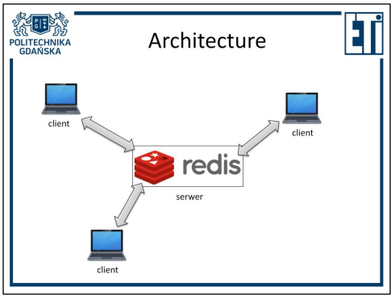 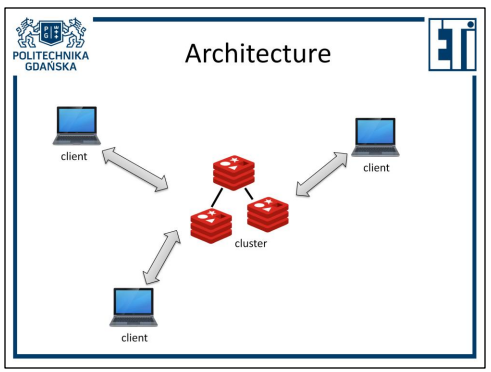

### Replication
如果您使用多台服务器，则可以选择复制。 在复制中，有一个主节点（服务器），与主节点存储相同数据的从节点（副本）连接到该主节点（服务器）。

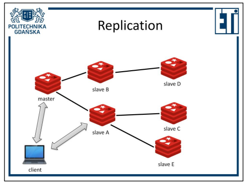

In such a configuration, in the event of a failure of the master node, the database will  have only slave nodes until the administrator's intervention. Synchronization is  asynchronous by default, but WAIT command will force replica synchronization.
**It is possible to write to replicas, but such entries will not be duplicated to any other  node (even to replicas connected to the one to which the value was written). Moreover, such a value can be deleted from the replica at any time.**

### 集群
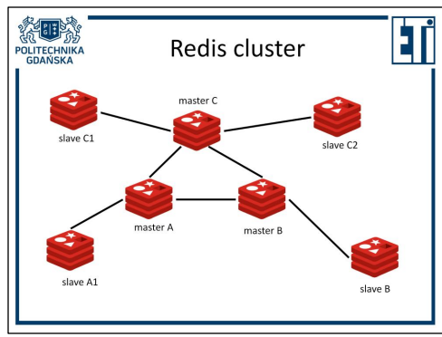

更高级的选项是 Redis 集群。 它不仅允许数据的复制（replication），还**允许数据在不同节点（多个主节点）之间的分布**。

1. 如果此配置中的一个主要节点丢失，这样一个节点的**副本会自动提升为主节点**。
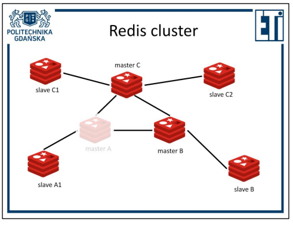 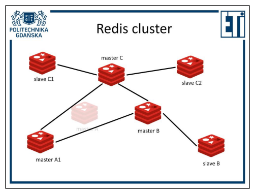

2. 如果每个主节点的副本数相差一个以上，副本会自动重新平衡（迁移）。
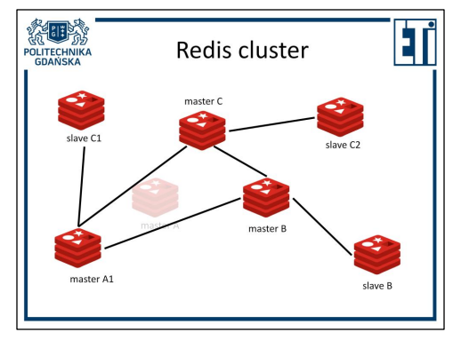

在 Redis 集群的情况下，大多数对多个键的操作只有在所有键都在一个节点上时才会执行（例如 SUNION）。 然而，这个问题受到哈希标签机制的限制。 多亏了这种机制，您可以控制值集将转到哪个哈希槽。 所有在大括号 ({}) 中具有相同键子字符串的值都将分配给相同的哈希槽。
在 Redis 集群中，节点数可能会在集群运行时发生变化。

### 持久化
#### RDB (Redis Database)
1. Periodical snapshot of the database saved to disc
2. RDB:
   1. compact
   2. easy to use for backups
   3. snapshot intervals provide window for data loss
   4. uses fork() for to create snapshopts, can be time consuming for big data

创建备份时的易用性源于您只需要复制一个最新的文件。
长时间拍摄快照可能会导致数据库暂时停止响应查询。

#### AOF (Append-Only File)
1. Every operation changing state of database data written to the end of a log file
2. Periodically log file is compacted （similar to RDB process）
3. Three different appendfsync policies: always, everysec, no
   * bigger file than RDB
   * impact on performance based on appendfsync
   * greater room for error

写入应该与未选择 appendfsync 策略的 RDB 一样快。
everysec 是默认策略，仍然提供良好的性能（如果在给定时刻没有同步，新的写入不会延迟）。

### Keys
1. 不支持复杂key，
2. 二进制安全字符串可以，比如text, png file。
3. 最大512MB
4. 分隔符制作keys structure，比如`user:1000:subscribed.to`。分隔符只是一种命名约定，方便阅读，对 Redis 处理键的方式没有影响（哈希标签除外）。
5. 避免太长和太短的key。要容易读。
6. 遵循命名模式简化了数据库操作。
7. Hash tags 可以 使Key在一个 hash slot里。`{user:1000}:name`和`{user:1000}:surname`
   * 创建密钥的建议。
   * 对于示例中的两个键，您必须输入整个键才能获取值，但只有哈希标签（“user:1000”）将决定为哪个哈希槽（以及因此哪个主节点）分配这些值。
   * 哈希槽是第一个`{`和第一个`}`之间的内容别管里面是什么。

### 哈希槽
一个cluster有16384个hash slots，然后redis会根据数据量之类的考量将哈希槽分配到不同节点。


## Redis实操

### docker 运行Redis
[【愚公系列】2022年05月 Docker容器 Windows11上Redis的安装 - 腾讯云开发者社区-腾讯云](https://cloud.tencent.com/developer/article/1990739)

* 绑定挂载
1. 设置配置文件
在E盘创建两个文件夹：
conf目录用于挂载配置文件
data目录用于存放数据持久化文件
在conf文件夹新建reids.conf文件，内容如下
```
#用守护线程的方式启动
daemonize no 
#给redis设置密码
#requirepass 000000 
#redis持久化　　默认是no  开启默认的模型时AOF
appendonly yes
#防止出现远程主机强迫关闭了一个现有的连接的错误 默认是300
tcp-keepalive 300 
```

2. 命令启动
由于没有执行`docker pull redis`命令，这里会自动执行
```cmd
docker run --name redis -p 6379:6379 -v /E/Redis/conf:/etc/redis -v /E/Redis/conf/redis.conf:/etc/redis/redis.conf -v /E/Redis/data:/data/ -d redis:latest redis-server /etc/redis/redis.conf ::--appendonly yes
```

参数说明
* –name="容器新名字"：为容器指定一个名称
* -p: 指定端口映射，格式为：主机(宿主)端口:容器端口
* -d: 后台运行容器，并返回容器ID
* -v /D/docker/redis/conf/redis.conf:/etc/redis/redis_6379.conf 把宿主机配置好的redis.conf放到容器内的这个位置中
* -v /D/docker/redis/data:/data/ 把redis持久化的数据在宿主机内显示，做数据备份

1. 操作
   1. 直接在docker desktop软件的terminal里操作
        ```
        redis-cli
        ```
   2. 自己的控制台
        ```
        docker exec -it redis redis-cli
        ...
        set name "愚公"
        get name
        ...
        ```

### 语法

#### 基础
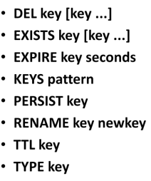 
* DEL - 删除密钥 
* EXISTS - 检查密钥是否存在 
* EXPIRE - 设置密钥生命周期 
* KEYS - 查找匹配模式的密钥 
* PERSIST - 设置无限密钥生命周期 
* RENAME - 更改密钥名称 
* TTL - 检查密钥的剩余时间 life 
* TYPE - 检查分配给键的数据类型
* DBSIZE - 返沪数据库大小
* flushall - 清空数据库

#### KEYS 
KEYS* - 用正则表达式返回所有匹配key，比如`KEYS key[xyz]`返回`keyx/keyy/keyz`

#### SCAN
SCAN 0 MATCH key* COUNT 5
1. 从0开始设游标，进行扫描，匹配正则，返回5个
2. 不会真返回5个，有些key在一个slot里
3. 返回两中参数，第一个是让你从下一个继续扫描，第二个是返回的所有key
4. 最多一次性返回10个


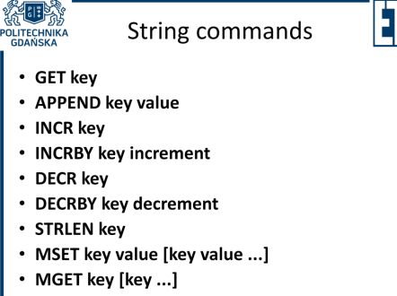

#### SET
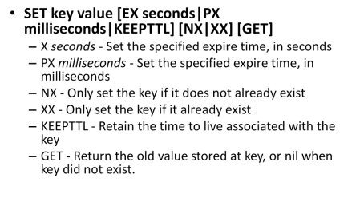
如果密钥已经存在并且设置了生命周期，则 KEEPTTL 选项将保持生命周期设置不变，而不是更改为无限时间（默认行为）

* SETNX = SET key value NX
* GET - 获取值 
* APPEND - 在末尾添加 
* INCR - 将值增加 1 
* INCRBY - 将值增加一个整数
* INCRBYFLOAT - 增加浮点数
* DECR - 将值减少 1 
* DECRBY - 将值减少一个整数 
* STLEN - 检查字符串的长度 
* MSET - 设置多个键 - 值对 
* MGET - 获取多个值

#### List
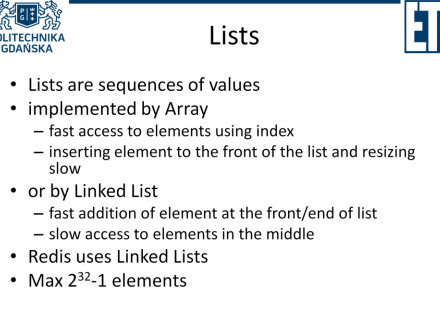
实现列表的可能方法是数组或链表。  Redis 使用链表。

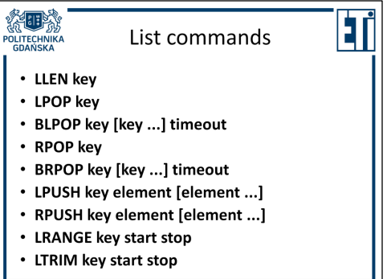
* LLEN - 列表的长度
* LPOP - 获取左侧的项目并将其删除
* BLPOP - 获取左边的元素并将其删除，阻塞（如果在给定时刻列表中没有元素，它将等待添加一个元素）
* RPOP - 获取右边的项目并删除它
* BRPOP - 同上，阻塞
* LPUSH - 从左边添加元素
* RPUSH - 从右边添加项目
* LRANGE - 从给定范围内获取元素（不删除）
* LTRIM - 从范围之外删除项目
* LRANGE mylist 0 -1 - 返回元素，**不能用GET**
* LPOS mylist a RANK -2 COUNT 2 - 返回倒数第二和第三的a的位置

#### 哈希表 hash
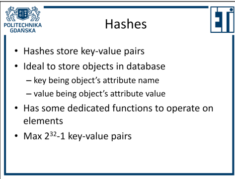
Hash或Hash maps非常适合存储对象（在对编程语言的理解中）。 对象属性的名称可以存储在键下，属性的值可以存储在值下。

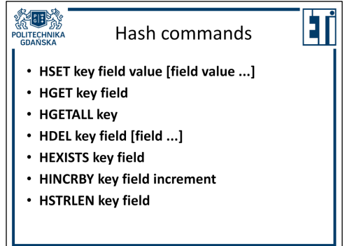
* HSET - 在给定的哈希图中设置多个字段
* HGET - 获取所选字段的值
* HGETALL - 获取所有字段值对
* HDEL - 删除指定的字段
* HEXISTS - 检查字段是否存在
* HINCRBY - 将字段的值增加
* HSTRLEN - 检查作为字段值的字符串的长度

#### 集合set
##### Sadd
Redis Sadd 命令将一个或多个成员元素加入到集合中，已经存在于集合的成员元素将被忽略。

假如集合 key 不存在，则创建一个只包含添加的元素作成员的集合。

当集合 key 不是集合类型时，返回一个错误。

注意：在 Redis2.4 版本以前， SADD 只接受单个成员值。
```bash
redis 127.0.0.1:6379> SADD KEY_NAME VALUE1..VALUEN
------------------
redis 127.0.0.1:6379> SADD myset "hello"
(integer) 1
redis 127.0.0.1:6379> SADD myset "foo"
(integer) 1
redis 127.0.0.1:6379> SADD myset "hello"
(integer) 0
redis 127.0.0.1:6379> SMEMBERS myset
1) "hello"
2) "foo"
```

##### Sunion
Redis Sunion 命令返回给定集合的并集。不存在的集合 key 被视为空集。
```bash
redis 127.0.0.1:6379> SUNION KEY KEY1..KEYN
------------------------
redis> SADD key1 "a"
(integer) 1
redis> SADD key1 "b"
(integer) 1
redis> SADD key1 "c"
(integer) 1
redis> SADD key2 "c"
(integer) 1
redis> SADD key2 "d"
(integer) 1
redis> SADD key2 "e"
(integer) 1
redis> SUNION key1 key2
1) "a"
2) "c"
3) "b"
4) "e"
5) "d"
redis> 
```

##### 集合的其他命令
1. SISMEMBER myset d - d是不是myset的元素
2. SMEMBERS myset - 返回所有元素
3. SREM myset value -  去掉
4. SPOP myset - 随机去掉
5. SUNIONSTORE sumset set1 (set2...) - 将几个集合并集并保存扫sumset
6. SCARD myset - 返回数量

#### 有序集合sorted
1. ZADD my.sorted.set 0 john 1 clara 2 ivona 3 bob 4 michel
2. ZRANGE my.sorted.set 0 -1 --elements returned according to the score (lowest to highest)
3. ZRANGE my.sorted.set 0 -1 WITHSCORES -- 连分数一起返回
4. ZRANK my.sorted.set ivona
5. ZADD my.sorted.set INCR 3 ivona --ivona’s score increased by 3 (to 5)
6. ZINCRBY my.sorted.set 1 ivona --ivona’s score increased by 1 (to 6)
7. ZRANGE my.sorted.set 0 -1
8. ZRANGEBYSCORE my.sorted.set 2 4 --elements with scores in the range are returned
9. ZADD second.sorted.set 0 Tom 0 Alice 0 Frank 0 Bob 0 Clara
10. ZRANGE second.sorted.set 0 -1 --if all elements have identical score, they are sorted alphabetically
11. ZRANGEBYLEX second.sorted.set - + --all values
12. ZRANGEBYLEX second.sorted.set (A [F --from A excluding to F including (why is Frank missing? 因为F在Frank前面)
13. ZCARD second.sorted.set
14. ZREM second.sorted.set A F
15. ZCARD second.sorted.set
16. ZRANGEBYSCORE sortie -inf 40

#### HyperLogLog 基数

Redis 在 2.8.9 版本添加了 HyperLogLog 结构。

Redis HyperLogLog 是用来做基数统计的算法，HyperLogLog 的优点是，在输入元素的数量或者体积非常非常大时，计算基数所需的空间总是固定 的、并且是很小的。

在 Redis 里面，每个 HyperLogLog 键只需要花费 12 KB 内存，就可以计算接近 2^64 个不同元素的基 数。这和计算基数时，元素越多耗费内存就越多的集合形成鲜明对比。

但是，因为 HyperLogLog 只会根据输入元素来计算基数，而不会储存输入元素本身，所以 HyperLogLog 不能像集合那样，返回输入的各个元素。
##### 什么是基数
{1，2，3，4，5，5} 基数就是不重复的数量，即5个

##### 命令
1. PFADD myHyperLogLog a c d b a g d h s a d j f w h l w f n a s p w t c n m --adding elements to hyperloglog
2. PFCOUNT myHyperLogLog --retrieving number of elements 但只返回了14, 所以是近似基数
3. SADD checking a c d b a g d h s a d j f w h l w f n a s p w t c n m
4. SCARD checking --返回了15
5. MEMORY USAGE myHyperLogLog SAMPLES 0 -- 168
6. MEMORY USAGE checking SAMPLES 0 -- 720

#### MEMORY
MRMORY USAGE key [SAMPLES count]

MEMORY USAGE 命令给出一个 key 和它的值在 RAM 中所占用的字节数。

返回的结果是 key 的值以及为管理该 key 分配的内存总字节数。

对于嵌套数据类型，可以使用选项 SAMPLES，其中 count 表示抽样的元素个数，默认值为 5 。**当需要抽样所有元素时，使用 SAMPLES 0**。

#### 其他
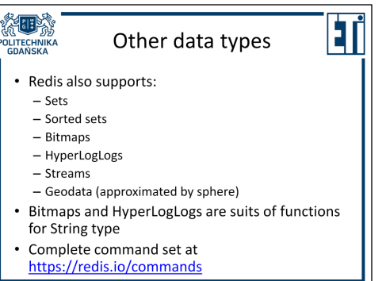


### Pub/Sub 发布和订阅
Redis 还允许您订阅频道（您也可以取消订阅）。 通过注册，从订阅的那一刻起发送到频道的每条消息都将发送给订阅的用户。
* `SUBSCRIBE channel [channel...]`
* `UNSUBSCRIBE [channel [channel...]]`
* `PUBLISH channel message`

第一个`redis-cli`:
```bash
redis 127.0.0.1:6379> SUBSCRIBE runoobChat

Reading messages... (press Ctrl-C to quit)
1) "subscribe"
2) "runoobChat"
3) (integer) 1
```

第二个`redis-cli`:
```bash
redis 127.0.0.1:6379> PUBLISH runoobChat "Redis PUBLISH test"

(integer) 1

redis 127.0.0.1:6379> PUBLISH runoobChat "Learn redis by runoob.com"

(integer) 1
```

第一个客户端会继续显示新的信息。

### Stream
* XACK 清除当前组的这个信息，其他组不影响
* 每个consumer的 `0` 消息是不一样的，决定于它读过的消息，所以当XACK一条ID为XXXX消息时，可能只影响其中一个consumer的0
* XACK不支持`0`ID
[Redis的简单应用 - 超卖](appendix/Redis的简单应用_超卖.md)

### Cluster 及 docker使用cluster
[Redis的简单应用 - 超卖](appendix/Redis的简单应用_超卖.md)
[Getting Title at 53:29](https://blog.csdn.net/qq_43753724/article/details/120397440)
注意链接中命令`-itd`没必要。`--privileged=true`必要。

### Other features
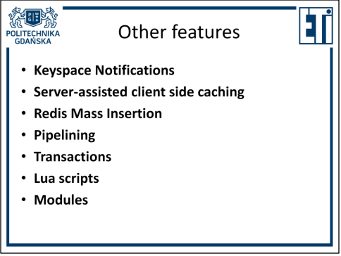

## Redis的简单应用 - 超卖
[Redis的简单应用 - 超卖](appendix/Redis的简单应用_超卖.md)