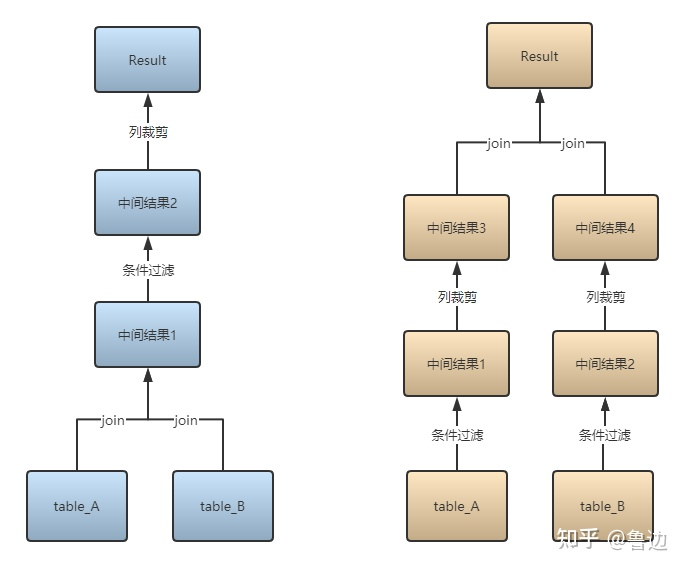
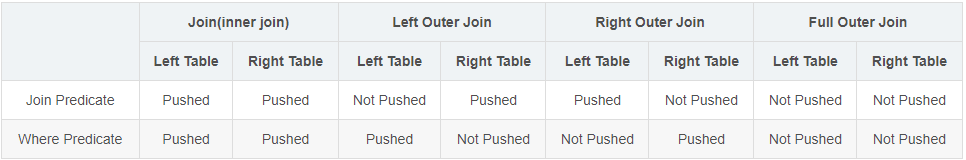

# 数据库其他知识积累

- [ACID](#acid)
- [谓词下推 predicate pushdown](#谓词下推-predicate-pushdown)
  - [hive里](#hive里)


## ACID
ACID，是指数据库管理系统（DBMS）在写入或更新资料的过程中，为保证**事务（transaction）**是正确可靠的，所必须具备的四个特性：原子性（atomicity，或称不可分割性）、一致性（consistency）、隔离性（isolation，又称独立性）、持久性（durability）。

[谈谈数据库的ACID - 随心勿欲 - 博客园](https://www.cnblogs.com/lichunyang321/p/9594196.html)

1. Atomicity
   原子性是指事务是一个不可再分割的工作单位，事务中的操作要么都发生，要么都不发生。
2. Consistency
   一致性是指在事务开始之前和事务结束以后，数据库的完整性约束没有被破坏。这是说数据库事务不能破坏关系数据的完整性以及业务逻辑上的一致性。
3. Isolation
   多个事务并发访问时，事务之间是隔离的，一个事务不应该影响其它事务运行效果。

   这指的是在并发环境中，当不同的事务同时操纵相同的数据时，每个事务都有各自的完整数据空间。由并发事务所做的修改必须与任何其他并发事务所做的修改隔离。事务查看数据更新时，数据所处的状态要么是另一事务修改它之前的状态，要么是另一事务修改它之后的状态，事务不会查看到中间状态的数据。

   在Windows中，如果多个进程对同一个文件进行修改是不允许的，Windows通过这种方式来保证不同进程的隔离性。
   1. 事务之间的相互影响 (T transaction)
      - dirty read : 
        - T2回滚读, T1到了回滚前的T2
      - read non-repeatable 不可重复读 : 
        - T2**修改或删除**了查询结果集中的某一**行数据**，T1两次读发现不一样 
        - 需要锁一些行
      - phantom read 幻读 : 
        - T2**插入或删除**了查询**范围**内的某些行数据 
        - 需要锁一些范围，
          - 范围指的是查询语句所涉及到的数据的范围，这个范围可以是特定的行、特定的列、特定的页或表中的所有行等。
      - lost update : 
        - 两个事务对同一数据进行修改操作时，其中一个事务的更新操作被另一个事务所覆盖，导致前一个事务的更新结果被丢失。
   2. 隔离层级
      - Read Uncommitted (解决lost update)
      - read Committed ( * + dirty read)
      - Reapeatable Read ( * + read non-repeatable) (mysql默认就是这个)
      - Serializable ( * + phantom read)
4. Durability
   持久性，意味着在事务完成以后，该事务所对数据库所作的更改便持久的保存在数据库之中，并不会被回滚。

   即使出现了任何事故比如断电等，事务一旦提交，则持久化保存在数据库中。


## 谓词下推 predicate pushdown

如图，下是table_A和table_B，即数据源头。

上是Result，即数据结果。

蓝色部分是未采用谓词下推运算过程，黄色部分是采用了谓词下推的运算过程。

理解：就像map-reduce里的map增加效率

### hive里
具体配置项是hive.optimize.ppd，默认为true，即开启谓词下推。

1. During Join predicates cannot be pushed past Preserved Row tables（ join条件过滤不能下推到保留行表中）
   1. 比如以下选择，left join中左表s1为保留行表（先扫描s1表，即以左表为基表），所以on条件（join过滤条件）不能下推到s1中
      ```sql
      select s1.key, s2.key from src s1 left join src s2 on s1.key > '2';
      ```
   2. 而s2表不是保留行，所以s2.key>2条件可以下推到s2表中：
      ```sql
      select s1.key, s2.key from src s1 left join src s2 on s2.key > '2';
      ```
2. After Join predicates cannot be pushed past Null Supplying tables（where条件过滤不能下推到NULL补充表）
   1. 比如以下选择left join的右表s2为NULL补充表所以，s1.key>2 where条件可以下推到s1：
      ```sql
      select s1.key, s2.key from src s1 left join src s2 where s1.key > '2';
      ```
   2. 而以下选择由于s2未NULL补充表所以s2.key>2过滤条件不能下推
      ```sql
      select s1.key, s2.key from src s1 left join src s2 where s2.key > '2';
      ```


总结如下：

* 对于Join(Inner Join)、Full outer Join，条件写在on后面，还是where后面，性能上面没有区别；
* 对于Left outer Join ，右侧的表写在on后面、左侧的表写在where后面，性能上有提高；
* 对于Right outer Join，左侧的表写在on后面、右侧的表写在where后面，性能上有提高；
* 当条件分散在两个表时，谓词下推可按上述结论2和3自由组合；
* 所谓下推，即谓词过滤在map端执行；所谓不下推，即谓词过滤在reduce端执行