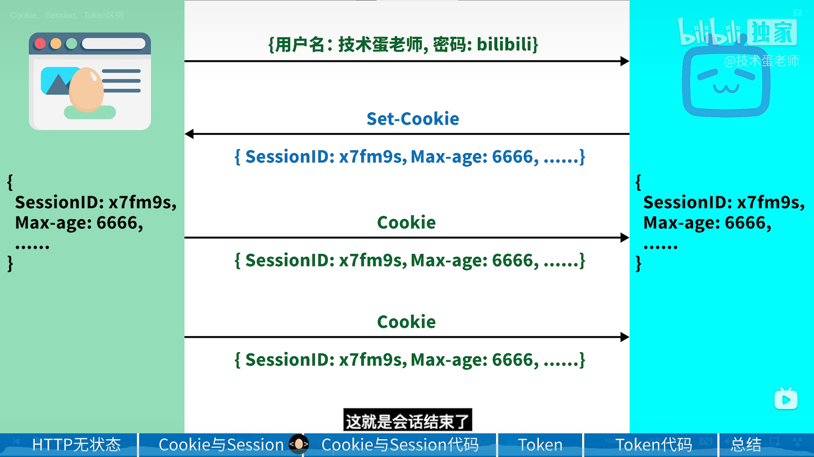
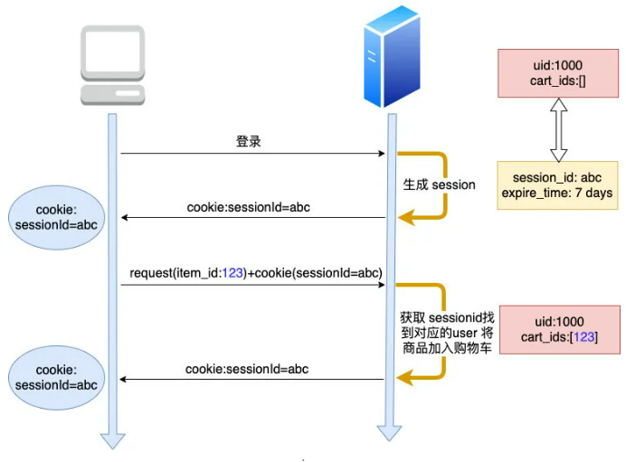
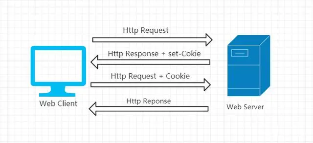
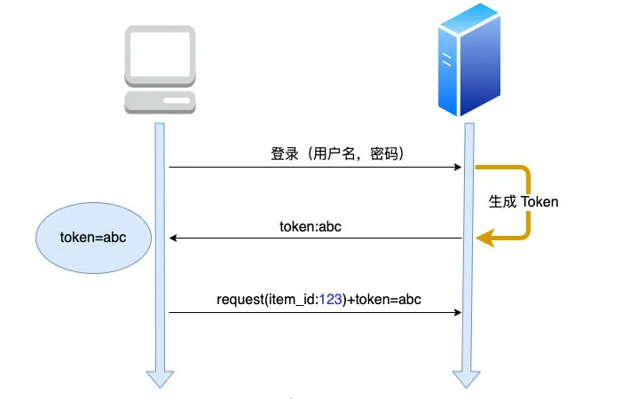
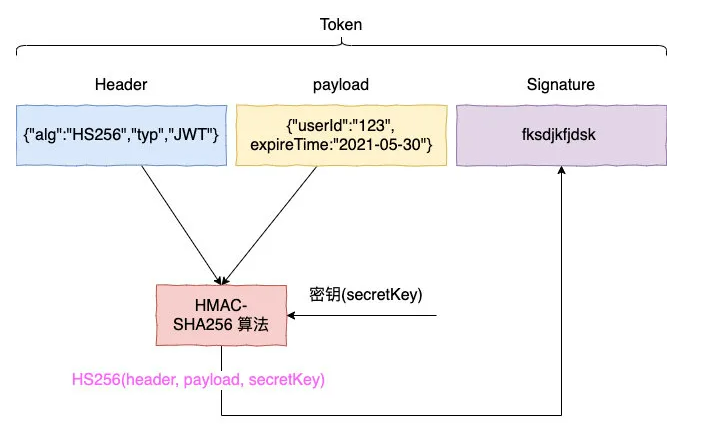
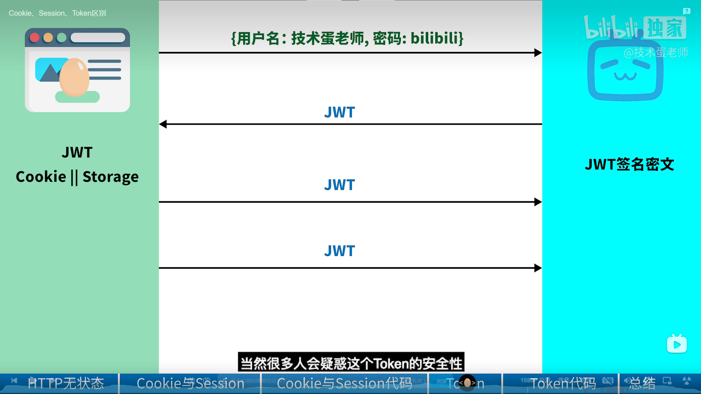

# /E:/Notes/计算机/服务器网络/cookie_session_token.md

## 起源
[cookie与session、token发展史_缀月的博客-CSDN博客](https://blog.csdn.net/weixin_50209879/article/details/128959880)

[Getting Title at 10:28](https://baijiahao.baidu.com/s?id=1705430412910145531&wfr=spider&for=pc)

服务器区分是谁发来请求 -> session -> 服务器存储辣么多，要炸了 -> token

cookie 跟另外两个人没有关西，最多可以用来存储sessionid来进行发送。

## session

## cookie

cookie 是浏览器里面能永久存储的一种数据(**key-value格式**)，仅仅是浏览器实现的一种数据存储功能。

cookie由服务器生成，发送给浏览器，浏览器把cookie以kv形式保存到某个目录下的文本文件内，下一次请求同一网站时会把该cookie发送给服务器。由于cookie是存在客户端上的，所以浏览器加入了一些限制确保cookie不会被恶意使用，同时不会占据太多磁盘空间，所以每个域的cookie数量是有限的。

## Token
token的意思是“令牌”，是服务端生成的一串**字符串**，作为客户端进行请求的一个标识。

私钥公钥，加密为token的签名部分并发送。收到时，用另一套根据密钥产生的算法进行解密。

* header：指定了签名算法
* payload：可以指定用户 id，过期时间等非敏感数据
* Signature: 签名，server 根据 header 知道它该用哪种签名算法，再用密钥根据此签名算法对 head + payload 生成签名，这样一个 token 就生成了。

### JWT
Json Web Token

