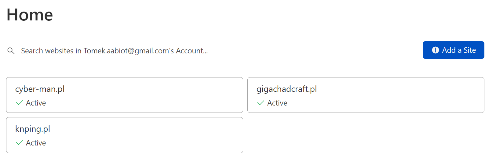
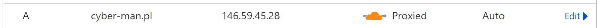

# https和http以及https的申请

https = http + SSL层

- SSL证书可以申请（有些需要收费）
  [图解如何在腾讯云上免费部署HTTPS-百度经验](https://jingyan.baidu.com/article/f0062228158dedfbd2f0c84e.html)\
  聊天记录：
    do u want to have https?
    Tomasz
    instead of http
    Tomasz
    ?
    Tomasz
    very easily
    Tomasz
    Tomasz Dąbrowski
    the best way
    你发送了
    Oh, I want
    Tomasz
    there are many ways
    Tomasz
    but imo one is besty
    Tomasz
    u want on discord?
    Tomasz
    Tomasz Dąbrowski
    me to show
    你发送了
    hmmm maybe you can just give me the key word. Because I am trying to let a game be wallpaper
    你发送了
    XXXXD
    It works but I am trying to make it better.
    Tomasz Dąbrowski 回复了你
    原始消息：
    hmmm maybe you can just give me the key word. Because I am trying to let a game be wallpaper
    i don't really get
    Tomasz
    but even if i give u clues
    Tomasz
    it might be hard for u
    Tomasz
    for the 1st time
    Tomasz
    i don't think there is any tutorial
    Tomasz
    Tomasz Dąbrowski
    on internet
    你发送了
    Yeah, thats true. Could I have discord with you tomorrow, If it is convenient?
    Tomasz
    of course
    Tomasz
    Tomasz Dąbrowski
    i can write u small tutorial
    你发送了
    Because my phone will power off
    你发送了
    I use hotspot
    Tomasz
    Tomasz Dąbrowski
    where do u have your domain registered?
    你发送了
    In China website
    你发送了
    called Tencent cloud
    你发送了
    1 Chinese yuan for 1 year because this is first time buy.
    Tomasz
    are u able
    Tomasz
    Tomasz Dąbrowski
    to change DNS servers on the domain? (also calles nameservers)
    你发送了
    Yess
    Tomasz
    ok
    Tomasz
    https://dash.cloudflare.com/sign-up
    Tomasz
    register here then
    Tomasz
    when u login:
    Tomasz
    click
    Tomasz
    Add
    Tomasz
    
    Tomasz
    Add a site
    Tomasz
    then just click through nexts
    Tomasz
    and then they tell you to change nameservers
    Tomasz
    then change them in the first domain provider
    Tomasz
    it will take about 24h-36h to change the nameservers i guess
    Tomasz
    if u done that
    Tomasz
    you can set your DNS records in cloudflare now
    Tomasz
    
    Tomasz
    and here click Proxied
    Tomasz
    Tomasz Dąbrowski
    and u have https

- https速度会下降
  
- 腾讯云可以直接申请
  
- 域名可以从不同的企业互相转（i.e. 阿里云转腾讯云）
  