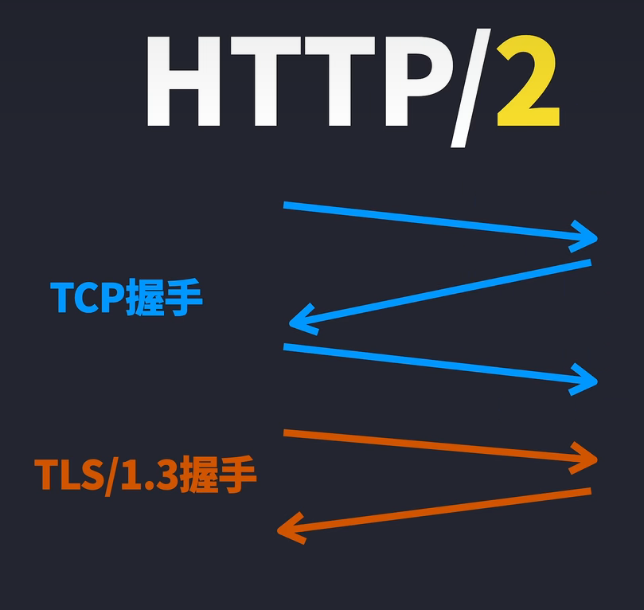
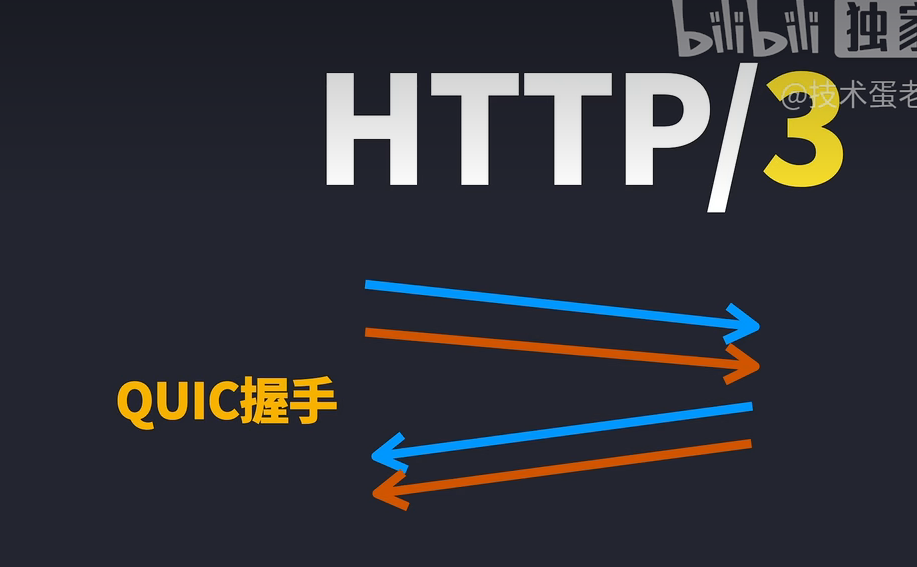

# http协议的版本

[HTTP/1.1，HTTP/2和HTTP/3的区别](https://www.bilibili.com/video/BV1vv4y1U77y/)

[长轮询连接](%E9%95%BF%E8%BD%AE%E8%AF%A2%E8%BF%9E%E6%8E%A5.md)

## http/1.1

一次一份：每次请求都需要建立一次连接，请求完毕后立即断开连接。

请求队伍里，先到先得，**后面的请求必须等待前面的请求完成后才能进行。** 比如请求html, js, css文件中有一个卡住了，后面都得等。

所以要多连接。

连接数限制导致出现了新技术：

1. 管线化：单个链接发送多个请求，顺序返回
2. 多个域名，多个域名就可以多个连接，多个连接就可以多个请求，多个请求就可以多个响应。

## http/2

把首部和实体分离，首部压缩，二进制传输，多路复用，这样就可以乱序响应，顺序返回（流的tcp顺序而已）。

多路复用：一个连接里面可以有多个请求，请求可以乱序，响应也可以乱序，但是最后还是要按照请求的顺序返回。

它会把客户端后续可能需要的资源都推送到客户端，这样就不用客户端再次请求了。

不再是TCP四次挥手了，而是TLS/1.3。



```python
import http.client

# 建立 HTTP/2 连接
conn = http.client.HTTPSConnection("example.com", port=443)

# 发送多个请求
req1 = conn.request("GET", "/endpoint1")
req2 = conn.request("POST", "/endpoint2", body="Request body")

# 获取响应
resp1 = conn.getresponse()
print("Response 1:", resp1.read().decode())

resp2 = conn.getresponse()
print("Response 2:", resp2.read().decode())

# 关闭连接
conn.close()
```

## http/3

不再是TCP握手挥手了，而是[QUIC](QUIC.md)，因为TCP三次握手太慢了。



