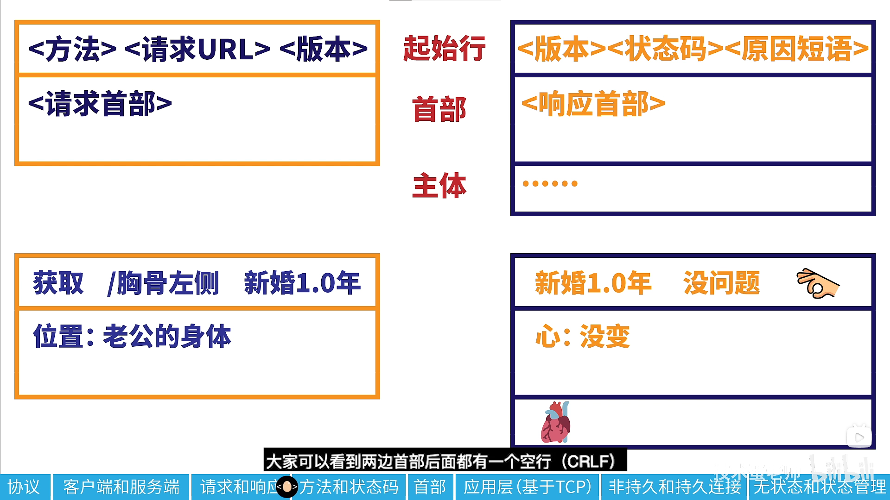
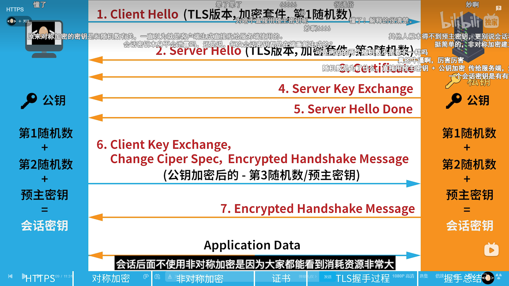

# 超文本传输协议

## http
[https://www.bilibili.com/video/BV1zb4y127JU/?spm_id_from=333.788&vd_source=6beebf17d5aa6fb3d9fb4b629d0b319a](https://www.bilibili.com/video/BV1zb4y127JU/?spm_id_from=333.788&vd_source=6beebf17d5aa6fb3d9fb4b629d0b319a)
默认端口80
### 请求和响应

空行表示首部结束

| 序号 | 方法    | 描述                                                                                                                                 |
| ---- | ------- | ------------------------------------------------------------------------------------------------------------------------------------ |
| 1    | get     | 请求指定的页面信息，并返回实体主体                                                                                                   |
| 2    | post    | 向指定资源提交数据进行处理请求（例如提交表单或者上传文件）。数据被包含在请求体中。post请求可能会导致新的资源的建立和已有资源的修改。 |
| 3    | put     | 从客户端向服务器传送的数据取代指定的文档内容                                                                                         |
| 4    | delete  | 请求服务器删除指定内容                                                                                                               |
| 5    | head    | 类似于get请求，只不过返回的响应中没有具体的内容，用于获取报头                                                                        |
| 6    | options | 允许客户端查看服务器的性能                                                                                                           |
| 7    | trace   | 回显服务器收到的请求，主要用于测试或者诊断                                                                                           |
| 8    | connect | 预留给能够连接改为管道方式的代理服务器                                                                                               |

和数据库相关
| 序号 | 方法   | 描述 |
| ---- | ------ | ---- |
| 1    | get    | 查看 |
| 2    | post   | 创建 |
| 3    | put    | 更新 |
| 4    | delete | 删除 |

### 状态码
1. 2XX 成功
2. 3XX 重定向 e.g. 304 可以使用缓存的内容
3. 4XX 客户端错误
4. 5XX 服务器错误

详细：[HTTP 状态码](https://www.runoob.com/http/http-status-codes.html)
1. 400 Bad request


### 首部
1. Content-type: 内容类型

### 持久连接和非持久连接
非持久连接：每处理完一个请求就关闭连接
持久连接：现在，没有要发送的请求了，客户端就发送 `Connection: close` 首部给服务器

### 无状态和状态管理
Cookie

## https
[https://www.bilibili.com/video/BV1KY411x7Jp/?spm_id_from=333.788&vd_source=6beebf17d5aa6fb3d9fb4b629d0b319a](https://www.bilibili.com/video/BV1KY411x7Jp/?spm_id_from=333.788&vd_source=6beebf17d5aa6fb3d9fb4b629d0b319a)
TLS/SSL : SSL是TSL的前身，现在大多只支持TSL（Transport Layer Security）

由CA（Certificate Authority）颁发证书，包含公钥。默认端口改为443。

改变：
TCP 三次握手以后


得到会话密钥之前都是非对称加密，即第三随机数，用服务器公钥加密，服务器用私钥解密

获得会话密钥后就都是对称加密了

## 上传文件
上传文件需要将form标签 的 ENCTYPE 属性设置为`multipart/form-data`属性， 与`application/x-www-form-urlencoded`类型不同， 此类型专门设计用来上传文件， 而前者用来传输数据，可以允许若干 **控件域** 同时上传其值，

每个域值使用 **boundary** 分割：
```http
###

PUT http://localhost:8082/api/characters/1/portrait
Content-Type: multipart/form-data; boundary=boundary

--boundary
Content-Disposition: form-data; name="portrait"; filename="uhlbrecht.png'

< ../../src/main/resources/pl/edu/pg/eti/kask/rpg/configuration/avatar/uhlbrecht.png
--boundary--
```
