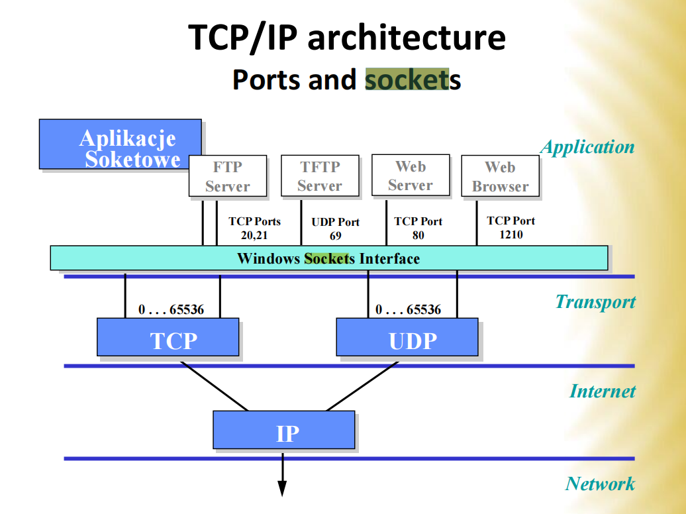

# socket

socket 
* 手机号码因为每个人都有套接字
* 物流公司因为：
  * TCP：得确认你在了再给你货
  * UDP：不管你在不在家，我给你送到了

The Internet socket is:
IP address, port number, port type.

>IP address `192.254.60.10`, port number `23`, `TCP` socket type >>> `192.254.60.10: 23 TCP`