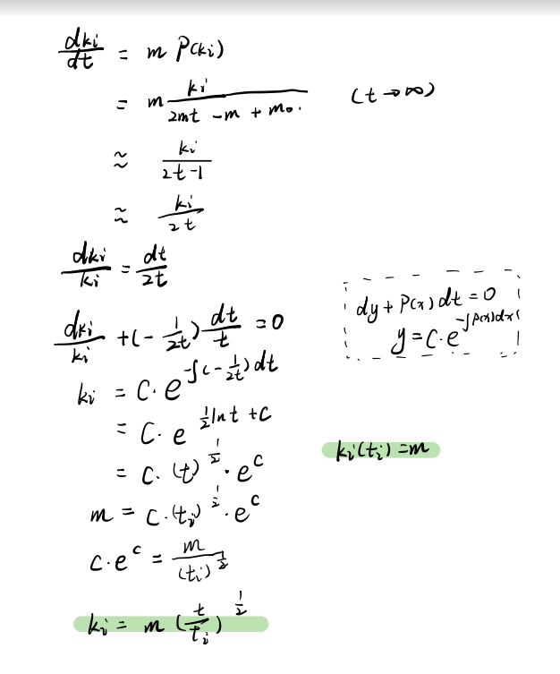
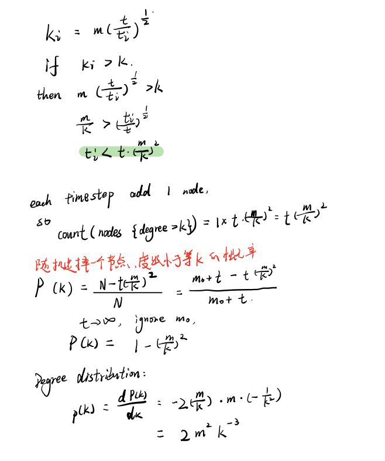

# 无标度网络
[哔哩哔哩-无标度网络模型](https://www.bilibili.com/video/BV1Dy4y1s7JN/?spm_id_from=333.337.search-card.all.click&vd_source=6beebf17d5aa6fb3d9fb4b629d0b319a)

## 定义
A scale-free network is a network whose **degree distribution follows a power law**, at least asymptotically.

遵循**幂律分布**

### 幂律分布
假设变量x服从参数为α的幂律分布，则其概率密度函数可以表示为:
$$
f(x)=cx^{-\alpha-1}, x\rightarrow\infty
$$

幂律分布在双对数坐标系上画的图形为一条直线，即$y=x^\alpha$, $\log y=\alpha \log x$

## BA无标度网络（Barabási-Albert）
[读书笔记 | 网络科学 Ch5: The Barabási-Albert Model](https://zhuanlan.zhihu.com/p/371735826)
算法：
1. 初始
   * 给定$m_0$个节点的连通网络
2. 增长
   * 每步加一个新点和m条连线 $m\leq m_0$
   * 缺增长，度分布就会变成单点分布
3. 偏好
   * 新点按概率选择旧点连接，不重复
   * 缺偏好，度分布就会变成指数分布

新节点连接到现有节点 i 的概率为
$$
P_i=\frac{k_i}{\sum_j k_j}
$$

节点i的度变量$k_i(t)$时间t的函数。把节点平均度近似地看作连续变量，节点度的变化速率将满足下面的动力学方程，也称场方程。
$$
\frac{dk_i(t)}{dt}=mP(k_i)= m{\frac{k_i}{2mt-m+m_0}}\approx\frac{k_i}{2t-1}
$$

解释：
上式中的m0不是m0个初始节点，是初始度数和，但是t足够大，所以约等于时可以忽略。
t时刻我们有$m_0+t$个节点，$m_0+mt$条边，度数和为2mt-m (2倍是因为度数和每条边被计算两次，-m是因为最新一次添加的不算)

当t充分大时，移项
$$
\frac{dk_i}{k_i}\approx\frac{dt}{2t}
$$

利用$k_i(t_i)=m$，得
$$
k_i(t)=m(\frac{t}{t_i})^\frac{1}{2}
$$

度分布

## BB适应性模型（Bianconi–Barabási 模型）
算法：
1. 初始
   * 给定$m_0$个节点的连通网络
2. 偏好
   * 每步加一个新点和m条连线 $m\leq m_0$
3. 增长
   * 新点按概率选择旧点连接，不重复
   * 引入的节点适应度（fitness）
   * 新节点i连接到现有节点的概率为
    $$
    P_i=\frac{\eta_i k_i}{\sum_j\eta_j k_j}
    $$