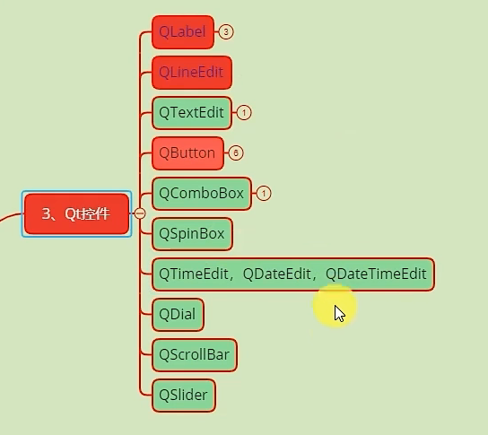

# Qt控件概览

1. QLabel
   1. 显示文字
   2. 显示图片
   3. 显示动画
2. QButton
   1. QPushButton
   2. QToolButton
   3. QRadioButton
   4. QCheckBox
   5. QCommandLineButton
   6. QDialogButtonBox
3. QComboBox
   1. QFontComboBox